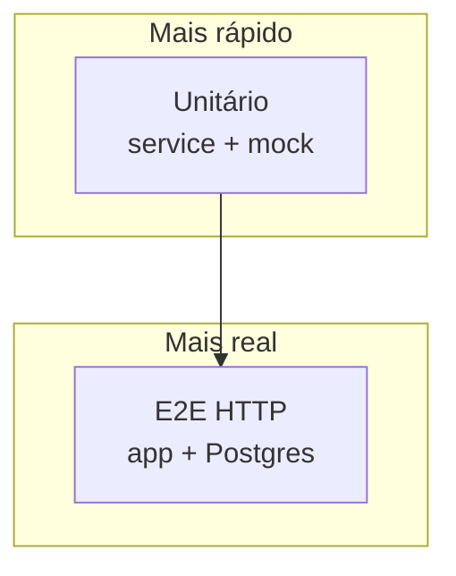
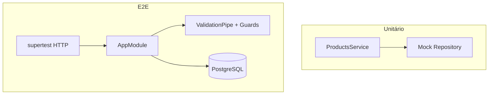
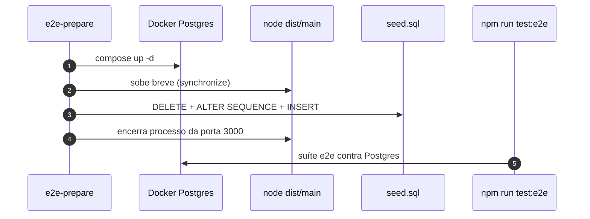

# Testes de software no `loja-api`

> *Episódio: rede de segurança — o curl da Ana vira suíte.*

> **Recuperação (30s):** 401 vs 403? Por que o DTO é classe? O seed usa `DELETE` + `ALTER SEQUENCE` — por quê não só `DELETE`?  
> **Neste episódio:** unitário com mock · e2e HTTP · suíte P (inclui Cli→403).  
> **Pause e rode:** `e2e-prepare` → `npm test` → `npm run test:e2e` (sem `start:dev` na 3000).  
> **Windows:** `.\scripts\e2e-prepare.ps1` a partir de `backend/nest/`.

## Objetivo deste material

Ao terminar, você deve conseguir:

1. Explicar, em uma frase cada, teste **unitário**, **integração** e **e2e**.
2. Escrever teste unitário do `ProductsService` com **mock** do `Repository`.
3. Escrever e2e HTTP: produto válido/inválido, `404`, auth (`401` sem token) e roles (**Cli → 403**, Ana → 201).
4. Rodar a **suíte P** do [mapa — Cap. 10](MAPA-LINHAS-P-A.md) contra PostgreSQL.

**Pré-requisito:** trilha P (produtos + auth; upload ajuda, mas não bloqueia).  
**Próximo passo:** [Capstone](exercicio-1.md).  
**Contrato HTTP:** [MAPA — Cap. 10](MAPA-LINHAS-P-A.md) — em conflito, o mapa prevalece.  
**Seed:** [seed/](seed/) — `ana` / `cli` / `secret123`. Curls manuais: [CURLS-P.md](CURLS-P.md).  
**Travou?** [FAQ-TRAVOU.md](FAQ-TRAVOU.md).

------

## 1. Por que testar nesta trilha?

Sem testes, cada mudança vira “torcer para o curl da Ana ainda funcionar”.

> **Conceito: teste mostra presença de defeitos**  
> Passar nos testes **aumenta confiança**; não prova perfeição. Priorize o contrato P.





| Nível | O que valida | Dependências |
|-------|--------------|--------------|
| Unitário | regra no service | mock do repository |
| E2E | contrato HTTP | Nest + Postgres + pipes/guards |

------

## 2. Técnicas rápidas

| Técnica | Exemplo |
|---------|---------|
| Particionamento | `price > 0` vs `price ≤ 0` |
| Limite | `stock = 0` ok; `-1` → 400 |
| Decisão | sem token → 401; Cli cria produto → 403; Ana → 201 |

------

## 3. Ambiente (linha P)

> **Linha P =** `e2e-prepare` + `npm test` + `npm run test:e2e` (suíte completa assume caps. **1–7** fechados). Nada mais é obrigatório.

### Caminho canônico — prepare + testes

A partir de `backend/nest/` — **um** comando conforme o SO. **Pare** `npm run start:dev` antes.

| SO | Comando |
|----|---------|
| Git Bash / macOS / Linux | `bash scripts/e2e-prepare.sh` |
| PowerShell (Windows) | `.\scripts\e2e-prepare.ps1` |

O script sobe Postgres, sincroniza schema se `users` ainda não existir e aplica o seed (`DELETE` + `ALTER SEQUENCE`). Rode a partir de **`backend/nest/`** (não de dentro de `loja-api/`).

```bash
# depois do prepare:
cd loja-api
npm test
npm run test:e2e
```

> **Importante:** o `ValidationPipe` no e2e deve usar as **mesmas opções** do `main.ts` (`whitelist`, `forbidNonWhitelisted`, `transform`, `enableImplicitConversion`) — senão o teste mente.  
> **`price` / `unitPrice`:** colunas `numeric` podem voltar como **string** no JSON — no assert use `Number(body.price)` ou compare string `"39.90"`, não `toBe(39.9)` cego.  
> **Primeira vez:** prepare precisa do `loja-api` com caps. 5–6 (TypeORM + `User`). Se falhar, suba `start:dev` uma vez, pare, e rode o prepare de novo.



> **Avançado (opcional, 2 linhas):** `globalSetup` do Jest ou `npm run test:e2e:prepare` que **só chama** o script acima — não invente outro fluxo. Scripts: [`e2e-prepare.sh`](scripts/e2e-prepare.sh) / [`.ps1`](scripts/e2e-prepare.ps1).

------

## 4. Linha P — unitário (`ProductsService`)

```typescript
import { NotFoundException } from '@nestjs/common';
import { Test } from '@nestjs/testing';
import { getRepositoryToken } from '@nestjs/typeorm';
import { Repository } from 'typeorm';
import { Product } from './product.entity';
import { ProductsService } from './products.service';

describe('ProductsService (unit)', () => {
  let service: ProductsService;
  let repo: jest.Mocked<Pick<Repository<Product>, 'findOne' | 'create' | 'save' | 'delete'>>;

  beforeEach(async () => {
    repo = {
      findOne: jest.fn(),
      create: jest.fn(),
      save: jest.fn(),
      delete: jest.fn(),
    };
    const moduleRef = await Test.createTestingModule({
      providers: [
        ProductsService,
        { provide: getRepositoryToken(Product), useValue: repo },
      ],
    }).compile();
    service = moduleRef.get(ProductsService);
  });

  it('create deve salvar produto', async () => {
    const dto = { name: 'Caneca', price: 10, stock: 2 };
    repo.create.mockReturnValue(dto as Product);
    repo.save.mockResolvedValue({ id: 1, ...dto } as Product);
    await expect(service.create(dto)).resolves.toMatchObject({ id: 1, name: 'Caneca' });
  });

  it('findOne inexistente → NotFoundException', async () => {
    repo.findOne.mockResolvedValue(null);
    await expect(service.findOne(99)).rejects.toBeInstanceOf(NotFoundException);
  });
});
```

> **Conceito: mock** — o unitário não fala com o Postgres.

------

## 5. Linha P — e2e (login determinístico da Ana)

**Pré-requisito:** rode o prepare do §3 (`e2e-prepare`) **antes** desta suíte. O exemplo abaixo **só faz login** — assume Ana já no Postgres.

```typescript
import { INestApplication, ValidationPipe } from '@nestjs/common';
import { Test } from '@nestjs/testing';
import * as request from 'supertest';
import { AppModule } from '../src/app.module';

describe('Products e2e (P)', () => {
  let app: INestApplication;
  let tokenAna: string;
  let tokenCli: string;

  beforeAll(async () => {
    const moduleRef = await Test.createTestingModule({
      imports: [AppModule],
    }).compile();

    app = moduleRef.createNestApplication();
    // Mesmas opções do main.ts — senão o e2e não testa a API real
    app.useGlobalPipes(
      new ValidationPipe({
        whitelist: true,
        forbidNonWhitelisted: true,
        transform: true,
        transformOptions: { enableImplicitConversion: true },
      }),
    );
    await app.init();

    const loginAna = await request(app.getHttpServer())
      .post('/auth/login')
      .send({ username: 'ana', password: 'secret123' })
      .expect(200);
    tokenAna = loginAna.body.access_token;

    const loginCli = await request(app.getHttpServer())
      .post('/auth/login')
      .send({ username: 'cli', password: 'secret123' })
      .expect(200);
    tokenCli = loginCli.body.access_token;
  });

  afterAll(async () => {
    await app.close();
  });

  it('POST /products válido (Ana) → 201', async () => {
    await request(app.getHttpServer())
      .post('/products')
      .set('Authorization', `Bearer ${tokenAna}`)
      .send({ name: 'Caneca', price: 39.9, stock: 5 })
      .expect(201);
  });

  it('POST /products inválido → 400', async () => {
    await request(app.getHttpServer())
      .post('/products')
      .set('Authorization', `Bearer ${tokenAna}`)
      .send({ name: 'X', price: -1, stock: 0 })
      .expect(400);
  });

  it('GET /products/:id inexistente → 404', async () => {
    await request(app.getHttpServer()).get('/products/999999').expect(404);
  });

  it('POST /products sem token → 401', async () => {
    await request(app.getHttpServer())
      .post('/products')
      .send({ name: 'Caneca', price: 10, stock: 1 })
      .expect(401);
  });

  it('POST /products com Cli (CLIENT) → 403', async () => {
    await request(app.getHttpServer())
      .post('/products')
      .set('Authorization', `Bearer ${tokenCli}`)
      .send({ name: 'Hack', price: 1, stock: 1 })
      .expect(403);
  });
});
```

O prepare do §3 (`e2e-prepare.sh` / `.ps1`) deixa Ana/Cli e o catálogo prontos antes desta suíte.

------

## 6. Checklist P

- [ ] Unitário: create + not found (+ stock se aplicável)  
- [ ] E2E: 201 / 400 / 404 / 401  
- [ ] E2E roles (após cap. 7): Cli `POST /products` → **403**; Ana → **201** (alinhe ao [mapa Cap. 10](MAPA-LINHAS-P-A.md))  
- [ ] Amplie a suíte com `/orders` se quiser cobertura extra  
- [ ] Login da **Ana** determinístico (após `e2e-prepare`)

------

## 7. Desafio (Linha A)

Specs das features A — `test/desafios/` ou `*.a.spec.ts`. Dispensável para a suíte P.

------

## Arquivos que você editou neste capítulo

- `src/products/products.service.spec.ts` (unitário) · `test/*.e2e-spec.ts` · `test/jest-e2e.json` · (opcional) espelhar prepare via `globalSetup` — não é obrigatório na linha P

------

## Checkpoint

1. Por que mockar o repository no unitário e não no e2e?  
2. E2e sem `ValidationPipe` no `createNestApplication` testa a mesma API?  
3. 401 vs 403 — qual é qual?

**Chave (1 frase cada):**  
1. Unitário isola a regra do service; e2e precisa do stack real (HTTP + DB).  
2. Não — sem o pipe você testa outra API (validação “desligada”).  
3. **401** = não autenticado; **403** = autenticado, sem permissão.

> **O que a loja ganhou hoje:** rede de segurança — regressão do catálogo/auth aparece no CI da aula, não só na demo.

------

## Referências

- [Testing (Nest)](https://docs.nestjs.com/fundamentals/testing)  
- Próximo: [exercicio-1.md](exercicio-1.md)

------

**Contrato HTTP:** [MAPA — Cap. 10](MAPA-LINHAS-P-A.md) — em conflito, o mapa prevalece.
