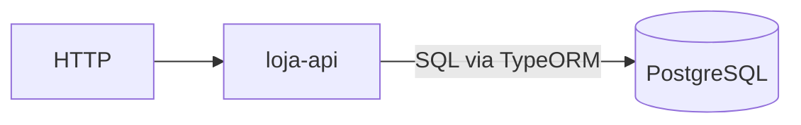
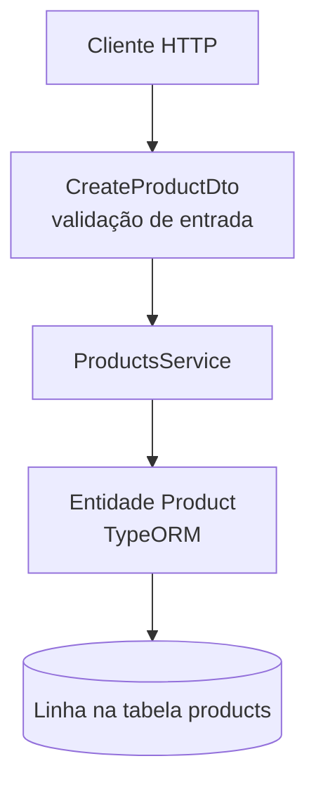
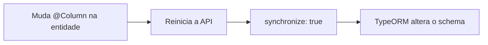
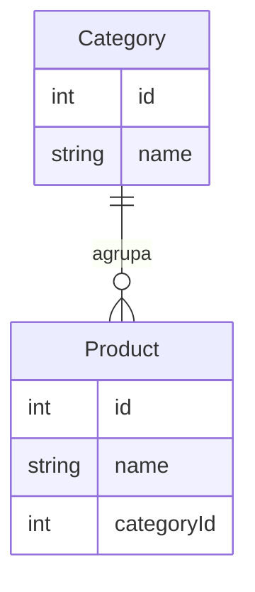

# Persistência com NestJS e TypeORM

> *Episódio: por que o Postgres entra na história.*

> **Neste episódio:** (1) Nest vs TypeORM · (2) entidade ≠ DTO · (3) vocabulário `forRoot` / `Repository`.  
> **Pause e rode:** não há rota nova — só leitura. **Não** rode Compose/`npm install` ainda (isso é o [cap. 5](5.crud_nest_bd.md)).  
> **Recuperação (30s):** onde vive o array de produtos hoje? O que some no restart?  
> **Próximo encontro:** Docker + `TypeOrmModule` de verdade no [cap. 5](5.crud_nest_bd.md).

## Objetivo deste material

Ao terminar, você deve conseguir:

1. Explicar o papel do **Nest** vs o papel do **TypeORM** na persistência.
2. Distinguir **entidade**, **DTO** e **objeto em memória**.
3. Reconhecer o papel de `TypeOrmModule.forRoot` / `forFeature` / `Repository` (implementação no cap. 5).
4. Ler um esboço de service com `Repository<T>` sem medo do jargão ORM.

**Pré-requisito:** [Services](3.services.md) — `ProductsService` em memória no `loja-api`.  
**Próximo passo:** [CRUD produtos no PostgreSQL](5.crud_nest_bd.md).  
**Contrato HTTP:** [MAPA — Cap. 4](MAPA-LINHAS-P-A.md) (sem rotas novas na linha P).

------

## 1. O problema

**Ana** reinicia o `npm run start:dev` e a Caneca Nest some: até o cap. 3 os produtos vivem num **array em memória**. Em uma loja de verdade, o catálogo precisa sobreviver a deploy, crash e múltiplas réplicas da API.

> **Conceito: persistência**  
> Guardar o estado em um meio durável (aqui: **PostgreSQL**). A API deixa de ser a “fonte da verdade” dos dados; o banco passa a ser.



------

## 2. Nest × TypeORM (quem faz o quê)

| Peça | Responsabilidade |
|------|------------------|
| **Nest** | Módulos, DI, HTTP, organizar `ProductsService` / controller |
| **TypeORM** | Mapear classes ↔ tabelas, montar SQL, sessões/repositórios |
| **PostgreSQL** | Armazenar linhas de verdade |
| **`pg`** | Driver Node que fala o protocolo do Postgres |

O Nest **não** é um banco. O TypeORM **não** substitui o controller. Cada um no seu lugar.

------

## 3. Entidade × DTO × registro em memória

| Artefato | Vive onde? | Exemplo |
|----------|------------|---------|
| Objeto no array (cap. 2–3) | RAM do processo | `{ id: 1, name: 'Caneca' }` |
| **DTO** | Fronteira HTTP | `CreateProductDto` (validação de entrada) |
| **Entidade** | Fronteira banco | `Product` com `@Entity()` / `@Column()` |



> **Conceito: entidade**  
> Classe TypeScript que o TypeORM trata como **tabela**. Propriedades ↔ colunas. Não misture regra de validação de HTTP na entidade: continue usando DTOs na borda da API.

```typescript
import { Entity, PrimaryGeneratedColumn, Column } from 'typeorm';

@Entity('products')
export class Product {
  @PrimaryGeneratedColumn()
  id: number;

  @Column({ length: 120 })
  name: string;

  @Column('numeric', { precision: 10, scale: 2 })
  price: number;

  @Column('int')
  stock: number;
}
```

------

## 4. PostgreSQL no Docker (prévia — implementar no cap. 5)

> **Não rode ainda na linha P deste capítulo.** Só conheça o arquivo: [`docker-compose.postgres.yml`](docker-compose.postgres.yml). O `up -d` + healthcheck são o **primeiro lab do cap. 5**.

Credenciais padrão (quando subir): usuário/senha/db `loja`, porta `5432`.

> **Conceito: banco fora do Node**  
> O Postgres é **outro processo**. Se ele estiver parado, a API sobe mas as queries falham — falha parcial clássica.

------

## 5. Conexão no Nest (`forRoot`) — prévia

> **Não instale pacotes neste capítulo.** Os `npm install …@versão` e o `.env` ficam no [cap. 5](5.crud_nest_bd.md). Abaixo é só o mapa mental.

Pins que o cap. 5 usa: `@nestjs/typeorm@10.0.2` · `typeorm@0.3.26` · `pg@8.13.3` ([VERSIONS](VERSIONS.md)).

Esboço (valores finais no cap. 5):

```typescript
TypeOrmModule.forRoot({
  type: 'postgres',
  host: 'localhost',
  port: 5432,
  username: 'loja',
  password: 'loja',
  database: 'loja',
  autoLoadEntities: true,
  synchronize: true, // só em desenvolvimento!
}),
```

| Opção | Ideia |
|-------|--------|
| `type: 'postgres'` | Dialeto PostgreSQL |
| `autoLoadEntities: true` | Entidades registradas via `forFeature` entram sozinhas |
| `synchronize: true` | TypeORM ajusta o schema às entidades — **proibido em produção**; use migrations depois |



No módulo do recurso (cap. 5):

```typescript
TypeOrmModule.forFeature([Product])
```

Isso libera `Repository<Product>` para injeção no `ProductsService`.

------

## 6. Repositório (prévia do cap. 5)

> **Não implemente ainda.** Só leia o esboço — o `@InjectRepository` de verdade é no [cap. 5](5.crud_nest_bd.md).

```typescript
constructor(
  @InjectRepository(Product)
  private readonly productsRepository: Repository<Product>,
) {}

findAll() {
  return this.productsRepository.find();
}
```

> **Conceito: Repository**  
> Objeto que sabe **buscar/salvar** entidades de um tipo. O service continua dono da regra de negócio; o repository é a porta para o banco.

------

## 7. Linha P neste capítulo

Não há rotas novas nem install. Checkpoint conceitual:

- [ ] Sei explicar Nest vs TypeORM vs PostgreSQL  
- [ ] Sei a diferença entidade × DTO  
- [ ] Sei **onde** o Compose vive (arquivo) — sobe no cap. 5  
- [ ] Entendo por que `synchronize: true` é só para aula  

------

## 8. Desafio (Linha A)

Esboce (texto ou diagrama) o relacionamento **Category 1:N Product**. **Não implemente** ainda — a implementação é o A do cap. 5.



Dispensável para o cap. 5 (linha P).

------

## Checkpoint

Por que `CreateProductDto` e a entidade `Product` são classes diferentes, mesmo com campos parecidos?

> **O que a loja ganhou hoje:** vocabulário de persistência — a turma sabe *por que* o Postgres entra na história.  
> **Próximo lab:** [cap. 5](5.crud_nest_bd.md) = Compose healthy → entidade → `forRoot` → mesma URL, outro miolo.

------

**Contrato HTTP:** [MAPA — Cap. 4](MAPA-LINHAS-P-A.md) — em conflito, o mapa prevalece.
