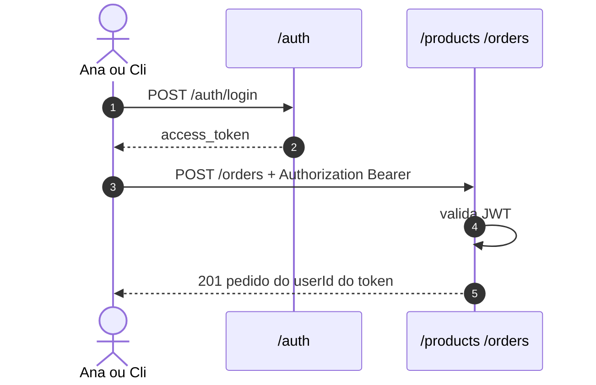
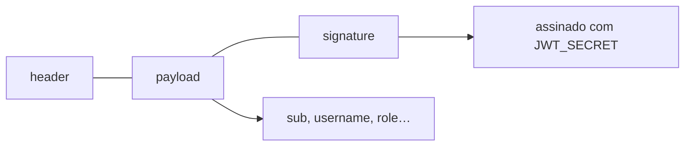
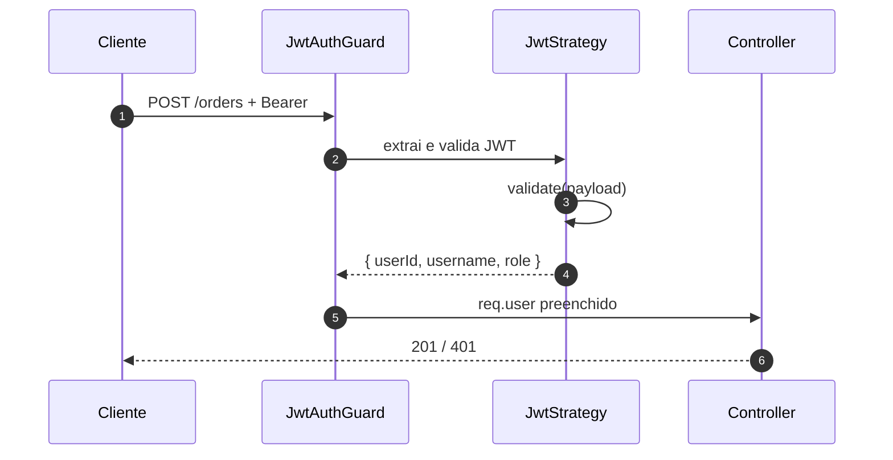
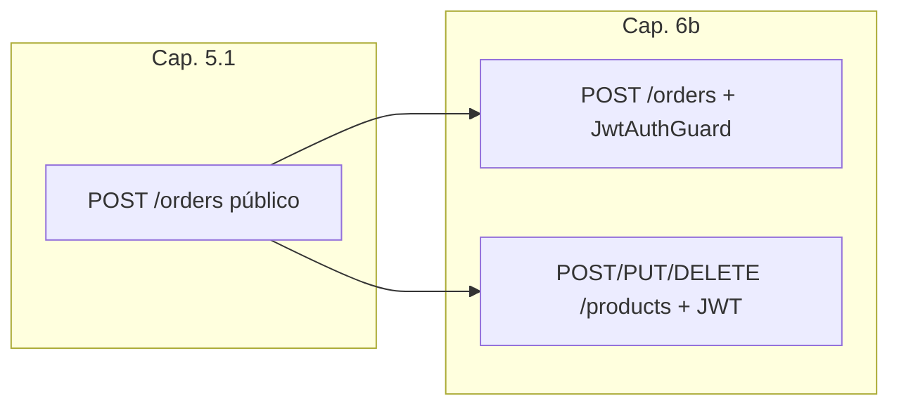

# Autenticação JWT no `loja-api`

> *Episódio: a vitrine ganha identidade — quem é Ana, quem é Cli?*

> **Como estudar (2 encontros / 2 vídeos):**  
> - **6a:** register/login + JWT + seed Ana/Cli — *pare* quando o login devolver `access_token`.
> - **6b:** `JwtAuthGuard` em products/orders + `userId` do token.
> **Recuperação (30s):** no cap. 5.1, `POST /orders` ainda é público? O `userId` do pedido está preenchido?  
> **Neste episódio:** identidade (**6a**) → portas com Bearer (**6b**).  
> **Pause e rode:** no fim da **6a**, login da Ana deve devolver `access_token` — **pare** antes da **6b**.  
> **Shell:** Bash (Linux ou **Git Bash** no Windows) — seed, `verify-seed.sh` e `TOKEN=$(…)`.  
> **Travou?** [FAQ](FAQ-TRAVOU.md) · seed: [seed/README](seed/README.md).  
> **Consulta:** JWT / guards → [REFERENCIA-NEST §6](REFERENCIA-NEST.md#sec-auth) · [§3](REFERENCIA-NEST.md#sec-guards).

## Objetivo deste material

Ao terminar, você deve conseguir:

1. Explicar o que é um **JWT** e por que a API não “guarda login” em sessão de servidor (neste desenho).
2. Implementar `POST /auth/register` e `POST /auth/login`.
3. Validar Bearer token com **Passport** + `JwtStrategy` + `JwtAuthGuard`.
4. **Endurecer** mutações de produtos e pedidos: JWT obrigatório; `Order.userId` = `sub` do token.

**Pré-requisito:** [Pedidos](5.1.pedidos.md) + [CRUD PostgreSQL](5.crud_nest_bd.md).  
**Próximo passo:** [Autorização (roles)](7.autorizacao.md).  
**Contrato HTTP:** [MAPA — Cap. 6](MAPA-LINHAS-P-A.md) — em conflito, o mapa prevalece.  
**Versões:** [VERSIONS.md](VERSIONS.md).

**Projeto:** continue o `loja-api` (PostgreSQL já no ar).  
**Personagens / seed:** [seed/](seed/) — **Ana** (ADMIN) e **Cli** (CLIENT), senha `secret123`. Folha de curls: [CURLS-P.md](CURLS-P.md).

------

## 1. Contexto

Até agora qualquer um cria produto e pedido. Em uma loja real precisamos saber **quem** está agindo: **Cli** compra; **Ana** administra.



> **Conceito: autenticação vs autorização**  
> - **Autenticação** (este capítulo): *quem é você?* (login → token).  
> - **Autorização** (cap. 7): *você pode fazer isso?* (`ADMIN` vs `CLIENT`).

> **Conceito: JWT (JSON Web Token)**  
> String assinada com três partes (`header.payload.signature`). O servidor **não precisa** guardar sessão: confere a assinatura com `JWT_SECRET` e lê o payload (`sub`, `username`, …). Se a chave vazar, qualquer um forja tokens — por isso segredo forte e HTTPS em produção.



------

## 6a — Identidade (register / login / JWT)

## 2. Dependências

Pacotes de autenticação **pinados** para Nest 10. Sem pin, `@nestjs/passport` e `@nestjs/config` “latest” pedem Nest 11/12 e o lab quebra:

| Pacote | Versão da trilha | Papel |
|--------|------------------|--------|
| `@nestjs/jwt` | **10.2.0** | emitir / verificar JWT |
| `@nestjs/passport` | **10.0.3** | ponte Nest ↔ Passport |
| `passport` | **0.7.0** | middleware de estratégias |
| `passport-jwt` | **4.0.1** | estratégia Bearer JWT |
| `bcryptjs` | **2.4.3** | hash de senha (puro JS) |
| `@nestjs/config` | **3.3.0** | `JWT_SECRET` no `.env` (se ainda não instalou no cap. 5) |

```bash
npm install @nestjs/jwt@10.2.0 @nestjs/passport@10.0.3 passport@0.7.0 passport-jwt@4.0.1 bcryptjs@2.4.3 @nestjs/config@3.3.0
npm install -D @types/passport-jwt@4.0.1 @types/bcryptjs@2.4.6
```

> **Conceito: `bcrypt`**  
> A senha **nunca** deve ir ao banco em texto puro. Guardamos um **hash**. No login, comparamos hash com `bcrypt.compare`. Usamos **`bcryptjs`** (JavaScript puro) para evitar compilação nativa no Windows/lab.

------

## 3. Variáveis de ambiente

`.env` (complete o que já tinha do Postgres):

```properties
JWT_SECRET=troque-por-um-segredo-longo
JWT_EXPIRES_IN=1h
DB_HOST=localhost
DB_PORT=5432
DB_USERNAME=loja
DB_PASSWORD=loja
DB_DATABASE=loja
```

`AppModule` com `ConfigModule` + TypeORM `postgres` (como no cap. 5) e, ao final deste capítulo, também `AuthModule`:

```typescript
imports: [
  ConfigModule.forRoot({ isGlobal: true }),
  TypeOrmModule.forRootAsync({ /* postgres — cap. 5 */ }),
  ProductsModule,
  OrdersModule,
  AuthModule, // adicionar quando o módulo existir
],
```

Confirme: `npm run start:dev` e `GET /products` ainda funcionam.

------

## 4. Gerar o módulo auth

```bash
npx nest g module auth
npx nest g controller auth --no-spec
npx nest g service auth --no-spec
```

------

## 5. Entidade `User`

`src/auth/user.entity.ts`:

```typescript
import { Column, Entity, PrimaryGeneratedColumn } from 'typeorm';

@Entity('users')
export class User {
  @PrimaryGeneratedColumn()
  id: number;

  @Column({ unique: true })
  username: string;

  @Column({ unique: true })
  email: string;

  @Column()
  password: string;

  /** CLIENT no register; ADMIN só via seed/SQL — nunca confiar em role no body */
  @Column({ default: 'CLIENT' })
  role: string;
}
```

> **Conceito: não aceite `role` no register (linha P)**  
> Se o cliente puder mandar `"role":"ADMIN"`, qualquer um vira administrador (**privilege escalation**). Admin nasce de seed.

------

## 6. DTOs de auth (recomendado)

`src/auth/dto/register.dto.ts`:

```typescript
import { IsEmail, IsString, MinLength } from 'class-validator';

export class RegisterDto {
  @IsString()
  @MinLength(2)
  username: string;

  @IsEmail()
  email: string;

  @IsString()
  @MinLength(6)
  password: string;
}
```

`src/auth/dto/login.dto.ts`:

```typescript
import { IsString, MinLength } from 'class-validator';

export class LoginDto {
  @IsString()
  @MinLength(2)
  username: string;

  @IsString()
  @MinLength(6)
  password: string;
}
```

No register, **não** inclua `role` no DTO.

------

## 7. `AuthService`

```typescript
import {
  ConflictException,
  Injectable,
  UnauthorizedException,
} from '@nestjs/common';
import { JwtService } from '@nestjs/jwt';
import { InjectRepository } from '@nestjs/typeorm';
import * as bcrypt from 'bcryptjs';
import { Repository } from 'typeorm';
import { User } from './user.entity';

@Injectable()
export class AuthService {
  constructor(
    @InjectRepository(User)
    private readonly usersRepository: Repository<User>,
    private readonly jwtService: JwtService,
  ) {}

  async register(username: string, email: string, password: string) {
    const exists = await this.usersRepository.findOne({
      where: [{ username }, { email }],
    });
    if (exists) {
      throw new ConflictException('username ou email já cadastrado');
    }

    const hashed = await bcrypt.hash(password, 10);
    const user = this.usersRepository.create({
      username,
      email,
      password: hashed,
      role: 'CLIENT',
    });
    const saved = await this.usersRepository.save(user);
    const { password: _, ...safe } = saved;
    return safe; // sem password na resposta
  }

  async login(username: string, password: string) {
    const user = await this.usersRepository.findOne({ where: { username } });
    if (!user || !(await bcrypt.compare(password, user.password))) {
      throw new UnauthorizedException('credenciais inválidas');
    }
    const payload = {
      sub: user.id,
      username: user.username,
      role: user.role,
    };
    return { access_token: await this.jwtService.signAsync(payload) };
  }
}
```

> **Conceito: `sub`**  
> Convenção JWT: *subject* = id do usuário. Nos pedidos, `userId` virá desse campo.

------

## 8. `AuthController`

```typescript
import { Body, Controller, HttpCode, Post } from '@nestjs/common';
import { AuthService } from './auth.service';
import { RegisterDto } from './dto/register.dto';
import { LoginDto } from './dto/login.dto';

@Controller('auth')
export class AuthController {
  constructor(private readonly authService: AuthService) {}

  @Post('register')
  register(@Body() dto: RegisterDto) {
    return this.authService.register(dto.username, dto.email, dto.password);
  }

  @Post('login')
  @HttpCode(200)
  login(@Body() dto: LoginDto) {
    return this.authService.login(dto.username, dto.password);
  }
}
```

------

## 9. Estratégia JWT + Guard

### `jwt.strategy.ts`

```typescript
import { Injectable } from '@nestjs/common';
import { ConfigService } from '@nestjs/config';
import { PassportStrategy } from '@nestjs/passport';
import { ExtractJwt, Strategy } from 'passport-jwt';

@Injectable()
export class JwtStrategy extends PassportStrategy(Strategy) {
  constructor(config: ConfigService) {
    super({
      jwtFromRequest: ExtractJwt.fromAuthHeaderAsBearerToken(),
      ignoreExpiration: false,
      secretOrKey: config.getOrThrow<string>('JWT_SECRET'),
    });
  }

  validate(payload: { sub: number; username: string; role: string }) {
    // vira request.user nas rotas protegidas
    return {
      userId: payload.sub,
      username: payload.username,
      role: payload.role,
    };
  }
}
```

### `jwt-auth.guard.ts`

```typescript
import { Injectable } from '@nestjs/common';
import { AuthGuard } from '@nestjs/passport';

@Injectable()
export class JwtAuthGuard extends AuthGuard('jwt') {}
```

> **Conceito: Strategy + Guard**  
> - **Strategy:** como extrair e validar o token.  
> - **Guard:** “esta rota só passa se a strategy autenticar”.  
> Sem token / token inválido → **401 Unauthorized**.



------

## 10. `AuthModule`

```typescript
import { Module } from '@nestjs/common';
import { ConfigModule, ConfigService } from '@nestjs/config';
import { JwtModule } from '@nestjs/jwt';
import { PassportModule } from '@nestjs/passport';
import { TypeOrmModule } from '@nestjs/typeorm';
import { AuthController } from './auth.controller';
import { AuthService } from './auth.service';
import { JwtAuthGuard } from './jwt-auth.guard';
import { JwtStrategy } from './jwt.strategy';
import { User } from './user.entity';

@Module({
  imports: [
    TypeOrmModule.forFeature([User]),
    PassportModule,
    JwtModule.registerAsync({
      imports: [ConfigModule],
      inject: [ConfigService],
      useFactory: (config: ConfigService) => ({
        secret: config.getOrThrow<string>('JWT_SECRET'),
        signOptions: {
          expiresIn: config.get<string>('JWT_EXPIRES_IN') ?? '1h',
        },
      }),
    }),
  ],
  controllers: [AuthController],
  providers: [AuthService, JwtStrategy, JwtAuthGuard],
  exports: [AuthService, JwtModule, PassportModule, JwtAuthGuard],
})
export class AuthModule {}
```

Importe `AuthModule` no `AppModule`. Nos próximos capítulos, `ProductsModule` / `OrdersModule` também importam `AuthModule` para reutilizar `JwtAuthGuard` (e, no cap. 7, `RolesGuard`).

> Tipagem simples de `expiresIn`: use string `'1h'` (sem import de `ms`) se o TypeScript reclamar.

------

## 11. Linha P — register / login (+ seed)

**Opção A — seed oficial** (recomendado no lab): aplique [`seed/seed.sql`](seed/seed.sql) e confira com [`seed/verify-seed.sh`](seed/verify-seed.sh).

```bash
# a partir de backend/nest/ (onde está o compose e a pasta seed/)
docker exec -i loja-postgres psql -U loja -d loja < seed/seed.sql
bash seed/verify-seed.sh
# se o shell estiver dentro de loja-api/:
# docker exec -i loja-postgres psql -U loja -d loja < ../seed/seed.sql
# bash ../seed/verify-seed.sh
```

> **Atenção:** o [`seed.sql`](seed/seed.sql) **limpa** `orders`, `products` e `users` — pedidos criados no cap. 5.1 somem. Isso é intencional para Ana/Cli determinísticos.

**Opção B — register** (cria só CLIENT; não envie `role` no body):

```bash
curl -s -X POST http://localhost:3000/auth/register \
  -H 'Content-Type: application/json' \
  -d '{"username":"cli2","email":"cli2@loja.test","password":"secret123"}'
```

Login da Ana e do Cli:

```bash
curl -s -X POST http://localhost:3000/auth/login \
  -H 'Content-Type: application/json' \
  -d '{"username":"ana","password":"secret123"}'

# Token JWT — opção A (python) | B (jq) | C (manual) — ver [CURLS-P.md](CURLS-P.md)
TOKEN_ANA=$(curl -s -X POST http://localhost:3000/auth/login \
  -H 'Content-Type: application/json' \
  -d '{"username":"ana","password":"secret123"}' \
  | python -c "import sys,json; print(json.load(sys.stdin)['access_token'])")

TOKEN_CLI=$(curl -s -X POST http://localhost:3000/auth/login \
  -H 'Content-Type: application/json' \
  -d '{"username":"cli","password":"secret123"}' \
  | python -c "import sys,json; print(json.load(sys.stdin)['access_token'])")
# Opção B — jq: ... | jq -r .access_token
# Opção C — manual: export TOKEN_ANA='eyJ...'
```

**Checkpoint intermediário (6a) — obrigatório antes da 6b:**

| Check | Esperado |
|-------|----------|
| Login Ana (`secret123`) | `200` + `access_token` |
| Payload (jwt.io) | `sub`, `username`, `role` |
| Seed + [`verify-seed`](seed/verify-seed.sh) | OK |

> **Pare aqui** se o token não vier. O teste de **401** sem Bearer fica na **6b** — só depois de colocar `JwtAuthGuard` nas mutações.

------

## ⛔ FIM DO VÍDEO / AULA **6a**

Checkpoint da tabela acima OK? Só então abra a **[6b](#6b--endurecer-a-loja-produtos-e-pedidos)** (mesmo arquivo).

Arquivos já tocados na 6a: `auth/*` (entity, DTOs, service, controller, strategy, guard, module) · `AppModule` · `.env` (JWT) · seed.  
Na **6b** você ainda edita: `ProductsModule` / `OrdersModule` (`imports: [AuthModule]`) · controllers com `@UseGuards` · `OrdersService` (`userId` do token).

------

## ▶ INÍCIO DO VÍDEO / AULA **6b**

> **Sessão nova?** Reexporte `TOKEN_ANA` / `TOKEN_CLI` ([CURLS-P](CURLS-P.md) opção A ou C) — variáveis do shell morrem ao fechar o Git Bash.  
> **Pause e rode (6b):** sem Bearer → **401**; com token da Ana → **201** em `POST /products`.

## 6b — Endurecer a loja (produtos e pedidos)



## 12. Endurecer produtos e pedidos (obrigatório P)

### Produtos — mutações com JWT; GETs públicos

Importe `AuthModule` no `ProductsModule` (e o mesmo no `OrdersModule`):

```typescript
// products.module.ts
import { Module } from '@nestjs/common';
import { TypeOrmModule } from '@nestjs/typeorm';
import { AuthModule } from '../auth/auth.module';
import { Product } from './product.entity';
import { ProductsController } from './products.controller';
import { ProductsService } from './products.service';

@Module({
  imports: [TypeOrmModule.forFeature([Product]), AuthModule],
  controllers: [ProductsController],
  providers: [ProductsService],
})
export class ProductsModule {}
```

Sem `AuthModule` aqui, o Nest pode falhar ao injetar `JwtAuthGuard` / `JwtStrategy` no contexto do módulo.

No `ProductsController`:

```typescript
import { UseGuards } from '@nestjs/common';
import { JwtAuthGuard } from '../auth/jwt-auth.guard';

@Post()
@UseGuards(JwtAuthGuard)
create(@Body() dto: CreateProductDto) { /* ... */ }

@Put(':id')
@UseGuards(JwtAuthGuard)
update(...) { /* ... */ }

@Delete(':id')
@UseGuards(JwtAuthGuard)
remove(...) { /* ... */ }

// GET /products e GET /products/:id continuam SEM guard
```

> **Até o cap. 7:** qualquer Bearer válido (Ana **ou** Cli) consegue `POST /products`. Isso é **etapa intermediária** — no [cap. 7](7.autorizacao.md) só `ADMIN` cria/edita/apaga. Se o Cli criar produto agora e você achar estranho, está certo; roles vêm no próximo capítulo.

### Pedidos — tudo com JWT + `userId` do token

A assinatura do service (cap. 5.1) é `create(dto, userId)` — **nessa ordem**.

No `OrdersService`, acrescente (e ajuste `findOne`/`cancel` se ainda listam tudo):

```typescript
findAllForUser(userId: number): Promise<Order[]> {
  return this.ordersRepository.find({
    where: { userId },
    order: { id: 'DESC' },
  });
}
```

No `OrdersController`:

```typescript
import { Req, UseGuards, Param, ParseIntPipe } from '@nestjs/common';
import { JwtAuthGuard } from '../auth/jwt-auth.guard';

@Post()
@UseGuards(JwtAuthGuard)
create(@Req() req: { user: { userId: number } }, @Body() dto: CreateOrderDto) {
  return this.ordersService.create(dto, req.user.userId);
}

@Get()
@UseGuards(JwtAuthGuard)
findAll(@Req() req: { user: { userId: number } }) {
  return this.ordersService.findAllForUser(req.user.userId);
}

@Get(':id')
@UseGuards(JwtAuthGuard)
findOne(
  @Req() req: { user: { userId: number } },
  @Param('id', ParseIntPipe) id: number,
) {
  return this.ordersService.findOneForUser(id, req.user.userId);
}

@Post(':id/cancel')
@UseGuards(JwtAuthGuard)
cancel(
  @Req() req: { user: { userId: number } },
  @Param('id', ParseIntPipe) id: number,
) {
  return this.ordersService.cancelForUser(id, req.user.userId);
}
```

Versão mínima de `findOneForUser` / `cancelForUser` (no cap. 7 você ramifica ADMIN):

```typescript
async findOneForUser(id: number, userId: number): Promise<Order> {
  const order = await this.findOne(id);
  if (order.userId !== userId) {
    throw new NotFoundException(`Pedido ${id} não encontrado`);
  }
  return order;
}

async cancelForUser(id: number, userId: number): Promise<Order> {
  await this.findOneForUser(id, userId);
  return this.cancel(id);
}
```

No service de pedidos: **ignore** qualquer `userId` vindo do body; use só o do token.

> **Conceito: identidade vem do token, não do JSON**  
> Se o body pudesse escolher `userId`, um cliente criaria pedido no nome de outro.

### Curls de verificação

> **Esperado até o cap. 7:** Cli autenticado **ainda cria** produto (`201`). Só no [cap. 7](7.autorizacao.md) isso vira **403**. Não é bug.

```bash
# sem token → 401 (agora sim: mutações já têm JwtAuthGuard)
curl -s -o /dev/null -w '%{http_code}\n' -X POST http://localhost:3000/products \
  -H 'Content-Type: application/json' \
  -d '{"name":"X","price":1,"stock":1}'

# com token da Ana → 201
curl -s -X POST http://localhost:3000/products \
  -H "Authorization: Bearer $TOKEN_ANA" \
  -H 'Content-Type: application/json' \
  -d '{"name":"Caneca","price":39.9,"stock":5}'

# com token do Cli → 201 também (ainda sem RolesGuard — no cap. 7 vira 403)
curl -s -o /dev/null -w '%{http_code}\n' -X POST http://localhost:3000/products \
  -H "Authorization: Bearer $TOKEN_CLI" \
  -H 'Content-Type: application/json' \
  -d '{"name":"Caneca Cli","price":19.9,"stock":3}'

curl -s -X POST http://localhost:3000/orders \
  -H "Authorization: Bearer $TOKEN_CLI" \
  -H 'Content-Type: application/json' \
  -d '{"items":[{"productId":1,"quantity":1}]}'
```

> **Pause e rode (fim 6b):** os curls acima passaram (401 sem token + mutações com Bearer)? Checkpoint final do capítulo só depois disso.

------

## 13. Lembrete: ADMIN não nasce no `register`

Se já rodou o [seed oficial](seed/README.md) ([`seed.sql`](seed/seed.sql)) na **6a** (§11), **pule esta seção**.

Na linha P, `POST /auth/register` só cria `CLIENT`. **Ana (ADMIN)** entra pelo seed/SQL — nunca pelo body do register (privilege escalation).

```bash
# só se ainda não aplicou o seed:
docker exec -i loja-postgres psql -U loja -d loja < seed/seed.sql
bash seed/verify-seed.sh
```

------

## 14. Desafio (Linha A)

Conforme o [mapa](MAPA-LINHAS-P-A.md):

- `GET /auth/me` (JWT) → dados do usuário logado  
- refresh token (par de tokens) — opcional avançado  

Dispensável para o cap. 7 (basta `role` no payload).

------

## Arquivos que você editou neste capítulo

- `loja-api/.env` (JWT) · `src/auth/*` · `src/app.module.ts` · `src/products/products.module.ts` + `products.controller.ts` · `src/orders/orders.module.ts` + `orders.controller.ts` + `orders.service.ts`

------

## Checkpoint

1. O que muda entre **401** (este capítulo) e **403** (próximo)?  
2. Por que devolver `password` no register é um problema mesmo com hash no banco?  
3. Onde o Nest coloca o resultado de `JwtStrategy.validate` para você ler no controller?

> **O que a loja ganhou hoje:** identidade **e** portas trancadas — só quem tem token cria produto/pedido; papéis finos (Ana vs Cli) ficam no cap. 7.  
> **Chave do checkpoint:** [SOLUCAO-P — chaves](SOLUCAO-P.md#chaves-rápidas-dos-checkpoints-professor--autoestudo).

------

## Referências

- JWT / guards: [REFERENCIA-NEST.md §6](REFERENCIA-NEST.md#sec-auth)  
- [Authentication (NestJS)](https://docs.nestjs.com/security/authentication)  
- [JWT.io — introdução](https://jwt.io/introduction)  
- Próximo: matriz ADMIN/CLIENT → [7.autorizacao.md](7.autorizacao.md)

------

**Contrato HTTP:** [MAPA — Cap. 6](MAPA-LINHAS-P-A.md) — em conflito, o mapa prevalece.
