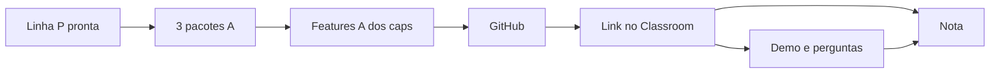
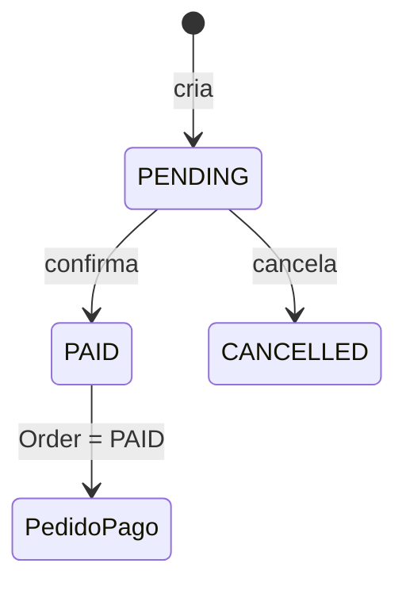

# Avaliação — Linha A da `loja-api`

## Leia isto primeiro (2 minutos)

Você já fez a **linha P** (caps. 1–10): a loja sobe, tem produtos, pedidos, login e papéis.

Nesta avaliação você vai **ampliar a mesma loja** com:

1. **Os 3 pacotes** — Endereço + Pagamento (fake) + Categorias (§2)  
2. **As features A dos capítulos** — o que nos caps. aparecia como “desafio opcional” (§3)  

Depois: **publicar no GitHub**, **enviar o link pela atividade do Google Classroom** e **apresentar presencialmente**, explicando o código.

| Antes de começar | |
|------------------|---|
| Pré-requisito | Linha P funcionando ([CURLS-P.md](CURLS-P.md)) |
| O que implementar | **3 pacotes** (§2) **+** **features A dos caps.** (§3) |
| O que entregar | Repositório no **GitHub** + link na atividade do **Google Classroom** da turma |
| No dia | Demo ao vivo + perguntas |
| Regras duras | Plágio → **nota 0**. Sem explicar o código no mínimo → a avaliação **pode ser zerada por completo**. |

> Nos capítulos, vários itens A apareciam como *desafio opcional*. **Na avaliação, §1 + §2 + §3 são obrigatórios.**  
> O que não está nessas seções **não** é exigido para fechar a nota.

**Documentos de apoio:** [MAPA-LINHAS-P-A.md](MAPA-LINHAS-P-A.md) (rotas — se divergir, o mapa manda) · [exercicio-1.md](exercicio-1.md) · [VERSIONS.md](VERSIONS.md) · [FAQ-TRAVOU.md](FAQ-TRAVOU.md)

### Quem é quem

| Papel | Role | Login do lab |
|-------|------|----------------|
| **Cliente** | `CLIENT` | `cli` / `secret123` |
| **Administrador** | `ADMIN` | `ana` / `secret123` |
| **Gerente** | `MANAGER` | `mgr` / `secret123` (crie no seed se ainda não existir; documente no README) |
| **Visitante** | — | sem token |

---

## 1. O que você precisa entregar

Tudo abaixo é **obrigatório**. Se faltar item, a avaliação fica incompleta ou a nota cai (ver §7).

| # | Item | Feito? |
|---|------|--------|
| 1 | Mesmo projeto `loja-api` da trilha (não criar outro projeto Nest do zero) | ☐ |
| 2 | Linha **P** ok — curls do [CURLS-P](CURLS-P.md) passam | ☐ |
| 3 | **Os 3 pacotes A completos** (§2) — Endereço **e** Pagamento **e** Categorias | ☐ |
| 4 | **Features A dos caps. (§3) todas completas** | ☐ |
| 5 | Código no **GitHub** (repositório acessível pelo professor) | ☐ |
| 6 | **Link do repositório** enviado na atividade do **Google Classroom** da turma | ☐ |
| 7 | README: como subir Postgres, seed, `.env`, curls P e A | ☐ |
| 8 | No README: seção `## Uso de IA` (ou “não utilizei”) | ☐ |
| 9 | No README: política de erro quando alguém acessa recurso de outro (`403` **ou** `404` — **uma** só, em tudo) | ☐ |
| 10 | Swagger em `/api` com as **rotas A** documentadas (Bearer) | ☐ |
| 11 | Versões alinhadas a [VERSIONS.md](VERSIONS.md) | ☐ |
| 12 | Apresentação **presencial** individual (§5) | ☐ |
| 13 | Código **seu** — consegue explicar (§5 e §6) | ☐ |

**Como entregar:** publique o projeto no GitHub e cole o URL do repositório na atividade do Google Classroom da turma (prazo da atividade = prazo da entrega escrita). Só enviar ZIP/Drive **não** substitui o GitHub + Classroom, salvo liberação por escrito do professor.

Shell dos curls: **Bash** (Linux ou Git Bash no Windows).

---

## 2. Os 3 pacotes (obrigatórios)

Você precisa fechar **os três** checklists abaixo. Faltar um pacote = entrega incompleta no C2.

Em cada pacote: histórias (o que o usuário quer) → rotas → checklist “pacote completo”.

---

### Pacote Endereço — “onde entrega?”

O cliente compra, mas a loja ainda não sabe **para onde** mandar. Você cria endereços e liga um ao pedido.

| ID | Como… | Quero… | Para… |
|----|--------|--------|-------|
| US-E1 | Cliente | cadastrar um endereço | usar nos pedidos |
| US-E2 | Cliente | ver só os **meus** | escolher qual usar |
| US-E3 | Cliente | editar ou apagar o **meu** | manter dados certos |
| US-E4 | Cliente | ligar endereço **meu** a pedido **meu** | definir a entrega |
| US-E5 | Cliente | ninguém mexer no meu endereço | privacidade |

| Método | Rota | Auth |
|--------|------|------|
| `POST` | `/addresses` | JWT |
| `GET` | `/addresses` | JWT (só os do usuário) |
| `PUT` / `DELETE` | `/addresses/:id` | JWT (dono) |
| `PATCH` | `/orders/:id/address` | JWT + `{ "addressId" }` (pedido e endereço do próprio cliente) |

**Pacote Endereço completo quando:**

- [ ] As 5 rotas acima existem e respondem  
- [ ] Cliente só vê/edita os **próprios** endereços  
- [ ] Não dá para ligar endereço de outra pessoa ao pedido  
- [ ] Política `403` **ou** `404` documentada no README e usada de ponta a ponta  
- [ ] Rotas no Swagger + curls no README  

---

### Pacote Pagamento — “foi paga?” (fake)

O cliente “paga” o pedido. **Não precisa** Stripe, PagSeguro, Pix de banco, webhook nem SDK.

No lab: salvar o pagamento no Postgres e, ao marcar `PAID`, **mudar o status do pedido**. O que importa são as **regras**, não a maquininha.

| ID | Como… | Quero… | Para… |
|----|--------|--------|-------|
| US-P1 | Cliente | pagamento (`CARD` / `BOLETO` / `PIX`) em pedido **meu** `OPEN` | quitar |
| US-P2 | Cliente | sem segundo pagamento ativo no mesmo pedido | evitar cobrança dupla |
| US-P3 | Cliente | listar/filtrar **meus** pagamentos | acompanhar |
| US-P3b | Administrador | listar/filtrar pagamentos (incl. de outros) | operar a loja |
| US-P4 | Dono do pedido ou administrador | marcar pagamento `PAID` | pedido também `PAID` |
| US-P5 | Administrador | cancelar/remover pagamento | operar a loja |
| US-P6 | Sistema | barrar se pedido ≠ `OPEN` | estados coerentes |

| Método | Rota | Auth / regra |
|--------|------|----------------|
| `POST` | `/orders/:id/payments` | JWT (dono do pedido); 1 ativo; pedido `OPEN` |
| `GET` | `/payments` | JWT: cliente vê os **próprios**; ADMIN vê/filtra todos (`status`, `orderId`) |
| `PATCH` | `/payments/:id/status` | JWT: **dono do pedido** ou **ADMIN**; `PAID` → `Order.status = PAID` |
| `DELETE` | `/payments/:id` | ADMIN |

Status: `PENDING` → `PAID` ou `CANCELLED`. Método não muda depois de criado.

**Pacote Pagamento completo quando:**

- [ ] As 4 rotas acima existem e respondem  
- [ ] Pagamento é **fake** (sem gateway externo)  
- [ ] Só pedido `OPEN`; no máximo **um** pagamento ativo por pedido  
- [ ] Confirmar `PAID` atualiza o pedido para `PAID`  
- [ ] Cliente não vê pagamento de outro; `DELETE` só ADMIN  
- [ ] Rotas no Swagger + curls no README  

---

### Pacote Catálogo rico — “caneca ou camiseta?”

O administrador organiza categorias; a vitrine lista.  
Como a avaliação já inclui login e papéis da linha P: **só ADMIN cria/edita/apaga categoria** (não deixe público “como no desafio antigo do cap. 5”).

| ID | Como… | Quero… | Para… |
|----|--------|--------|-------|
| US-C1 | Administrador | CRUD de categorias | organizar |
| US-C2 | Visitante ou cliente | ver categorias e produtos | navegar |
| US-C3 | Administrador | associar produto ↔ categoria | grupo certo |
| US-C4 | Cliente | não mutar categorias | só admin mexe |

**Rotas:** CRUD `/categories` + associação (ex.: `PATCH /products/:id/category`) — detalhe no [mapa Cap. 5 A](MAPA-LINHAS-P-A.md).

**Pacote Catálogo completo quando:**

- [ ] CRUD de categorias funciona  
- [ ] Dá para listar produtos de uma categoria  
- [ ] Dá para associar produto à categoria  
- [ ] Cliente com JWT em mutação → **`403`**  
- [ ] Rotas no Swagger + curls no README  

---

## 3. Features A dos capítulos (obrigatórias)

Nos capítulos isso era “desafio”. **Aqui fecha a entrega.** Detalhe de contrato no [MAPA](MAPA-LINHAS-P-A.md); se divergir, o mapa manda.

Faltar item = C2 incompleto (junto com os pacotes).

### Cap. 1 — Versionamento

| Método | Rota | Resposta |
|--------|------|----------|
| `GET` | `/health/version` | `{ "name": "loja-api", "version": "..." }` (de `package.json` ou constante) |

- [ ] Rota responde com `name` e `version`  
- [ ] Curl no README  

### Cap. 2 — Busca e PATCH de produto

| Método | Rota | Notas |
|--------|------|-------|
| `GET` | `/products?q=` | `q` = substring do nome |
| `PATCH` | `/products/:id` | body parcial |

- [ ] Busca por `q` filtra produtos  
- [ ] `PATCH` atualiza só os campos enviados  
- [ ] Rotas no Swagger + curls no README  

### Cap. 2.1 — DTO do PATCH

- [ ] Existe `PatchProductDto` usando `PartialType(CreateProductDto)`  
- [ ] O `PATCH /products/:id` usa esse DTO na validação  

### Cap. 3 — Resumo do catálogo

| Método | Rota | Resposta |
|--------|------|----------|
| `GET` | `/catalog/summary` | `{ "totalProducts", "totalStockUnits" }` |

- [ ] Rota responde com os dois totais  
- [ ] Curl no README  

### Cap. 4 — Diagrama Category

- [ ] README tem um **diagrama** (Mermaid ou imagem) da entidade Category e relação com Product  

### Cap. 5 — Categorias

Coberto pelo **pacote Catálogo** (§2). Não há checklist à parte aqui.

### Cap. 5.1 — Status e estoque

| Método | Rota | Notas |
|--------|------|-------|
| `PATCH` | `/orders/:id/status` | Body `{ "status" }`; máquina `OPEN` → `PAID` \| `CANCELLED` |

- [ ] `PATCH /orders/:id/status` com as transições acima  
- [ ] Pedido com estoque insuficiente: rejeição com **mensagem de domínio clara**  
- [ ] Não dá para cancelar pedido já `PAID`  
- [ ] Curl / regra documentados no README  

### Cap. 6 — `/auth/me` e refresh

Os **dois** são obrigatórios (não escolha um).

| Método | Rota | Auth | Resposta |
|--------|------|------|----------|
| `GET` | `/auth/me` | JWT (access) | `{ "userId", "username", "email", "role" }` |
| `POST` | `/auth/refresh` | refresh token | novo `access_token` |

- [ ] Login (ou fluxo documentado) emite **access** e **refresh**  
- [ ] `GET /auth/me` com access token  
- [ ] `POST /auth/refresh` devolve novo access  
- [ ] Rotas no Swagger + curls no README  

### Cap. 7 — Role `MANAGER`

| Pode | Não pode |
|------|----------|
| `PUT` produto | `DELETE` produto |
| Ver **todos** os pedidos | — |

- [ ] Role `MANAGER` existe no enum / seed (`mgr` / `secret123` ou o que você documentar)  
- [ ] `PUT /products/:id` com MANAGER → ok  
- [ ] `DELETE /products/:id` com MANAGER → **`403`**  
- [ ] `GET /orders` com MANAGER lista todos (como ADMIN na listagem)  
- [ ] Documentado no README  

### Cap. 9 — Galeria de imagens

| Método | Rota | Notas |
|--------|------|-------|
| `POST` | `/products/:id/images` | várias imagens; MIME `image/jpeg` / `image/png`; limite de tamanho |
| `DELETE` | `/products/:id/images/:imageId` | remove uma imagem |

- [ ] Upload múltiplo funciona  
- [ ] Validação de MIME e tamanho  
- [ ] Delete de uma imagem da galeria  
- [ ] Rotas no Swagger + curls no README  

---

## 4. O que NÃO conta

- Criar outro projeto Nest **do zero** só para a prova.  
- Alterar a linha P para “encaixar” o A: as rotas, o login e as respostas da P precisam continuar iguais ao [CURLS-P](CURLS-P.md). O A **soma** endpoints e regras; não renomeia, remove nem muda o contrato do que já existia.  
- Entregar só front, só diagrama ou só README **sem** a API no ar.  
- Entregar só ZIP/Drive **sem** repositório no GitHub e **sem** link no Classroom.  
- Vídeo no lugar da oral — **salvo liberação por escrito** do professor.  
- Código copiado de colega / repositório alheio (§6).  

Não há “extras” que fechem a nota: o que não está no §1–§3 **não** é exigido.

---

## 5. Como a avaliação acontece

### Fase 1 — Antes da oral (seu GitHub)

O professor usa o **link do Classroom** para abrir o repositório e olha:

- Se a P ainda funciona, os **3 pacotes** (§2) e as **features A** (§3) estão completos  
- README, Swagger A, declaração de IA  
- **Similaridade** do código A com outras entregas  

Sem link no Classroom (ou repo inacessível) → entrega escrita **incompleta**.

### Fase 2 — No dia (presencial, individual, ~10–15 min + perguntas)

1. Mostrar que os **três** pacotes e o §3 existem; escolher **uma** história (US-*) para aprofundar  
2. **Demo ao vivo:** fluxo feliz **e** um erro de domínio (ex.: segundo pagamento, endereço de outro)  
3. Abrir 2–3 trechos do **seu** código e explicar  
4. Responder perguntas (podem cair em pacotes **ou** em busca/PATCH, refresh, `MANAGER`, galeria, etc.)  

Código que “só roda” **não basta**. Você precisa da **explicação mínima** abaixo.

### O que é explicação mínima

Sem ler o arquivo linha a linha, você deve conseguir:

1. Dizer **o que** a rota da demo faz e **quem** pode chamar (cliente / admin / gerente / visitante).  
2. Apontar no projeto o caminho: **controller → service → entidade/regra**.  
3. Explicar **uma** regra de negócio de **cada** pacote (ex.: endereço só do dono; um pagamento ativo; mutação de categoria = ADMIN).  
4. Diferenciar **401** (não autenticado) e **403** (autenticado sem permissão) na sua demo.  

Se ficar claro que você **não** atende a isso, a **avaliação inteira poderá ser zerada** — não só a nota da oral.

| Na oral… | Como lemos |
|----------|------------|
| Explica com clareza e edge cases | Excelente |
| Demo + código com segurança | Adequado |
| Lê a tela e trava no básico | Frágil — risco de zerar se faltar o mínimo |
| Não liga rota à regra / não explica | **Pode zerar a avaliação inteira** |

---

## 6. IA e plágio

**Pode** usar ChatGPT, Copilot, Cursor, Claude… para estudar, rascunhar (e **reescrever**) ou depurar — desde que você entenda o resultado.

**Tem que** declarar no README (`## Uso de IA`: ferramenta, onde ajudou, o que você mudou — ou “não utilizei”).

**Não pode:** mentir na declaração; usar IA **durante** a oral (fone, segundo PC, prompt ao vivo).

### Plágio

Comparamos o código **A** entre alunos (não a linha P do material da disciplina).

> **Plágio confirmado invalida a avaliação inteira — nota 0.**  
> Não há nota parcial. Pode haver sanção pelo regimento do curso.

Similaridade alta → perguntas na oral. Se a autoria não se sustentar → plágio → **nota 0**.  
Parecido com o tutorial da P **não** é plágio. Duas entregas A iguais por cópia ou IA compartilhada **contam**.

O limiar e a ferramenta o professor avisa **antes** do prazo.

---

## 7. Como a nota é calculada

A rubrica abaixo só vale se a entrega for **válida** (sem plágio e com explicação mínima).

| # | Critério | Peso | O que olhamos |
|---|----------|------|----------------|
| C1 | Linha P de pé | 10% | Curls P / health / login |
| C2 | Entrega A completa | 25% | Checklists do §2 **e** do §3 |
| C3 | Qualidade | 15% | Módulos, validação, HTTP coerente |
| C4 | Documentação | 10% | README, curls A, Swagger A, `## Uso de IA` |
| C5 | Ética com IA | 10% | Declaração honesta |
| C6 | Oral | 20% | Demo e explicação (falha mínima pode zerar **tudo**) |
| C7 | Autoria | 10% | Similaridade ok (plágio → nota 0 na avaliação, não só neste critério) |

A entrega válida é **uma só**: §1 + §2 + §3. Não há níveis “mínimo / intermediário / completo” à parte. Qualidade de código entra em **C3**; demo e explicação entram em **C6**.

**Situações especiais**

| Situação | O que acontece |
|----------|----------------|
| **Plágio confirmado** | Avaliação **invalidada** — **nota 0** |
| **Sem explicação mínima** na oral | Avaliação **pode ser zerada por completo** |
| Linha P quebrada (curls do [CURLS-P](CURLS-P.md) falham) | A avaliação **não fecha** com nota cheia. **Sem** correção no prazo: fica **incompleta**. **Com** correção no prazo que o professor abrir em sala, o dano na nota pode ser reduzido |
| Pacote (§2) ou feature (§3) incompletos | Abaixo do mínimo; C2 baixo |
| Sem link no Classroom / repo GitHub inacessível | Entrega escrita **incompleta** |
| Faltou à oral sem justificativa aceita | Avaliação **incompleta** (não fecha sem defesa) |
| Sem `## Uso de IA` | C5 pela metade |
| IA **durante** a oral | C6 = 0 |
| Vídeo no lugar da oral sem liberação escrita | Não aceito |

---

## 8. FAQ do aluno

**Os desafios A dos capítulos são obrigatórios na avaliação?**  
Sim. Ver §3. Nos caps. eram opcionais; **aqui fecham a entrega**.

**Posso entregar só busca / PATCH do cap. 2?**  
Não. Precisa dos **3 pacotes** (§2) **e** de **todas** as features do §3.

**Posso entregar só Endereço (ou só Pagamento)?**  
Não. Os três pacotes são obrigatórios: Endereço **e** Pagamento **e** Categorias.

**Categorias podem ficar públicas como no desafio antigo do cap. 5?**  
Não nesta avaliação. Mutação de categoria = **ADMIN**.

**Preciso integrar Stripe / Pix de verdade?**  
Não. Pagamento **fake** basta. Gateway externo **não** é exigido e **não** substitui as regras do pacote.

**É 403 ou 404 quando o cliente mexe no endereço de outro?**  
Escolha **um**, escreva no README e use **sempre** o mesmo.

**Minha P quebrou, mas o A está perfeito.**  
Não fecha nota cheia. Sem corrigir a P no prazo: avaliação **incompleta**. Se o professor abrir prazo e você corrigir a tempo: **C1 = 0** e nota **no máximo 40%** (§7).

**Posso mandar um vídeo no lugar da apresentação?**  
Só com **liberação por escrito** do professor. Senão, não.

**O código roda, mas eu travei na oral. Passo?**  
Código sozinho não basta. Sem explicação mínima a avaliação **pode ser zerada**.

**Swagger / README são “extra do cap. 8”?**  
Não. São **obrigatórios** da entrega (§1).

**Posso enviar só ZIP / Google Drive?**  
Não. A entrega é **repositório no GitHub** + **link na atividade do Google Classroom**.

---

## 9. Última olhada

- [ ] §1 todo marcado (inclui GitHub + link no Classroom)  
- [ ] Checklist de **Endereço**, **Pagamento** e **Categorias** (§2) todos marcados  
- [ ] Checklists das **features A** (§3) todos marcados  
- [ ] Consigo cumprir os 4 pontos da explicação mínima (§5) em voz alta  

---

## 10. Para o professor

- [ ] Link no Classroom · repo GitHub acessível · P ok · 3 pacotes (§2) · features A (§3) · README/IA/política 403\|404 · Swagger A · similaridade · oral  
- [ ] Plágio ou sem explicação mínima → **nota 0** (não aplicar só C6/C7)  
- [ ] Comunicar limiar/ferramenta de similaridade **antes** do prazo  

Perguntas úteis: o que a rota faz e quem chama? Onde está a regra no service? 401 vs 403? Quem marca `PAID`? O que o `MANAGER` pode e não pode? Como funciona o refresh? Por que este trecho é igual ao do colega?

---

**Plágio → avaliação invalidada, nota 0.**  
**Sem explicação mínima do código → a avaliação inteira pode ser zerada.**  
Com P estável, **3 pacotes** + **features A dos caps.** e oral com domínio, você fecha a avaliação.
