# Tutorial NestJS — Backend (`loja-api`)

Material de estudo para construir uma API de **e-commerce** com **NestJS 12** e **PostgreSQL**.

> **Shell:** os comandos deste tutorial são **Bash**. Funcionam no **Linux** e no **Windows via Git Bash** (padrão Windows desta trilha). Não use PowerShell para os curls/seed/scripts.

## Linhas P e A

| Linha | Nome | Regra |
|-------|------|--------|
| **P** | Principal (obrigatória) | Ao fim do capítulo a API sobe e os curls de P passam. O capítulo seguinte **só depende de P**. |
| **A** | Alternativa (desafio) | Amplia o domínio. **Nunca** é importada pelo código da linha P. |

Detalhe canônico das rotas: [`MAPA-LINHAS-P-A.md`](MAPA-LINHAS-P-A.md).  
**Em conflito entre tutorial e mapa, o mapa prevalece.**

**Projeto único:** `loja-api` — crie com `npx -y @nestjs/cli@12 new loja-api --package-manager npm --skip-git` **dentro de** [`backend/nest/`](.) (ao lado do Compose e do `seed/`). No prompt: **CJS (CommonJS) [with jest]** — não ESM/Vitest.  
**Banco:** PostgreSQL 16 — [`docker-compose.postgres.yml`](docker-compose.postgres.yml).  
**Seed oficial:** [`seed/`](seed/) — **Ana** (ADMIN) e **Cli** (CLIENT), senha `secret123`.  
**Versões pinadas:** [`VERSIONS.md`](VERSIONS.md).  
**Travou?** [`FAQ-TRAVOU.md`](FAQ-TRAVOU.md).  
**Consulta decorators/pipes:** [`REFERENCIA-NEST.md`](REFERENCIA-NEST.md) (cheat sheet da linha P — não é aula).  
**Folha de curls P:** [`CURLS-P.md`](CURLS-P.md).  
**Gabarito de verificação P:** [`SOLUCAO-P.md`](SOLUCAO-P.md) — checklist HTTP e árvore de arquivos (sem código pronto).

| Shell em… | Compose | Seed |
|-----------|---------|------|
| `backend/nest/` | `docker compose -f docker-compose.postgres.yml up -d` ([arquivo](docker-compose.postgres.yml)) | [`seed/seed-catalog.sql`](seed/seed-catalog.sql) ou [`seed/seed.sql`](seed/seed.sql) |
| `backend/nest/loja-api/` | `docker compose -f ../docker-compose.postgres.yml up -d` | `../seed/...` ([pasta](seed/)) |

---

## Sinopse da loja

**Ana** sobe a `loja-api` → cadastra a **Caneca Nest** no catálogo → valida a entrada com DTOs → organiza a regra no service → grava no **PostgreSQL** → **Cli** compra (pedido + estoque) → ambos se autenticam com JWT → Ana ganha poder de **ADMIN** → documenta no Swagger → sobe a foto do produto → testa a linha P → amplia com pacotes A no capstone.

```mermaid
flowchart LR
    C1[1 health] --> C2[2 catálogo RAM]
    C2 --> C21[2.1 DTOs]
    C21 --> C3[3 services]
    C3 --> C4[4 persistência]
    C4 --> C5[5 Postgres]
    C5 --> C51[5.1 pedidos]
    C51 --> C6a[6a JWT login]
    C6a --> C6b[6b Bearer]
    C6b --> C7[7 roles]
    C7 --> C8[8 Swagger]
    C8 --> C9[9 upload]
    C9 --> C10[10 testes]
    C10 --> Cap[capstone A]
```



---

## Como cada capítulo está organizado

1. **Neste episódio** (quando houver) — foco de aula/vídeo + “pause e rode”  
2. **Objetivo** — o que você deve conseguir ao terminar  
3. **Pré-requisito / próximo passo**  
4. **Contexto** — problema da `loja-api` (Ana / Cli)  
5. **Conceito** em pontos estratégicos  
6. **Linha P** — implementação + curls  
7. **Desafio (Linha A)** — opcional  
8. **Checkpoint** (+ chave curta nos caps. principais / [`SOLUCAO-P`](SOLUCAO-P.md))  
9. Rodapé: contrato do mapa + link para [`REFERENCIA-NEST`](REFERENCIA-NEST.md) quando o cap. introduz symbols novos  

Atalhos: [`VERSIONS.md`](VERSIONS.md) · [`FAQ-TRAVOU.md`](FAQ-TRAVOU.md) · [`REFERENCIA-NEST.md`](REFERENCIA-NEST.md) · [`CURLS-P.md`](CURLS-P.md).

**Travou?** FAQ → CURLS-P → SOLUCAO-P → capítulo do sintoma.

---

## Pré-requisitos

- **Node.js 20.19+** ou **22.12+** (Nest 12; **não** use 21.x)  
- npm, Docker Desktop (ou Docker Engine + Compose)  
- HTTP/REST básico; JS básico → cap. 0 para TypeScript/Nest  
- Comandos `nest g` → rode **`npx nest g …` dentro de `loja-api/`** (usa o CLI local do projeto)  
- Variáveis de ambiente: copie [`.env.example`](.env.example) para `loja-api/.env`  
- **Shell Bash** (Linux ou **Git Bash** no Windows) — curls, seed (`< seed.sql`) e scripts `.sh`  
  - Windows: instale [Git for Windows](https://git-scm.com/download/win) → **Menu Iniciar → Git Bash** (não use o terminal PowerShell do Cursor/VS Code)  
  Travou? [`FAQ-TRAVOU.md`](FAQ-TRAVOU.md) · [`VERSIONS.md`](VERSIONS.md)  

---

## Docker — troubleshooting

| Sintoma | O que fazer |
|---------|-------------|
| `Cannot connect to the Docker daemon` | Inicie o Docker Desktop / serviço (`sudo systemctl start docker` no Linux). |
| `port is already allocated` (5432) | Pare o Postgres local ou altere a porta no [`docker-compose.postgres.yml`](docker-compose.postgres.yml). |
| API sobe, queries falham | `docker compose -f docker-compose.postgres.yml ps` — espere `healthy` no `loja-postgres`. |
| `relation "users" does not exist` ao aplicar seed | Suba a API uma vez (`synchronize: true`) **antes** do [`seed.sql`](seed/seed.sql). |

Teste rápido:

```bash
docker compose -f docker-compose.postgres.yml up -d
docker exec -it loja-postgres psql -U loja -d loja -c '\conninfo'
```

---

## Ordem de estudo (= numeração dos arquivos)

| Ordem | Arquivo | Episódio | Foco P | Duração sugerida |
|-------|---------|----------|--------|------------------|
| 0 | [`0.typescript-para-nestjs.md`](0.typescript-para-nestjs.md) | Óculos para ler o `loja-api` | Ler código Nest | Pré-aula ou 2 encontros |
| 1 | [`1.introducao_nestjs.md`](1.introducao_nestjs.md) | A loja sobe (`/health`) | `loja-api` + health | 1 encontro |
| 2 | [`2.controllers.md`](2.controllers.md) | A vitrine abre (RAM) | CRUD `/products` | 1 encontro |
| 2.1 | [`2.1.dtos-e-validacao.md`](2.1.dtos-e-validacao.md) | Porta da frente | DTOs + pipe | 1 encontro + consulta em casa (§5–7) |
| 3 | [`3.services.md`](3.services.md) | Estoque lógico | `ProductsService` + DI | 1 encontro |
| 4 | [`4.introducao_nestjs_persistencia.md`](4.introducao_nestjs_persistencia.md) | Por que o Postgres | Conceitos TypeORM | ½–1 encontro |
| 5 | [`5.crud_nest_bd.md`](5.crud_nest_bd.md) | Caneca sobrevive ao restart | Produtos no PG | 1 encontro |
| 5.1 | [`5.1.pedidos.md`](5.1.pedidos.md) | Cli compra | `/orders` | 1 encontro |
| 6 | [`6.autenticacao.md`](6.autenticacao.md) | Identidade Ana/Cli | JWT **6a** (login) + **6b** (guards) | **2 vídeos** / 2 encontros |
| 7 | [`7.autorizacao.md`](7.autorizacao.md) | Mesmo token ≠ todas as portas | Roles (não é “parte B” do 6) | 1 encontro |
| 8 | [`8.documentacao_api.md`](8.documentacao_api.md) | Cardápio vivo `/api` | Swagger | ½–1 encontro |
| 9 | [`9.upload_arquivos.md`](9.upload_arquivos.md) | Foto na Caneca Nest | Upload | 1 encontro |
| 10 | [`10.testes_software.md`](10.testes_software.md) | Rede de segurança | Suíte P | 1 encontro |
| — | [`exercicio-1.md`](exercicio-1.md) | Pacotes A | Capstone | Projeto / prazo do professor |

**Cap. 2.1:** na aula foque §1–4 + §4.1; §5–7 é consulta de decorators.

---

## PostgreSQL e seed

Arquivos: [`docker-compose.postgres.yml`](docker-compose.postgres.yml), [`seed/seed-catalog.sql`](seed/seed-catalog.sql), [`seed/seed.sql`](seed/seed.sql), [`seed/verify-seed.sh`](seed/verify-seed.sh).

Seeds usam **`DELETE` + `ALTER SEQUENCE … RESTART WITH 1`** (não `TRUNCATE`) — assim `productId: 1` continua válido após reseed. Detalhe: [`seed/README.md`](seed/README.md).

```bash
docker compose -f docker-compose.postgres.yml up -d
# após cap. 5 (só products):
docker exec -i loja-postgres psql -U loja -d loja < seed/seed-catalog.sql
# após auth + pedidos (seed completo):
docker exec -i loja-postgres psql -U loja -d loja < seed/seed.sql
bash seed/verify-seed.sh   # confirma ana/cli → secret123
```

Extrair JWT (Bash — use `python`; no Linux, `python3` também serve):

```bash
TOKEN_ANA=$(curl -s -X POST http://localhost:3000/auth/login \
  -H 'Content-Type: application/json' \
  -d '{"username":"ana","password":"secret123"}' \
  | python -c "import sys,json; print(json.load(sys.stdin)['access_token'])")
# alternativas: jq (-r .access_token) ou copiar o token manualmente — [CURLS-P](CURLS-P.md)
```

**Testes e2e (cap. 10):** com Docker no ar, [`scripts/e2e-prepare.sh`](scripts/e2e-prepare.sh) sobe Postgres, sincroniza schema se necessário e aplica o seed. **Pare** `npm run start:dev` antes — o prepare usa a porta `3000`.

```bash
# cap. 10 — a partir de backend/nest/
bash scripts/e2e-prepare.sh
cd loja-api && npm run test:e2e
```

| Variável | Valor |
|----------|--------|
| host / port | `localhost` / `5432` |
| user / password / db | `loja` / `loja` / `loja` |

Driver: `pg`.

---

## Domínio mínimo (P)

| Entidade | Capítulo |
|----------|----------|
| `Product` | 2 → 5 |
| `Order` + `OrderItem` | 5.1 |
| `User` (+ `role`) | 6–7 |

Personagens: **Ana** administra; **Cli** compra.

---

## Compatibilidade e versões pinadas

Detalhe completo: [`VERSIONS.md`](VERSIONS.md). Travou em versão/ambiente? [`FAQ-TRAVOU.md`](FAQ-TRAVOU.md).

Esta trilha usa **NestJS 12** + **PostgreSQL 16** + **TypeScript 6** (scaffold CJS + Jest). Pins completos: [`VERSIONS.md`](VERSIONS.md).

| Peça | Versão da trilha | Onde aparece |
|------|------------------|--------------|
| Nest CLI / scaffold | `@nestjs/cli@12` (CJS + Jest) | cap. 1 |
| `@nestjs/common` / `core` / `platform-express` | `12.0.3` | cap. 1 |
| `@nestjs/typeorm` | `12.0.1` | cap. 5 (prévia no 4) |
| `typeorm` | `0.3.31` (**não** use 1.x) | cap. 5 (prévia no 4) |
| `pg` | `8.13.3` | cap. 5 (prévia no 4) |
| `@nestjs/config` | `12.0.0` | caps. 5–6 |
| `class-validator` / `class-transformer` | `0.14.1` / `0.5.1` | cap. 2.1 |
| `@nestjs/mapped-types` | `12.0.0` | desafio A do 2.1 |
| `@nestjs/jwt` / `@nestjs/passport` | `12.0.2` / `12.0.0` | cap. 6 |
| `passport` / `passport-jwt` / `bcryptjs` | `0.7.0` / `4.0.1` / `2.4.3` | cap. 6 |
| `@nestjs/swagger` | `12.0.1` | cap. 8 |
| `@types/multer` | `2.0.0` (dev) | cap. 9 |
| Postgres (Docker) | `postgres:16-alpine` | Compose |
| pgAdmin (Docker) | `dpage/pgadmin4:8` | Compose |

**Regra de ouro:** copie o comando `npm install …@versão` do capítulo. Se omitir o `@versão`, o npm pode puxar majors incompatíveis (ex.: `typeorm@1` ou misturar Nest 10/11 com 12).
