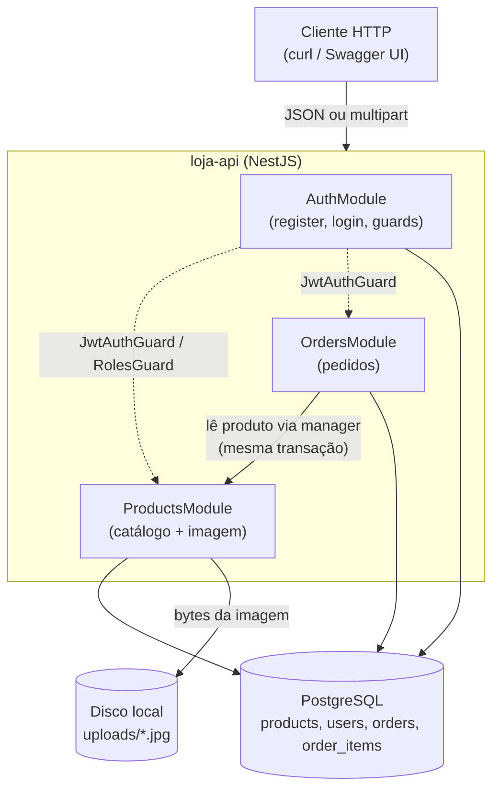
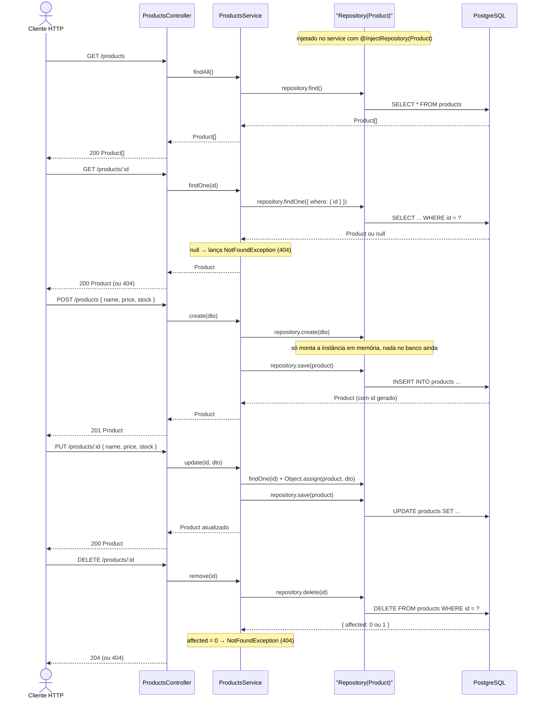
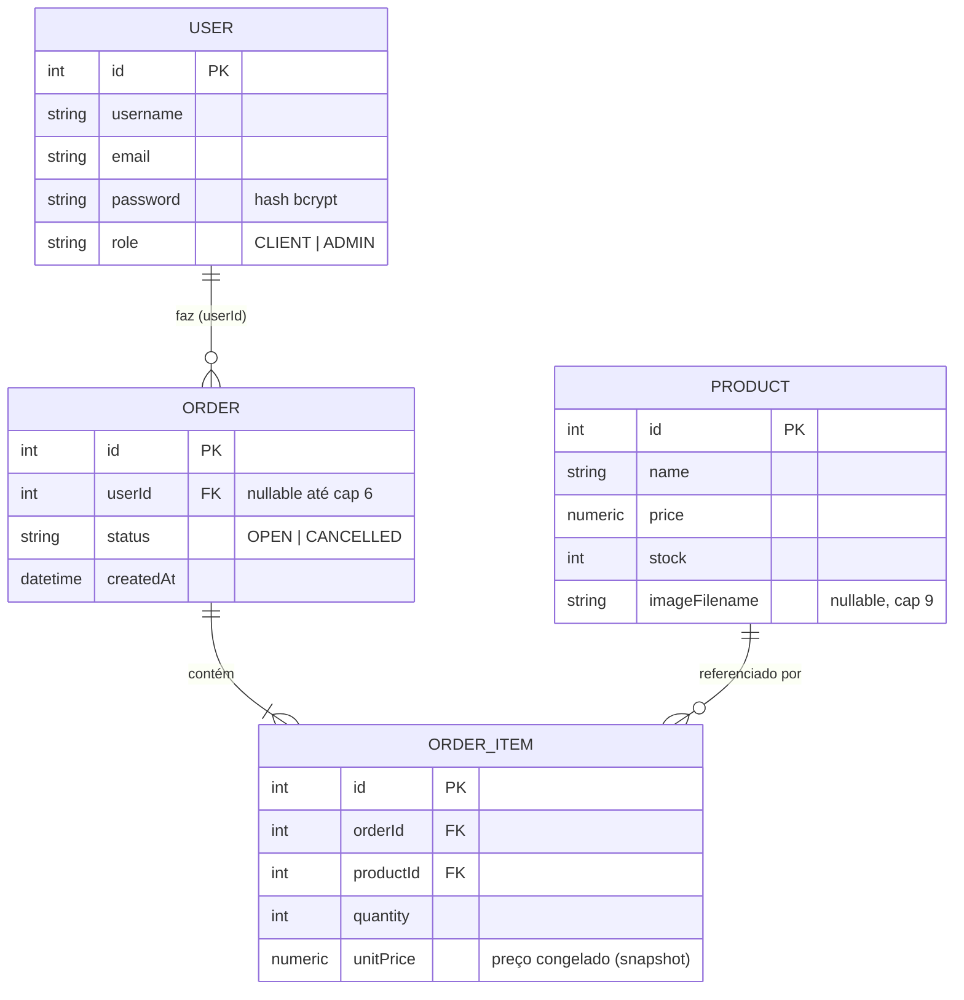
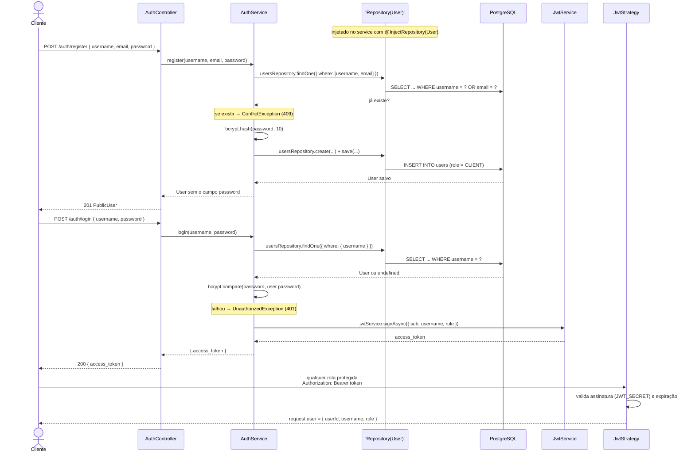
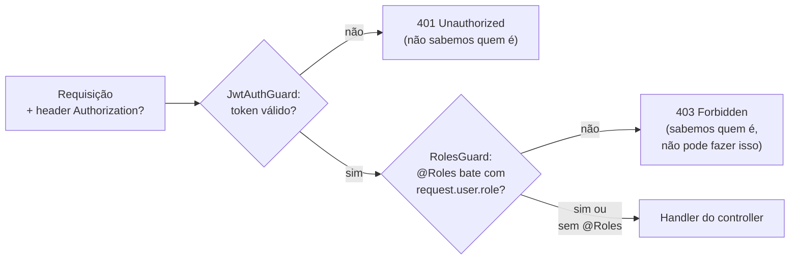
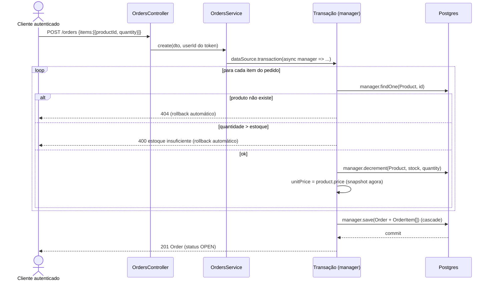
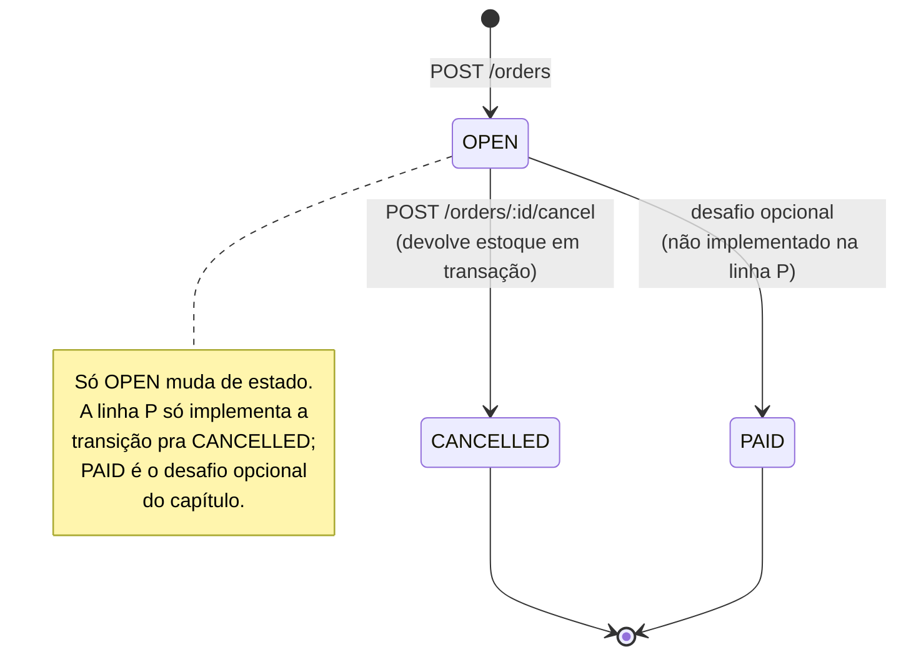
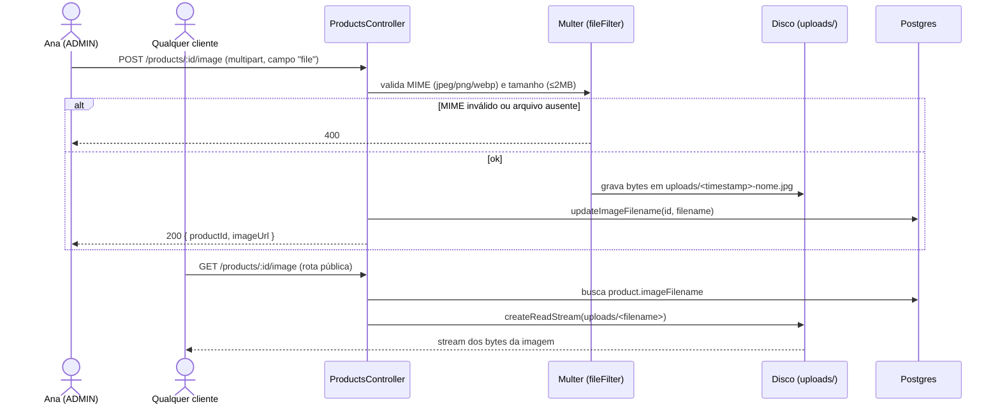

# Diagramas da solução — loja-api (trilha NestJS, linha P)

Complementa o `openapi.json`: descreve graficamente os fluxos que a API implementa do cap. 1 ao cap. 9. Cada bloco é um diagrama Mermaid independente — abra num visualizador Mermaid (mermaid.live, extensão do VS Code, ou qualquer app que renderize ```mermaid) ou cole direto num doc/markdown que já renderiza Mermaid.

## 1. Arquitetura geral

Visão de componentes: onde cada módulo vive e com o que ele fala.



## 2. Persistência de produtos (cap. 5): padrão Repository

O cap. 5 troca o array em memória pelo `Repository<Product>` do TypeORM — cada método do service vira uma chamada direta ao repositório, sem transação manual (compare com o diagrama 6, onde criar um pedido precisa do `manager` dentro de uma transação).



## 3. Modelo de dados (ER)

As quatro entidades da linha P e como se relacionam.



## 4. Autenticação: registro, login e requisição protegida

Assim como o cap. 5 (diagrama 2), o cap. 6 também acessa o banco via `Repository<User>` — nunca via `manager`. Só o cap. 5.1/20 (diagrama 6) usa `manager`, porque só ali existe uma transação multi-tabela de verdade.



## 5. Pipeline de autorização (guards)

A diferença prática entre 401 e 403, no formato que os guards checam.



## 6. Criar pedido (transação, snapshot de preço, baixa de estoque)

O fluxo mais importante do curso — tudo ou nada. Repara a diferença pro diagrama 2: aqui o acesso ao banco passa pelo `manager` de uma transação explícita, nunca pelo repositório normal — porque essa operação mexe em `Order`, `OrderItem` e `Product` ao mesmo tempo, e precisa de tudo-ou-nada.



## 7. Ciclo de vida do pedido



## 8. Upload e download de imagem do produto


