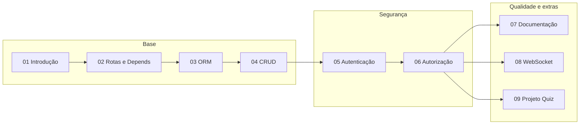

# Curso de APIs com Python e FastAPI

Material de estudo para desenvolvimento de APIs em Python com **FastAPI**, pensado para que o aluno consiga seguir e reproduzir os exemplos em casa. Ao final, você será capaz de construir APIs escaláveis com ORM (SQLAlchemy), autenticação JWT, autorização por papéis e documentação OpenAPI.

## Pré-requisitos

- **Python** 3.10 ou superior
- **pip** para gerenciar dependências
- Conhecimento básico de **HTTP** e **REST**
- Editor de código (recomendado: VS Code ou Cursor)

## Ordem sugerida dos módulos

| Ordem | Módulo | Conteúdo |
|-------|--------|----------|
| 1 | [01-introducao](01-introducao/) | O que é FastAPI, OpenAPI, tipagem, escalabilidade; primeiro projeto |
| 2 | [02-rotas-e-dependencias](02-rotas-e-dependencias/) | APIRouter, Depends, path/query/body, injeção de dependências |
| 3 | [03-persistencia-orm](03-persistencia-orm/) | SQLAlchemy, engine, session, modelos; configuração do banco |
| 4 | [04-crud-completo](04-crud-completo/) | Pydantic, schemas vs models; CRUD completo com SQLite |
| 5 | [05-autenticacao](05-autenticacao/) | JWT, hash de senha; login e proteção de rotas com FastAPI |
| 6 | [06-autorizacao](06-autorizacao/) | RBAC, auth vs authz; rotas por papel (admin/user) |
| 7 | [07-documentacao](07-documentacao/) | OpenAPI, Swagger/ReDoc; tags, descrições e Bearer no FastAPI |
| 8 | [08-websocket](08-websocket/) | WebSocket com FastAPI (opcional) |
| 9 | [09-projeto-integrador](09-projeto-integrador/) | Projeto Quiz: CRUD, auth, roles e documentação integrados |
| — | [recursos](recursos/) | Glossário e referências |

## Fluxo de aprendizagem

## Como usar os materiais

- Cada módulo contém arquivos de **conceitos** (teoria) e **tutorial** (prática passo a passo), exceto 08 e 09, que são predominantemente práticos.
- Estude a teoria antes de fazer o tutorial correspondente.
- Siga a ordem dos módulos: os tutoriais 04–07 evoluem sobre um mesmo tipo de projeto (CRUD + auth + roles + docs).
- **Ambiente**: use um ambiente virtual (`python -m venv venv`) e instale as dependências indicadas em cada tutorial.
- **Testes**: use a documentação interativa em `/docs` (Swagger) ou ferramentas como Postman/Insomnia.
- **Referência**: em caso de dúvida, consulte a [documentação oficial do FastAPI](https://fastapi.tiangolo.com/).

## Objetivos de aprendizagem

- Estruturar um projeto FastAPI com rotas e dependências
- Persistir dados com SQLAlchemy (ORM) e Pydantic (schemas)
- Implementar autenticação JWT e autorização por papéis
- Documentar a API com OpenAPI (Swagger/ReDoc)
- Construir uma API completa sozinho (projeto integrador Quiz)
