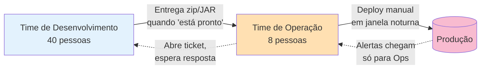

# Cenário PBL — Problema Norteador do Módulo

Este módulo é guiado por um **problema real** (PBL — Problem-Based Learning). Todo o conteúdo teórico está a serviço de **responder à pergunta norteadora** ao final.

---

## A empresa: CloudStore

A **CloudStore** é um e-commerce brasileiro de médio porte, com cerca de **200 mil pedidos/mês**. Tem três anos de operação, 40 engenheiros de software, 8 pessoas de operação/infra e 1 DBA.

A empresa **cresceu rápido** e, como em muitas startups que viraram empresa média, o processo de entrega **não acompanhou** esse crescimento.

---

## Como o trabalho acontece hoje

---

## Sintomas observados

| # | Sintoma | Detalhe |
|---|---------|---------|
| 1 | **Silos rígidos** | Dev e Ops quase não conversam. Comunicação acontece por ticket no Jira. |
| 2 | **"Jogar por cima do muro"** | Dev entrega um `.jar` para Ops com um README improvisado. Ops precisa "adivinhar" como rodar em produção. |
| 3 | **Deploys manuais em madrugada** | Toda sexta-feira, 23h, uma pessoa de Ops executa ~40 passos manuais. Alguém sempre esquece um deles. |
| 4 | **Incidentes sem raiz identificada** | Quando algo quebra, Ops é chamado. Ops reinicia o serviço. Dev diz "funciona na minha máquina". O problema volta em 2 semanas. |
| 5 | **Medo de release** | Ninguém quer fazer deploy na sexta. Releases são agrupadas, levando **semanas** entre uma e outra. |
| 6 | **Postmortem vira caça às bruxas** | Após um incidente grave, a pergunta principal da reunião é: *"Quem commitou isso?"*. A pessoa sai da reunião desmotivada; ninguém quer assumir riscos. |
| 7 | **Dev não tem acesso a log de produção** | "É política de segurança". Dev depende de Ops para saber o que aconteceu. |
| 8 | **Métricas inexistentes** | Ninguém sabe responder: "Com que frequência fazemos deploy?", "Quanto tempo leva uma feature do código ao cliente?", "Quantas vezes uma release causa incidente?" |
| 9 | **On-call é só de Ops** | Dev dorme tranquilo; Ops acorda às 3h da manhã para reiniciar serviço que Dev escreveu. |
| 10 | **Conhecimento concentrado** | Existe "o Roberto", única pessoa que sabe como o serviço de pagamento realmente funciona em produção. Quando Roberto tira férias, ninguém faz deploy no serviço de pagamento. |

---

## O que a liderança quer

A nova CTO, que acabou de entrar, resumiu assim para a diretoria:

> *"Quero entregar **mais rápido**, com **menos medo** e **menos dependência de heróis individuais**. E quero parar de culpar gente quando algo quebra — quero aprender com cada incidente."*

Metas declaradas:

- **Reduzir tempo entre commit e produção** (hoje: 3 a 4 semanas).
- **Aumentar frequência de deploy** (hoje: 1 a cada 2 semanas, às vezes 1 por mês).
- **Eliminar noites em claro** evitáveis de Ops.
- **Construir uma cultura** em que falhar faz parte e gera aprendizado.

---

## Pergunta norteadora

> **Como transformar a CloudStore em uma organização DevOps — em cultura, processos e métricas — de forma que as metas da CTO sejam atingíveis nos próximos 6 a 12 meses?**

Esta pergunta **não tem resposta única**. Ela exige que você articule:

1. **Diagnóstico** dos sintomas em termos de **causas sistêmicas** (não pessoas).
2. **Princípios** que devem guiar a transformação (CALMS, Três Caminhos).
3. **Intervenções concretas** (práticas, cerimônias, métricas, mudanças de processo).
4. **Riscos e trade-offs** — por que a mudança é difícil e como mitigar.

---

## Como este cenário aparece nos blocos

| Bloco | Lente sobre a CloudStore |
|-------|--------------------------|
| **Bloco 1** — O que é DevOps | Identificar a "Parede da Confusão" entre Dev e Ops e como os incentivos desalinhados criaram os silos. |
| **Bloco 2** — CALMS | Classificar cada um dos 10 sintomas em C, A, L, M ou S. |
| **Bloco 3** — Três Caminhos | Diagnosticar falhas de **fluxo**, **feedback** e **aprendizado** na CloudStore. |
| **Bloco 4** — Cultura em prática | Desenhar um modelo de postmortem *blameless* e discutir o caso "Roberto" (herói individual vs conhecimento compartilhado). |

E os **exercícios progressivos** vão exigir que você produza artefatos concretos a partir desse cenário: um diagnóstico CALMS, um Value Stream Map, um template de postmortem e um plano de transformação.

---

## Próximo passo

Leia o **[Bloco 1 — O que é DevOps e a Parede da Confusão](bloco-1/01-o-que-e-devops.md)** para começar a entender a raiz histórica dos problemas que a CloudStore vive hoje.

---

<!-- nav:start -->

| &nbsp; | &nbsp; | &nbsp; |
|:--|:--:|--:|
| **← Anterior** [Módulo 1 — Fundamentos de DevOps e Cultura](README.md) | **↑ Índice** [Módulo 1 — Fundamentos e cultura DevOps](README.md) | **Próximo →** [Bloco 1 — O que é DevOps e a Parede da Confusão](bloco-1/01-o-que-e-devops.md) |

<!-- nav:end -->
