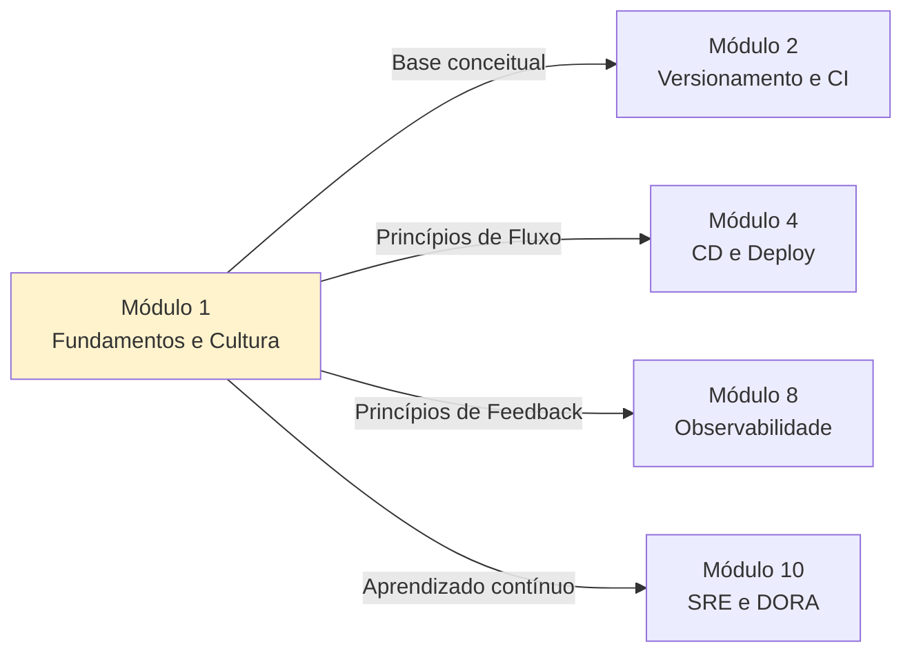

# Módulo 1 — Fundamentos de DevOps e Cultura

**Carga horária:** 5 horas
**Nível:** Graduação (ensino superior)
**Pré-requisitos:** Nenhum (módulo introdutório da disciplina)

---

## Por que este módulo vem primeiro

Antes de ferramentas, pipelines, contêineres e nuvem, DevOps é **um modelo mental** sobre como software é construído, entregue e operado. Este módulo estabelece as **fundações conceituais** que dão sentido aos demais módulos da disciplina: quando você estiver configurando um pipeline (Módulo 2), empacotando uma aplicação em Docker (Módulo 5) ou desenhando SLOs (Módulo 10), vai perceber que todas essas decisões emergem dos princípios discutidos aqui.

> DevOps não é um cargo, não é um time e não é uma ferramenta. É uma forma de trabalhar.

---

## Objetivos de Aprendizagem

Ao final do módulo, você será capaz de:

- **Explicar** a origem histórica do movimento DevOps e a "Parede da Confusão" entre Dev e Ops.
- **Diferenciar** DevOps como cultura, prática e filosofia — e identificar **anti-padrões** comuns.
- **Aplicar** o modelo **CALMS** (Culture, Automation, Lean, Measurement, Sharing) para diagnosticar a maturidade de um time.
- **Descrever** os **Três Caminhos** do DevOps Handbook (Fluxo, Feedback, Aprendizado Contínuo).
- **Analisar** um cenário real usando **mapeamento de fluxo de valor** (Value Stream Mapping).
- **Conduzir** um *blameless postmortem* e entender seu papel na cultura de aprendizado.
- **Reconhecer** os quatro indicadores-chave **DORA** (preparação para o Módulo 10).

---

## Estrutura do Material

O conteúdo está organizado em **4 blocos teóricos** + **5 exercícios progressivos**, seguindo o modelo PBL (Problem-Based Learning).

| Ordem | Conteúdo | Arquivo(s) |
|-------|----------|------------|
| 0 | Cenário PBL (CloudStore) | [00-cenario-pbl.md](00-cenario-pbl.md) |
| 1 | O que é DevOps e a Parede da Confusão | [bloco-1/01-o-que-e-devops.md](bloco-1/01-o-que-e-devops.md) · [exercícios](bloco-1/01-exercicios-resolvidos.md) |
| 2 | Modelo CALMS | [bloco-2/02-modelo-calms.md](bloco-2/02-modelo-calms.md) · [exercícios](bloco-2/02-exercicios-resolvidos.md) |
| 3 | Os Três Caminhos (DevOps Handbook) | [bloco-3/03-tres-caminhos.md](bloco-3/03-tres-caminhos.md) · [exercícios](bloco-3/03-exercicios-resolvidos.md) |
| 4 | Cultura em prática e anti-padrões | [bloco-4/04-cultura-pratica-antipadroes.md](bloco-4/04-cultura-pratica-antipadroes.md) · [exercícios](bloco-4/04-exercicios-resolvidos.md) |
| 5 | Exercícios progressivos (5 partes) | [exercicios-progressivos/](exercicios-progressivos/) |
| 6 | Entrega avaliativa | [entrega-avaliativa.md](entrega-avaliativa.md) |
| — | Referências bibliográficas | [referencias.md](referencias.md) |

---

## Como Estudar

1. **Comece pelo cenário PBL** — leia o problema da CloudStore. Ele é o fio condutor de todo o módulo.
2. **Siga a ordem dos blocos** — cada bloco traz uma lente diferente para diagnosticar o problema da CloudStore.
3. **Faça os exercícios resolvidos** após cada bloco — eles são conceituais e rápidos (15–20 min).
4. **Execute os exercícios progressivos** — eles exigem produção de artefatos (documentos, diagramas, scripts Python).
5. **Consulte as referências** — cite autores e obras nas suas entregas para consolidar a argumentação.

### Ferramentas recomendadas

- **Editor de texto** (VS Code, Cursor, etc.) para Markdown.
- **Python 3.10+** para os exemplos executáveis de simulação dos blocos 2 e 3.
- **Conta no GitHub** (já deve existir do Módulo 2 — se ainda não, criar agora).
- Nenhuma ferramenta de CI/CD é exigida ainda — este módulo é conceitual.

---

## Ideia Central do Módulo

| Conceito | Significado |
|----------|-------------|
| **DevOps** | Forma de trabalhar que **elimina silos** entre desenvolvimento e operação |
| **CALMS** | Lentes para diagnosticar maturidade: **C**ultura, **A**utomação, **L**ean, **M**étricas, **S**haring |
| **Três Caminhos** | Princípios de **Fluxo → Feedback → Aprendizado contínuo** |
| **Cultura** | Segurança psicológica + responsabilidade compartilhada + aprendizado sem culpa |

> Conforme Kim, Humble, Debois e Willis em *The DevOps Handbook*, DevOps é a aplicação dos princípios Lean ao fluxo de trabalho de TI, transformando como organizações produzem, entregam e operam software.

---

## Conexão com o restante da disciplina

Tudo o que vem depois — pipelines, contêineres, Kubernetes, IaC, observabilidade, SRE — são **implementações técnicas** dos princípios que você vai aprender aqui.

---

*Material alinhado a: The DevOps Handbook (Kim et al.), Continuous Delivery (Humble & Farley), Site Reliability Engineering (Google/O'Reilly), A Regra é Não Ter Regras (Netflix/Hastings), DORA State of DevOps Report.*

---

<!-- nav:start -->

| &nbsp; | &nbsp; | &nbsp; |
|:--|:--:|--:|
| **← Anterior** _(início do curso)_ | **↑ Índice** Módulo 1 — Fundamentos e cultura DevOps | **Próximo →** [Cenário PBL — Problema Norteador do Módulo](00-cenario-pbl.md) |

<!-- nav:end -->
