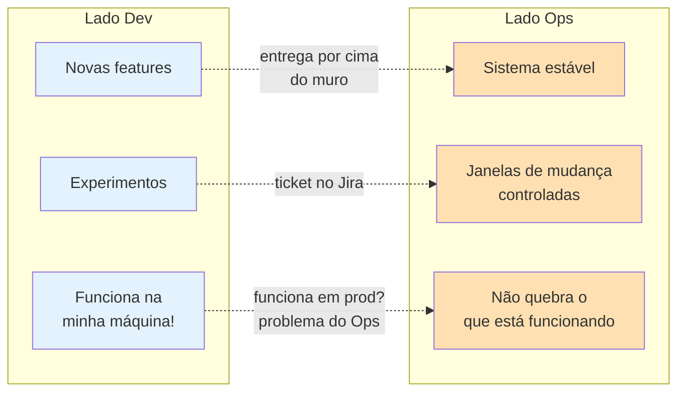
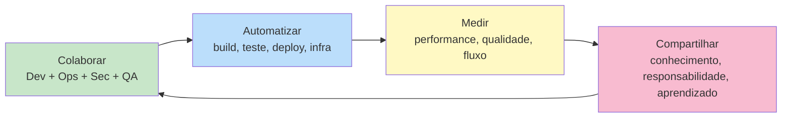

# Bloco 1 — O que é DevOps e a Parede da Confusão

> **Duração estimada:** 50 a 60 minutos de leitura e reflexão.

DevOps é, ao mesmo tempo, um **movimento cultural**, um **conjunto de práticas** e uma **forma de estruturar o trabalho** em organizações que produzem software. Este bloco responde à pergunta mais importante antes de qualquer prática técnica: **por que DevOps existe?**

---

## 1. O problema: desenvolvimento e operação em silos

Por décadas, as áreas de **Desenvolvimento** (escrever software) e **Operação** (rodar software em produção) eram organizadas como **times separados**, com **incentivos opostos**:

| Área | Objetivo declarado | O que maximiza o bônus |
|------|--------------------|------------------------|
| **Desenvolvimento (Dev)** | Entregar funcionalidades novas | **Mudança** rápida |
| **Operação (Ops)** | Manter o sistema no ar | **Estabilidade** — ou seja, **evitar mudança** |

Esta é a raiz do conflito: **a mesma ação (colocar código em produção) é simultaneamente o objetivo de um time e a ameaça ao objetivo do outro**.

### Um exemplo cotidiano

O time de Dev entrega uma feature nova que precisa ir a produção. Dev está animado: trabalhou duas semanas nisso. Ops olha o e-mail com o anexo e pensa: *"Mais uma mudança para quebrar o sistema que eu preciso manter estável."*

Do lado de Dev, Ops "atrapalha" a entrega.
Do lado de Ops, Dev "ameaça" a estabilidade.

**Ninguém está agindo de má-fé**. Cada um está respondendo racionalmente aos **incentivos que recebeu**. E é exatamente esse o ponto: o problema é **estrutural**, não pessoal.

---

## 2. A "Parede da Confusão" (Wall of Confusion)

O termo **Wall of Confusion** foi cunhado por Andrew Shafer e Patrick Debois em 2008 para descrever essa barreira organizacional entre Dev e Ops.

O que acontece dentro de uma empresa com a Parede da Confusão:

- **Dev** empacota o software e "joga" para Ops.
- **Ops** recebe um pacote que não sabe como funciona por dentro.
- Quando algo quebra, cada lado **culpa o outro**.
- O deploy vira um **evento traumático**: todo mundo em war room, muita tensão, muita pressão.

### Sintomas na CloudStore

Volte ao [cenário PBL](../00-cenario-pbl.md) e releia os sintomas. Vários deles são manifestações diretas da Parede da Confusão:

- **Sintoma 2** — "Dev entrega um `.jar` para Ops com um README improvisado" → literalmente a parede.
- **Sintoma 4** — "Dev diz 'funciona na minha máquina'" → o clássico da parede.
- **Sintoma 7** — "Dev não tem acesso a log de produção" → separação reforçada por política.
- **Sintoma 9** — "On-call é só de Ops" → incentivo desalinhado institucionalizado.

---

## 3. Breve história: como DevOps surgiu

### 3.1 As origens — Lean e Agile

DevOps não nasceu do vácuo. Suas raízes vêm de dois movimentos anteriores:

1. **Lean Manufacturing** (Toyota Production System, décadas de 1950–1970): inspira a ideia de **fluxo contínuo**, **redução de desperdício** (*muda*), **melhoria contínua** (*kaizen*) e **parar a linha para consertar** (*Andon Cord*).
2. **Agile** (Manifesto Ágil, 2001): traz para software a ideia de **entregas frequentes**, **colaboração com cliente**, **ciclos curtos** e **adaptação**.

Agile revolucionou o **desenvolvimento**, mas parou na porta da operação. Um time ágil podia terminar um sprint em 2 semanas e... esperar **3 meses** pela janela de deploy de Ops. O gargalo apenas se moveu.

### 3.2 Velocity 2009 — a palestra fundadora

Em junho de 2009, na conferência **Velocity** da O'Reilly, John Allspaw (VP of Ops) e Paul Hammond (VP of Engineering) do **Flickr** deram a palestra histórica:

> ***"10+ Deploys per Day: Dev and Ops Cooperation at Flickr"***

A tese era chocante para a época: o Flickr fazia **mais de 10 deploys por dia**, e o segredo era que **Dev e Ops trabalhavam juntos**, com ferramentas automatizadas, responsabilidade compartilhada e confiança mútua.

A palestra está registrada em vídeo e transcrições; é praticamente o "marco zero" cultural do DevOps.

### 3.3 DevOpsDays — o nome nasce

Inspirado pela palestra, **Patrick Debois** (engenheiro belga de Ops) organizou em **outubro de 2009**, em Ghent (Bélgica), o primeiro **DevOpsDays**. O evento juntou gente de Dev, Ops, QA, segurança e produto para discutir como derrubar silos.

O termo **"DevOps"** foi cunhado como hashtag do evento no Twitter: `#devops`. Ficou.

### 3.4 Consolidação — livros que viraram cânone

Nos anos seguintes, surgiram as obras que formalizaram o movimento:

- **2011** — *Continuous Delivery*, de Jez Humble e David Farley: trouxe fundamentos técnicos de pipelines de entrega.
- **2013** — *The Phoenix Project*, de Gene Kim, Kevin Behr e George Spafford: novela ficcional introduzindo DevOps para gestores (leitura paralela recomendada).
- **2016** — *The DevOps Handbook*, de Kim, Humble, Debois e Willis: **a bíblia** do movimento, com os **Três Caminhos** (veja Bloco 3).
- **2016** — *Site Reliability Engineering*, do Google: trouxe a visão **SRE** como "implementação do DevOps".
- **2018** — *Accelerate*, de Forsgren, Humble e Kim: base científica das **métricas DORA** (veja Bloco 4 e Módulo 10).

---

## 4. Mas afinal, o que é DevOps?

Não existe uma definição oficial única. Mas podemos convergir em uma formulação funcional:

> **DevOps** é um conjunto de **práticas culturais, de processo e de tecnologia** cujo objetivo é **reduzir o tempo entre ter uma ideia e vê-la rodando com qualidade em produção**, eliminando silos entre quem constrói e quem opera o software.

Quatro verbos ajudam a memorizar:

**Colaborar → Automatizar → Medir → Compartilhar → (loop).**

---

## 5. O que DevOps **não é** (desfazendo mitos)

Talvez mais importante que definir **o que é**, é entender **o que NÃO é**.

| Mito | Por que está errado |
|------|---------------------|
| **"DevOps é um cargo"** ("DevOps Engineer") | DevOps é uma cultura; colocar "DevOps" como título de um cargo individual repete o erro de silo — a pessoa vira apenas um novo Ops rebatizado. |
| **"DevOps é um time separado"** | Criar um **"Time DevOps"** entre Dev e Ops cria **três silos** em vez de dois. Piora o problema. |
| **"DevOps é ferramenta"** (Jenkins, Kubernetes, Docker) | Ferramentas habilitam DevOps, mas não **são** DevOps. É possível ter Kubernetes e continuar com cultura Dev-vs-Ops. |
| **"DevOps = CI/CD"** | CI/CD é uma **prática fundamental** de DevOps, mas DevOps é mais amplo: inclui cultura, observabilidade, segurança, organização. |
| **"DevOps significa que Dev faz Ops"** | Significa que Dev e Ops **trabalham juntos**, não que papéis sumiram. Especialização continua existindo; silos é que não. |
| **"DevOps resolve tudo"** | DevOps melhora fluxo de software; **não** resolve problema de produto, de arquitetura monolítica mal feita ou de cultura tóxica da liderança. |

> **Atenção:** Na CloudStore do nosso cenário, contratar um "DevOps Engineer" e colocá-lo como **ponte** entre os dois times provavelmente **não** resolveria o problema — apenas adicionaria mais um silo. A transformação precisa ser **estrutural**.

---

## 6. Por que DevOps dá retorno (a evidência)

Não é só "fé". Desde 2014, o **DORA (DevOps Research & Assessment)** — hoje parte do Google Cloud — publica o *State of DevOps Report* com pesquisas envolvendo dezenas de milhares de profissionais.

As conclusões, sintetizadas no livro **Accelerate** (Forsgren, Humble & Kim, 2018), mostram que organizações com práticas DevOps maduras superam as outras em:

- **46 vezes** mais deploys.
- **440 vezes** menor lead time do código ao cliente.
- **170 vezes** MTTR menor.
- **5 vezes** menor taxa de falha de mudança.

E mais: **essas mesmas empresas também são mais lucrativas e têm mais satisfação dos funcionários**. DevOps não é tradeoff entre velocidade e qualidade — é um jeito de ter os **dois**.

> **Referência:** Forsgren, N.; Humble, J.; Kim, G. *Accelerate: The Science of Lean Software and DevOps*. IT Revolution, 2018. Veja também o arquivo `books/DORA-State of DevOps.pdf`.

Essas métricas — **Deployment Frequency, Lead Time, MTTR e Change Failure Rate** — são conhecidas como **"Quatro Indicadores-Chave DORA"** e serão aprofundadas no **Módulo 10**.

---

## 7. Aplicação ao cenário da CloudStore

Reúna os conceitos deste bloco e aplique-os ao cenário:

- **A Parede da Confusão existe na CloudStore?** Sim — vide os sintomas 1, 2, 4, 7, 9.
- **O que deveria mudar no nível estrutural?** Responsabilidade compartilhada (Dev entra no on-call, Ops participa do design), acesso compartilhado (Dev pode ver logs), ferramental compartilhado (mesmo dashboard).
- **Basta mudar ferramentas?** **Não**. Uma CloudStore com Kubernetes e Jenkins pode continuar com os mesmos silos. A mudança precisa começar pela **responsabilidade compartilhada** e pelos **incentivos**.

---

## Resumo do bloco

- DevOps surgiu como **resposta ao conflito estrutural** entre Dev (mudança) e Ops (estabilidade).
- A **Parede da Confusão** simboliza esse silo: cada time otimiza sua métrica isolada e o sistema como um todo sofre.
- O movimento nasceu em **2009** (Velocity + DevOpsDays) e tem **raízes em Lean e Agile**.
- DevOps é **cultura, prática e tecnologia** — não cargo, não time isolado, não ferramenta única.
- **Evidência (DORA):** empresas com práticas DevOps maduras têm performance muito superior em todas as dimensões.
- Na CloudStore, a **solução não é contratar "um DevOps"**; é transformar estrutura, incentivos e cultura.

---

## Próximo passo

- Faça os **[exercícios resolvidos do Bloco 1](01-exercicios-resolvidos.md)** para fixar os conceitos.
- Depois vá para o **[Bloco 2 — Modelo CALMS](../bloco-2/02-modelo-calms.md)**.

---

## Referências deste bloco

- **Kim, G.; Humble, J.; Debois, P.; Willis, J.** *The DevOps Handbook.* IT Revolution, 2016. (Introdução — origens do movimento.)
- **Forsgren, N.; Humble, J.; Kim, G.** *Accelerate.* IT Revolution, 2018. (Evidências quantitativas.)
- **Humble, J.; Farley, D.** *Entrega Contínua.* Alta Books. (Fundamentos técnicos.)
- **Allspaw, J.; Hammond, P.** *"10+ Deploys per Day: Dev and Ops Cooperation at Flickr"*. Velocity 2009.
- **DORA State of DevOps Report** (veja `books/DORA-State of DevOps.pdf`).

---

<!-- nav:start -->

| &nbsp; | &nbsp; | &nbsp; |
|:--|:--:|--:|
| **← Anterior** [Cenário PBL — Problema Norteador do Módulo](../00-cenario-pbl.md) | **↑ Índice** [Módulo 1 — Fundamentos e cultura DevOps](../README.md) | **Próximo →** [Exercícios Resolvidos — Bloco 1](01-exercicios-resolvidos.md) |

<!-- nav:end -->
