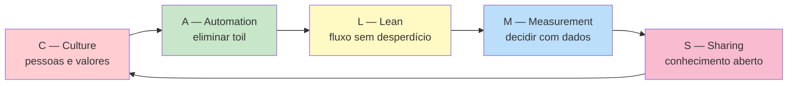
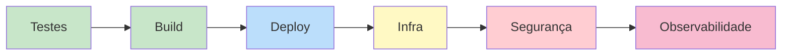
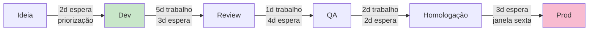
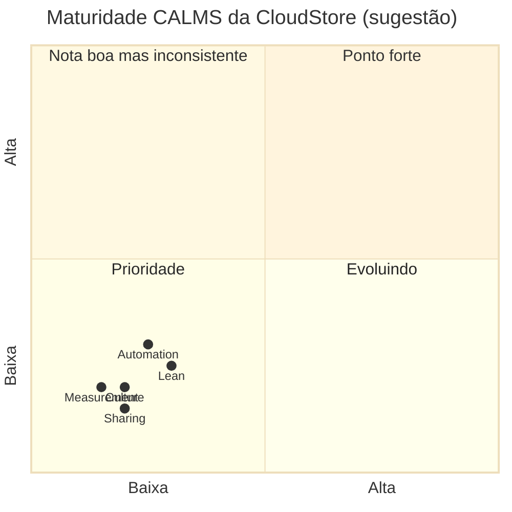

# Bloco 2 — Modelo CALMS

> **Duração estimada:** 50 a 60 minutos de leitura, exemplo prático em Python incluído.

Você já entendeu, no Bloco 1, **por que** DevOps existe. Agora precisamos de uma **ferramenta de diagnóstico**: como saber se um time (ou uma empresa como a CloudStore) é **maduro** em DevOps? Em que **dimensões** ele precisa evoluir?

É para isso que serve o **modelo CALMS**.

---

## 1. Origem e definição

O acrônimo **CALMS** foi proposto por **Jez Humble** em 2010 como uma forma simples de **memorizar os cinco pilares** de uma cultura DevOps. A sigla significa:

| Letra | Pilar | Pergunta central |
|-------|-------|-------------------|
| **C** | **Culture** (Cultura) | As pessoas compartilham objetivos, responsabilidade e confiança? |
| **A** | **Automation** (Automação) | O trabalho repetitivo foi eliminado? |
| **L** | **Lean** | O fluxo de valor tem desperdício? Há gargalos? |
| **M** | **Measurement** (Medição) | Decisões são tomadas com dados ou com opinião? |
| **S** | **Sharing** (Compartilhamento) | Conhecimento é compartilhado ou concentrado em pessoas-herói? |

Cada pilar é uma **lente diferente** sobre o mesmo sistema. Uma organização madura em DevOps **tem força nos cinco**; uma imatura tem pontos cegos em um ou mais.



> **Referência histórica:** o post original de Jez Humble descrevia apenas CAMS; o "L" (Lean) foi incorporado depois por Damon Edwards e John Willis em 2010. A versão consolidada é discutida em Kim et al., *The DevOps Handbook* (2016), parte introdutória.

---

## 2. C — Culture (Cultura)

**Pergunta:** *As pessoas compartilham objetivos e têm segurança psicológica para falhar, aprender e melhorar?*

Cultura é o **pilar mais difícil** porque é **invisível** — você não vê cultura, você vê **comportamentos** que são sintomas dela.

### Sinais de cultura DevOps saudável

- Dev e Ops têm o **mesmo KPI** ou KPIs que se reforçam.
- Postmortem é **blameless** (sem culpa) — o objetivo é aprender.
- Decisões são descentralizadas: quem está mais perto do problema decide.
- Experimentação é valorizada; falhar pequeno faz parte.

### Sinais de cultura DevOps doente

- "Quem **commitou** isso?" é a primeira pergunta depois de um incidente.
- Decisões pequenas precisam de **aprovação de comitê**.
- Engenheiros não propõem melhorias ("pra que, não vai ser aprovado mesmo").
- Existe um **"herói"** do time (veja o caso do "Roberto" na CloudStore) — dependência forte em uma pessoa.

### O conceito de segurança psicológica

**Amy Edmondson** (Harvard Business School, 1999) cunhou o termo **psychological safety**: o sentimento de que se pode **admitir erro, fazer perguntas ou sugerir ideias sem medo** de retaliação ou humilhação.

O **projeto Aristóteles**, do Google (2012–2015), analisou centenas de times internos e concluiu que **segurança psicológica é o fator #1** que diferencia times de alta performance.

DevOps **depende** de segurança psicológica: sem ela, engenheiros escondem erros, não propõem experimentos e não pedem ajuda. O resultado é o que vemos na CloudStore — incidentes sem raiz, deploy com medo, postmortem que vira tribunal.

> **Leitura:** Netflix, em *A Regra é Não Ter Regras* (Hastings & Meyer, 2020), sistematiza como altíssima densidade de talento + candor (feedback direto) + liberdade operacional reforçam segurança psicológica em escala. Veja `books/A Regra é Não Ter Regras.pdf`.

---

## 3. A — Automation (Automação)

**Pergunta:** *O trabalho manual repetitivo (toil) foi eliminado onde tecnicamente possível?*

### O que é toil?

O livro **Site Reliability Engineering** (Google/O'Reilly, 2016), no **Capítulo 5 — Eliminating Toil**, define toil como o trabalho que tem **todas** estas características:

- **Manual** — requer ação humana.
- **Repetitivo** — feito várias vezes igual.
- **Automatizável** — poderia ser feito por máquina.
- **Reativo** (táctico) — não agrega valor de longo prazo.
- **Sem valor duradouro** — feito algo e desfeito pelo próximo incidente.
- **Escala linearmente com o serviço** — dobrou o tráfego, dobrou o toil.

Ou seja, **toil ≠ trabalho duro**. Um projeto de refatoração difícil **não** é toil (agrega valor duradouro). Reiniciar um serviço toda noite porque "ele vaza memória" **é** toil.

### Por que automação é central para DevOps?

1. **Elimina erro humano em tarefas rotineiras** (deploy manual em 40 passos — sintoma 3 da CloudStore).
2. **Libera engenheiros para trabalho de engenharia** (criar algo novo em vez de repetir o mesmo).
3. **Permite escala** — uma empresa de 40 engenheiros não aguenta se cada deploy precisa de uma pessoa.
4. **Torna o processo auditável e reproduzível** — script versionado mostra o que foi feito.

### A regra prática do Google SRE

O livro SRE recomenda: **se um SRE gasta mais de 50% do tempo com toil, algo está errado**. A outra metade deve ser **engenharia**: automatizar, melhorar, projetar.

### O que automatizar (roadmap típico)



Cada item é um módulo desta disciplina:

- **Testes e Build** → Módulos 2 e 3.
- **Deploy** → Módulo 4.
- **Infra (IaC)** → Módulo 7.
- **Segurança (DevSecOps)** → Módulo 9.
- **Observabilidade** → Módulo 8.

### Exemplo: calculando o custo do toil na CloudStore

Vamos **quantificar** o toil da CloudStore com um pequeno script Python. Os dados saem do [cenário PBL](../00-cenario-pbl.md):

- Deploy manual às sextas, 40 passos, uma pessoa de Ops.
- Cada passo leva ~5 minutos em média (alguns rápidos, alguns esperando coisas subirem).
- Deploys são quinzenais (cerca de 2 por mês).
- Taxa de falha estimada: 15% (ou seja, ~1 a cada 7 deploys precisa ser retomado, gastando +30% do tempo).
- Salário médio Ops (com encargos): R$ 150/hora.

#### Script: `custo_toil.py`

Crie um arquivo `custo_toil.py` em qualquer lugar da sua máquina e rode com **Python 3.10+**:

```python
"""
Calcula o custo mensal e anual do toil de deploy manual na CloudStore.
Uso:
    python custo_toil.py
"""

from dataclasses import dataclass


@dataclass
class ToilDeploy:
    passos_manuais: int
    minutos_por_passo: float
    deploys_por_mes: float
    taxa_falha: float  # 0.0 a 1.0 — fração de deploys que precisam ser retomados
    tempo_retomada_extra: float  # fração extra de tempo quando falha (ex.: 0.3 = +30%)
    custo_hora_reais: float

    def tempo_por_deploy_horas(self) -> float:
        base = (self.passos_manuais * self.minutos_por_passo) / 60
        esperado = base * (1 + self.taxa_falha * self.tempo_retomada_extra)
        return esperado

    def custo_mensal(self) -> float:
        return self.tempo_por_deploy_horas() * self.deploys_por_mes * self.custo_hora_reais

    def custo_anual(self) -> float:
        return self.custo_mensal() * 12


if __name__ == "__main__":
    cloudstore = ToilDeploy(
        passos_manuais=40,
        minutos_por_passo=5,
        deploys_por_mes=2,
        taxa_falha=0.15,
        tempo_retomada_extra=0.30,
        custo_hora_reais=150,
    )

    print("=== Custo do toil de deploy manual — CloudStore ===")
    print(f"Tempo médio por deploy: {cloudstore.tempo_por_deploy_horas():.2f} horas")
    print(f"Custo mensal estimado : R$ {cloudstore.custo_mensal():,.2f}")
    print(f"Custo anual  estimado : R$ {cloudstore.custo_anual():,.2f}")
    print()
    print("Observação: este cálculo mostra APENAS o custo de tempo de Ops.")
    print("Não inclui: oportunidade perdida, bugs em produção, moral do time,")
    print("risco de erro manual, etc. O custo real é bem maior.")
```

#### Saída esperada

```
=== Custo do toil de deploy manual — CloudStore ===
Tempo médio por deploy: 3.48 horas
Custo mensal estimado : R$ 1,045.00
Custo anual  estimado : R$ 12,540.00

Observação: este cálculo mostra APENAS o custo de tempo de Ops.
...
```

**R$ 12.540 por ano** parece pouco — mas só pelo **tempo direto de Ops**. Some: risco de downtime (um erro manual em produção custa **muito** mais), moral do time, oportunidade de estar fazendo engenharia em vez de repetir passos, e o **medo de release** que trava a frequência de entregas.

**Esse é o argumento econômico para automatizar.** E é justamente o que vocês vão fazer no Módulo 2 em diante.

---

## 4. L — Lean

**Pergunta:** *O fluxo de trabalho tem desperdício? Onde estão os gargalos?*

O **L** vem do **Lean Manufacturing** (Toyota Production System), formalizado por **Taiichi Ohno** entre os anos 1950 e 1970, e aplicado a software por **Mary e Tom Poppendieck** a partir de 2003 (*Lean Software Development*).

### Os três inimigos do Lean (3 Ms)

- **Muda (ムダ)** — desperdício.
- **Muri (ムリ)** — sobrecarga.
- **Mura (ムラ)** — inconsistência/variabilidade.

### Os 7 desperdícios clássicos (adaptados ao software)

| # | Muda | Em software... |
|---|------|----------------|
| 1 | Superprodução | Features que ninguém usa. |
| 2 | Espera | Ticket parado esperando revisão, aprovação, deploy. |
| 3 | Transporte | Passar tarefa entre times (handoff entre Dev e QA e Ops). |
| 4 | Excesso de processamento | Retrabalho, reunião desnecessária, aprovação redundante. |
| 5 | Estoque | Features terminadas mas não entregues (acumulam risco). |
| 6 | Movimento | Alternar contexto entre 10 tarefas; ambiente confuso. |
| 7 | Defeitos | Bugs que viram retrabalho. |

**Na CloudStore:** releases agrupadas = estoque (5). Ticket no Jira esperando resposta = espera (2). Deploy manual em 40 passos = processamento excessivo (4). Bugs descobertos tarde em homologação = defeitos (7).

### Ferramenta-chave: Value Stream Mapping (VSM)

Um **VSM** mapeia **todo o fluxo** desde a ideia até o cliente, identificando onde está o **tempo de trabalho efetivo** e onde está o **tempo de espera**.

Exemplo simplificado da CloudStore:



Somando: **8 dias de trabalho** + **14 dias de espera** = **22 dias (lead time)** com **Activity Ratio ≈ 8/22 ≈ 36%**.

Isso é **Muda puro**. O trabalho em si não é o problema — o **esperar** entre atividades é.

Você vai produzir um VSM da CloudStore na **Parte 3 dos exercícios progressivos**.

> **Referência:** Kim, Humble, Debois, Willis. *The DevOps Handbook*. IT Revolution, 2016. Capítulo "The First Way: The Principles of Flow".

---

## 5. M — Measurement (Medição)

**Pergunta:** *Decisões são baseadas em dados ou em opinião/intuição?*

Sem métricas, toda discussão vira **opinião**. Com métricas, vira **evidência**.

### O que medir

1. **Métricas de fluxo** (como o trabalho anda):
    - **Lead Time** — ideia → cliente.
    - **Cycle Time** — começou a trabalhar → terminou.
    - **Throughput** — quantas unidades entregues por período.
    - **WIP (Work in Progress)** — quantas coisas em andamento.

2. **Métricas de qualidade** (o que chega tem qualidade?):
    - **Taxa de falha de mudança** (Change Failure Rate).
    - **Bugs em produção por release**.
    - **Cobertura de testes** (com moderação — não é meta em si).

3. **Métricas de confiabilidade** (o sistema funciona?):
    - **Disponibilidade** (uptime).
    - **MTTR** — tempo médio para restaurar.
    - **SLIs / SLOs** (aprofundado no Módulo 8 e 10).

4. **Métricas DORA** — combinam fluxo e qualidade:
    - Deployment Frequency.
    - Lead Time for Changes.
    - Change Failure Rate.
    - MTTR.
    - (2022+) Reliability (SLO compliance).

### Armadilhas clássicas

- **Vanity metrics** — métricas que parecem boas mas não guiam ação (ex.: "linhas de código").
- **Métricas que viram meta viram métricas ruins** (Lei de Goodhart). Se você pagar bônus por "baixo número de bugs abertos", surpresa: ninguém mais abre bug.
- **Medir só uma dimensão** (ex.: só velocidade) distorce o comportamento.

**Na CloudStore:** sintoma 8 é explícito — *"Ninguém sabe com que frequência fazemos deploy, quanto tempo leva uma feature, quantas falham"*. Sem essas respostas, não se pode melhorar — porque não se pode nem **diagnosticar**.

---

## 6. S — Sharing (Compartilhamento)

**Pergunta:** *Conhecimento, ferramentas e responsabilidade fluem entre pessoas e times?*

Compartilhamento tem múltiplas dimensões:

### Compartilhamento de **conhecimento**

- Runbooks, documentação viva, ADRs (Architecture Decision Records).
- Pair programming, mob programming.
- Lightning talks internas, brown bags, guildas.
- Postmortems abertos para toda a empresa ler.

**Anti-sinal:** "o Roberto" da CloudStore — única pessoa que sabe como o serviço de pagamento funciona.

### Compartilhamento de **ferramentas e código**

- Repositório único (monorepo) ou biblioteca compartilhada para problemas comuns.
- **InnerSource** — aplicar práticas open-source dentro da empresa: qualquer engenheiro pode abrir PR em qualquer repositório.

### Compartilhamento de **responsabilidade**

- On-call rotativo incluindo Dev.
- Design reviews com participação cruzada.
- Planning com Dev, Ops, Segurança, Produto juntos.

### Compartilhamento **externo**

- Times participam de conferências, escrevem posts, contribuem para open-source. Isso expõe o time a novas ideias e atrai talento.

> **Referência:** o **DevOps Handbook** dedica toda a Parte V ("The Technical Practices of Continual Learning") ao Terceiro Caminho, com Sharing no centro. Veja também o Capítulo 21 (*Reserve Time to Create Organizational Learning*) e o Capítulo 22 (*Inform Decisions with Production Telemetry*).

---

## 7. Aplicação ao cenário da CloudStore

Vamos fazer uma **primeira passada** — você refinará esse diagnóstico na entrega avaliativa.

| Sintoma CloudStore | Dimensão CALMS afetada |
|--------------------|-------------------------|
| 1. Silos rígidos | **C** (Culture), **S** (Sharing) |
| 2. "Jogar por cima do muro" | **C**, **S** |
| 3. Deploys manuais em madrugada | **A** (Automation), **L** (Lean) |
| 4. Incidentes sem raiz | **C** (postmortem), **M** (Measurement — falta dado), **S** |
| 5. Medo de release | **C**, **A**, **L** |
| 6. Postmortem de culpa | **C** (segurança psicológica) |
| 7. Dev sem acesso a log | **S**, **M** |
| 8. Métricas inexistentes | **M** |
| 9. On-call só de Ops | **C**, **S** |
| 10. "Roberto" (conhecimento concentrado) | **S** |

**Conclusão do diagnóstico preliminar:** a CloudStore tem **todas as cinco dimensões comprometidas**, mas a mais crítica é **Culture + Sharing**. Sem avançar nessas, qualquer automação técnica isolada tende a fracassar — porque engenheiros continuarão trabalhando em silos.

---

## 8. Como usar CALMS de forma prática

CALMS é útil em **3 momentos**:

1. **Diagnóstico inicial** — mapear a situação atual (o que você está fazendo agora com a CloudStore).
2. **Planejamento de transformação** — priorizar em qual dimensão investir primeiro.
3. **Avaliação periódica** — reaplicar trimestral/semestralmente para medir evolução.

Uma forma simples de diagnóstico é um **radar CALMS**:



Todos os pontos estão no **canto inferior esquerdo** (baixa maturidade). A CloudStore precisa evoluir em **todos os pilares** simultaneamente — mas começando por C e S.

---

## Resumo do bloco

- **CALMS** é acrônimo para os cinco pilares: **Cultura, Automação, Lean, Medição, Sharing**.
- **Culture** é a base: segurança psicológica, incentivos compartilhados.
- **Automation** elimina toil — **mas toil ≠ trabalho difícil**; toil é **manual, repetitivo e sem valor duradouro**.
- **Lean** olha para o **fluxo**: onde está o desperdício (espera, retrabalho, handoff).
- **Measurement** previne debate de opinião; DORA (Módulo 10) dá a linguagem.
- **Sharing** combate heróis individuais e concentração de conhecimento.
- A CloudStore tem **os cinco pilares comprometidos**, mas C e S são os mais urgentes.

---

## Próximo passo

- Faça os **[exercícios resolvidos do Bloco 2](02-exercicios-resolvidos.md)**.
- Depois avance para o **[Bloco 3 — Os Três Caminhos](../bloco-3/03-tres-caminhos.md)**.

---

## Referências deste bloco

- **Humble, J.** Post original sobre CAMS (2010), expandido por Damon Edwards e John Willis.
- **Kim, G.; Humble, J.; Debois, P.; Willis, J.** *The DevOps Handbook.* IT Revolution, 2016.
- **Beyer, B.; Jones, C.; Petoff, J.; Murphy, N.R. (eds.)** *Site Reliability Engineering.* O'Reilly, 2016. **Cap. 5 — Eliminating Toil.**
- **Poppendieck, M.; Poppendieck, T.** *Lean Software Development.* Addison-Wesley, 2003.
- **Ohno, T.** *Toyota Production System.* Productivity Press, 1988 (origem conceitual do Lean).
- **Edmondson, A.** *"Psychological Safety and Learning Behavior in Work Teams"*, 1999.
- **Hastings, R.; Meyer, E.** *A Regra é Não Ter Regras.* Intrínseca, 2020. (`books/A Regra é Não Ter Regras.pdf`)
