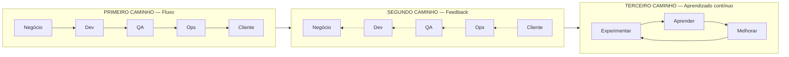
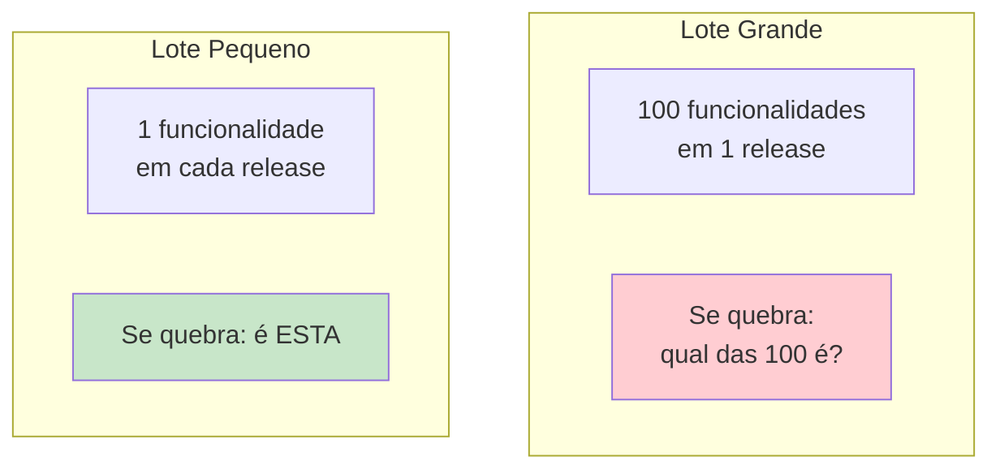

# Bloco 3 — Os Três Caminhos (The Three Ways)

> **Duração estimada:** 55 a 65 minutos. Inclui uma simulação prática em Python sobre o efeito de WIP e tamanho de lote no lead time.

Os **Três Caminhos** são o **coração conceitual** do livro *The DevOps Handbook* (Kim, Humble, Debois e Willis, 2016). Se CALMS (Bloco 2) é o que **diagnosticar**, os Três Caminhos são os **princípios que guiam a ação**.

Eles foram formulados originalmente por **Gene Kim** no livro *The Phoenix Project* (2013) e formalizados no *DevOps Handbook* em 2016.

---

## 1. Visão geral



- **Primeiro Caminho (Fluxo):** otimizar o **fluxo da esquerda para a direita** — do pedido do negócio até o valor entregue ao cliente.
- **Segundo Caminho (Feedback):** amplificar os **loops de feedback da direita para a esquerda** — da realidade da produção de volta para quem projeta.
- **Terceiro Caminho (Aprendizado):** criar uma **cultura de experimentação e aprendizado contínuo**.

> **Memorize:** **Fluxo → Feedback → Aprendizado.** Os três são **ordenados e cumulativos** — o segundo depende do primeiro; o terceiro depende dos dois anteriores.

---

## 2. Primeiro Caminho — Princípios do Fluxo

**Objetivo:** fazer o trabalho fluir **de forma suave e rápida** de Dev até o cliente, **sem acumular em filas** nem gerar retrabalho.

### 2.1 Tornar o trabalho **visível**

> *"Você não pode gerenciar o que não pode ver."*

Em manufatura, você vê pilhas de peças acumulando. Em software, o trabalho é **invisível** — está em cabeças, tickets, branches, pull requests. Ferramentas de **visualização** (quadros Kanban, boards) tornam o fluxo visível.

### 2.2 Reduzir **tamanho de lote** (batch size)

Quanto **menor o lote**, **menor o risco** de cada entrega e **mais rápido o feedback**.



**Na CloudStore:** releases quinzenais agrupadas = lote grande. Cada release vira um "big bang" — quando algo quebra, é quase impossível saber **o que** quebrou entre as dezenas de mudanças.

### 2.3 Limitar **WIP** (Work in Progress)

> *"Comece menos, termine mais."* — Henrik Kniberg, *Lean from the Trenches*.

Quanto **menos trabalho simultâneo**, mais rápido cada item passa. Contra-intuitivo mas matematicamente demonstrável (**Lei de Little**, veja seção 5).

### 2.4 Reduzir **número de handoffs**

Cada **passagem de bastão** entre times é uma oportunidade para:

- Contexto se perder.
- Trabalho ficar parado em fila.
- Responsabilidade ficar difusa.

O ideal é que um mesmo time (cross-funcional) leve do **conceito ao cliente** — o famoso **"you build it, you run it"** da Amazon.

### 2.5 Identificar e elevar **gargalos**

Vindo da **Teoria das Restrições** (Eliyahu Goldratt, *The Goal*, 1984): um sistema é tão rápido quanto seu **gargalo**. Investir em acelerar **não-gargalos** é desperdício. Primeiro identifique **qual é o gargalo real**, depois foque lá.

> **Leitura complementar:** *The Goal*, de Goldratt, e *The Phoenix Project*, de Kim — ambos introduzem Teoria das Restrições aplicada à TI.

### 2.6 Eliminar **muda** continuamente

Todos os desperdícios Lean (Bloco 2 seção 4) devem ser caçados: espera, retrabalho, handoff, overprocessing, defeitos, estoque, superprodução.

### Conexão com a CloudStore

- Trabalho **invisível?** Sim — "o Roberto" concentra conhecimento.
- **Lote grande?** Sim — releases quinzenais agrupadas.
- **WIP?** Alto e sem limite explícito.
- **Handoffs?** Muitos — Dev → QA → Ops → Release.
- **Gargalo?** Provavelmente o processo de deploy manual, que exige que **uma pessoa específica** esteja disponível na sexta à noite.

---

## 3. Segundo Caminho — Princípios do Feedback

**Objetivo:** garantir que informação da **direita** (produção, cliente) volte rapidamente para a **esquerda** (quem desenha, quem desenvolve), permitindo **corrigir problemas onde eles surgem**.

### 3.1 Ver os problemas **conforme acontecem**

Em Lean/Toyota, o conceito é o **Andon Cord**: qualquer operário pode **puxar a corda** e **parar a linha** se notar um defeito. O problema é resolvido **ali**, antes de virar defeito em massa.

Em software, o equivalente é:

- **CI/CD** — build quebrou, ninguém avança até consertar.
- **Feature flags** — se uma feature dá problema em produção, desligar em segundos.
- **Monitoramento** — alertas acionáveis avisam enquanto o problema ainda é pequeno.

> **Anti-padrão na CloudStore:** Sintoma 4 — bugs só aparecem no ambiente de homologação. Isso é feedback **tardio**: o problema anda **muitos passos** pelo pipeline antes de ser visto. Quanto mais tarde descoberto, mais caro corrigir.

### 3.2 Ampliar o loop da **produção → desenvolvimento**

Dev precisa ver o que acontece em **produção** com o código que escreveu. Concretamente:

- Dev tem acesso a logs e métricas (com permissão adequada).
- Dev recebe alertas relacionados ao código que escreveu.
- Dev participa do **on-call** — sente diretamente o que construiu.

Este último ponto é crucial. Há uma anedota famosa, contada por **Werner Vogels** (CTO Amazon):

> *"You build it, you run it."* — Dev é responsável pelo serviço em produção, 24×7.

Essa simples mudança de incentivo **muda radicalmente** como o código é escrito. Porque você **não quer** ser acordado às 3h pela própria bagunça.

### 3.3 **Telemetria ubíqua**

Todo sistema deve produzir **logs, métricas e traces** estruturados. O Módulo 8 aprofundará, mas aqui fica a semente: sem telemetria, não há feedback; sem feedback, não há aprendizado.

### 3.4 **Qualidade** deve estar **embutida na fonte**

Em Lean: **a qualidade é responsabilidade de quem produz a peça**, não de um inspetor no final. Em software:

- Dev escreve testes (shift-left).
- Dev considera segurança desde o commit (shift-left security — Módulo 9).
- Dev pensa em observabilidade ao desenhar a feature.

### 3.5 **Amplificar o sinal** — métricas compartilhadas

Métricas devem ser **visíveis para todos** — dashboards públicos na parede, no Slack, no e-mail diário. Quando todo mundo vê a mesma informação, as decisões se alinham.

---

## 4. Terceiro Caminho — Princípios do Aprendizado Contínuo

**Objetivo:** criar uma cultura em que a organização como um todo **aprende**, **melhora** e **inova** continuamente.

### 4.1 **Segurança psicológica** para experimentar

Ponto central. Sem segurança psicológica, ninguém experimenta; ninguém admite erro; não há aprendizado.

> **Anti-padrão na CloudStore:** Sintoma 6 — postmortem vira caça às bruxas. Isso **bloqueia** o Terceiro Caminho.

### 4.2 **Falhas são oportunidades de aprendizado**

Na cultura DevOps madura:

- **Falhar pequeno** é bom (experimentos controlados).
- **Falhar rápido** é melhor (feedback curto).
- **Falhar no mesmo lugar duas vezes** é problema (aprendizado não aconteceu).

### 4.3 **Blameless postmortem**

Depois de um incidente, **reúna o time**, reconstrua a sequência, identifique as **causas sistêmicas** — e nunca culpe pessoas.

O livro **Site Reliability Engineering** (Google/O'Reilly, 2016), no **Capítulo 15 — Postmortem Culture: Learning from Failure**, é a referência canônica. Será aprofundado no Bloco 4.

### 4.4 **Converter aprendizado local em melhoria global**

Quando um time aprende algo, como isso **vira conhecimento da organização**?

- Postmortem compartilhado internamente.
- Engineering blog interno.
- Guildas/Comunidades de prática (ex.: guilda de backend, guilda de segurança).

### 4.5 **Reservar tempo para melhoria**

O mandato típico do Google SRE: **at least 50% engineering time** (o outro 50% operacional). Na CloudStore, sem esse tempo reservado, engenheiros vão **apagar incêndio eterno**.

Outras formas:

- **20% time** (Google, 3M) — parte do tempo em experimentos livres.
- **Improvement Kata** (Toyota) — rituais regulares de melhoria.
- **"Fix-it days"** mensais — um dia inteiro só para melhorias técnicas.

### 4.6 **Injetar falhas de propósito — Chaos Engineering**

Para aprender a se recuperar de falhas, as melhores empresas **causam falhas de propósito** em produção, em ambiente controlado. Netflix inventou o **Chaos Monkey** em 2011 — uma ferramenta que **derruba aleatoriamente** instâncias em produção para garantir que o sistema se recupera.

> **Referência:** Netflix e sua cultura de chaos engineering é descrita em Hastings & Meyer, *A Regra é Não Ter Regras*, e também em *Chaos Engineering* (Rosenthal & Jones, O'Reilly, 2020).

---

## 5. Demonstração prática: o efeito do WIP no lead time

Vamos usar Python para **visualizar matematicamente** por que limitar WIP acelera entrega — um dos princípios centrais do Primeiro Caminho.

### 5.1 Lei de Little

A **Lei de Little** (John Little, 1961) é a equação fundamental de filas:

\[
L = \lambda \cdot W
\]

Onde:

- **L** = número médio de itens no sistema (WIP).
- **λ (lambda)** = taxa de chegada/saída (throughput, ex.: itens por dia).
- **W** = tempo médio que um item passa no sistema (lead time).

Reorganizando:

\[
W = \frac{L}{\lambda}
\]

**Interpretação direta:** com throughput fixo, **se você aumenta o WIP, o lead time cresce proporcionalmente.**

### 5.2 Simulação

Crie um arquivo `simula_fluxo.py`:

```python
"""
Simulação didática do efeito do WIP no lead time.

Modelo simplificado:
- O time tem capacidade de processar TAREFAS_POR_DIA tarefas concluídas/dia.
- Há diferentes cenários de trabalho em andamento (WIP) simultâneos.
- Cada tarefa tem um esforço fixo em "homens-dia".
- Pela Lei de Little, lead time = WIP / throughput.
- Multitarefa adiciona overhead (context switch).

Uso:
    python simula_fluxo.py
"""

from dataclasses import dataclass


@dataclass
class Cenario:
    nome: str
    wip: int           # quantas tarefas simultâneas
    capacidade_dia: float  # tarefas concluídas por dia em regime estável
    overhead_switch: float  # penalidade de troca de contexto (0.0 a 1.0)

    def throughput_efetivo(self) -> float:
        penalty = self.overhead_switch * (self.wip - 1)
        penalty = max(0.0, min(penalty, 0.8))
        return self.capacidade_dia * (1 - penalty)

    def lead_time_medio(self) -> float:
        tp = self.throughput_efetivo()
        if tp <= 0:
            return float("inf")
        return self.wip / tp


def linha(cenario: Cenario) -> str:
    return (
        f"{cenario.nome:<28} | "
        f"WIP={cenario.wip:>2} | "
        f"throughput={cenario.throughput_efetivo():>4.2f} tarefas/dia | "
        f"lead time médio={cenario.lead_time_medio():>5.2f} dias"
    )


if __name__ == "__main__":
    CAP = 2.0
    SWITCH = 0.08

    cenarios = [
        Cenario("WIP baixo  (2 simultâneas)", wip=2, capacidade_dia=CAP, overhead_switch=SWITCH),
        Cenario("WIP médio  (5 simultâneas)", wip=5, capacidade_dia=CAP, overhead_switch=SWITCH),
        Cenario("WIP alto   (10 simultâneas)", wip=10, capacidade_dia=CAP, overhead_switch=SWITCH),
        Cenario("WIP caótico (20 simultâneas)", wip=20, capacidade_dia=CAP, overhead_switch=SWITCH),
    ]

    print("=== Efeito do WIP no lead time (Lei de Little + overhead de context switch) ===\n")
    print(
        f"Capacidade base: {CAP} tarefas/dia | "
        f"Penalidade por context switch: {SWITCH*100:.0f}% por tarefa extra\n"
    )

    for c in cenarios:
        print(linha(c))

    print("\nLeitura:")
    print("- Com WIP crescendo, o throughput efetivo CAI (context switch).")
    print("- Lead time cresce proporcionalmente ao WIP (Lei de Little).")
    print("- A soma desses dois efeitos explica por que limitar WIP acelera entrega.")
```

### 5.3 Saída esperada

```
=== Efeito do WIP no lead time (Lei de Little + overhead de context switch) ===

Capacidade base: 2.0 tarefas/dia | Penalidade por context switch: 8% por tarefa extra

WIP baixo  (2 simultâneas)   | WIP= 2 | throughput=1.84 tarefas/dia | lead time médio= 1.09 dias
WIP médio  (5 simultâneas)   | WIP= 5 | throughput=1.36 tarefas/dia | lead time médio= 3.68 dias
WIP alto   (10 simultâneas)  | WIP=10 | throughput=0.56 tarefas/dia | lead time médio=17.86 dias
WIP caótico (20 simultâneas) | WIP=20 | throughput=0.40 tarefas/dia | lead time médio=50.00 dias
```

### 5.4 Leitura dos resultados

- **WIP baixo:** tarefas saem em ~1 dia.
- **WIP caótico:** as mesmas tarefas, com o **mesmo time**, levam **mais de 50 dias** cada.
- A diferença não está nas pessoas; está em **quantas coisas elas tentam fazer ao mesmo tempo**.

**Esse é o argumento matemático para limitar WIP.** Kanban moderno, Scrum (sprint goal focado), Scrumban — todos aplicam este princípio.

---

## 6. Os Três Caminhos aplicados à CloudStore

| Caminho | Diagnóstico CloudStore | Intervenção prioritária |
|---------|------------------------|-------------------------|
| **Fluxo** | Releases quinzenais (lote grande). Muitos handoffs (Dev → QA → Ops). Gargalo no deploy manual. | Reduzir tamanho de lote (releases semanais → diárias), eliminar janela fixa de deploy, automatizar deploy. |
| **Feedback** | Bugs descobertos tarde. On-call só de Ops. Dev sem acesso a logs. | Pipeline de testes automatizados (CI), Dev no on-call, Grafana/logs acessíveis para Dev. |
| **Aprendizado** | Postmortem de culpa. Conhecimento concentrado ("Roberto"). Sem tempo para melhoria. | Blameless postmortem, pair programming, guildas, 20% de tempo para melhoria técnica. |

---

## Resumo do bloco

- **Três Caminhos:** **Fluxo (1º)** → **Feedback (2º)** → **Aprendizado contínuo (3º)**.
- **Primeiro Caminho:** otimizar o fluxo da esquerda para a direita; reduzir lote, WIP e handoffs; eliminar gargalos (Teoria das Restrições).
- **Segundo Caminho:** amplificar feedback da direita para a esquerda; ver falhas na fonte; "you build it, you run it"; telemetria ubíqua.
- **Terceiro Caminho:** cultura de aprendizado; blameless postmortem; tempo reservado para melhoria; Chaos Engineering.
- **Lei de Little** demonstra matematicamente por que **WIP baixo = lead time baixo**.
- Os três são **cumulativos e ordenados** — feedback pressupõe fluxo; aprendizado pressupõe feedback.

---

## Próximo passo

- Faça os **[exercícios resolvidos do Bloco 3](03-exercicios-resolvidos.md)**.
- Depois avance para o **[Bloco 4 — Cultura em prática e anti-padrões](../bloco-4/04-cultura-pratica-antipadroes.md)**.

---

## Referências deste bloco

- **Kim, G.; Humble, J.; Debois, P.; Willis, J.** *The DevOps Handbook.* IT Revolution, 2016. **Parte I — The Three Ways**. (`books/DevOps_Handbook_Intro_Part1_Part2.pdf`)
- **Kim, G.; Behr, K.; Spafford, G.** *The Phoenix Project.* IT Revolution, 2013. (Introdução ficcional dos Três Caminhos.)
- **Beyer, B. et al. (eds.)** *Site Reliability Engineering.* O'Reilly, 2016. **Cap. 15 — Postmortem Culture.**
- **Goldratt, E.** *The Goal.* North River Press, 1984. (Teoria das Restrições.)
- **Little, J.D.C.** *"A Proof for the Queuing Formula: L = λW"*. Operations Research, 1961.
- **Rosenthal, C.; Jones, N.** *Chaos Engineering.* O'Reilly, 2020.
- **Kniberg, H.** *Lean from the Trenches.* Pragmatic Bookshelf, 2011.
