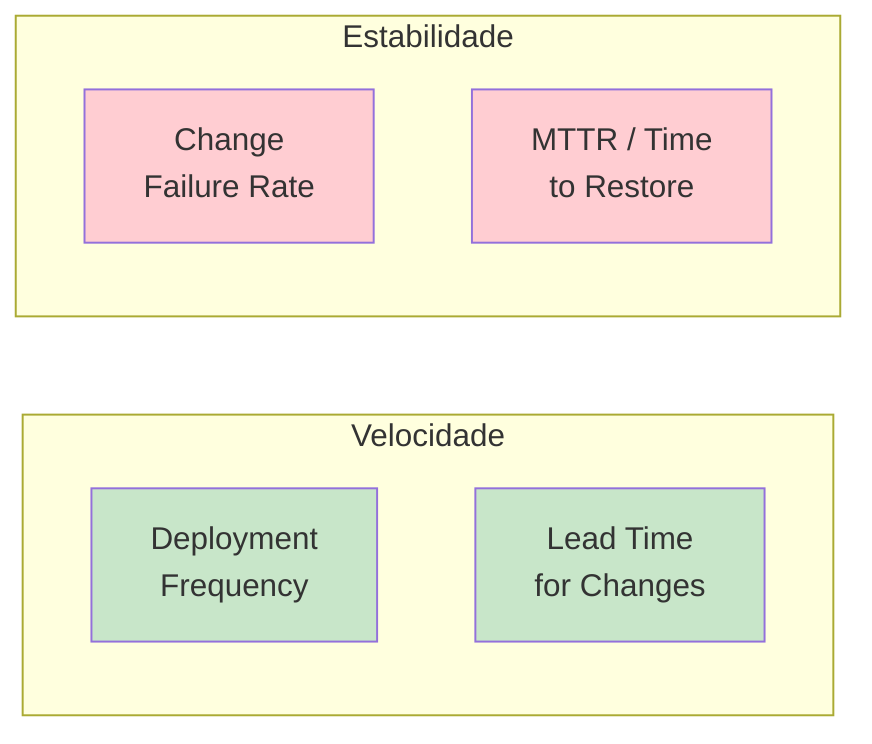
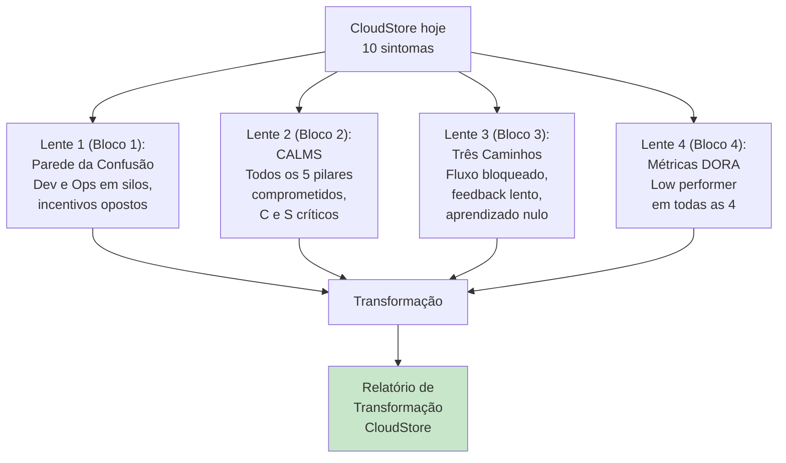

# Bloco 4 — Cultura em Prática, Anti-padrões e Introdução às Métricas DORA

> **Duração estimada:** 50 a 60 minutos. Inclui um gerador de template de postmortem em Python.

Os blocos anteriores construíram a base conceitual. Este bloco **aterra** os conceitos em **práticas concretas** e discute os **anti-padrões** mais comuns de transformação DevOps — armadilhas que a CloudStore (e você como profissional) precisa evitar.

---

## 1. Blameless Postmortem — aprendendo com incidentes

Já vimos em blocos anteriores por que postmortems de culpa bloqueiam o aprendizado. Aqui aprofundamos: **como fazer** um blameless postmortem na prática.

### 1.1 Definição

Um **blameless postmortem** (ou *retrospectiva de incidente sem culpa*) é uma reunião estruturada **após um incidente** cujo objetivo é:

- **Reconstruir** o que aconteceu, em linha do tempo.
- **Entender** as causas **sistêmicas** (não as pessoas).
- **Identificar** aprendizados e ações de melhoria.
- **Documentar** para que **outros times** aprendam também.

A referência canônica é **Site Reliability Engineering** (Google/O'Reilly, 2016), **Capítulo 15 — Postmortem Culture: Learning from Failure**.

### 1.2 Princípio central: "Ninguém causou o incidente sozinho"

Um postmortem blameless assume desde o início que:

1. **Pessoas agem com as melhores intenções** com a informação disponível.
2. **Se alguém conseguiu quebrar o sistema com uma ação isolada**, o problema é do **sistema** (por que ele permitiu?), não da ação.
3. **A raiz está sempre no sistema**, nas ferramentas, no processo, nas instruções, no incentivo — nunca na pessoa.

### 1.3 Estrutura típica de um postmortem

| Seção | Conteúdo |
|-------|----------|
| **Resumo** | O que aconteceu, 2 a 3 frases. |
| **Impacto** | Clientes afetados, tempo de degradação, perdas (dinheiro, SLO). |
| **Linha do tempo** | Ordem cronológica de eventos (detecção, diagnóstico, mitigação, resolução). |
| **Diagnóstico / Causa-raiz** | Análise sistêmica: os "5 Porquês" ou Ishikawa. |
| **O que funcionou** | Práticas que funcionaram — comemorar explicitamente. |
| **O que poderia ter ido melhor** | Lacunas observadas. |
| **Onde tivemos sorte** | O que **não** quebrou por acaso (próxima vez pode quebrar). |
| **Ações (action items)** | Com **dono** e **prazo**; cada ação é uma melhoria sistêmica. |
| **Lições aprendidas** | Sínteses para quem não participou. |

### 1.4 A "regra de ouro" blameless

Durante a reunião, **substitua** frases como:

- "O João fez o deploy e quebrou" → *"O deploy foi feito sem execução prévia da suite de testes de integração."*
- "A Ana clicou no botão errado" → *"A UI do painel permitia que um clique acidental deletasse recursos em produção."*
- "O time de rede não avisou" → *"O canal de comunicação para mudanças de rede não foi escalado automaticamente para o time de produto."*

Note a diferença: a primeira forma **encerra** a investigação na pessoa; a segunda **abre** oportunidades de melhoria sistêmica.

### 1.5 Os "5 Porquês"

Técnica simples e poderosa: pergunte **"por que?"** cinco vezes em sequência para cavar até a causa sistêmica.

**Exemplo aplicado à CloudStore:**

> **Problema:** a API de pagamento ficou indisponível por 40 minutos.
>
> 1. *Por que ficou indisponível?* Porque o banco de dados esgotou conexões.
> 2. *Por que esgotou conexões?* Porque uma query do novo release abria conexão e nunca fechava.
> 3. *Por que essa query subiu assim?* Porque não foi rodado teste de carga antes do release.
> 4. *Por que não foi rodado teste de carga?* Porque não temos ambiente de staging com carga realista.
> 5. *Por que não temos?* Porque nunca priorizamos o esforço de infraestrutura para isso.

**Causa-raiz sistêmica:** **ausência de ambiente de staging com carga realista**. A ação é criar esse ambiente — **não** culpar quem escreveu a query.

### 1.6 Exemplo: gerador de template de postmortem em Python

Você vai produzir um template customizado para a CloudStore na Parte 4 dos exercícios progressivos. Aqui está um script gerador que já te dá uma base:

Crie um arquivo `gerar_postmortem.py`:

```python
"""
Gerador de template de Blameless Postmortem.

Uso:
    python gerar_postmortem.py "Nome do Incidente" > postmortem-incidente.md
"""

import sys
from datetime import date


TEMPLATE = """# Postmortem — {titulo}

> **Data do incidente:** {data}
> **Documento criado em:** {hoje}
> **Severidade (proposta):** S? (S1 crítico · S2 alto · S3 médio · S4 baixo)
> **Este documento é BLAMELESS** — foco em causas sistêmicas, não em indivíduos.

---

## 1. Resumo

_Descreva em 2–3 frases o que aconteceu._

## 2. Impacto

- **Clientes afetados:** _ex.: 5% dos usuários não conseguiram finalizar compras por 38 min._
- **Janela do incidente:** _início HH:MM → restaurado HH:MM (duração XX min)._
- **Perdas estimadas:** _receita, SLA, confiança._
- **Canais afetados:** _web, app, API, etc._

## 3. Linha do tempo

| Hora | Evento | Quem/Fonte |
|------|--------|------------|
| HH:MM | Deploy da versão X.Y iniciou | CI pipeline |
| HH:MM | Primeiro alerta disparado | Grafana |
| HH:MM | Engenheiro de plantão reconheceu | PagerDuty |
| HH:MM | Diagnóstico identificou causa provável | Logs |
| HH:MM | Mitigação aplicada (rollback) | Pipeline |
| HH:MM | Sistema restaurado | Monitoramento |

## 4. Diagnóstico / Análise de causa-raiz

### 4.1 Os "5 Porquês"

1. Por que o sistema falhou? …
2. Por que isso aconteceu? …
3. Por que? …
4. Por que? …
5. **Por que (causa-raiz sistêmica)?** …

### 4.2 Fatores contribuintes

- _fator 1_
- _fator 2_
- _fator 3_

## 5. O que funcionou bem

- _ex.: alerta disparou em 90 segundos._
- _ex.: rollback automatizado funcionou._

## 6. O que poderia ter ido melhor

- _ex.: a equipe não tinha runbook atualizado para este cenário._

## 7. Onde tivemos sorte

- _ex.: o pico de tráfego não coincidiu com o incidente; o dano poderia ter sido maior._

## 8. Ações (Action Items)

| # | Ação | Responsável | Prazo | Tipo |
|---|------|-------------|-------|------|
| 1 | _criar alerta automático para X_ | @fulano | 2 semanas | Prevenção |
| 2 | _adicionar teste de regressão_ | @fulana | 1 semana | Detecção |
| 3 | _atualizar runbook_ | @sicrano | 1 semana | Resposta |

> **Regra:** cada ação deve ter **dono nomeado** e **prazo concreto**. "A gente vai melhorar" não vale.

## 9. Lições aprendidas

_Parágrafo curto que alguém que não estava no incidente possa ler em 2 min e aprender algo útil._

## 10. Anexos

- Links para dashboards, logs, PRs de correção, threads de chat durante o incidente.

---

_Este postmortem está publicado para toda a engenharia. Comentários e perguntas são bem-vindos._
"""


def main() -> int:
    if len(sys.argv) < 2:
        print("Uso: python gerar_postmortem.py \"Título do Incidente\"", file=sys.stderr)
        return 1

    titulo = sys.argv[1]
    hoje = date.today().isoformat()
    print(TEMPLATE.format(titulo=titulo, data=hoje, hoje=hoje))
    return 0


if __name__ == "__main__":
    sys.exit(main())
```

Rodando:

```bash
python gerar_postmortem.py "API de pagamento indisponível 40min" > postmortem-2024-03-15.md
```

Você terá um Markdown pronto para preencher.

---

## 2. Rituais culturais fundamentais

Práticas pequenas e recorrentes que **solidificam** a cultura DevOps:

### 2.1 **Daily compartilhada** (Dev + Ops)

Uma daily de 15 min com **representação de ambos os times**. Pauta mínima:

- O que está em produção agora (Ops traz).
- O que está indo amanhã (Dev traz).
- Algum risco ou alerta em aberto (todos).

Essa simples daily combate **sintomas 1 e 2** da CloudStore (silos e "jogar por cima do muro").

### 2.2 **On-call rotativo incluindo Dev**

Dev entra na escala de plantão. **Polêmico, necessário**. Como introduzir sem traumatizar:

1. **Começar com co-on-call**: Dev e Ops juntos no plantão; Ops é o primeiro a responder, Dev aprende observando.
2. **Depois, dev como primeiro responder** com Ops de back-up.
3. **Finalmente, dev solo** para serviços maduros e observáveis.

**Condição necessária:** antes de Dev entrar no on-call, garantir que:

- Sistema é **observável** (logs, métricas, tracing).
- Existem **runbooks atualizados**.
- Há **rollback seguro** disponível.
- Alertas são **acionáveis** (não "500 alertas por noite").

Sem essas condições, on-call vira tortura e as pessoas boas vão embora.

### 2.3 **Game Days** (simulações de incidente)

Um dia reservado para o time **simular** um incidente de propósito, sem aviso prévio. Exemplo: "o banco de dados principal caiu às 10h, o que fazemos?". Todos agem como se fosse real. Ao final, retrospectiva.

Benefícios:

- Testa runbooks.
- Revela lacunas antes que um incidente real aconteça.
- Treina o time em modo "calma sob pressão".

Netflix documenta isso bem; o livro **Chaos Engineering** (Rosenthal & Jones, O'Reilly, 2020) é a referência.

### 2.4 **Retrospectivas periódicas do sistema**

Além do postmortem (por incidente), uma retrospectiva **mensal ou trimestral** do estado do sistema:

- Quais alertas ruidosos?
- Qual o toil acumulado?
- Quais métricas estão piorando?
- O que vamos mudar neste trimestre?

---

## 3. O caso Netflix — liberdade e responsabilidade

O livro **A Regra é Não Ter Regras** (Hastings & Meyer, 2020) descreve a cultura Netflix com três pilares:

1. **Alta densidade de talento.** Poucos funcionários, todos muito bons. Sem espaço para "passageiros".
2. **Candor — feedback direto radical.** Feedback em reuniões abertas, assinado, construtivo, frequente.
3. **Menos regras, mais contexto.** Decisões descentralizadas; cada um tem contexto para decidir.

### Impacto no DevOps

- **"Freedom and responsibility"** traduz diretamente o "you build it, you run it".
- **Ausência de aprovações** permite velocidade — qualquer engenheiro pode subir mudança em produção.
- **Chaos Monkey** (2011) só é viável em uma cultura que **aceita falha como aprendizado**.

### Nuances (cuidado com o culto)

A Netflix é caso extremo e **não transplantável** direto para toda empresa. Algumas condições que habilitam a cultura deles:

- **Alto salário e alto critério de contratação** (densidade de talento exige dinheiro).
- **Domínio de negócio tolerante a falha eventual** (streaming; comparar com aviação, saúde).
- **Maturidade técnica extrema** — chaos engineering exige base observável sólida.

Para a **CloudStore**, inspirações da Netflix que fazem sentido:

- Reduzir aprovações para mudanças de baixo risco (pequenas, com testes, com feature flag).
- Feedback direto em postmortem (sem, porém, o estilo corporativo americano da Netflix — adaptar à cultura local).
- Descentralizar ownership de serviços.

O que **não** fazer na CloudStore agora:

- Copiar o "Keeper Test" da Netflix (demissão por baixa performance) — pode destruir segurança psicológica se não houver maturidade de liderança.
- Permitir deploy para produção sem quality gate — ainda não há maturidade técnica.

---

## 4. Os Quatro Indicadores DORA — Introdução

Já mencionamos; agora sistematizamos. A pesquisa do **DORA** (agora parte do Google Cloud) identificou **4 métricas-chave** que diferenciam times de alta performance — validadas com pesquisa quantitativa desde 2014.



### 4.1 Deployment Frequency (DF)

**"Com que frequência você faz deploy em produção?"**

- **Elite:** múltiplos deploys por dia (sob demanda).
- **High:** 1× a 7× por semana.
- **Medium:** 1× por mês a 1× por semana.
- **Low:** menos de 1× por mês.

**CloudStore hoje:** 1 a 2 deploys por mês → **Low/Medium**.

### 4.2 Lead Time for Changes (LT)

**"Quanto tempo leva um commit até rodar em produção?"**

- **Elite:** menos de 1 hora.
- **High:** 1 dia a 1 semana.
- **Medium:** 1 semana a 1 mês.
- **Low:** 1 mês a 6 meses.

**CloudStore hoje:** 3 a 4 semanas → **Medium**.

### 4.3 Change Failure Rate (CFR)

**"Que porcentagem dos deploys causa incidente ou exige hotfix?"**

- **Elite:** 0% a 15%.
- **High:** 16% a 30%.
- **Medium:** 16% a 30%.
- **Low:** 46% a 60%.

**CloudStore hoje:** não medido — provavelmente alto (sintomas 5 e 6).

### 4.4 MTTR / Time to Restore (TTR)

**"Quanto tempo leva para restaurar o serviço depois de um incidente?"**

- **Elite:** menos de 1 hora.
- **High:** menos de 1 dia.
- **Medium:** 1 dia a 1 semana.
- **Low:** 1 semana a 1 mês.

**CloudStore hoje:** não medido, mas anedoticamente alto (sintomas 4, 9).

### 4.5 As "duas dimensões" do DORA

O segredo do DORA é que ele combina **velocidade** (DF, LT) com **estabilidade** (CFR, MTTR). **Times ruins têm que escolher um**; times bons **têm os dois**.

> **Referência:** Forsgren, Humble, Kim. *Accelerate.* IT Revolution, 2018. Também o *State of DevOps Report* anual (`books/DORA-State of DevOps.pdf`).

**O Módulo 10** aprofundará DORA, incluindo cálculo a partir de dados reais e ligação com SRE.

---

## 5. Anti-padrões de transformação DevOps

Erros comuns ao tentar implementar DevOps — que geram frustração e podem desacreditar a iniciativa inteira.

### 5.1 "Criar o Time DevOps"

Já discutido no Bloco 1. Cria um **terceiro silo** no lugar de derrubar dois.

### 5.2 "Nomear alguém DevOps Engineer"

Transformar "DevOps" em cargo individual. A pessoa vira Ops rebatizado; nada estrutural muda.

### 5.3 "Comprar a stack mágica"

Acreditar que a compra de Jenkins + Kubernetes + Terraform **é** a transformação. Ferramentas ajudam, mas sem mudança cultural viram **infraestrutura abandonada**.

### 5.4 "Transformação só de cima"

Executivos anunciam "agora somos DevOps" sem mudar nem incentivo nem processo do time. Engenheiros fazem teatro para agradar, nada muda.

### 5.5 "Transformação só de baixo"

Engenheiros heróis constroem tudo por conta, mas liderança não protege o tempo necessário. Engenheiros queimam, ferramentas ficam órfãs.

### 5.6 "DevOps = só automação"

Investe em pipeline, ignora cultura. Em pouco tempo o pipeline quebra em decisões de negócio (aprovações, janelas de mudança) e ninguém usa mais.

### 5.7 "Copy-paste da Netflix"

Quer ser Netflix, mas não tem a densidade de talento, salário, nem domínio tolerante a falhas. Falha.

### 5.8 "Métrica como meta"

Mede DF individual e bonifica por número de deploys. Resultado: deploys inúteis para inflar número.

### 5.9 "Postmortem teatral"

Faz postmortem "blameless" pró-forma, mas na prática todos sabem quem vai ser "convidado para uma conversa privada" depois. Pior que não fazer — destrói confiança.

### 5.10 "Shift-left sem ferramentas"

Declarar "agora Dev faz segurança/testes/ops" sem dar ferramentas, treinamento ou tempo. Resultado: Dev ignora ou faz mal.

---

## 6. Síntese do módulo — um diagnóstico integrado da CloudStore

Agora você tem **quatro lentes** (Parede da Confusão, CALMS, Três Caminhos, DORA) para olhar o mesmo problema. Um diagnóstico integrado da CloudStore seria:



**Esse relatório é exatamente a entrega avaliativa do módulo.**

---

## Resumo do bloco

- **Blameless postmortem** é o artefato central da cultura de aprendizado; foco em causa **sistêmica**, uso dos **"5 porquês"**.
- **Rituais** como daily cruzada Dev/Ops, on-call rotativo e Game Days materializam a cultura no dia a dia.
- A **Netflix** é fonte de inspiração, mas não de cópia — seu modelo exige pré-condições específicas.
- As **Quatro Métricas DORA** (Deployment Frequency, Lead Time, Change Failure Rate, MTTR) são o termômetro quantitativo.
- **Anti-padrões comuns:** "Time DevOps", "DevOps Engineer", copiar Netflix, automação sem cultura, postmortem teatral.

---

## Próximo passo

- Faça os **[exercícios resolvidos do Bloco 4](04-exercicios-resolvidos.md)**.
- Depois parta para os **[exercícios progressivos](../exercicios-progressivos/)** que aplicam todo o módulo ao cenário da CloudStore.

---

## Referências deste bloco

- **Beyer, B.; Jones, C.; Petoff, J.; Murphy, N.R. (eds.)** *Site Reliability Engineering.* O'Reilly, 2016. **Cap. 15 — Postmortem Culture: Learning from Failure.** (`books/OReilly.Site.Reliability.Engineering.2016.3.pdf`)
- **Hastings, R.; Meyer, E.** *A Regra é Não Ter Regras.* Intrínseca, 2020. (`books/A Regra é Não Ter Regras.pdf`)
- **Forsgren, N.; Humble, J.; Kim, G.** *Accelerate: The Science of Lean Software and DevOps.* IT Revolution, 2018.
- **Google Cloud / DORA.** *State of DevOps Report* (anual desde 2014). (`books/DORA-State of DevOps.pdf`)
- **Rosenthal, C.; Jones, N.** *Chaos Engineering.* O'Reilly, 2020.
- **Kim, G. et al.** *The DevOps Handbook.* IT Revolution, 2016. Parte V (Continual Learning).

---

<!-- nav:start -->

**Navegação — Módulo 1 — Fundamentos e cultura DevOps**

- ← Anterior: [Exercícios Resolvidos — Bloco 3](../bloco-3/03-exercicios-resolvidos.md)
- → Próximo: [Exercícios Resolvidos — Bloco 4](04-exercicios-resolvidos.md)
- ↑ Índice do módulo: [Módulo 1 — Fundamentos e cultura DevOps](../README.md)

<!-- nav:end -->
