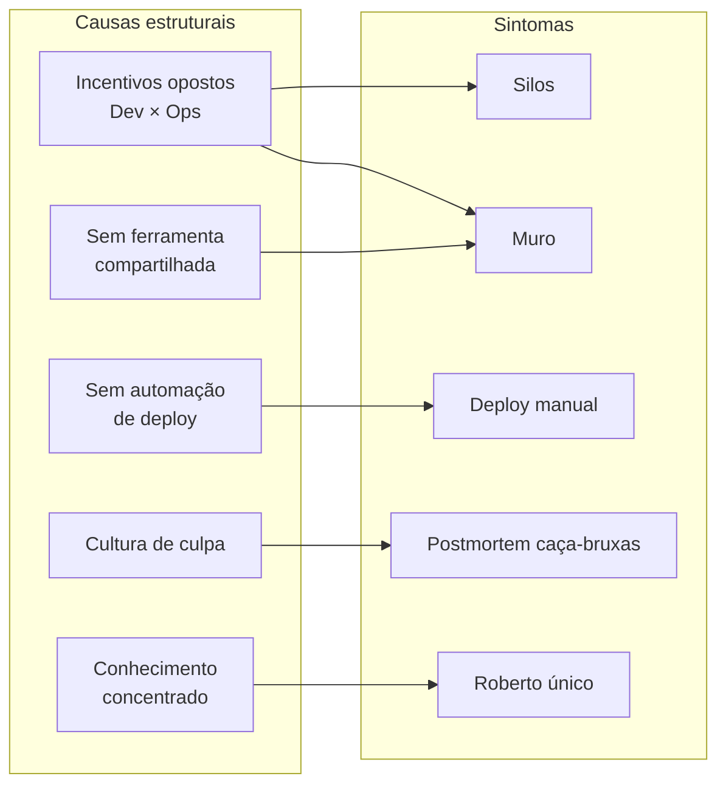

# Parte 1 — Diagnóstico dos Silos

**Duração:** 30 minutos
**Pré-requisito:** Bloco 1 ([01-o-que-e-devops.md](../bloco-1/01-o-que-e-devops.md))

---

## Objetivo

Fazer um **diagnóstico inicial** dos sintomas da CloudStore sob a lente dos silos e da Parede da Confusão. Esta parte gera o **primeiro artefato** do relatório avaliativo: o **diagrama de causas**.

---

## Contexto

Reveja rapidamente:

- [Cenário CloudStore](../00-cenario-pbl.md) — os 10 sintomas.
- [Bloco 1](../bloco-1/01-o-que-e-devops.md) — Parede da Confusão, DevOps ≠ ferramenta.

---

## Atividades

### Atividade 1 — Mapa de sintomas (10 min)

Leia novamente os 10 sintomas. Para cada um, classifique em:

- **ORIGEM DEV** — o comportamento nasce principalmente do time de Dev.
- **ORIGEM OPS** — o comportamento nasce principalmente do time de Ops.
- **ORIGEM ESTRUTURAL** — o comportamento nasce do **desenho da organização** (incentivos, processos, ferramentas — não das pessoas).

Crie uma tabela:

| # | Sintoma resumido | Origem (Dev / Ops / Estrutural) | Justificativa (1 linha) |
|---|-------------------|----------------------------------|--------------------------|
| 1 | Silos rígidos | | |
| 2 | Jogar por cima do muro | | |
| 3 | Deploy manual sexta 23h | | |
| 4 | Bugs só em homologação | | |
| 5 | Medo de release | | |
| 6 | Postmortem de culpa | | |
| 7 | Dev sem log de prod | | |
| 8 | Métricas inexistentes | | |
| 9 | On-call só de Ops | | |
| 10 | "Roberto" (herói único) | | |

> **Dica:** a maioria dos sintomas tem origem **estrutural**. Se você classificar muitos como "ORIGEM DEV" ou "ORIGEM OPS", releia o Bloco 1 — o ponto central é que o problema é do **sistema**, não das pessoas.

### Atividade 2 — Diagrama de causas (15 min)

Desenhe um **diagrama Mermaid** que mostre:

- Os sintomas como "caixas à direita".
- As causas estruturais como "caixas à esquerda".
- Setas ligando cada causa aos sintomas que ela gera.

**Exemplo de esqueleto para você adaptar:**

**Seu diagrama deve:**

- Ter pelo menos **5 causas** identificadas.
- Conectar **cada sintoma** a pelo menos 1 causa.
- Ser coerente — se você liga C1 a S1, deve saber explicar por quê.

### Atividade 3 — Pergunta crítica (5 min)

Responda em 3 a 5 linhas:

> **Se a CloudStore contratar 3 "DevOps Engineers" e instalar Jenkins amanhã, isso resolve o diagnóstico acima? Por quê?**

---

## Entregáveis desta parte

1. **Tabela de sintomas** (atividade 1).
2. **Diagrama Mermaid de causas × sintomas** (atividade 2).
3. **Resposta à pergunta crítica** (atividade 3).

Guarde em um arquivo **`parte-1-diagnostico.md`** — vai entrar no relatório final (seção 1 — Diagnóstico).

---

## Rubrica de autoavaliação

- [ ] Classifiquei corretamente a maioria dos sintomas como **estruturais** (não pessoais).
- [ ] Meu diagrama tem **pelo menos 5 causas** e cobre **todos os 10 sintomas**.
- [ ] Respondi à pergunta crítica referenciando **cultura, incentivos e processos** (não só ferramenta).

---

## Próximo passo

Siga para a **[Parte 2 — Análise CALMS](parte-2-analise-calms.md)**.

---

<!-- nav:start -->

**Navegação — Módulo 1 — Fundamentos e cultura DevOps**

- ← Anterior: [Exercícios Progressivos — Módulo 1](README.md)
- → Próximo: [Parte 2 — Análise CALMS da CloudStore](parte-2-analise-calms.md)
- ↑ Índice do módulo: [Módulo 1 — Fundamentos e cultura DevOps](../README.md)

<!-- nav:end -->
