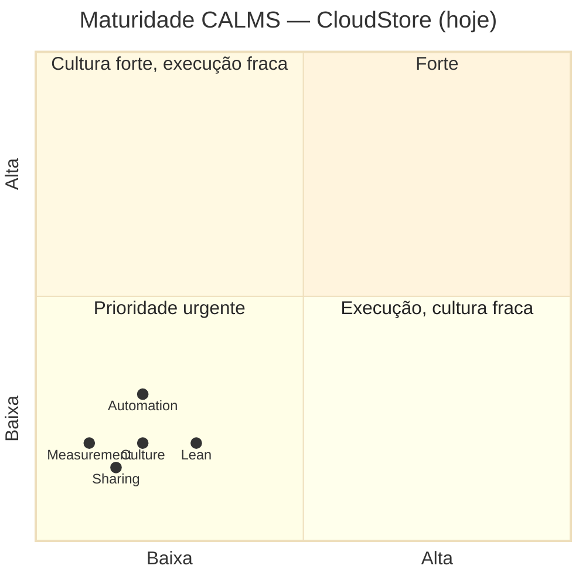

# Parte 2 — Análise CALMS da CloudStore

**Duração:** 1 hora
**Pré-requisito:** Bloco 2 ([02-modelo-calms.md](../bloco-2/02-modelo-calms.md)) + Parte 1

---

## Objetivo

Aplicar o **modelo CALMS** aos 10 sintomas da CloudStore e produzir um **radar de maturidade** que entra na seção 2 do relatório avaliativo.

---

## Atividades

### Atividade 1 — Classificação CALMS dos 10 sintomas (25 min)

Para **cada um** dos 10 sintomas, classifique em **uma ou mais** dimensões CALMS (**C**ulture, **A**utomation, **L**ean, **M**easurement, **S**haring).

Crie a tabela abaixo:

| # | Sintoma | C | A | L | M | S | Justificativa |
|---|---------|---|---|---|---|---|---------------|
| 1 | Silos rígidos | ✓ | | | | ✓ | Dev e Ops não conversam — cultura de silo + falta de sharing. |
| 2 | Jogar por cima do muro | | | | | | |
| 3 | Deploy manual 23h sexta | | | | | | |
| 4 | Bugs só em homologação | | | | | | |
| 5 | Medo de release | | | | | | |
| 6 | Postmortem de culpa | | | | | | |
| 7 | Dev sem log de prod | | | | | | |
| 8 | Métricas inexistentes | | | | | | |
| 9 | On-call só de Ops | | | | | | |
| 10 | "Roberto" único | | | | | | |

**Regras:**

- Um sintoma pode afetar **várias dimensões**. Marque todas que fazem sentido.
- Cada linha deve ter **justificativa curta** (1 linha).
- Consulte o Bloco 2, seção 7 para ver o gabarito proposto — mas **tente primeiro sozinho(a)**.

### Atividade 2 — Contagem por dimensão (5 min)

Some quantos ✓ apareceram em cada dimensão:

| Dimensão | Quantos sintomas atingem |
|----------|---------------------------|
| C (Culture) | |
| A (Automation) | |
| L (Lean) | |
| M (Measurement) | |
| S (Sharing) | |

Responda: **qual é a dimensão mais fraca** da CloudStore (a que mais sintomas atingem)?

### Atividade 3 — Radar de maturidade (15 min)

Desenhe um **diagrama tipo radar** ou um quadrante mostrando a maturidade CloudStore em cada dimensão CALMS, em uma escala de **1 a 5**:

- **1** — Inexistente. Nenhuma prática alinhada.
- **2** — Embrionário. Iniciativas isoladas, não sistêmicas.
- **3** — Em desenvolvimento. Algumas práticas adotadas, mas inconsistentes.
- **4** — Maduro. Práticas adotadas em toda a organização, com métricas.
- **5** — Otimizado. Cultura viva, melhora contínua mensurada.

Você pode usar o seguinte formato Mermaid:

**Ajuste** os pontos conforme **sua** análise — não apenas copie o exemplo. Justifique cada nota em 1 linha.

### Atividade 4 — Argumento de priorização (15 min)

Escreva **1 a 2 parágrafos** respondendo:

> **Em qual dimensão CALMS a CloudStore deveria investir primeiro? Por quê?**

Ancore sua resposta:

- No **diagnóstico quantitativo** da atividade 2 (qual dimensão tem mais sintomas).
- Em **argumento teórico** (cite o Bloco 2 ou um dos livros da pasta `books/`).
- Em um **contra-argumento** possível (alguém poderia dizer que deveríamos começar por outra dimensão — por quê e por que você discorda).

**Dica:** não existe resposta "certa" — o que vale é **consistência argumentativa**. Começar por **Culture + Sharing** é a escolha mais defendida na literatura (Kim et al., 2016; Hastings & Meyer, 2020), mas começar por **Automation** (quick win visível) também tem defensores pragmáticos.

---

## Entregáveis desta parte

1. **Tabela CALMS completa** (atividade 1).
2. **Contagem por dimensão** (atividade 2).
3. **Radar de maturidade** em Mermaid (atividade 3).
4. **Parágrafo de priorização** (atividade 4).

Guarde em **`parte-2-calms.md`** — vai entrar na seção 2 do relatório.

---

## Rubrica de autoavaliação

- [ ] Classifiquei **todos os 10 sintomas**.
- [ ] Cada linha tem justificativa.
- [ ] Meu radar tem **nota para cada dimensão** com justificativa.
- [ ] Meu argumento de priorização cita **pelo menos 1 referência teórica**.

---

## Próximo passo

Siga para a **[Parte 3 — Mapeamento do Fluxo de Valor (VSM)](parte-3-mapeamento-fluxo-valor.md)**.

---

<!-- nav:start -->

**Navegação — Módulo 1 — Fundamentos e cultura DevOps**

- ← Anterior: [Parte 1 — Diagnóstico dos Silos](parte-1-diagnostico-silos.md)
- → Próximo: [Parte 3 — Mapeamento do Fluxo de Valor (VSM)](parte-3-mapeamento-fluxo-valor.md)
- ↑ Índice do módulo: [Módulo 1 — Fundamentos e cultura DevOps](../README.md)

<!-- nav:end -->
