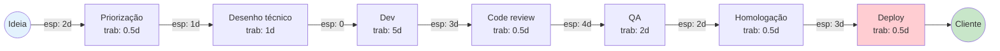

# Parte 3 — Mapeamento do Fluxo de Valor (VSM)

**Duração:** 1h 30 min
**Pré-requisito:** Bloco 3 ([03-tres-caminhos.md](../bloco-3/03-tres-caminhos.md)) + Partes 1 e 2

---

## Objetivo

Construir o **Value Stream Map** (VSM) da CloudStore no estado **atual** e proposto no estado **futuro**. Calcular lead time e activity ratio. Este é o artefato central da seção 3 do relatório avaliativo.

---

## Contexto

Um **Value Stream Map** mapeia o caminho completo de uma unidade de valor — **da ideia ao cliente** — e destaca **onde está o tempo de trabalho** vs **onde está o tempo de espera**. É a ferramenta Lean mais poderosa para diagnosticar desperdício de fluxo.

Revise a seção 4 do [Bloco 2](../bloco-2/02-modelo-calms.md) e a seção 2 do [Bloco 3](../bloco-3/03-tres-caminhos.md).

---

## Dados da CloudStore (para o VSM)

Considere o caminho típico de uma feature média na CloudStore:

| Etapa | Tempo de trabalho efetivo | Tempo de espera antes de entrar nesta etapa |
|-------|----------------------------|-----------------------------------------------|
| 1. Discovery / priorização (Produto) | 0.5 dia | 2 dias (fila de priorização) |
| 2. Desenho técnico (Tech Lead) | 1 dia | 1 dia |
| 3. Desenvolvimento (Dev) | 5 dias | 0 dia |
| 4. Code review (outro Dev) | 0.5 dia | 3 dias (PR parado) |
| 5. QA manual | 2 dias | 4 dias (QA sobrecarregado) |
| 6. Homologação (Ops) | 0.5 dia | 2 dias (agendamento) |
| 7. Deploy em produção (Ops) | 0.5 dia (4h janela sexta 23h) | 3 dias (espera janela) |

---

## Atividades

### Atividade 1 — VSM do estado atual (30 min)

Desenhe o VSM atual. Use **Mermaid** no formato abaixo (é mais fácil e vai direto no relatório):

**Calcule:**

- **Lead Time total** (T_LT) = soma de todo tempo de trabalho + todo tempo de espera.
- **Tempo de trabalho efetivo** (T_VA) = só tempos de trabalho.
- **Activity Ratio** = T_VA / T_LT × 100%.

**Interprete o Activity Ratio:**

- Elite / High DevOps: >= 30% (fluxo razoável).
- Problemático: < 20% (muito tempo parado em fila).
- CloudStore: **calcule e compare.**

### Atividade 2 — Identificação de gargalos (15 min)

Com base no VSM, identifique:

1. **Onde está o maior tempo de espera?** (diga qual etapa).
2. **Qual é o gargalo real** — a estação onde, se o trabalho não passa, tudo para?
3. **Quais etapas poderiam ser eliminadas ou paralelizadas?**

### Atividade 3 — VSM do estado futuro (30 min)

Desenhe um **segundo VSM** representando a CloudStore **após 6 meses de transformação DevOps**. Seja realista — não "eliminou 100% de tudo", mas reduções plausíveis.

**Dica de cenário-alvo (pode ajustar):**

| Etapa | Mudança proposta | Tempo novo |
|-------|------------------|------------|
| Priorização | Visibilidade compartilhada, daily com Dev | trab 0.5d, esp 1d |
| Desenho técnico | Continua | trab 1d, esp 0.5d |
| Dev | Features menores (lote pequeno) | trab 2d |
| Code review | SLA de 4h para review | trab 0.5d, esp 0.5d |
| QA | Testes automatizados substituem QA manual | trab 0.3d, esp 0d |
| Homologação | Deploy contínuo em staging (automatizado) | trab 0.1d, esp 0d |
| Deploy em prod | Automatizado, canary | trab 0.1d, esp 0d |

Recalcule **Lead Time**, **T_VA** e **Activity Ratio** para o estado futuro.

### Atividade 4 — Comparativo quantitativo (15 min)

Preencha a tabela:

| Métrica | Atual | Futuro | Ganho |
|---------|-------|--------|-------|
| Lead Time total | | | |
| Tempo de trabalho efetivo | | | |
| Activity Ratio | | | |
| Tempo em espera | | | |

Escreva **1 parágrafo** interpretando o ganho. Pergunta-guia: **o ganho veio de "as pessoas trabalhando mais rápido" ou de "menos tempo parado em fila"?**

---

## Entregáveis desta parte

1. **VSM atual** (Mermaid) com cálculos.
2. **Análise de gargalos**.
3. **VSM futuro** (Mermaid) com cálculos.
4. **Tabela comparativa** e parágrafo interpretativo.

Guarde em **`parte-3-vsm.md`** — entra na seção 3 do relatório.

---

## Rubrica de autoavaliação

- [ ] Meu VSM atual tem **todas as 7 etapas** e os tempos corretos.
- [ ] Calculei **Lead Time**, **T_VA** e **Activity Ratio** do estado atual (T_LT = **22 dias**, T_VA = **9.5 dias**, AR ≈ **43%** — confira).
- [ ] Meu VSM futuro é **realista** (não "mágico").
- [ ] Interpreto o ganho em termos de **redução de espera**, não apenas "fazendo mais rápido".

> **Gabarito dos cálculos do estado atual (confira):**
> - Espera total: 2 + 1 + 0 + 3 + 4 + 2 + 3 = **15 dias**
> - Trabalho total: 0.5 + 1 + 5 + 0.5 + 2 + 0.5 + 0.5 = **10 dias**
> - Lead Time: 15 + 10 = **25 dias**
> - Activity Ratio: 10 / 25 = **40%**
>
> Se seus números divergirem um pouco, revise — pequenas diferenças de interpretação são aceitáveis. O importante é o **método correto**.

---

## Próximo passo

Siga para a **[Parte 4 — Template de Postmortem Blameless](parte-4-postmortem-blameless.md)**.

---

<!-- nav:start -->

| &nbsp; | &nbsp; | &nbsp; |
|:--|:--:|--:|
| **← Anterior** [Parte 2 — Análise CALMS da CloudStore](parte-2-analise-calms.md) | **↑ Índice** [Módulo 1 — Fundamentos e cultura DevOps](../README.md) | **Próximo →** [Parte 4 — Template de Postmortem Blameless](parte-4-postmortem-blameless.md) |

<!-- nav:end -->
