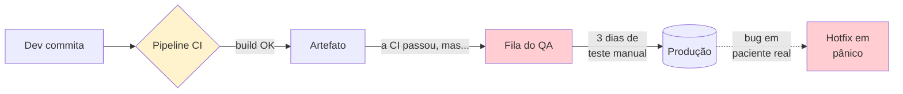

# Cenário PBL — Problema Norteador do Módulo

Este módulo é guiado por um **problema real** (PBL — Problem-Based Learning). O conteúdo teórico e os exercícios estão a serviço de **responder à pergunta norteadora** ao final.

---

## A empresa: MediQuick

A **MediQuick** é uma **plataforma de telemedicina** que conecta pacientes a médicos por videochamada, permitindo agendar consultas, emitir prescrições digitais e manter prontuário eletrônico. Tem 4 anos de mercado, **100 mil usuários ativos** e cresce **12% ao mês**.

A plataforma é composta por três serviços principais:

- **Agendamento** (Python/FastAPI + PostgreSQL) — marca e cancela consultas.
- **Prontuário** (Python/FastAPI + PostgreSQL) — guarda histórico clínico, prescrições, laudos.
- **Teleconsulta** (Python/FastAPI + Redis + SFU de vídeo) — orquestra chamadas de vídeo.

---

## O contexto técnico

A MediQuick passou pelos Módulos 1 e 2 da disciplina — ou seja, a cultura está melhorando e há um **pipeline de CI em GitHub Actions** que roda a cada push. O problema é que **o que roda nesse pipeline não dá confiança para ninguém**.

---

## Sintomas observados

| # | Sintoma | Detalhe |
|---|---------|---------|
| 1 | **Cobertura irrisória** | Menos de **15% de cobertura** de teste unitário em todos os serviços. |
| 2 | **Pirâmide invertida** | Dos ~500 testes existentes, ~380 são E2E (UI), ~100 integração, ~20 unit. É uma **casquinha de sorvete**, não uma pirâmide. |
| 3 | **Testes flaky** | Os E2E falham aleatoriamente: 1 em cada 4 execuções quebra sem motivo real. O time aprendeu a "rodar de novo" quando falha. |
| 4 | **QA virou gargalo** | 5 pessoas de QA revisando manualmente **3 dias por release**. Time cresceu, QA não. Eles estão **em burnout**. |
| 5 | **Dev não roda teste local** | "Pra que, a CI roda". Dev commita, CI falha, Dev corrige, commita de novo. Loop longo, caro. |
| 6 | **Regressão frequente** | Bugs que "já foram corrigidos" voltam em releases seguintes. Não há **teste de regressão** automatizado. |
| 7 | **Bugs críticos em produção** | Nos últimos 6 meses: · Consulta agendada para médico errado (2 incidentes) · Prescrição exibida para paciente errado (1 incidente, LGPD) · Agendamento duplicado cobrado 2x (dezenas de casos) |
| 8 | **"Funciona no meu env"** | Bugs aparecem em staging que não reproduzem local — diferença de versão do Postgres, timezone, fuso horário. |
| 9 | **Mocks em excesso** | Quando há teste unitário, cada teste "mocka tudo" — inclusive o código sob teste. Passam sempre e não detectam bug. |
| 10 | **Sem quality gates** | Pipeline só faz build. Não mede cobertura, não bloqueia PR por falta de teste, não roda linter. |

---

## Impacto nos negócios

A CTO apresentou números para a diretoria no mês passado:

- **3 dias** para release (só testes manuais), eram **4 horas** há 2 anos.
- **Frequência de release caiu**: 1 por mês, era 1 por semana.
- **5% dos chamados do SAC** viraram queixas de erro funcional evitável.
- **1 caso em apuração LGPD** (prescrição mostrada a outro paciente) pode gerar multa de até **2% do faturamento**.
- **QA perdeu 2 pessoas** no último trimestre (burnout); recrutar novos leva ~3 meses cada.
- **Dev joga pedra em QA**, QA joga pedra em Dev, ninguém confia em ninguém.

---

## O que a liderança quer

A nova diretora de engenharia (vinda do Módulo 1 CloudStore, metaforicamente) foi direta:

> *"Quero que daqui a 6 meses a release **não dependa** de teste manual para ir a produção. Quero **confiança** de que quando a CI passar, o código funciona. E quero o QA **parando de revisar bug** e passando a **desenhar estratégia de qualidade**."*

Metas declaradas:

- **Reduzir tempo de release** de 3 dias para **menos de 1 hora**.
- **Elevar cobertura útil** para **mínimo 70%** nos caminhos críticos.
- **Eliminar 100% dos testes flaky** (ou segregar em pipeline separado).
- **Quality gates no CI**: PR sem teste não é mergeado.
- **Zerar regressões** — bug corrigido vira teste que nunca mais passa "acidentalmente".

---

## Pergunta norteadora

> **Como estruturar a cultura, as práticas e a automação de testes na MediQuick para que a confiança para entregar rápido seja construída dentro do pipeline — e não empilhada nos ombros do QA?**

Esta pergunta exige articular:

1. **Diagnóstico da pirâmide atual** da MediQuick e onde investir primeiro.
2. **Estratégia de testes** por camada (unit, integration, E2E, contract) com proporções.
3. **Quality gates concretos** para o pipeline CI da MediQuick.
4. **Mudança de papel do QA** — de revisor manual para engenheiro de qualidade.
5. **Plano de evolução** considerando que **a equipe não pode parar** de entregar durante a transformação.

---

## Como este cenário aparece nos blocos

| Bloco | Lente sobre a MediQuick |
|-------|--------------------------|
| **Bloco 1** — Pirâmide de testes | Diagnosticar a pirâmide invertida e planejar a redistribuição. |
| **Bloco 2** — TDD e BDD | Escrever o primeiro teste **antes do código** em uma feature real da MediQuick (ex.: agendamento). |
| **Bloco 3** — Quality Gates | Adicionar cobertura, linter e complexidade ao pipeline CI. |
| **Bloco 4** — Integração e E2E | Estabilizar os E2E flaky, introduzir testcontainers para testes de integração reais. |

E os **exercícios progressivos** vão exigir que você **escreva código real de testes**: TDD de uma feature, integration com Postgres de verdade, E2E, e configuração de quality gates.

---

## Próximo passo

Leia o **[Bloco 1 — Pirâmide de testes e fundamentos](bloco-1/01-piramide-testes.md)** para começar a entender por que a MediQuick tem **muitos testes** mas **pouca confiança**.

---

<!-- nav:start -->

| &nbsp; | &nbsp; | &nbsp; |
|:--|:--:|--:|
| **← Anterior** [Módulo 3 — Testes Automatizados e Qualidade de Software](README.md) | **↑ Índice** [Módulo 3 — Testes e qualidade de software](README.md) | **Próximo →** [Bloco 1 — Pirâmide de Testes e Fundamentos](bloco-1/01-piramide-testes.md) |

<!-- nav:end -->
