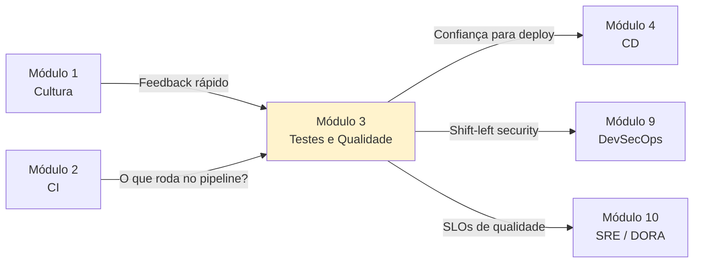

# Módulo 3 — Testes Automatizados e Qualidade de Software

**Carga horária:** 5 horas
**Nível:** Graduação (ensino superior)
**Pré-requisitos:** Módulos 1 (Fundamentos e Cultura) e 2 (Versionamento e CI)

---

## Por que este módulo vem aqui

Você já tem um **pipeline de CI** (Módulo 2). Mas **o que o pipeline roda?** Um CI sem testes é só um "build automatizado que passa sempre". A confiança para entregar rápido (Módulo 4) vem da **qualidade automatizada** — este módulo.

Testes automatizados são o **mecanismo prático** que materializa dois dos Três Caminhos do Módulo 1:

- **Segundo Caminho — Feedback:** o teste é a principal forma de feedback rápido sobre se o código funciona.
- **Terceiro Caminho — Aprendizado:** o teste é um artefato vivo que captura **o que o time aprendeu** sobre o domínio e sobre bugs passados.

> Conforme Humble e Farley (2014), **a qualidade não se inspeciona — se constrói**. Teste manual no final é inspeção; teste automatizado integrado é construção.

---

## Objetivos de Aprendizagem

Ao final do módulo, você será capaz de:

- **Explicar** a **pirâmide de testes** (unit, integration, E2E) e os trade-offs entre níveis.
- **Identificar** os anti-padrões da pirâmide: **ice cream cone**, **hourglass**, **test diamond**.
- **Aplicar** o ciclo **Red-Green-Refactor** do **TDD** em um problema real.
- **Diferenciar** TDD, BDD e ATDD; escolher quando usar cada um.
- **Implementar** testes automatizados em Python usando **pytest** e seu ecossistema.
- **Escrever** testes de integração com **banco de dados real** usando Testcontainers.
- **Configurar quality gates** no pipeline de CI (cobertura, linter, complexidade).
- **Criticar** a cobertura de teste como métrica (Lei de Goodhart) e propor métricas complementares.
- **Usar test doubles** corretamente — dummy, stub, fake, spy, mock (taxonomia de Fowler).

---

## Estrutura do Material

Mesma estrutura dos módulos anteriores: **4 blocos teóricos** + **5 exercícios progressivos** em PBL.

| Ordem | Conteúdo | Arquivo(s) |
|-------|----------|------------|
| 0 | Cenário PBL (MediQuick) | [00-cenario-pbl.md](00-cenario-pbl.md) |
| 1 | Pirâmide de testes e fundamentos | [bloco-1/01-piramide-testes.md](bloco-1/01-piramide-testes.md) · [exercícios](bloco-1/01-exercicios-resolvidos.md) |
| 2 | TDD, BDD e ciclo Red-Green-Refactor | [bloco-2/02-tdd-bdd.md](bloco-2/02-tdd-bdd.md) · [exercícios](bloco-2/02-exercicios-resolvidos.md) |
| 3 | Quality Gates, cobertura e shift-left | [bloco-3/03-quality-gates.md](bloco-3/03-quality-gates.md) · [exercícios](bloco-3/03-exercicios-resolvidos.md) |
| 4 | Testes de integração, E2E e estratégias | [bloco-4/04-integracao-e2e.md](bloco-4/04-integracao-e2e.md) · [exercícios](bloco-4/04-exercicios-resolvidos.md) |
| 5 | Exercícios progressivos (5 partes) | [exercicios-progressivos/](exercicios-progressivos/) |
| 6 | Entrega avaliativa | [entrega-avaliativa.md](entrega-avaliativa.md) |
| — | Referências bibliográficas | [referencias.md](referencias.md) |

---

## Como Estudar

1. **Comece pelo cenário PBL** — a MediQuick é uma empresa de telemedicina com crise de qualidade.
2. **Siga a ordem dos blocos** — cada bloco tem código Python executável.
3. **Tenha Python 3.10+** e saiba criar um **ambiente virtual** (veja seção abaixo).
4. **Execute o código** à medida que lê. Teste é disciplina prática; leitura passiva aprende pouco.
5. **Faça os exercícios resolvidos** após cada bloco.
6. **Execute os exercícios progressivos** — cada um produz código real da MediQuick.

### Setup do ambiente (uma vez por máquina)

```bash
python3 -m venv .venv
source .venv/bin/activate       # Linux/macOS
# .venv\Scripts\activate        # Windows PowerShell

pip install --upgrade pip
pip install pytest pytest-cov pytest-mock ruff
```

Com isso você já roda **80% dos exemplos** do módulo. Bibliotecas adicionais (como `testcontainers`, `pytest-bdd`, `playwright`) são instaladas no bloco correspondente.

### Requirements consolidado

No diretório do módulo existe um `requirements.txt` consolidado — veja [requirements.txt](requirements.txt). Você pode instalar tudo de uma vez:

```bash
pip install -r requirements.txt
```

---

## Ideia Central do Módulo

| Conceito | Significado |
|----------|-------------|
| **Pirâmide de testes** | Distribuir testes por nível: muitos unitários, médios integração, poucos E2E |
| **TDD** | Teste vem **antes** do código — guia o design |
| **BDD** | Teste escrito em linguagem de domínio — ponte com negócio |
| **Quality Gates** | Critérios automáticos que barram código de má qualidade no CI |
| **Shift-left** | Mover qualidade para a esquerda do pipeline — começa no commit, não no QA |

> Uma suíte de testes automatizada não é "custo adicional"; é **o mecanismo** que permite entregar rápido com segurança.

---

## Conexão com o restante da disciplina



---

*Material alinhado a: Continuous Delivery (Humble & Farley), The DevOps Handbook (Kim et al.), xUnit Test Patterns (Meszaros), Growing Object-Oriented Software Guided by Tests (Freeman & Pryce), Specification by Example (Adzic).*
