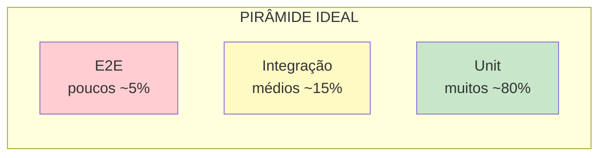
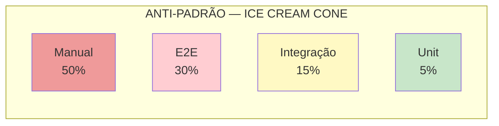
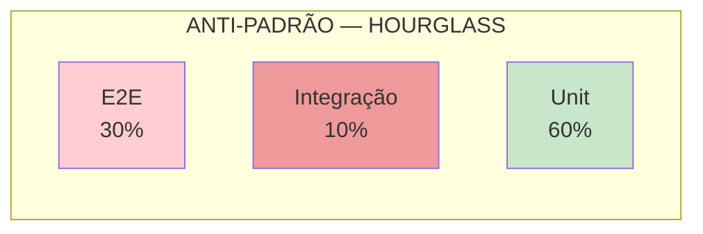

# Bloco 1 — Pirâmide de Testes e Fundamentos

> **Duração estimada:** 55 a 65 minutos. Inclui um primeiro exemplo completo em `pytest`.

Antes de falar de **TDD**, **BDD** ou **quality gates**, precisamos responder uma pergunta básica: **que tipos de teste existem, e em que proporção?** A resposta correta é o que separa uma suíte útil de uma suíte que "passa sempre mas não detecta nada" — situação clássica da MediQuick.

---

## 1. Por que automatizar testes?

Testar **manualmente** é possível — milhões de releases foram entregues assim. Mas **não escala**. Quando o software cresce, **o custo do teste manual cresce mais rápido que o valor do teste manual**:

- Cada nova feature adiciona casos a verificar.
- Casos antigos precisam ser verificados a cada release (regressão).
- QA vira gargalo — exatamente o **sintoma 4 da MediQuick**.
- Teste manual **não pode rodar a cada commit** — então o feedback chega tarde.

Teste automatizado inverte essa matemática: **uma vez escrito, roda milhões de vezes a custo ~zero**.

### Conexão direta com o Módulo 1

Lembra dos **Três Caminhos** (Módulo 1, Bloco 3)?

- **Primeiro caminho — Fluxo:** sem teste automatizado, o trabalho fica preso em QA manual.
- **Segundo caminho — Feedback:** teste manual dá feedback em **dias**; teste automatizado em **segundos**.
- **Terceiro caminho — Aprendizado:** cada bug reproduzido em teste é **aprendizado capturado** — nunca mais volta sem ninguém perceber.

> **Referência:** Humble e Farley (2014), *Entrega Contínua*, Cap. 4 — "A ausência de uma estratégia de testes automatizados é um dos maiores impedimentos para entrega contínua."

---

## 2. A Pirâmide de Testes

A **Pirâmide de Testes** foi proposta por **Mike Cohn** no livro *Succeeding with Agile* (2009) e formalizada por **Martin Fowler** em 2012. É a imagem mental mais influente sobre **como distribuir esforço de teste**.



### 2.1 Por que a pirâmide tem essa forma?

A forma reflete **três trade-offs** entre níveis de teste:

| Nível | Velocidade | Custo de manutenção | Confiança que entrega |
|-------|-----------|---------------------|-----------------------|
| **Unit** | Muito rápido (ms) | Baixo | Confiança em **uma unidade** |
| **Integração** | Médio (segundos) | Médio | Confiança em **integração entre unidades** |
| **E2E** | Lento (segundos a minutos) | Alto (flaky, ambiente, setup) | Confiança em **fluxo real** |

**Regra prática:** cada nível cobre **um tipo diferente** de bug. Mais testes nos níveis rápidos = feedback rápido. Poucos no topo = confiança de integração sem sacrificar velocidade.

### 2.2 Os níveis em detalhe

#### Unit Test (Teste Unitário)

**O que é:** testa uma **unidade** isolada do sistema — tipicamente uma função ou classe — **sem tocar I/O** (sem banco, sem rede, sem disco).

**Características:**

- **Rápido** — centenas de testes em segundos.
- **Determinístico** — mesmo input → mesmo output, sempre.
- **Foca em lógica de negócio** — regras, cálculos, validações.

#### Teste de Integração

**O que é:** testa a **integração entre dois ou mais componentes**. Tipicamente: **código + banco**, **código + API externa**, **código + fila**.

**Características:**

- **Médio** — segundos, precisa subir recursos externos (ex.: Postgres).
- **Detecta problemas de contrato** — SQL errado, serialização, encoding.
- Em Python, a ferramenta recomendada é **Testcontainers** (Bloco 4).

#### Teste E2E (End-to-End)

**O que é:** testa um **fluxo completo do usuário**, atravessando todas as camadas — UI, API, banco, filas.

**Características:**

- **Lento** — segundos a minutos por teste.
- **Frágil** — qualquer mudança na UI pode quebrar.
- **Caro de manter** — mas **único nível** que prova que o sistema **inteiro** funciona.

### 2.3 Níveis que aparecem na literatura moderna

O modelo original é simples, mas na prática outros níveis surgem:

- **Contract tests** — testam o **contrato** entre dois serviços (ex.: Pact). Tipicamente entre integração e E2E.
- **Component tests** — um serviço inteiro, mas com dependências substituídas. Entre integração e E2E.
- **Smoke tests** — conjunto mínimo executado após deploy para detectar "o básico funciona?".

A pirâmide **sem números exatos** é o que vale. O ponto é: **base larga, topo estreito**.

---

## 3. Anti-padrões: quando a pirâmide vira outra coisa

### 3.1 Ice Cream Cone (Casquinha de sorvete)



**É exatamente o diagnóstico da MediQuick** (sintoma 2). Pirâmide invertida: muitos testes E2E, poucos unitários, e uma **camada gigante de teste manual** em cima.

**Consequências:**

- Feedback lento — E2E demora.
- **Flaky** — sintoma 3 da MediQuick. E2E dependem de rede, tempo, estado de banco; quebram aleatoriamente.
- **Caro manter** — cada mudança na UI quebra dezenas de testes.
- Time perde confiança — quando um E2E falha, o reflexo é **rodar de novo**, não investigar. Com o tempo, **ninguém olha os testes com seriedade**.

### 3.2 Hourglass (Ampulheta)



Muitos unitários e muitos E2E, mas **pouca** integração. Resultado: **bugs de integração passam** — o código funciona isolado e funciona no fluxo completo em staging, mas quebra em **produção** quando uma condição de integração específica acontece.

### 3.3 Test Diamond (Diamante)

Meio grande (integração/componente) e extremos pequenos. Aceitável em algumas arquiteturas de microsserviços, mas requer integração forte e observabilidade — não começa por aqui.

---

## 4. Princípios F.I.R.S.T. — como um bom teste unitário parece

Robert C. Martin, em *Clean Code* (2008), Cap. 9, sintetizou 5 qualidades de um teste unitário bom:

| Letra | Significado | O que significa na prática |
|-------|-------------|-----------------------------|
| **F** | **Fast** (Rápido) | Roda em milissegundos. Suíte inteira em segundos. |
| **I** | **Independent** (Independente) | A ordem dos testes não importa. Teste 2 passa mesmo se teste 1 falhar. |
| **R** | **Repeatable** (Repetível) | Roda igual em qualquer máquina, a qualquer hora, offline. |
| **S** | **Self-validating** (Auto-verificável) | Passa ou falha; **não exige leitura humana do output**. |
| **T** | **Timely** (Oportuno) | Escrito junto (ou antes) do código de produção (relação com TDD, Bloco 2). |

> Um teste que depende de data/hora do sistema **fere R (repeatable)**. Um teste que precisa rodar em ordem específica fere **I**. Um teste que leva 10 segundos fere **F**. Todos esses são sintomas que aparecem na MediQuick.

---

## 5. Test Doubles — mock, stub, fake, spy, dummy

Quando sua unidade depende de algo externo (banco, API, fila) e você quer testar **só a unidade**, você usa um **test double** — um "duplo de teste" no lugar da dependência real. Analogia: dublê no cinema.

**Gerard Meszaros**, no livro *xUnit Test Patterns* (2007), catalogou **5 tipos**. **Martin Fowler** popularizou a taxonomia em [TestDouble](https://martinfowler.com/bliki/TestDouble.html):

| Tipo | O que faz | Quando usar |
|------|-----------|-------------|
| **Dummy** | Objeto passado só para preencher parâmetro, **nunca usado**. | Quando o teste exige um argumento mas não liga para ele. |
| **Stub** | Retorna respostas pré-programadas. Não verifica chamadas. | Quando você quer **forçar um caminho** do código sob teste. |
| **Fake** | Implementação **real, porém simplificada** (ex.: banco em memória). | Quando a real é cara ou inconveniente (banco, API paga). |
| **Spy** | Stub que **grava** como foi chamado. Verifica depois. | Quando você precisa saber **se/quando** algo foi invocado. |
| **Mock** | Objeto com **expectativas pré-configuradas** — falha o teste se não for chamado como esperado. | Teste focado em **interação**, não em retorno. |

### 5.1 Exemplo em Python

Dado um código que envia e-mail quando uma consulta é agendada:

```python
class AgendamentoService:
    def __init__(self, repo, notificador):
        self.repo = repo
        self.notificador = notificador

    def agendar(self, consulta):
        self.repo.salvar(consulta)
        self.notificador.enviar_confirmacao(consulta.paciente_email)
```

Diferentes test doubles para **`notificador`**:

```python
# DUMMY — passado só para preencher; nunca usado
# (não seria usado aqui porque o service CHAMA notificador)

# STUB — retorna algo fixo, não verifica chamadas
class NotificadorStub:
    def enviar_confirmacao(self, email):
        return True  # pronto; não testamos interação

# SPY — grava o que aconteceu
class NotificadorSpy:
    def __init__(self):
        self.chamadas = []
    def enviar_confirmacao(self, email):
        self.chamadas.append(email)

# FAKE — implementação real simplificada
class NotificadorEmMemoria:
    def __init__(self):
        self.enviados = []
    def enviar_confirmacao(self, email):
        self.enviados.append({"to": email, "subject": "Consulta agendada"})

# MOCK — via pytest-mock, expectativa configurada
def test_agendar_envia_email(mocker):
    notificador = mocker.Mock()
    service = AgendamentoService(repo=mocker.Mock(), notificador=notificador)
    consulta = Consulta(paciente_email="ana@example.com")

    service.agendar(consulta)

    notificador.enviar_confirmacao.assert_called_once_with("ana@example.com")
```

### 5.2 Armadilha: over-mocking

**Sintoma 9 da MediQuick**: "cada teste mocka tudo — inclusive o código sob teste". Isso **destrói o valor** do teste — o teste passa **por construção**, não porque o código funciona.

**Regras práticas:**

- **Mocke dependências externas** (banco, API paga, serviço externo).
- **Não mocke o que você está testando** (o SUT — System Under Test).
- **Prefira Fake ou Stub a Mock** quando possível — Mock acopla o teste à **implementação** (como o código é chamado), o que torna refatoração dolorosa.
- Se seu teste tem **mais de 5 linhas de `mock.patch`**, algo está errado — o código provavelmente tem acoplamento alto, e refatorá-lo é melhor que escalar mocks.

> **Leitura:** Fowler, "Mocks Aren't Stubs" (2007) — clássico sobre a diferença filosófica entre escola "classicist" (prefere estado) e "mockist" (prefere interação).

---

## 6. Primeiro exemplo completo em `pytest`

Vamos escrever um teste real, do zero, que você pode rodar **agora mesmo**.

### 6.1 Preparação

Em um diretório vazio:

```bash
python3 -m venv .venv
source .venv/bin/activate
pip install pytest
```

### 6.2 Código sob teste: `consulta.py`

```python
"""Modelo de domínio de Consulta da MediQuick."""
from __future__ import annotations

from dataclasses import dataclass
from datetime import datetime, timedelta


class CancelamentoNaoPermitido(Exception):
    """Política de negócio: cancelamento com menos de 2h de antecedência não é permitido."""


@dataclass
class Consulta:
    id: int
    paciente_email: str
    data_hora: datetime
    cancelada: bool = False

    def cancelar(self, agora: datetime) -> None:
        if self.cancelada:
            return
        antecedencia = self.data_hora - agora
        if antecedencia < timedelta(hours=2):
            raise CancelamentoNaoPermitido(
                f"Cancelamento exige 2h de antecedência; faltam {antecedencia}."
            )
        self.cancelada = True
```

### 6.3 Testes: `test_consulta.py`

```python
"""Testes unitários de Consulta — FAST, INDEPENDENT, REPEATABLE."""
from datetime import datetime, timedelta

import pytest

from consulta import Consulta, CancelamentoNaoPermitido


AMANHA_10H = datetime(2026, 1, 15, 10, 0, 0)
HOJE_8H = datetime(2026, 1, 14, 8, 0, 0)
HOJE_9H = datetime(2026, 1, 15, 9, 0, 0)   # 1h antes da consulta
HOJE_7H = datetime(2026, 1, 15, 7, 0, 0)   # 3h antes da consulta


def _consulta_padrao() -> Consulta:
    return Consulta(id=1, paciente_email="ana@example.com", data_hora=AMANHA_10H)


def test_cancela_quando_ha_mais_de_2h_de_antecedencia():
    consulta = _consulta_padrao()

    consulta.cancelar(agora=HOJE_8H)

    assert consulta.cancelada is True


def test_nao_cancela_quando_falta_menos_de_2h():
    consulta = _consulta_padrao()

    with pytest.raises(CancelamentoNaoPermitido):
        consulta.cancelar(agora=HOJE_9H)

    assert consulta.cancelada is False


def test_cancelar_consulta_ja_cancelada_e_idempotente():
    consulta = _consulta_padrao()
    consulta.cancelar(agora=HOJE_7H)

    consulta.cancelar(agora=HOJE_7H)

    assert consulta.cancelada is True


@pytest.mark.parametrize(
    "horas_antes,deve_cancelar",
    [
        (3, True),
        (2, True),   # exatamente 2h é permitido (>=)
        (1, False),
        (0, False),
    ],
)
def test_regra_de_2h_em_diferentes_valores(horas_antes, deve_cancelar):
    consulta = _consulta_padrao()
    agora = AMANHA_10H - timedelta(hours=horas_antes)

    if deve_cancelar:
        consulta.cancelar(agora=agora)
        assert consulta.cancelada is True
    else:
        with pytest.raises(CancelamentoNaoPermitido):
            consulta.cancelar(agora=agora)
```

### 6.4 Rodando

```bash
pytest -v test_consulta.py
```

Saída esperada:

```
test_consulta.py::test_cancela_quando_ha_mais_de_2h_de_antecedencia PASSED
test_consulta.py::test_nao_cancela_quando_falta_menos_de_2h PASSED
test_consulta.py::test_cancelar_consulta_ja_cancelada_e_idempotente PASSED
test_consulta.py::test_regra_de_2h_em_diferentes_valores[3-True] PASSED
test_consulta.py::test_regra_de_2h_em_diferentes_valores[2-True] PASSED
test_consulta.py::test_regra_de_2h_em_diferentes_valores[1-False] PASSED
test_consulta.py::test_regra_de_2h_em_diferentes_valores[0-False] PASSED

======================== 7 passed in 0.04s ========================
```

### 6.5 Elementos-chave apresentados

- **Pattern AAA (Arrange-Act-Assert):** cada teste **prepara, age, verifica** — a estrutura dobra como documentação do comportamento.
- **Injeção de tempo** (`agora: datetime`) em vez de `datetime.now()` — **respeita R (repeatable)**.
- **`pytest.raises`** para testar exceções.
- **`pytest.mark.parametrize`** — um teste, múltiplos casos. Evita copy-paste.
- **Nomes descritivos** — o nome do teste é a frase de documentação.

### 6.6 Por que este teste é bom (F.I.R.S.T.)

- **Fast:** 0.04s para 7 testes.
- **Independent:** nenhum depende de ordem.
- **Repeatable:** sem banco, sem rede, sem `datetime.now()`.
- **Self-validating:** `assert` claro, `pytest` retorna código 0 ou !=0.
- **Timely:** escrito com o código (no Bloco 2 você vai escrever **antes** do código).

---

## 7. Aplicação ao cenário da MediQuick

Revisando os sintomas à luz do Bloco 1:

| Sintoma MediQuick | O que o Bloco 1 explica |
|-------------------|--------------------------|
| 1. Cobertura <15% | Ausência da base da pirâmide. |
| 2. Pirâmide invertida | Ice Cream Cone — anti-padrão clássico. |
| 3. Testes flaky | Sintoma típico de E2E mal escritos/quantidade excessiva. |
| 5. Dev não roda teste local | Testes demoram (E2E) — violam **F (fast)**. |
| 6. Regressão frequente | Falta de testes de regressão na base (unit) — bugs voltam porque nada os "segura". |
| 9. Mocks em excesso | Over-mocking — o código sob teste vira facada — violando validade do teste. |

A recomendação estratégica que emerge:

1. **Inverter a pirâmide:** prioridade absoluta é aumentar a base unitária, reduzir E2E.
2. **Reeducar test doubles:** treinar time em quando mockar e quando não.
3. **Configurar o ambiente local** para testes rodarem em **segundos**, não minutos (devolve ciclo curto para Dev).

---

## Resumo do bloco

- Teste manual **não escala**; teste automatizado é o **mecanismo** que materializa fluxo + feedback rápido.
- **Pirâmide de testes:** base larga de **unit**, meio de **integração**, topo estreito de **E2E**.
- **Anti-padrões:** Ice Cream Cone (MediQuick), Hourglass, Test Diamond.
- **F.I.R.S.T.:** Fast, Independent, Repeatable, Self-validating, Timely.
- **Test Doubles:** Dummy, Stub, Fake, Spy, Mock — escolher conforme intenção.
- **Armadilha:** over-mocking invalida o teste; mock o externo, não o SUT.
- Em Python, **`pytest`** é o framework moderno; `parametrize` elimina copy-paste.

---

## Próximo passo

- Faça os **[exercícios resolvidos do Bloco 1](01-exercicios-resolvidos.md)**.
- Depois avance para o **[Bloco 2 — TDD, BDD e Red-Green-Refactor](../bloco-2/02-tdd-bdd.md)**.

---

## Referências deste bloco

- **Humble, J.; Farley, D.** *Entrega Contínua.* Alta Books. Cap. 4 — Estratégia de testes. (`books/Entrega Contínua.pdf`)
- **Cohn, M.** *Succeeding with Agile.* Addison-Wesley, 2009. (Origem da pirâmide.)
- **Fowler, M.** *TestPyramid.* (Ver [martinfowler.com/bliki/TestPyramid.html](https://martinfowler.com/bliki/TestPyramid.html)).
- **Fowler, M.** *TestDouble.* (Ver [martinfowler.com/bliki/TestDouble.html](https://martinfowler.com/bliki/TestDouble.html)).
- **Meszaros, G.** *xUnit Test Patterns.* Addison-Wesley, 2007.
- **Martin, R. C.** *Clean Code.* Prentice Hall, 2008. Cap. 9 — Clean Tests.
- **Kim, G. et al.** *The DevOps Handbook.* Cap. 10 — Enable Fast and Reliable Automated Testing. (`books/DevOps_Handbook_Intro_Part1_Part2.pdf`)

---

<!-- nav:start -->

| &nbsp; | &nbsp; | &nbsp; |
|:--|:--:|--:|
| **← Anterior**<br>[Cenário PBL — Problema Norteador do Módulo](../00-cenario-pbl.md) | **↑ Índice**<br>[Módulo 3 — Testes e qualidade de software](../README.md) | **Próximo →**<br>[Exercícios Resolvidos — Bloco 1](01-exercicios-resolvidos.md) |

<!-- nav:end -->
