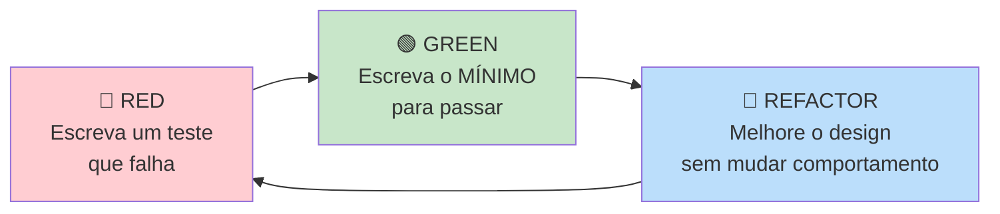
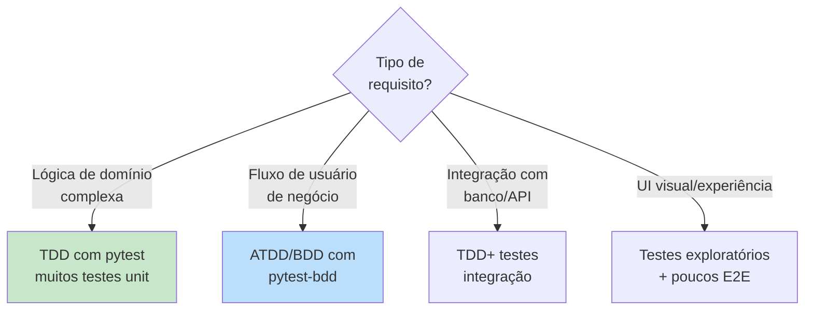

# Bloco 2 — TDD, BDD e o Ciclo Red-Green-Refactor

> **Duração estimada:** 60 a 75 minutos. Inclui um **walkthrough completo de TDD** em Python que você deve executar passo a passo.

O Bloco 1 mostrou **como é** um teste. Este bloco mostra **quando escrevê-lo**: **antes** do código. A pergunta "teste vem antes ou depois?" parece cosmética, mas muda o **design do código**, o **ritmo de trabalho** e a **qualidade da cobertura**.

---

## 1. TDD — Test-Driven Development

### 1.1 Definição

**TDD** é a prática de **escrever o teste antes do código de produção**, em ciclos muito curtos, formalizada por **Kent Beck** no livro *Test-Driven Development: By Example* (2002).

A regra é simples e rigorosa:

> **Você não escreve uma linha de código de produção sem ter um teste falhando que a exija.**

### 1.2 O ciclo Red-Green-Refactor



**Três passos, curtos:**

1. **🔴 RED** — Escreva um teste que **falhe por uma razão específica**. Ele deve **compilar/carregar** mas **falhar** por comportamento ausente.
2. **🟢 GREEN** — Implemente o **mínimo possível** para o teste passar. *Seja deliberadamente ingênuo.*
3. **🔵 REFACTOR** — Com o teste te protegendo, **melhore o design**: extraia funções, remova duplicação, renomeie. **Sem mudar comportamento** — o teste continua passando.

Depois repete. Cada ciclo dura **minutos**, não horas.

### 1.3 Por que TDD funciona (a tese)

TDD entrega benefícios em **3 camadas** que frequentemente são confundidas:

| Camada | Benefício |
|--------|-----------|
| **Segurança** | Você tem **regressão garantida** — cada comportamento virou teste. |
| **Design** | Testabilidade **força** baixo acoplamento. Código difícil de testar é código **mal projetado**. |
| **Fluxo** | Ciclos curtos produzem um **ritmo psicológico** que mantém foco (Kent Beck insiste nisso). |

> **Citação clássica** (Beck, 2002, p. xv): *"If it's worth building, it's worth testing. If it's not worth testing, why are you building it?"*

### 1.4 Armadilhas comuns

- **"Escrevo o teste depois" não é TDD.** É teste automatizado. Pode ser bom, mas **perde** o efeito de design.
- **Não faça "big step":** implementar 10 linhas para passar um teste é violação de GREEN. GREEN é **mínimo**.
- **Refactor não é re-escrita:** é **melhoria progressiva**. Se precisar trocar a arquitetura, é um ciclo maior — escreva novos testes primeiro.
- **TDD não é para tudo:** exploração de UI, spikes, prototipação descartável — raramente se beneficiam. **Regras de negócio e lógica crítica** — o doce ponto do TDD.

---

## 2. Walkthrough completo: TDD de uma feature real

Vamos fazer **TDD de verdade**, ciclo por ciclo, para uma feature da MediQuick.

### 2.1 A feature

> Na MediQuick, um paciente tem direito a **reagendar** uma consulta. A política de negócio é:
>
> - Permitido até **2 vezes por consulta**.
> - Apenas se a consulta estiver com **mais de 24 horas de antecedência**.
> - Após o 2º reagendamento, só cancelamento (sujeito a multa, não é parte desta feature).

### 2.2 Setup

```bash
mkdir -p mediquick-tdd/src/agendamento mediquick-tdd/tests
cd mediquick-tdd
python3 -m venv .venv
source .venv/bin/activate
pip install pytest
touch src/agendamento/__init__.py tests/__init__.py
```

Estrutura inicial:

```
mediquick-tdd/
├── src/agendamento/__init__.py
└── tests/__init__.py
```

Em `pyproject.toml` (ou passando `PYTHONPATH=src` ao chamar pytest), configure o pacote:

```toml
# pyproject.toml
[tool.pytest.ini_options]
pythonpath = ["src"]
testpaths = ["tests"]
```

---

### 2.3 Ciclo 1 — Um reagendamento simples funciona

#### 🔴 RED

Arquivo **`tests/test_reagendamento.py`**:

```python
from datetime import datetime, timedelta

import pytest

from agendamento.consulta import Consulta


def test_reagendar_uma_vez_muda_a_data_e_incrementa_contador():
    agora = datetime(2026, 1, 15, 9, 0, 0)
    data_original = agora + timedelta(days=3)
    nova_data = agora + timedelta(days=5)

    consulta = Consulta(id=1, paciente_email="a@b.com", data_hora=data_original)

    consulta.reagendar(nova_data=nova_data, agora=agora)

    assert consulta.data_hora == nova_data
    assert consulta.reagendamentos == 1
```

Rode:

```bash
pytest -v
```

Saída esperada — **falha por `ImportError` ou `AttributeError`**. Ótimo. Está vermelho.

#### 🟢 GREEN

Arquivo **`src/agendamento/consulta.py`** — implementação **mínima**:

```python
from dataclasses import dataclass
from datetime import datetime


@dataclass
class Consulta:
    id: int
    paciente_email: str
    data_hora: datetime
    reagendamentos: int = 0

    def reagendar(self, nova_data: datetime, agora: datetime) -> None:
        self.data_hora = nova_data
        self.reagendamentos += 1
```

Rode: **1 passed**. Verde.

#### 🔵 REFACTOR

Nada a refatorar ainda; código é mínimo. Seguimos.

---

### 2.4 Ciclo 2 — Limite de 2 reagendamentos

#### 🔴 RED

Adicione ao `tests/test_reagendamento.py`:

```python
def test_nao_permite_terceiro_reagendamento():
    agora = datetime(2026, 1, 15, 9, 0, 0)
    consulta = Consulta(
        id=1, paciente_email="a@b.com",
        data_hora=agora + timedelta(days=3),
        reagendamentos=2,
    )

    with pytest.raises(ReagendamentoNaoPermitido):
        consulta.reagendar(nova_data=agora + timedelta(days=10), agora=agora)
```

Rode: falha por `ReagendamentoNaoPermitido` não existir. **RED**.

#### 🟢 GREEN

Adicione ao `src/agendamento/consulta.py`:

```python
class ReagendamentoNaoPermitido(Exception):
    pass


# dentro da classe Consulta, método reagendar:
    def reagendar(self, nova_data: datetime, agora: datetime) -> None:
        if self.reagendamentos >= 2:
            raise ReagendamentoNaoPermitido("Limite de reagendamentos atingido.")
        self.data_hora = nova_data
        self.reagendamentos += 1
```

Adicione o import no teste:

```python
from agendamento.consulta import Consulta, ReagendamentoNaoPermitido
```

Rode: **2 passed**. Verde.

#### 🔵 REFACTOR

Ainda simples. Seguimos.

---

### 2.5 Ciclo 3 — 24h de antecedência

#### 🔴 RED

```python
def test_nao_permite_reagendar_com_menos_de_24h():
    agora = datetime(2026, 1, 15, 9, 0, 0)
    consulta = Consulta(
        id=1, paciente_email="a@b.com",
        data_hora=agora + timedelta(hours=23),
    )

    with pytest.raises(ReagendamentoNaoPermitido):
        consulta.reagendar(nova_data=agora + timedelta(days=2), agora=agora)
```

**RED** — não há a regra das 24h.

#### 🟢 GREEN

```python
def reagendar(self, nova_data: datetime, agora: datetime) -> None:
    if self.reagendamentos >= 2:
        raise ReagendamentoNaoPermitido("Limite de reagendamentos atingido.")
    if self.data_hora - agora < timedelta(hours=24):
        raise ReagendamentoNaoPermitido(
            "Reagendamento exige 24h de antecedência."
        )
    self.data_hora = nova_data
    self.reagendamentos += 1
```

Rode: **3 passed**.

#### 🔵 REFACTOR

**Agora** há duplicação de responsabilidade — a regra de reagendamento acumula. Vamos extrair uma **política**:

```python
# src/agendamento/consulta.py
from dataclasses import dataclass
from datetime import datetime, timedelta


MAX_REAGENDAMENTOS = 2
ANTECEDENCIA_MINIMA = timedelta(hours=24)


class ReagendamentoNaoPermitido(Exception):
    pass


@dataclass
class Consulta:
    id: int
    paciente_email: str
    data_hora: datetime
    reagendamentos: int = 0

    def reagendar(self, nova_data: datetime, agora: datetime) -> None:
        self._verificar_politica_reagendamento(agora)
        self.data_hora = nova_data
        self.reagendamentos += 1

    def _verificar_politica_reagendamento(self, agora: datetime) -> None:
        if self.reagendamentos >= MAX_REAGENDAMENTOS:
            raise ReagendamentoNaoPermitido("Limite de reagendamentos atingido.")
        if self.data_hora - agora < ANTECEDENCIA_MINIMA:
            raise ReagendamentoNaoPermitido(
                "Reagendamento exige 24h de antecedência."
            )
```

Rode: **3 passed**. Refator não quebrou nada.

---

### 2.6 Ciclo 4 — Zerar reagendamentos após cancelamento

(Simulando continuação; implemente por conta.)

**Teste:**

```python
def test_nova_consulta_comeca_com_zero_reagendamentos():
    agora = datetime(2026, 1, 15, 9, 0, 0)
    consulta = Consulta(id=2, paciente_email="b@c.com",
                       data_hora=agora + timedelta(days=5))

    assert consulta.reagendamentos == 0
```

Esse já passa sem implementação (o `@dataclass` já tem default 0) — é um **teste de regressão** que documenta a expectativa.

---

### 2.7 Arquivo completo final

Arquivo `src/agendamento/consulta.py` (após 3 ciclos):

```python
from dataclasses import dataclass
from datetime import datetime, timedelta


MAX_REAGENDAMENTOS = 2
ANTECEDENCIA_MINIMA = timedelta(hours=24)


class ReagendamentoNaoPermitido(Exception):
    pass


@dataclass
class Consulta:
    id: int
    paciente_email: str
    data_hora: datetime
    reagendamentos: int = 0

    def reagendar(self, nova_data: datetime, agora: datetime) -> None:
        self._verificar_politica_reagendamento(agora)
        self.data_hora = nova_data
        self.reagendamentos += 1

    def _verificar_politica_reagendamento(self, agora: datetime) -> None:
        if self.reagendamentos >= MAX_REAGENDAMENTOS:
            raise ReagendamentoNaoPermitido("Limite de reagendamentos atingido.")
        if self.data_hora - agora < ANTECEDENCIA_MINIMA:
            raise ReagendamentoNaoPermitido(
                "Reagendamento exige 24h de antecedência."
            )
```

**4 testes, código limpo, regra de negócio documentada como teste executável.**

> **Importante:** note que em cada ciclo nós **adicionamos apenas o que o teste exige**. Nenhum "se precisar no futuro...". Isso é o **YAGNI** (*You Aren't Gonna Need It*) em ação.

---

## 3. Histórico Git como evidência de TDD

A **entrega avaliativa** exige **prova de TDD via git**. O padrão sugerido é **3 commits por feature**:

```
* 3b4f9a2 refactor(consulta): extrai política de reagendamento
* a782ef4 feat(consulta): limita reagendamento a 2x e exige 24h
* 1d9c2a1 test(consulta): regras de reagendamento (RED)
```

A leitura do histórico **prova** que você escreveu teste antes — os artefatos não podem ser forjados sem cuidado.

---

## 4. BDD — Behavior-Driven Development

### 4.1 Origem e proposta

**BDD** foi formulado por **Dan North** em 2006 como uma **evolução do TDD** para resolver um problema de **linguagem**: quando desenvolvedores falam em "teste", pessoas de negócio se desligam; quando falam em "comportamento", continuam engajadas.

A proposta de North: **escrever testes na linguagem do domínio**, de forma que **não-programadores** consigam ler, discutir e até escrever.

### 4.2 Estrutura Given-When-Then (Gherkin)

Introduzida pela ferramenta **Cucumber** e adotada por praticamente todas as bibliotecas BDD depois:

```gherkin
Feature: Reagendamento de consulta
  Como paciente
  Quero poder reagendar minha consulta
  Para adaptar a consulta à minha agenda real

  Scenario: Reagendamento com 24h de antecedência
    Given que eu tenho uma consulta marcada para daqui a 3 dias
    And ainda não reagendei essa consulta
    When eu solicito reagendar para daqui a 5 dias
    Then a consulta passa a estar marcada para daqui a 5 dias
    And meu contador de reagendamentos fica em 1

  Scenario: Terceiro reagendamento é bloqueado
    Given que eu tenho uma consulta marcada para daqui a 3 dias
    And ela já foi reagendada 2 vezes
    When eu tento reagendar
    Then o sistema recusa com mensagem "Limite de reagendamentos atingido"
```

### 4.3 Exemplo com `pytest-bdd`

Setup:

```bash
pip install pytest-bdd
```

Arquivo `features/reagendamento.feature` com Gherkin acima.

Arquivo de teste `tests/test_reagendamento_bdd.py`:

```python
from datetime import datetime, timedelta

import pytest
from pytest_bdd import scenarios, given, when, then, parsers

from agendamento.consulta import Consulta, ReagendamentoNaoPermitido


scenarios("../features/reagendamento.feature")

AGORA = datetime(2026, 1, 15, 9, 0, 0)


@pytest.fixture
def contexto():
    return {"consulta": None, "erro": None}


@given(parsers.parse("que eu tenho uma consulta marcada para daqui a {dias:d} dias"))
def consulta_marcada(contexto, dias):
    contexto["consulta"] = Consulta(
        id=1, paciente_email="a@b.com",
        data_hora=AGORA + timedelta(days=dias),
    )


@given(parsers.parse("ela já foi reagendada {n:d} vezes"))
@given("ainda não reagendei essa consulta")
def ajusta_reagendamentos(contexto, n=0):
    contexto["consulta"].reagendamentos = n


@when(parsers.parse("eu solicito reagendar para daqui a {dias:d} dias"))
def reagenda(contexto, dias):
    try:
        contexto["consulta"].reagendar(
            nova_data=AGORA + timedelta(days=dias), agora=AGORA
        )
    except ReagendamentoNaoPermitido as e:
        contexto["erro"] = str(e)


@when("eu tento reagendar")
def tenta_reagendar(contexto):
    try:
        contexto["consulta"].reagendar(
            nova_data=AGORA + timedelta(days=10), agora=AGORA
        )
    except ReagendamentoNaoPermitido as e:
        contexto["erro"] = str(e)


@then(parsers.parse("a consulta passa a estar marcada para daqui a {dias:d} dias"))
def confere_data(contexto, dias):
    assert contexto["consulta"].data_hora == AGORA + timedelta(days=dias)


@then(parsers.parse("meu contador de reagendamentos fica em {n:d}"))
def confere_contador(contexto, n):
    assert contexto["consulta"].reagendamentos == n


@then(parsers.parse('o sistema recusa com mensagem "{msg}"'))
def confere_mensagem(contexto, msg):
    assert contexto["erro"] is not None
    assert msg in contexto["erro"]
```

Rode: `pytest -v`. Os cenários Gherkin viram testes executáveis.

### 4.4 Quando usar BDD

BDD **brilha** em dois cenários:

1. **Envolvimento de negócio** — analistas, POs, stakeholders que escrevem/leem cenários. A especificação **vira** teste.
2. **Testes de aceitação** / **ATDD** — cenário de alto nível validando requisito de negócio.

BDD **não é melhor que TDD** para toda situação. Para regras complexas de domínio, **TDD** com `pytest` puro é mais leve. Um projeto típico tem **TDD na base** (muitos testes unitários) e **BDD como camada de aceitação** (poucos cenários de alto valor).

### 4.5 Diferenças rápidas

| Característica | TDD | BDD |
|----------------|-----|-----|
| Foco | Código | Comportamento |
| Linguagem | Código | Natural (Gherkin) |
| Público | Dev | Dev + Negócio |
| Granularidade típica | Função / classe | Fluxo de usuário |
| Ferramenta Python | `pytest` puro | `pytest-bdd`, `behave` |

> **Referência:** Adzic, G. *Specification by Example.* Manning, 2011 — Texto canônico sobre BDD/ATDD em escala organizacional.

---

## 5. ATDD (Acceptance Test-Driven Development)

**ATDD** é BDD visto como **processo organizacional**: a equipe de produto + dev + QA define **cenários de aceitação** **antes** do desenvolvimento começar. Esses cenários são:

- **Critério de aceitação** do ticket.
- **Guia** para o dev saber "terminei?".
- **Teste automatizado** ao final.

Na **MediQuick**, a diretora de engenharia quer que o QA deixe de ser "revisor manual" e passe a ser "engenheiro de qualidade" — ATDD é o caminho. QA coescreve cenários **antes**; desenvolve junto com Dev; a release não depende de revisão manual porque **a aceitação já é automatizada**.

---

## 6. Escolhendo entre TDD e BDD — um roteiro



**Na prática:**

- Regra de negócio nova → **TDD** em Python puro.
- Feature de alto valor para negócio → **BDD** na camada de aceitação.
- Integração nova com banco/API externa → **TDD** + integração (Bloco 4).
- UI nova → teste **E2E mínimo** só para o caminho crítico; demais via testes unitários de componentes.

---

## 7. Aplicação ao cenário da MediQuick

- **Sintoma 1 (cobertura 15%)**: TDD natural-mente eleva cobertura, porque cada comportamento novo vem com teste.
- **Sintoma 6 (regressão frequente)**: cada bug corrigido vira **primeiro um teste** que reproduz o bug (RED) — aí conserta (GREEN). Nunca mais volta sem alguém reescrever o teste.
- **Sintoma 9 (mocks em excesso)**: TDD tende a **evidenciar acoplamento ruim** — quando você não consegue escrever um teste limpo, o código precisa ser refatorado. É mecanismo de design, não só verificação.
- **QA como engenheiro de qualidade**: ATDD muda o papel do QA — coescreve critérios de aceitação com dev e negócio.

---

## Resumo do bloco

- **TDD** = escrever teste **antes** do código, em ciclos **Red-Green-Refactor** curtos.
- **Ciclo:**
    - 🔴 **RED** — teste falhando por razão específica.
    - 🟢 **GREEN** — mínimo código para passar.
    - 🔵 **REFACTOR** — melhora sem mudar comportamento.
- **Benefícios em 3 camadas:** segurança (regressão), design (baixo acoplamento), fluxo (ritmo curto).
- **YAGNI**: nada além do que o teste exige.
- **BDD** = teste em linguagem natural (Given-When-Then) — ponte com negócio.
- **ATDD** = BDD como processo organizacional — define aceitação antes de desenvolver.
- Na MediQuick, TDD ataca cobertura + regressão; BDD/ATDD muda o papel do QA.

---

## Próximo passo

- Faça os **[exercícios resolvidos do Bloco 2](02-exercicios-resolvidos.md)**.
- Depois avance para o **[Bloco 3 — Quality Gates, cobertura e shift-left](../bloco-3/03-quality-gates.md)**.

---

## Referências deste bloco

- **Beck, K.** *Test-Driven Development: By Example.* Addison-Wesley, 2002. (Versão PT-BR: Bookman, 2010.)
- **North, D.** *"Introducing BDD"* (2006). [dannorth.net/introducing-bdd](https://dannorth.net/introducing-bdd/)
- **Adzic, G.** *Specification by Example.* Manning, 2011.
- **Freeman, S.; Pryce, N.** *Growing Object-Oriented Software, Guided by Tests.* Addison-Wesley, 2009.
- **Fowler, M.** *"Mocks Aren't Stubs"* (2007). [martinfowler.com/articles/mocksArentStubs.html](https://martinfowler.com/articles/mocksArentStubs.html)
- **Humble, J.; Farley, D.** *Entrega Contínua.* Alta Books. Cap. 4. (`books/Entrega Contínua.pdf`)

---

<!-- nav:start -->

| &nbsp; | &nbsp; | &nbsp; |
|:--|:--:|--:|
| **← Anterior**<br>[Exercícios Resolvidos — Bloco 1](../bloco-1/01-exercicios-resolvidos.md) | **↑ Índice**<br>[Módulo 3 — Testes e qualidade de software](../README.md) | **Próximo →**<br>[Exercícios Resolvidos — Bloco 2](02-exercicios-resolvidos.md) |

<!-- nav:end -->
