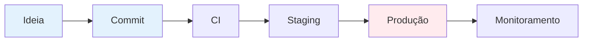
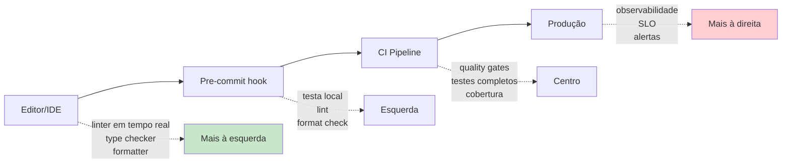
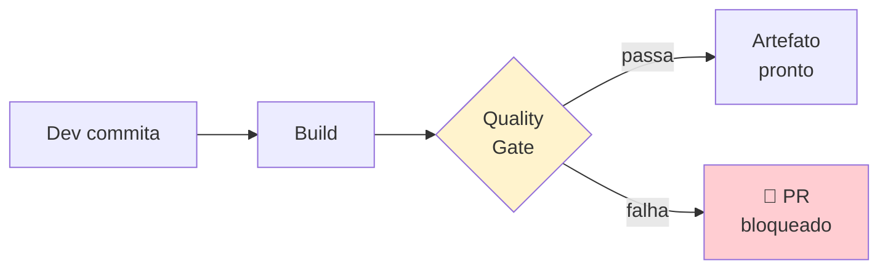

# Bloco 3 — Quality Gates, Cobertura e Shift-Left

> **Duração estimada:** 55 a 65 minutos. Inclui exemplo completo de pipeline GitHub Actions com quality gates, e um script Python para **avaliar** a qualidade de uma suíte de testes.

Os Blocos 1 e 2 ensinaram a **escrever** testes. Este bloco trata de **cobrar** que testes sejam escritos — e com qualidade. Um teste **que ninguém olha** logo **não é escrito**. A resposta de DevOps é: **automatizar a cobrança**, via **quality gates** no pipeline CI.

---

## 1. Shift-Left Testing: o deslocamento da qualidade

### 1.1 A metáfora

Imagine o pipeline de software como uma esteira que vai da **esquerda** (ideia, commit) à **direita** (produção):



**Quando** a qualidade é inspecionada define o **custo** de corrigir.

### 1.2 Custo exponencial do bug quanto mais tarde ele é detectado

Referência clássica: **Boehm (1981)** — o custo de corrigir um bug cresce **de 10x a 100x** a cada estágio em que ele escapa.

| Onde o bug é detectado | Custo relativo |
|------------------------|----------------|
| No editor (IDE com linter) | **1x** |
| No pipeline CI | **10x** |
| Em QA manual/staging | **15–30x** |
| Em produção | **30–100x+** |
| Em produção **causando incidente** | **100–1000x+** |

> Os bugs caros da MediQuick (prescrição para paciente errado) foram detectados **em produção**. É a posição mais à direita possível. O objetivo do shift-left é **mover a detecção para a esquerda**, onde é barato.

### 1.3 Shift-Left em 4 camadas



**Shift-left não é "não rodar em produção"** — é "**rodar o mais cedo que fizer sentido**". E quality gates no CI são a camada **mais barata** de fazer isso hoje.

---

## 2. Quality Gates: o que são

### 2.1 Definição

Um **Quality Gate** é um **critério automático** no pipeline que **barra a progressão** do código se não for atendido. Funciona como o **Andon Cord** do Módulo 1: qualquer pessoa (qualquer linha de código) pode parar a esteira se a qualidade cair.



### 2.2 Gates típicos em ordem de custo crescente

| Gate | Ferramenta Python | Tempo típico | O que detecta |
|------|-------------------|--------------|---------------|
| **Lint** | `ruff` | < 5s | Erros de estilo, imports não usados, bugs simples |
| **Format check** | `ruff format --check` | < 2s | Código não formatado |
| **Type check** (opcional) | `mypy`, `pyright` | 10s–1min | Erros de tipo |
| **Testes unitários** | `pytest` | segundos | Regressão de comportamento |
| **Cobertura mínima** | `pytest-cov --cov-fail-under` | +segundos | Código não testado |
| **Complexidade** | `radon cc` | segundos | Funções complexas demais |
| **Análise de segurança** | `bandit` | segundos | Padrões inseguros (hardcoded passwords, SQL injection) |
| **Testes de integração** | `pytest + testcontainers` | 1–5 min | Bug de integração |
| **Mutation testing** (opcional) | `mutmut` | minutos a horas | Qualidade dos testes |

### 2.3 O gate não é ditador — é combinado

Na MediQuick, **cobertura mínima** não pode começar em 80% (o repo tem 15%). Começa **onde você está** (15%) e só **sobe gradualmente** via **ratchet**: cada PR **pode manter** ou **subir**, nunca descer. Em 3 meses, de 15% → 50%; em 6 meses → 70%.

> **Referência:** Humble e Farley (2014), Cap. 4 — "Quality is a characteristic you have to continually earn." O quality gate é o mecanismo.

---

## 3. Cobertura de Teste — Como Medir e Como **Não** Interpretar

### 3.1 O que cobertura mede

Cobertura mede a **fração de linhas (ou branches)** do código **executadas** durante os testes:

- **Line coverage:** "quais linhas foram executadas?"
- **Branch coverage:** "quais ramos de `if/else` foram explorados?"
- **Statement coverage:** variação de line.

Em Python, a ferramenta é **Coverage.py**, frequentemente usada via o plugin **pytest-cov**.

### 3.2 Exemplo prático

Instale:

```bash
pip install pytest pytest-cov
```

Rode com cobertura (usando o exemplo do Bloco 1):

```bash
pytest --cov=. --cov-report=term-missing test_consulta.py
```

Saída exemplo:

```
---------- coverage: platform linux, python 3.11 ----------
Name              Stmts   Miss  Cover   Missing
-----------------------------------------------
consulta.py          11      0   100%
test_consulta.py     26      0   100%
-----------------------------------------------
TOTAL                37      0   100%
```

Para **branch coverage** (mais revelador):

```bash
pytest --cov=. --cov-branch --cov-report=term-missing
```

Para **quebrar o build se abaixo de 80%**:

```bash
pytest --cov=. --cov-fail-under=80
```

### 3.3 A armadilha: Lei de Goodhart

> **Lei de Goodhart (1975):** *"When a measure becomes a target, it ceases to be a good measure."*

Assim que cobertura vira **meta**, três coisas acontecem:

1. **Testes triviais** aparecem — testes de getters/setters que executam a linha sem verificar comportamento. A cobertura **sobe**, a qualidade **não**.
2. **Asserts vazios** — teste roda o código (cobre a linha) mas não valida o resultado.
3. **Mock everywhere** — dev mocka tudo; teste executa tudo; nada é realmente testado.

### 3.4 Exemplo concreto de cobertura enganosa

```python
# código:
def calcular_desconto(plano: str) -> float:
    if plano == "BASICO":
        return 0.0
    if plano == "PREMIUM":
        return 0.10
    return 0.05  # default

# teste que dá 100% de cobertura MAS não valida nada:
def test_calcular_desconto_cobre_tudo():
    calcular_desconto("BASICO")
    calcular_desconto("PREMIUM")
    calcular_desconto("OUTRO")
    # sem assert. Roda tudo, valida nada. Coverage: 100%.
```

Cobertura: **100%**. Bugs detectados: **zero**.

### 3.5 Métricas complementares

**Mutation testing** mede **a qualidade** dos testes — modifica o código (muta) e verifica se o teste detecta.

Em Python: `mutmut` ou `cosmic-ray`.

```bash
pip install mutmut
mutmut run --paths-to-mutate consulta.py
mutmut results
```

Exemplo de mutação: se `<` vira `<=` no código, **algum** teste deveria falhar. Se nenhum falha, a cobertura era **cosmética**.

> **Referência:** Fowler, *"Test Coverage"* — cobertura é **útil para identificar código não testado**, mas **não prova qualidade**. Use como **sanidade**, não como meta.

### 3.6 Regra prática de threshold

| Tipo de código | Threshold saudável |
|----------------|---------------------|
| Regras de negócio críticas (agendamento, prescrição) | **≥ 90%**, branch coverage |
| Código de aplicação comum | **70–85%** |
| Adaptadores, plumbing simples (CRUD trivial) | **50–70%** |
| Código gerado, migrations | **não mede** |

**Threshold global único** (ex.: 80% em todo o repo) é mais simples, mas cego ao risco. **Threshold por diretório** é melhor — e suportado pelo `coverage.py` via `[tool.coverage.report] fail_under` com exclusões.

---

## 4. Um pipeline de CI com quality gates — completo

Vamos materializar todos os gates em um **workflow GitHub Actions**, rodando contra uma aplicação Python.

### 4.1 Estrutura do projeto

```
mediquick-agendamento/
├── src/agendamento/
│   ├── __init__.py
│   └── consulta.py
├── tests/unit/
│   └── test_consulta.py
├── pyproject.toml
├── requirements.txt
├── requirements-dev.txt
└── .github/workflows/ci.yml
```

### 4.2 `pyproject.toml` com configurações

```toml
[project]
name = "mediquick-agendamento"
version = "0.1.0"
requires-python = ">=3.11"

[tool.pytest.ini_options]
pythonpath = ["src"]
testpaths = ["tests"]
addopts = "-ra --strict-markers"

[tool.coverage.run]
source = ["src"]
branch = true

[tool.coverage.report]
show_missing = true
skip_covered = false
fail_under = 70

[tool.ruff]
line-length = 100
target-version = "py311"

[tool.ruff.lint]
select = ["E", "F", "I", "W", "B", "N", "UP"]
# E - pycodestyle errors, F - pyflakes, I - import sort,
# W - warnings, B - bugbear, N - naming, UP - pyupgrade
```

### 4.3 `requirements-dev.txt`

```
pytest>=8.0
pytest-cov>=4.1
ruff>=0.4
radon>=6.0
```

### 4.4 Workflow `.github/workflows/ci.yml`

```yaml
name: CI

on:
  push:
    branches: [main]
  pull_request:
    branches: [main]

jobs:
  quality:
    name: Quality Gates
    runs-on: ubuntu-latest
    steps:
      - uses: actions/checkout@v4

      - name: Setup Python
        uses: actions/setup-python@v5
        with:
          python-version: "3.11"
          cache: "pip"

      - name: Install dependencies
        run: |
          python -m pip install --upgrade pip
          pip install -r requirements.txt
          pip install -r requirements-dev.txt

      - name: Lint (ruff)
        run: ruff check .

      - name: Format check (ruff)
        run: ruff format --check .

      - name: Complexity (radon)
        run: |
          # falha se alguma função ficar em CC > C (>10)
          radon cc src -s -a --min C --total-average
          # gate efetivo: falha se houver funções grau D ou pior
          ! radon cc src --min D --json | grep -q '"rank":'

      - name: Unit tests + coverage
        run: |
          pytest tests/unit \
            --cov=src \
            --cov-branch \
            --cov-report=term-missing \
            --cov-report=xml \
            --cov-fail-under=70

      - name: Upload coverage artifact
        if: always()
        uses: actions/upload-artifact@v4
        with:
          name: coverage-xml
          path: coverage.xml
```

### 4.5 Leitura do workflow

| Gate | Comando | Falha quando |
|------|---------|--------------|
| Lint | `ruff check .` | Qualquer warning/erro de estilo |
| Format | `ruff format --check .` | Código não formatado |
| Complexity | `radon cc` + grep | Função grau D ou pior (CC > 20) |
| Tests + coverage | `pytest --cov-fail-under=70` | Algum teste falha OU cobertura < 70% |

**Artefato** de cobertura é preservado mesmo se o job falhar (`if: always()`) — útil para diagnosticar.

### 4.6 Estratégia de "ratchet" — elevando a cobertura gradualmente

Na MediQuick saindo de 15%, começa-se com `--cov-fail-under=15` e um **trigger periódico** que sobe o número 2% por mês:

```bash
# script simplificado (rodado manualmente ou no final do sprint)
current=$(grep -oP 'fail_under = \K\d+' pyproject.toml)
new=$((current + 2))
sed -i "s/fail_under = $current/fail_under = $new/" pyproject.toml
```

Assim, **cada PR** só pode **manter ou subir**; nunca descer. Em um ano, 15% → 40%. Agressivo mas realista; código crítico escala mais rápido via TDD.

---

## 5. Complexidade ciclomática — por que importa

**Complexidade ciclomática (CC)** conta o número de caminhos independentes que o código pode seguir. Foi proposta por **McCabe (1976)**.

Regra de bolso:

| CC | Avaliação | Ação |
|----|-----------|------|
| 1–5 | Simples | 👍 |
| 6–10 | Razoável | Observar |
| 11–20 | Complexo | Refatorar quando possível |
| 21+ | **Perigoso** | Testar muito ou reescrever |

Em Python, `radon cc` mede.

Função com CC alto tem **muitos caminhos** — difícil testar (muitos testes necessários), alto risco de bug. **Forçar teto** no CI empurra o time para código mais simples.

### Exemplo

```python
# CC = 6  (razoável)
def aplicar_desconto(paciente, plano, cupom, consulta_gratis, primeiro_acesso):
    desconto = 0.0
    if plano == "PREMIUM":
        desconto += 0.1
    if cupom:
        desconto += 0.05
    if consulta_gratis:
        desconto = 1.0
    if primeiro_acesso:
        desconto += 0.15
    if desconto > 0.5:
        desconto = 0.5
    return desconto
```

**Gate sugerido:** `radon cc --min C` (permite até CC 20, falha em D+).

---

## 6. Avaliador de suíte — script prático

Script Python que lê a saída de `pytest --cov` e dá um **veredito** simples. Útil para educar o time.

### Arquivo `avalia_suite.py`

```python
"""Avalia de forma simples a saúde de uma suíte de testes Python.

Uso:
    python avalia_suite.py --cobertura 72 --testes-total 150 \
        --testes-unit 120 --testes-integracao 25 --testes-e2e 5

Retorna texto com um veredito sobre a pirâmide e a cobertura.
"""
from __future__ import annotations

import argparse
import sys
from dataclasses import dataclass


@dataclass
class Avaliacao:
    veredito: str
    sugestoes: list[str]
    nivel_piramide: str
    nivel_cobertura: str

    def imprimir(self) -> None:
        print("=== Avaliação da suíte de testes ===\n")
        print(f"Pirâmide: {self.nivel_piramide}")
        print(f"Cobertura: {self.nivel_cobertura}")
        print(f"Veredito: {self.veredito}\n")
        if self.sugestoes:
            print("Sugestões:")
            for s in self.sugestoes:
                print(f"  - {s}")


def classifica_piramide(unit: int, integ: int, e2e: int) -> tuple[str, list[str]]:
    total = max(unit + integ + e2e, 1)
    p_unit = unit / total
    p_int = integ / total
    p_e2e = e2e / total

    sugestoes: list[str] = []

    if p_unit >= 0.60 and p_e2e <= 0.15:
        nivel = "saudável (pirâmide)"
    elif p_e2e > p_unit:
        nivel = "ICE CREAM CONE (anti-padrão)"
        sugestoes.append("inverter a pirâmide: aumentar unit, reduzir E2E")
    elif p_int < 0.05 and p_unit > 0.5 and p_e2e > 0.2:
        nivel = "HOURGLASS (anti-padrão)"
        sugestoes.append("adicionar testes de integração entre unit e E2E")
    elif p_unit < 0.4:
        nivel = "pirâmide fraca (base pequena)"
        sugestoes.append("priorizar testes unitários em lógica de domínio")
    else:
        nivel = "pirâmide razoável"

    return nivel, sugestoes


def classifica_cobertura(pct: float) -> tuple[str, list[str]]:
    sugestoes: list[str] = []
    if pct < 30:
        nivel = f"crítica ({pct:.0f}%)"
        sugestoes.append(
            "começar por caracterizar testes nos caminhos críticos (agendamento, pagamento)"
        )
    elif pct < 60:
        nivel = f"baixa ({pct:.0f}%)"
        sugestoes.append(
            "aplicar ratchet: subir threshold 2pp por sprint, sem forçar volumes absurdos"
        )
    elif pct < 80:
        nivel = f"aceitável ({pct:.0f}%)"
        sugestoes.append(
            "verificar se caminhos de erro/branches estão cobertos (--cov-branch)"
        )
    else:
        nivel = f"boa ({pct:.0f}%)"
        sugestoes.append(
            "avaliar mutation testing para checar se a cobertura é real ou cosmética"
        )
    return nivel, sugestoes


def avalia(cobertura: float, unit: int, integ: int, e2e: int) -> Avaliacao:
    nivel_p, sug_p = classifica_piramide(unit, integ, e2e)
    nivel_c, sug_c = classifica_cobertura(cobertura)

    if "ICE CREAM CONE" in nivel_p or "crítica" in nivel_c:
        veredito = "RUIM — ação imediata"
    elif "saudável" in nivel_p and "boa" in nivel_c:
        veredito = "BOM — manter e monitorar com mutation testing"
    else:
        veredito = "ACEITÁVEL — com plano de melhoria"

    return Avaliacao(
        veredito=veredito,
        sugestoes=sug_p + sug_c,
        nivel_piramide=nivel_p,
        nivel_cobertura=nivel_c,
    )


def main(argv: list[str] | None = None) -> int:
    parser = argparse.ArgumentParser()
    parser.add_argument("--cobertura", type=float, required=True)
    parser.add_argument("--testes-unit", type=int, required=True)
    parser.add_argument("--testes-integracao", type=int, required=True)
    parser.add_argument("--testes-e2e", type=int, required=True)
    # opcional, não usado diretamente — apenas sanidade
    parser.add_argument("--testes-total", type=int, required=False)
    args = parser.parse_args(argv)

    resultado = avalia(
        cobertura=args.cobertura,
        unit=args.testes_unit,
        integ=args.testes_integracao,
        e2e=args.testes_e2e,
    )
    resultado.imprimir()
    return 0


if __name__ == "__main__":
    sys.exit(main())
```

### Rodando nos três times do Exercício 2 do Bloco 1

**Time A (saudável):**

```bash
python avalia_suite.py --cobertura 82 --testes-unit 1000 --testes-integracao 120 --testes-e2e 15
```

**Time B (MediQuick – ice cream cone):**

```bash
python avalia_suite.py --cobertura 15 --testes-unit 80 --testes-integracao 30 --testes-e2e 450
```

**Time C (hourglass):**

```bash
python avalia_suite.py --cobertura 55 --testes-unit 600 --testes-integracao 20 --testes-e2e 200
```

---

## 7. Segurança no shift-left — preview do Módulo 9

Ferramentas de **análise estática de segurança** (SAST) rodam junto dos gates:

- **`bandit`** — padrões inseguros em Python (hardcoded passwords, SQL concat, `eval`).
- **`pip-audit`** — dependências com CVE conhecido.
- **`gitleaks`** — secrets vazados em histórico git.

Adicionando ao workflow:

```yaml
      - name: Security (bandit)
        run: bandit -r src

      - name: Vulnerable deps (pip-audit)
        run: pip-audit -r requirements.txt --strict
```

O Módulo 9 (DevSecOps) aprofundará. Mas já vale adicionar como gate leve.

---

## 8. Aplicação ao cenário da MediQuick

| Sintoma | Como o Bloco 3 ataca |
|---------|-----------------------|
| 1 — Cobertura <15% | `--cov-fail-under` começando em 15, subindo via ratchet |
| 5 — Dev não roda local | Pre-commit hook roda lint + unit em segundos |
| 10 — Sem quality gates | Este bloco é exatamente o que falta; PR não passa sem gate OK |
| 9 — Mocks em excesso | Mutation testing expõe testes cosméticos (longo prazo) |

O plano típico para a MediQuick:

1. **Semana 1**: pre-commit hook com `ruff` e `pytest tests/unit` (rápido).
2. **Semana 2**: workflow CI com `ruff`, `pytest` e `--cov-fail-under=15`.
3. **Mês 1**: adicionar `radon`, `bandit`.
4. **Mês 2 a 6**: ratchet — sobe cobertura 2pp/sprint até 70%.
5. **Mês 6+**: mutation testing em módulos críticos (agendamento, prescrição).

---

## Resumo do bloco

- **Shift-left** = detectar bug o mais cedo possível; custo cresce 10–100x a cada estágio.
- **Quality Gates** = critérios automáticos no CI que **barram** código de baixa qualidade.
- Gates essenciais em Python: `ruff` (lint + format), `pytest` (testes), `pytest-cov` (cobertura), `radon` (complexidade), `bandit` (segurança).
- **Cobertura** é útil mas sujeita à **Lei de Goodhart** — teste cosmético infla cobertura sem agregar.
- **Branch coverage > line coverage**.
- **Mutation testing** (`mutmut`) mede qualidade dos testes.
- **Ratchet**: subir threshold gradualmente; nunca descer.
- Alto CC (ciclomática) exige mais testes **ou** refatoração.

---

## Próximo passo

- Faça os **[exercícios resolvidos do Bloco 3](03-exercicios-resolvidos.md)**.
- Depois avance para o **[Bloco 4 — Integração, E2E e estratégias](../bloco-4/04-integracao-e2e.md)**.

---

## Referências deste bloco

- **Boehm, B.** *Software Engineering Economics.* Prentice-Hall, 1981. (Custo crescente de bugs.)
- **McCabe, T.J.** "A Complexity Measure." *IEEE TSE*, 1976. (Complexidade ciclomática.)
- **Humble, J.; Farley, D.** *Entrega Contínua.* Alta Books. Cap. 4 e Cap. 11. (`books/Entrega Contínua.pdf`)
- **Kim, G. et al.** *The DevOps Handbook.* Cap. 10 — testes rápidos e confiáveis. (`books/DevOps_Handbook_Intro_Part1_Part2.pdf`)
- **Fowler, M.** *"Test Coverage."* [martinfowler.com/bliki/TestCoverage.html](https://martinfowler.com/bliki/TestCoverage.html).
- **Fowler, M.** *"Continuous Integration."* [martinfowler.com/articles/continuousIntegration.html](https://martinfowler.com/articles/continuousIntegration.html).
