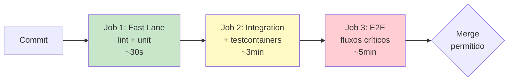

# Bloco 4 — Testes de Integração, E2E e Estratégias

> **Duração estimada:** 60 a 75 minutos. Inclui exemplo completo com **Testcontainers + Postgres real** e exemplo de **E2E com FastAPI + httpx**.

Até aqui os testes foram **unitários** — isolados, rápidos, sem I/O. Mas a MediQuick tem **bugs que só aparecem com Postgres real** (sintoma 8). A base da pirâmide **não é suficiente** — é **necessária**. Este bloco trata do **topo** da pirâmide: integração, contract, E2E, e como **não** deixar esses testes virarem o pesadelo flaky da MediQuick.

---

## 1. Por que testes unitários não bastam

### 1.1 O mundo real dos bugs

Um teste unitário do `AgendamentoService` pode passar perfeitamente, mas em produção o código quebra porque:

- A **query SQL** construída pelo repo tem um `JOIN` errado.
- O **Postgres em staging é versão 14**, em produção é **15** — uma função se comporta diferente.
- O campo **`paciente_email`** tem `VARCHAR(100)` no banco; o teste unit nunca percebeu, mas em produção emails longos são truncados.
- O **timezone** do servidor é `UTC`, mas o Postgres está em `America/Sao_Paulo`.
- O **encoding** de `utf8` vs `utf8mb4` altera emojis em nomes.

Esses bugs **não** são pegos por unit. São pegos por **testes de integração**.

### 1.2 A ilusão do "rodou local"

**Sintoma 8 da MediQuick**: "Funciona no meu env". Causa raiz: ambiente local diferente do ambiente de produção. A solução **não** é "equipar cada dev com réplica de produção" — é **subir ambiente efêmero idêntico** para cada rodada de teste. Testcontainers resolve isso.

---

## 2. Testes de integração com Testcontainers

### 2.1 O que é

**Testcontainers** é uma biblioteca que **sobe contêineres Docker efêmeros** dentro do teste. Cada teste pode ter o **seu próprio** Postgres, Redis, Kafka — inicializado, usado, **destruído no teardown**.

Proposto originalmente para Java (2015), hoje tem bindings para Python, Go, JS, .NET.

**Vantagens:**

- **Ambiente idêntico** ao de produção (mesma imagem Docker).
- **Isolamento**: cada teste tem banco limpo.
- **Reprodutibilidade**: funciona igual em máquina local e em CI.
- **Paralelizável**: cada worker pega um contêiner.

**Requisito:** Docker instalado na máquina (ou daemon remoto).

### 2.2 Setup

```bash
pip install testcontainers[postgres] psycopg2-binary
```

### 2.3 Exemplo completo — repositório de Consulta com Postgres real

#### Estrutura

```
mediquick-integracao/
├── src/mediquick/
│   ├── __init__.py
│   └── repo.py
├── tests/integration/
│   ├── __init__.py
│   ├── conftest.py
│   └── test_consulta_repo.py
├── pyproject.toml
└── requirements-dev.txt
```

#### `src/mediquick/repo.py`

```python
"""Repositório de Consulta da MediQuick — acesso a Postgres."""
from __future__ import annotations

from dataclasses import dataclass
from datetime import datetime

import psycopg2
from psycopg2.extras import RealDictCursor


SCHEMA_SQL = """
CREATE TABLE IF NOT EXISTS consultas (
    id             SERIAL PRIMARY KEY,
    paciente_email VARCHAR(200) NOT NULL,
    data_hora      TIMESTAMPTZ NOT NULL,
    cancelada      BOOLEAN NOT NULL DEFAULT FALSE,
    CONSTRAINT uq_paciente_data UNIQUE (paciente_email, data_hora)
);
"""


@dataclass
class ConsultaRow:
    id: int
    paciente_email: str
    data_hora: datetime
    cancelada: bool


class ConsultaRepo:
    """Repositório com acesso direto a Postgres via psycopg2."""

    def __init__(self, dsn: str) -> None:
        self.dsn = dsn

    def _conn(self):
        return psycopg2.connect(self.dsn)

    def criar_schema(self) -> None:
        with self._conn() as conn, conn.cursor() as cur:
            cur.execute(SCHEMA_SQL)

    def salvar(self, paciente_email: str, data_hora: datetime) -> int:
        with self._conn() as conn, conn.cursor() as cur:
            cur.execute(
                "INSERT INTO consultas (paciente_email, data_hora) "
                "VALUES (%s, %s) RETURNING id",
                (paciente_email, data_hora),
            )
            row = cur.fetchone()
            return row[0]

    def buscar(self, consulta_id: int) -> ConsultaRow | None:
        with self._conn() as conn, conn.cursor(cursor_factory=RealDictCursor) as cur:
            cur.execute("SELECT * FROM consultas WHERE id = %s", (consulta_id,))
            row = cur.fetchone()
            return ConsultaRow(**row) if row else None

    def listar_por_paciente(self, paciente_email: str) -> list[ConsultaRow]:
        with self._conn() as conn, conn.cursor(cursor_factory=RealDictCursor) as cur:
            cur.execute(
                "SELECT * FROM consultas WHERE paciente_email = %s ORDER BY data_hora",
                (paciente_email,),
            )
            return [ConsultaRow(**r) for r in cur.fetchall()]
```

#### `tests/integration/conftest.py`

```python
"""Fixtures de integração — Postgres efêmero por sessão."""
from __future__ import annotations

import pytest
from testcontainers.postgres import PostgresContainer

from mediquick.repo import ConsultaRepo


@pytest.fixture(scope="session")
def postgres_container():
    """Sobe UM Postgres por sessão de teste (mais rápido que por teste)."""
    with PostgresContainer("postgres:16-alpine") as pg:
        yield pg


@pytest.fixture(scope="session")
def dsn(postgres_container) -> str:
    return postgres_container.get_connection_url().replace(
        "postgresql+psycopg2://", "postgresql://"
    )


@pytest.fixture(scope="session")
def repo_criado(dsn) -> ConsultaRepo:
    r = ConsultaRepo(dsn)
    r.criar_schema()
    return r


@pytest.fixture
def repo(repo_criado, dsn) -> ConsultaRepo:
    """Cada teste começa com a tabela LIMPA (truncate) — isolamento."""
    import psycopg2
    with psycopg2.connect(dsn) as conn, conn.cursor() as cur:
        cur.execute("TRUNCATE TABLE consultas RESTART IDENTITY")
    return repo_criado
```

#### `tests/integration/test_consulta_repo.py`

```python
from datetime import datetime, timezone

import psycopg2
import pytest


def test_salvar_e_buscar_consulta_real(repo):
    dt = datetime(2026, 3, 10, 14, 30, tzinfo=timezone.utc)

    id_gerado = repo.salvar("ana@example.com", dt)
    row = repo.buscar(id_gerado)

    assert row is not None
    assert row.id == id_gerado
    assert row.paciente_email == "ana@example.com"
    assert row.data_hora == dt
    assert row.cancelada is False


def test_restricao_unica_impede_duplicata(repo):
    dt = datetime(2026, 3, 10, 14, 30, tzinfo=timezone.utc)
    repo.salvar("ana@example.com", dt)

    with pytest.raises(psycopg2.errors.UniqueViolation):
        repo.salvar("ana@example.com", dt)


def test_listar_por_paciente_retorna_ordenado_por_data(repo):
    repo.salvar("ana@example.com", datetime(2026, 4, 1, 10, 0, tzinfo=timezone.utc))
    repo.salvar("ana@example.com", datetime(2026, 3, 1, 10, 0, tzinfo=timezone.utc))
    repo.salvar("ana@example.com", datetime(2026, 5, 1, 10, 0, tzinfo=timezone.utc))
    repo.salvar("outro@example.com", datetime(2026, 3, 1, 10, 0, tzinfo=timezone.utc))

    ordenadas = repo.listar_por_paciente("ana@example.com")

    assert len(ordenadas) == 3
    assert ordenadas[0].data_hora.month == 3
    assert ordenadas[1].data_hora.month == 4
    assert ordenadas[2].data_hora.month == 5
```

### 2.4 Rodando

```bash
pytest tests/integration -v
```

Na primeira rodada, o Docker baixa a imagem `postgres:16-alpine` (~90 MB). A partir daí, cada sessão sobe em ~2s. O teste completo roda em ~5s (com paralelismo, ainda mais rápido).

### 2.5 O que este teste **pega** que unit não pegaria

- **Constraint UNIQUE** — só aparece no banco real.
- **`TIMESTAMPTZ` timezone** — comportamento específico do Postgres.
- **`RETURNING id`** — sintaxe específica (não funciona em MySQL).
- **Ordenação** — a query pode estar sintaticamente certa e semanticamente errada (faltando `ORDER BY`).
- **Conexão, transação, autocommit** — diversos detalhes de integração.

### 2.6 Evitando o pesadelo de flakiness

Regras práticas:

- **Limpe estado a cada teste** (TRUNCATE). Nunca confie em ordem.
- **Use `scope="session"`** para subir o contêiner uma vez — teste em milissegundos quando já está de pé.
- **Use `scope="function"`** se testar **coisas diferentes por contêiner** (caro — só quando necessário).
- **Tags explícitas da imagem** (`postgres:16-alpine`, não `postgres:latest`) — determinismo.
- **Não misture** testes de integração com unit no mesmo comando `pytest` — execute em jobs **separados** no CI.

---

## 3. Testes End-to-End (E2E)

### 3.1 Definição prática

Um teste **E2E** exercita o **fluxo completo de usuário** pela aplicação inteira — tipicamente subindo a aplicação + banco + filas + qualquer serviço externo.

Na MediQuick, um E2E de agendamento sobe:

- O serviço de Agendamento (FastAPI).
- O Postgres.
- Um cliente HTTP que simula o frontend.

### 3.2 Exemplo — E2E com FastAPI e `httpx.AsyncClient`

#### `src/mediquick/api.py`

```python
"""API HTTP minimalista do serviço de Agendamento."""
from __future__ import annotations

from datetime import datetime

from fastapi import FastAPI, HTTPException
from pydantic import BaseModel

from mediquick.repo import ConsultaRepo


app = FastAPI(title="MediQuick — Agendamento")

# repo_global é injetado antes de subir em produção; em teste, fixture substitui
_repo: ConsultaRepo | None = None


def set_repo(r: ConsultaRepo) -> None:
    global _repo
    _repo = r


class AgendamentoIn(BaseModel):
    paciente_email: str
    data_hora: datetime


class AgendamentoOut(BaseModel):
    id: int
    paciente_email: str
    data_hora: datetime
    cancelada: bool


@app.post("/consultas", response_model=AgendamentoOut, status_code=201)
def criar(payload: AgendamentoIn):
    if _repo is None:
        raise HTTPException(500, "repo não configurado")
    id_gerado = _repo.salvar(payload.paciente_email, payload.data_hora)
    row = _repo.buscar(id_gerado)
    return AgendamentoOut(**row.__dict__)


@app.get("/consultas/{consulta_id}", response_model=AgendamentoOut)
def obter(consulta_id: int):
    row = _repo.buscar(consulta_id)
    if row is None:
        raise HTTPException(404, "não encontrada")
    return AgendamentoOut(**row.__dict__)
```

#### `tests/e2e/test_fluxo_agendamento.py`

```python
"""Testes E2E — fluxo completo via HTTP.

Usa o Postgres efêmero dos testes de integração + FastAPI TestClient.
"""
from datetime import datetime, timezone

import pytest
from fastapi.testclient import TestClient

from mediquick.api import app, set_repo
from mediquick.repo import ConsultaRepo


@pytest.fixture
def client(repo):
    set_repo(repo)
    return TestClient(app)


def test_agendar_e_buscar_via_api(client):
    payload = {
        "paciente_email": "ana@example.com",
        "data_hora": "2026-06-15T10:00:00+00:00",
    }

    r = client.post("/consultas", json=payload)
    assert r.status_code == 201
    body = r.json()
    assert body["paciente_email"] == "ana@example.com"
    consulta_id = body["id"]

    r2 = client.get(f"/consultas/{consulta_id}")
    assert r2.status_code == 200
    assert r2.json()["id"] == consulta_id


def test_agendar_duplicado_retorna_erro(client):
    payload = {
        "paciente_email": "ana@example.com",
        "data_hora": "2026-06-15T10:00:00+00:00",
    }
    client.post("/consultas", json=payload)
    r2 = client.post("/consultas", json=payload)
    assert r2.status_code >= 400  # algum erro apropriado


def test_buscar_inexistente_retorna_404(client):
    r = client.get("/consultas/99999")
    assert r.status_code == 404
```

### 3.3 Escopo e quantidade de E2E

Regra prática:

- **E2E só para fluxos críticos** — agendamento, pagamento, prescrição.
- **Quantidade baixa** — 1 a 5 fluxos principais. **Não mais de 10 por serviço**.
- **Feature nova** raramente merece E2E. **Unit + integração** cobre 95% dos casos.

Os 450 E2E da MediQuick (sintoma 2) são **manifestação do anti-padrão** Ice Cream Cone. Parte da estratégia de transformação é **aposentar E2E redundantes**, convertendo para unit/integração equivalentes.

### 3.4 E2E de navegador com Playwright (quando faz sentido)

Para fluxos que **precisam** exercitar o **navegador** (ex.: login com JS, upload de arquivo), use **Playwright** — substituto moderno do Selenium.

```bash
pip install pytest-playwright
playwright install chromium
```

Exemplo mínimo:

```python
def test_agendamento_via_navegador(page):
    page.goto("http://localhost:8000/login")
    page.fill("#email", "ana@example.com")
    page.fill("#senha", "secret")
    page.click("#entrar")

    page.click("text=Agendar consulta")
    page.select_option("#medico", "Dr. Silva")
    page.fill("#data", "2026-06-15")
    page.click("text=Confirmar")

    expect(page).to_have_url("/confirmacao")
    expect(page.locator(".mensagem")).to_contain_text("confirmada")
```

**Playwright é estável** — muito menos flaky que Selenium — mas ainda custa. **Restrinja** a 2 ou 3 fluxos reais.

---

## 4. Contract tests — integração entre serviços

Em arquiteturas de microsserviços (MediQuick tem 3 serviços), integração vira problema **distribuído**: Agendamento publica evento `consulta_agendada`; Notificação consome. Se o formato muda, **os dois lados precisam concordar**. Um teste E2E detecta, mas é caro.

**Contract testing** testa **só o contrato**:

- **Consumer side:** Notificação escreve um "pact" dizendo o que espera.
- **Provider side:** Agendamento verifica que **cumpre** o pact.
- Se o provider muda sem avisar, o pact falha **antes** da integração real.

Em Python: `pact-python`. Conceitualmente, é um E2E de **integração entre serviços**, muito mais barato.

O Módulo 7 (Arquitetura e Microsserviços) vai aprofundar.

---

## 5. Estratégia de execução no CI

Organização típica de jobs:



**Fast lane** (Job 1) roda em **todos os PRs**. Feedback em < 1 min.
**Integração e E2E** podem rodar **em paralelo ao Fast Lane** ou após. Em projetos pequenos, rode tudo sempre. Em grandes, E2E pode ir em **merge queue** ou **nightly**.

### Workflow completo

```yaml
name: CI

on:
  pull_request:
    branches: [main]

jobs:
  fast-lane:
    name: Fast (lint + unit)
    runs-on: ubuntu-latest
    steps:
      - uses: actions/checkout@v4
      - uses: actions/setup-python@v5
        with: { python-version: "3.11", cache: "pip" }
      - run: pip install -r requirements.txt -r requirements-dev.txt
      - run: ruff check .
      - run: pytest tests/unit --cov=src --cov-fail-under=70 --cov-branch

  integration:
    name: Integration (testcontainers)
    runs-on: ubuntu-latest
    needs: fast-lane
    steps:
      - uses: actions/checkout@v4
      - uses: actions/setup-python@v5
        with: { python-version: "3.11", cache: "pip" }
      - run: pip install -r requirements.txt -r requirements-dev.txt
      # Docker já está disponível em ubuntu-latest do GH Actions
      - run: pytest tests/integration -v

  e2e:
    name: E2E (fluxos críticos)
    runs-on: ubuntu-latest
    needs: integration
    steps:
      - uses: actions/checkout@v4
      - uses: actions/setup-python@v5
        with: { python-version: "3.11", cache: "pip" }
      - run: pip install -r requirements.txt -r requirements-dev.txt
      - run: pytest tests/e2e -v
```

**Princípio:** "**falha rápido**, falha no mais barato". Se o lint já quebra, não vale gastar 5 min em E2E.

---

## 6. Tornar E2E não-flaky — estratégias

Os E2E da MediQuick são flaky por causas típicas:

| Causa | Sintoma | Solução |
|-------|---------|---------|
| **Espera arbitrária** (`sleep(5)`) | Falha quando ambiente está lento | Usar **espera explícita** por elemento (`wait_for_selector`) |
| **Ambiente compartilhado** | 2 testes criam paciente com mesmo email | **Dados únicos por teste** (UUID, seq) |
| **Rede externa real** | API do CRM derruba o teste | **Mockar na borda** (WireMock / tests fakes) |
| **Estado acumulado** | Teste N vê dado do teste N-1 | **Isolamento por transação/truncate** |
| **Timezone/relógio** | Teste às 23:59 quebra | Congelar tempo (`freezegun`, injeção de `agora`) |
| **Concorrência real** | Race condition entre steps | Idempotência; esperar estado final, não latência |

> Um E2E flaky **erosiona confiança**: o time aprende a **rodar de novo**, e quando o teste **acha mesmo** um bug real, ninguém acredita. **Flakiness é dívida técnica que se paga com incidentes**.

---

## 7. Aplicação final à MediQuick — plano consolidado

Juntando os 4 blocos, a estratégia para a MediQuick é:

### Fase 1 (Mês 1) — Base e pipeline

- Pre-commit hook com ruff + unit (segundos).
- Workflow CI com **Fast Lane** (lint + unit + coverage=15% inicial).
- Começar TDD nas **features novas**.

### Fase 2 (Mês 2–3) — Integração

- Introduzir Testcontainers nos repos críticos (Postgres do agendamento e prescrição).
- Ratchet de cobertura: 15 → 40%.
- Adicionar job `integration` no CI.

### Fase 3 (Mês 4–6) — E2E e estabilização

- **Aposentar** E2E redundantes; migrar cobertura para unit/integração.
- Manter **5 a 10 E2E** de fluxos críticos.
- Adicionar Playwright só para o fluxo UI mais crítico (videoconsulta).
- Ratchet: 40 → 70%.

### Fase 4 (Mês 6+) — Maturidade

- Mutation testing nos módulos críticos.
- Contract tests entre Agendamento ↔ Notificação ↔ Teleconsulta.
- QA **redesenha estratégia de qualidade**, não inspeciona bug.

---

## Resumo do bloco

- **Integração** pega bugs que **unit nunca pega** (SQL real, timezone, constraints).
- **Testcontainers** sobe dependências efêmeras em Docker — ambiente idêntico ao de produção.
- **E2E** exercita fluxo completo — usar **pouco**, só fluxos críticos.
- **Contract tests** substituem E2E em integrações entre serviços.
- **Pipeline multi-job**: Fast Lane → Integration → E2E — falha rápido.
- **Flakiness** tem causas conhecidas e todas têm solução — **não é aceitável**.

---

## Próximo passo

- Faça os **[exercícios resolvidos do Bloco 4](04-exercicios-resolvidos.md)**.
- Depois vá para os **[exercícios progressivos](../exercicios-progressivos/)** — onde você aplica tudo no cenário MediQuick.

---

## Referências deste bloco

- **Humble, J.; Farley, D.** *Entrega Contínua.* Alta Books. Cap. 8 — Testes de aceitação automatizados. (`books/Entrega Contínua.pdf`)
- **Kim, G. et al.** *The DevOps Handbook.* Cap. 10. (`books/DevOps_Handbook_Intro_Part1_Part2.pdf`)
- **Testcontainers Documentation:** [testcontainers.com/guides/getting-started-with-testcontainers-for-python](https://testcontainers.com/guides/getting-started-with-testcontainers-for-python/).
- **Fowler, M.** *"IntegrationTest."* [martinfowler.com/bliki/IntegrationTest.html](https://martinfowler.com/bliki/IntegrationTest.html).
- **Fowler, M.** *"Consumer-Driven Contracts."* [martinfowler.com/articles/consumerDrivenContracts.html](https://martinfowler.com/articles/consumerDrivenContracts.html).
- **Rainsberger, J.B.** *"Integrated Tests Are a Scam"* (2011). [blog.thecodewhisperer.com/permalink/integrated-tests-are-a-scam](https://blog.thecodewhisperer.com/permalink/integrated-tests-are-a-scam).
- **Playwright Python:** [playwright.dev/python](https://playwright.dev/python/).

---

<!-- nav:start -->

| &nbsp; | &nbsp; | &nbsp; |
|:--|:--:|--:|
| **← Anterior**<br>[Exercícios Resolvidos — Bloco 3](../bloco-3/03-exercicios-resolvidos.md) | **↑ Índice**<br>[Módulo 3 — Testes e qualidade de software](../README.md) | **Próximo →**<br>[Exercícios Resolvidos — Bloco 4](04-exercicios-resolvidos.md) |

<!-- nav:end -->
