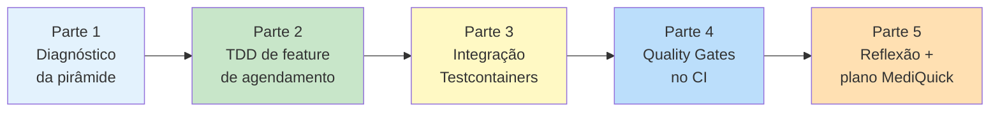

# Exercícios Progressivos — Módulo 3

Os exercícios progressivos são a **oficina** do módulo. Diferente dos exercícios de cada bloco (conceituais, curtos), aqui você **constrói software real** da MediQuick em **5 partes encadeadas**. Ao final, você terá um repositório pronto para a [entrega avaliativa](../entrega-avaliativa.md).

---

## Visão geral

| # | Título | Tempo | Entregável |
|---|--------|-------|------------|
| 1 | [Diagnóstico da pirâmide atual](parte-1-diagnostico-piramide.md) | 30 min | Análise escrita + diagrama |
| 2 | [TDD do serviço de Agendamento](parte-2-tdd-agendamento.md) | 1h 30min | Código + testes + 3 commits (Red-Green-Refactor) |
| 3 | [Integração com Testcontainers](parte-3-integracao-testcontainers.md) | 1h | Testes + conftest |
| 4 | [Quality Gates no pipeline CI](parte-4-quality-gates-ci.md) | 1h | `.github/workflows/ci.yml` + 1 PR falhando, 1 PR passando |
| 5 | [Reflexão e plano MediQuick](parte-5-reflexao-plano.md) | 30 min | Documento de estratégia (1 a 2 páginas) |

**Tempo total estimado:** ~4h 30min (dentro da carga do módulo de 5h).

---

## Pré-requisitos técnicos

- **Python 3.11+**
- **Git**
- **Docker** (para Parte 3 — Testcontainers)
- **GitHub** (para Parte 4 — Actions)
- Ambiente virtual Python configurado (ver [README principal](../README.md#setup-do-ambiente-uma-vez-por-máquina))

---

## Filosofia

Estes exercícios **não são avaliados isoladamente**; eles **constituem a entrega**:

- O **diagnóstico** (Parte 1) vira a seção "Análise da pirâmide atual" do documento de estratégia.
- O **código TDD** (Parte 2) é a base do repositório da entrega.
- Os **testes de integração** (Parte 3) compõem a camada de integração da suíte.
- O **pipeline** (Parte 4) é o `.github/workflows/ci.yml` da entrega.
- A **reflexão** (Parte 5) vira o corpo do documento de estratégia.

Você **pode** fazer as partes fora de ordem, mas a ordem apresentada **minimiza retrabalho**.

---

## Como usar este material

- Cada parte tem: **objetivo**, **passos detalhados**, **critérios de pronto** e **dicas/armadilhas comuns**.
- Há **espaço para exploração** — o tempo sugerido assume uma primeira tentativa; faça mais se quiser.
- **Commite frequentemente** — para a Parte 2, seus commits **são prova** do processo TDD.

---

## Próximo passo

Comece pela **[Parte 1 — Diagnóstico da pirâmide atual](parte-1-diagnostico-piramide.md)**.

---

<!-- nav:start -->

**Navegação — Módulo 3 — Testes e qualidade de software**

- ← Anterior: [Exercícios Resolvidos — Bloco 4](../bloco-4/04-exercicios-resolvidos.md)
- → Próximo: [Parte 1 — Diagnóstico da Pirâmide Atual da MediQuick](parte-1-diagnostico-piramide.md)
- ↑ Índice do módulo: [Módulo 3 — Testes e qualidade de software](../README.md)

<!-- nav:end -->
