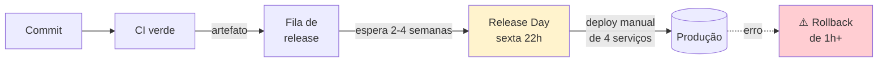

# Cenário PBL — Problema Norteador do Módulo

Este módulo é guiado por um **problema real** (PBL — Problem-Based Learning). O conteúdo teórico e os exercícios estão a serviço de **responder à pergunta norteadora** ao final.

---

## A empresa: LogiTrack

A **LogiTrack** é uma plataforma de **rastreamento logístico**: empresas transportadoras plugam na API, e pacientes/clientes acompanham a entrega em tempo real. Tem 6 anos de mercado, **200 mil pacotes rastreados por dia** (pico de ~8k/min) e **45 transportadoras parceiras**.

A arquitetura é composta por 4 serviços principais:

- **Tracking API** (Python/FastAPI) — recebe eventos de posição das transportadoras.
- **Consulta** (Python/FastAPI) — entrega o rastreamento ao consumidor final.
- **Notificações** (Python worker + Redis) — envia SMS/e-mail/push.
- **Billing** (Python/FastAPI) — fatura transportadoras pelo volume processado.

Há um **frontend** (React, fora do escopo) e um **Postgres** para cada serviço principal.

---

## O contexto técnico atual

A LogiTrack passou pelos Módulos 1, 2 e 3 da disciplina — portanto:

- **Cultura** está razoável: postmortems sem culpa, rituais definidos.
- **CI** funciona: GitHub Actions rodando em cada push.
- **Testes** existem: pirâmide saudável em dois dos quatro serviços, os outros estão em evolução.

**Mas entregar para produção ainda é um pesadelo.**

---

## Sintomas observados

| # | Sintoma | Detalhe |
|---|---------|---------|
| 1 | **Release mensal** | Um deploy em produção a cada **3 a 4 semanas**. "Release day" é sexta-feira, 22h. |
| 2 | **Deploy manual** | Um SRE sênior (Marcos) faz o deploy. Lê um runbook em Confluence de 87 passos. Demora 2h30 quando corre bem. |
| 3 | **Artefatos recompilados** | O pipeline que vai para staging **recompila** o código; depois o pipeline que vai para produção **recompila de novo**. **3 binários distintos** viajam — com o mesmo commit. |
| 4 | **Ambientes divergentes** | Staging roda Python 3.10. Produção roda 3.11. Staging tem 1 réplica; produção tem 8. A configuração é **copiada à mão** entre ambientes. |
| 5 | **Sem rollback real** | Se o deploy quebrar, a equipe restaura o banco do backup da manhã (sim, perdendo até 12h de dados) e faz novo deploy da versão anterior. Duração: **60 a 120 min**. |
| 6 | **Friday deploy freeze... que não é respeitado** | Por regra interna, "não deployar sexta". Mas a fila de releases pressiona — na prática, **80% das releases acontecem sexta à noite**. |
| 7 | **Release train mental** | Features ficam paradas 2 a 4 semanas esperando a **janela**. Mudança de 3 linhas espera o mesmo tempo que mudança de 3 mil. |
| 8 | **Sem feature flags** | Se uma feature vai ser liberada parcialmente, a equipe copia o código para um branch, espera o release, deploya, e aí tira o branch de volta. Código real de flags: **zero**. |
| 9 | **Config drift** | A transportadora X tem um parâmetro especial em produção que **ninguém documentou**. Toda vez que o app é reconfigurado, quebra para a X até alguém lembrar. |
| 10 | **Deploy anxiety generalizada** | Release day tem pizza (romantizou o pesadelo). O time diz: "melhor não mexer". Dias antes da release, **dev para de mergear PR arriscado**. |

---

## Impacto nos negócios

O diretor de produto levou para a reunião executiva:

- **Deploys por semana: 0,25** (1 a cada 4 semanas). Benchmark DORA: times "elite" → **múltiplos por dia**.
- **Lead time for changes: 25 dias** (tempo entre merge em main e produção). Benchmark elite: **< 1 dia**.
- **Change failure rate: 18%** (quase 1 em cada 5 deploys causa incidente). Elite: **0 a 15%**.
- **MTTR: 90 minutos**. Elite: **< 1 hora**.
- **12 features prontas** aguardando release no momento; 2 delas são **contratos firmados** com transportadoras que dependem da feature.
- **O maior cliente (Transportadora Gamma)** ameaçou migrar para concorrente se "o bug do cálculo de rota" não for corrigido em 5 dias. A correção já está em `main` há 3 dias. Aguarda a próxima release — em 18 dias.

---

## O que a liderança quer

A nova VP de engenharia (ex-Netflix) foi direta:

> *"Em 6 meses quero **deploy diário** como normal, **não evento**. Quero **release separado do deploy** — deploy é técnico, release é de produto. E quero que **rollback** seja clicar um botão, não uma operação de guerra."*

Metas declaradas:

- **Deploy frequency**: de 0,25/semana → **≥ 5/semana** (ou 1/dia).
- **Lead time**: de 25 dias → **< 24 horas**.
- **Change failure rate**: de 18% → **< 10%**.
- **MTTR**: de 90 min → **< 15 min** (via rollback automatizado).
- **Extinguir "release day"**: deploy fora de janela, com feature flag para liberação gradual.
- **Artefato único imutável**: o mesmo binário que roda em staging vai para produção.

---

## Pergunta norteadora

> **Como transformar o processo de entrega da LogiTrack para que deploy seja rotina segura — e não evento tenso — construindo confiança suficiente para liberar valor ao usuário várias vezes por dia?**

Esta pergunta exige articular:

1. **Diagnóstico** do pipeline atual — onde está cada gargalo (em Lead Time, em Change Failure Rate, em MTTR).
2. **Desenho de um deployment pipeline** com promoção de artefato único.
3. **Escolha de estratégia de release** (Blue-Green, Canary, Feature Flags) adequada ao domínio logístico.
4. **Estratégia de rollback e de migração de banco** compatível com deploys frequentes.
5. **Plano de transformação** considerando que **a LogiTrack não pode interromper o serviço** durante a mudança.

---

## Como este cenário aparece nos blocos

| Bloco | Lente sobre a LogiTrack |
|-------|--------------------------|
| **Bloco 1** — CI / CDelivery / CDeployment | Classificar onde a LogiTrack está hoje e para onde quer ir. Métricas DORA. |
| **Bloco 2** — Deployment Pipeline | Reconstruir o pipeline com "build once, deploy many" e promoção de artefatos. |
| **Bloco 3** — Estratégias de release | Escolher Blue-Green ou Canary; introduzir Feature Flags para separar deploy de release. |
| **Bloco 4** — Release engineering | Versionamento, rollback automatizado, migrations compatíveis com CD. |

E os **exercícios progressivos** vão exigir que você **construa código real**: um workflow de múltiplos estágios, feature flags em Python, plano de rollback, etc.

---

## Próximo passo

Leia o **[Bloco 1 — CI vs. Continuous Delivery vs. Continuous Deployment](bloco-1/01-ci-cd-deployment.md)** para estabelecer os conceitos fundamentais antes de desenhar o pipeline.

---

<!-- nav:start -->

| &nbsp; | &nbsp; | &nbsp; |
|:--|:--:|--:|
| **← Anterior** [Módulo 4 — Entrega Contínua (Continuous Delivery)](README.md) | **↑ Índice** [Módulo 4 — Entrega contínua](README.md) | **Próximo →** [Bloco 1 — CI vs. Continuous Delivery vs. Continuous Deployment](bloco-1/01-ci-cd-deployment.md) |

<!-- nav:end -->
