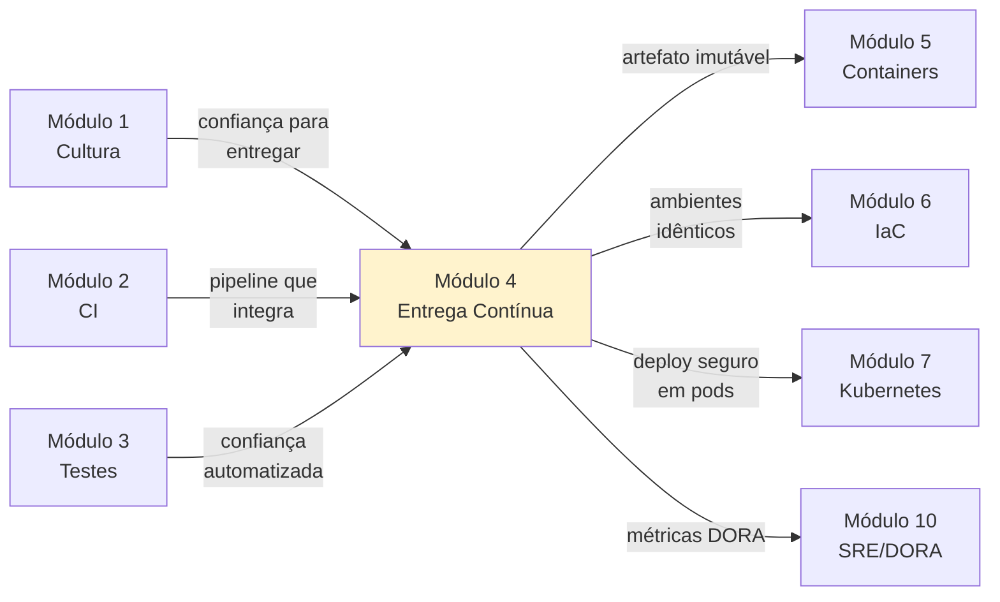

# Módulo 4 — Entrega Contínua (Continuous Delivery)

**Carga horária:** 5 horas
**Nível:** Graduação (ensino superior)
**Pré-requisitos:** Módulos 1 (Cultura), 2 (CI) e 3 (Testes)

---

## Por que este módulo vem aqui

Você já tem **cultura** (Módulo 1), **CI que integra a cada push** (Módulo 2) e **uma suíte de testes com quality gates** (Módulo 3). Na teoria, tudo está pronto para entregar. **Na prática, não está.**

O que falta é o **pipeline de entrega** — a disciplina de levar o artefato testado até a produção de forma **frequente, segura e reversível**. Este módulo fecha o ciclo: transforma "código verde" em "valor entregue ao usuário".

> **Humble & Farley (2014):** *"Software should be ready to release at any time, throughout its development lifecycle."* É exatamente isso — qualquer commit na `main` **deveria poder ir para produção** sem pânico.

---

## Objetivos de Aprendizagem

Ao final do módulo, você será capaz de:

- **Distinguir** com precisão **CI**, **Continuous Delivery** e **Continuous Deployment**.
- **Desenhar** um **deployment pipeline** com múltiplos estágios e promoção de artefatos.
- **Aplicar** o princípio **"build once, deploy many"** — artefatos imutáveis promovidos entre ambientes.
- **Escolher** entre estratégias de release: **Blue-Green**, **Canary**, **Rolling** e **Feature Flags**.
- **Implementar** **feature flags** em Python para separar *release* de *deployment*.
- **Desenhar** estratégia de **rollback** e **migrations expand/contract** compatíveis com CD.
- **Avaliar** maturidade do pipeline com as **métricas DORA** (Deployment Frequency, Lead Time for Changes).
- **Diagnosticar** anti-padrões: sexta sem deploy, release train, big-bang, config drift.

---

## Estrutura do Material

Mesma estrutura dos módulos anteriores: **4 blocos teóricos** + **5 exercícios progressivos** em PBL.

| Ordem | Conteúdo | Arquivo(s) |
|-------|----------|------------|
| 0 | Cenário PBL (LogiTrack) | [00-cenario-pbl.md](00-cenario-pbl.md) |
| 1 | CI vs. Continuous Delivery vs. Continuous Deployment | [bloco-1/01-ci-cd-deployment.md](bloco-1/01-ci-cd-deployment.md) · [exercícios](bloco-1/01-exercicios-resolvidos.md) |
| 2 | Deployment Pipeline: construção e promoção | [bloco-2/02-deployment-pipeline.md](bloco-2/02-deployment-pipeline.md) · [exercícios](bloco-2/02-exercicios-resolvidos.md) |
| 3 | Estratégias de release: Blue-Green, Canary, Feature Flags | [bloco-3/03-estrategias-release.md](bloco-3/03-estrategias-release.md) · [exercícios](bloco-3/03-exercicios-resolvidos.md) |
| 4 | Release engineering, versionamento e rollback | [bloco-4/04-release-engineering.md](bloco-4/04-release-engineering.md) · [exercícios](bloco-4/04-exercicios-resolvidos.md) |
| 5 | Exercícios progressivos (5 partes) | [exercicios-progressivos/](exercicios-progressivos/) |
| 6 | Entrega avaliativa | [entrega-avaliativa.md](entrega-avaliativa.md) |
| — | Referências bibliográficas | [referencias.md](referencias.md) |

---

## Como Estudar

1. **Comece pelo cenário PBL** — a LogiTrack é uma empresa de logística com crise de releases.
2. **Siga a ordem dos blocos** — cada bloco tem artefatos executáveis (workflows, scripts, feature flags).
3. **Tenha Python 3.10+**, **Git** e **GitHub**. Para os exercícios progressivos, **Docker** ajuda mas não é obrigatório.
4. **Execute e modifique** os workflows. Pipeline não se aprende lendo; se aprende quebrando e consertando.
5. **Faça os exercícios resolvidos** após cada bloco.
6. **Execute os exercícios progressivos** — cada um produz artefatos reais para a LogiTrack.

### Setup do ambiente (uma vez por máquina)

```bash
python3 -m venv .venv
source .venv/bin/activate       # Linux/macOS
# .venv\Scripts\activate        # Windows PowerShell

pip install --upgrade pip
pip install -r requirements.txt
```

O `requirements.txt` consolidado está em [requirements.txt](requirements.txt).

---

## Ideia Central do Módulo

| Conceito | Significado |
|----------|-------------|
| **Continuous Delivery** | Software **pode** ir para produção a qualquer momento — decisão é de negócio, não técnica |
| **Continuous Deployment** | Cada commit verde **vai** para produção, automaticamente |
| **Deployment Pipeline** | Esteira de múltiplos estágios que promove o MESMO artefato imutável |
| **Release ≠ Deployment** | Deployment coloca código em produção; release expõe ao usuário. Feature flags permitem separá-los. |
| **Rollback reversível** | Capacidade de desfazer um deploy em minutos — pré-requisito para deploys frequentes |

> Pipeline de entrega **não é ferramenta**, é **disciplina codificada**. A ferramenta (GitHub Actions, GitLab CI, Argo CD) é substituível; a disciplina é o que transforma.

---

## Conexão com o restante da disciplina



---

## O que este módulo NÃO cobre

- **Infrastructure as Code** em profundidade — Módulo 6.
- **Containers** e empacotamento Docker — Módulo 5 (este módulo usa Docker como preview, sem aprofundar).
- **Kubernetes** deploy, Helm, Argo CD — Módulo 7.
- **SRE, SLOs, Error Budget** — Módulo 10.

Aqui tratamos do **pipeline de entrega em si**: como construir, como promover artefatos, como liberar com segurança. O **onde** roda (servidor, contêiner, cluster) é parcialmente dos próximos módulos.

---

*Material alinhado a: Continuous Delivery (Humble & Farley), The DevOps Handbook (Kim et al.), Release It! (Nygard), Accelerate (Forsgren, Humble, Kim), Google SRE Book (Beyer et al.), Feature Toggles (Hodgson/Fowler).*

---

<!-- nav:start -->

**Navegação — Módulo 4 — Entrega contínua**

- ← Anterior: [Referências Bibliográficas — Módulo 3](../03-testes-qualidade/referencias.md)
- → Próximo: [Cenário PBL — Problema Norteador do Módulo](00-cenario-pbl.md)

<!-- nav:end -->
