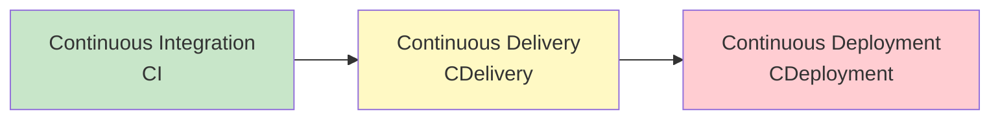
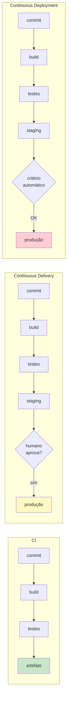

# Bloco 1 — CI vs. Continuous Delivery vs. Continuous Deployment

> **Duração estimada:** 50 a 60 minutos. Inclui um calculador Python de maturidade DORA.

"**CI/CD**" é o termo mais ambíguo do vocabulário DevOps. Pergunte a cinco engenheiros o que ele significa e você ganhará cinco respostas parcialmente certas. Este bloco **limpa a confusão** e posiciona a LogiTrack num espectro concreto.

---

## 1. O vocabulário: três conceitos distintos

Três ideias que o acrônimo **CI/CD** mistura:



Cada um é **superconjunto** do anterior. Você **não pode** fazer Continuous Deployment sem Continuous Delivery. Não pode fazer Continuous Delivery sem Continuous Integration.

---

### 1.1 Continuous Integration (CI)

**Definição (Fowler):** prática de **integrar** trabalho de desenvolvedores **em uma ramificação principal várias vezes por dia**, acompanhada de um **build automatizado** e **conjunto de testes** que rodam a cada integração.

**O que entrega:**

- Branches não divergem.
- "O build está verde?" é uma pergunta com resposta objetiva.
- Problemas de integração aparecem em **minutos**, não semanas.

**O que NÃO entrega (sozinho):**

- Software pronto para produção.
- Deploy automatizado.
- Confiança para liberar ao usuário.

> Foi o conteúdo do **Módulo 2** (versionamento + CI) e do **Módulo 3** (testes automatizados e quality gates).

### 1.2 Continuous Delivery (CDelivery)

**Definição (Humble & Farley):** disciplina de manter o software em estado **sempre pronto para ser liberado** a qualquer momento.

**Elementos distintivos sobre CI:**

- Pipeline multi-estágio até produção (dev → staging → prod).
- Artefato imutável construído uma vez.
- **Promoção automática** até o estágio anterior a produção.
- **A decisão de fazer o deploy** em produção é **de negócio** — técnicamente, já está pronto.

**O que entrega:**

- Qualquer commit na main **pode** ir para produção **hoje**.
- Lead time para mudanças despenca.
- Deploy vira **ato cotidiano**, não evento.

**O que NÃO entrega:**

- Deploy **automaticamente** em produção. Um humano (ou critério de negócio) ainda aprova.

### 1.3 Continuous Deployment (CDeployment)

**Definição:** todo commit verde **na main** é **deployado automaticamente** em produção, **sem intervenção humana**.

**O "salto" sobre CDelivery:**

- Não há aprovação manual para prod.
- Critério de "promover ou não" é **totalmente automatizado** (smoke tests, health checks, canary, feature flags).

**O que entrega:**

- Frequência máxima de deploy — cada commit vira deploy.
- Feedback em tempo real do usuário real.
- Organizações como **Amazon** (milhões/dia), **Netflix** (milhares/dia), **Etsy** (dezenas/dia) vivem aqui.

**O que exige:**

- **Cultura madura** (Módulo 1).
- **Testes de altíssima qualidade** (Módulo 3) — não há humano revisando.
- **Observabilidade em tempo real** (Módulo 10).
- **Feature flags** para separar deploy de release (Bloco 3 deste módulo).

### 1.4 Resumo visual



---

## 2. Onde a LogiTrack está hoje?

Usando os sintomas do [cenário PBL](../00-cenario-pbl.md):

| Pergunta | Resposta para LogiTrack | Estado |
|----------|-------------------------|--------|
| Existe pipeline que roda a cada push? | Sim (CI do Módulo 2) | ✅ CI |
| O artefato que vai para staging é o mesmo que vai para produção? | **Não** — recompila em cada etapa | ❌ CDelivery |
| Qualquer commit na main pode ir para produção hoje? | **Não** — há fila mensal de 2 a 4 semanas | ❌ CDelivery |
| Deploy é automatizado? | **Não** — SRE executa 87 passos manuais | ❌ CDelivery |
| Cada commit verde vai para produção? | **Muito não** | ❌ CDeployment |

**Veredito:** LogiTrack tem **CI básico** e está **longe** de Continuous Delivery. A meta da VP — "deploy diário" — exige cruzar para CDelivery, com opção de ir a CDeployment nos serviços mais maduros (ex.: Consulta, que só lê).

**É realista em 6 meses?** Sim, para CDelivery. Continuous Deployment completo é 12 a 24 meses em empresas comparáveis.

---

## 3. A pesquisa DORA — por que isso importa

**DORA** (DevOps Research and Assessment, fundada por Nicole Forsgren, Jez Humble e Gene Kim) publica o **State of DevOps Report** anualmente desde 2014. A base é rigorosa: tipicamente **30 mil+ respostas** por ano.

A pesquisa identificou **4 métricas** que separam times de alta performance de times de baixa performance — e correlacionam com **performance de negócio** (velocidade de entrega, lucro, satisfação).

### 3.1 As 4 métricas DORA

| Métrica | O que mede | Como calcular |
|---------|------------|---------------|
| **Deployment Frequency (DF)** | Com que frequência o time deploya para produção | Deploys ÷ período |
| **Lead Time for Changes (LT)** | Tempo entre um commit em `main` e ir para produção | Diferença `prod_deployed_at - committed_at` |
| **Change Failure Rate (CFR)** | % de deploys que causam incidente/rollback/hotfix | Deploys com falha ÷ total de deploys |
| **Mean Time to Restore (MTTR)** | Tempo médio para restaurar serviço após incidente | Média de `restored_at - incident_started_at` |

> **Por que essas 4?** Forsgren et al. (2018, *Accelerate*) demonstram estatisticamente que **velocidade** (DF, LT) e **estabilidade** (CFR, MTTR) **não** são opostas — times elite **melhoram ambas simultaneamente**.

### 3.2 Benchmarks (State of DevOps 2023)

| Métrica | Elite | High | Medium | Low |
|---------|-------|------|--------|-----|
| **DF** | On-demand (múltiplos/dia) | 1/dia – 1/semana | 1/semana – 1/mês | < 1/mês |
| **LT** | < 1 hora | 1 dia – 1 semana | 1 semana – 1 mês | 1 – 6 meses |
| **CFR** | 0 – 15% | 0 – 15% | 16 – 30% | 16 – 30% |
| **MTTR** | < 1 hora | < 1 dia | 1 dia – 1 semana | 1 semana – 1 mês |

### 3.3 Onde a LogiTrack se encaixa?

| Métrica | LogiTrack atual | Tier |
|---------|------------------|------|
| DF | 0,25/semana (1/mês) | **Low** |
| LT | 25 dias | **Low** |
| CFR | 18% | **Medium** |
| MTTR | 90 min | **Medium** |

Diagnóstico: **Low performer** em velocidade, **Medium** em estabilidade. A meta é subir para **High** em 6 meses, **Elite** em 18 a 24 meses nos serviços mais maduros.

### 3.4 Armadilha comum: medir o ruim

Algumas organizações medem DF "corretamente" mas **inflacionam o número** contando:

- Deploys para ambientes não-produtivos (staging conta como deploy? **Não.**)
- Reloads de configuração (conta? **Não.**)
- Hotfixes manuais (conta, e **ainda piora** o CFR).

E medem MTTR **excluindo** incidentes curtos ("foi só 3 minutos, nem abriu chamado"). O rigor da DORA exige **definições compartilhadas** — e um script simples ajuda.

---

## 4. Calculadora DORA em Python

Script que recebe eventos de deploy e incidente e calcula as 4 métricas.

### `calc_dora.py`

```python
"""Calculadora simples das 4 métricas DORA.

Entrada: 2 arquivos CSV.
  deploys.csv:   committed_at,deployed_at,succeeded   (ISO 8601)
  incidentes.csv: started_at,restored_at              (ISO 8601)

Uso:
  python calc_dora.py deploys.csv incidentes.csv --periodo-dias 30
"""
from __future__ import annotations

import argparse
import csv
import statistics
import sys
from dataclasses import dataclass
from datetime import datetime, timedelta
from pathlib import Path


@dataclass
class Deploy:
    committed_at: datetime
    deployed_at: datetime
    succeeded: bool

    @property
    def lead_time_segundos(self) -> float:
        return (self.deployed_at - self.committed_at).total_seconds()


@dataclass
class Incidente:
    started_at: datetime
    restored_at: datetime

    @property
    def duracao_segundos(self) -> float:
        return (self.restored_at - self.started_at).total_seconds()


def _parse_iso(s: str) -> datetime:
    return datetime.fromisoformat(s.strip())


def carregar_deploys(path: Path) -> list[Deploy]:
    rows = []
    with path.open(newline="") as f:
        reader = csv.DictReader(f)
        for r in reader:
            rows.append(
                Deploy(
                    committed_at=_parse_iso(r["committed_at"]),
                    deployed_at=_parse_iso(r["deployed_at"]),
                    succeeded=r["succeeded"].strip().lower() in {"true", "1", "yes", "sim"},
                )
            )
    return rows


def carregar_incidentes(path: Path) -> list[Incidente]:
    rows = []
    with path.open(newline="") as f:
        reader = csv.DictReader(f)
        for r in reader:
            rows.append(
                Incidente(
                    started_at=_parse_iso(r["started_at"]),
                    restored_at=_parse_iso(r["restored_at"]),
                )
            )
    return rows


def tier_df(deploys_por_dia: float) -> str:
    # Baseado em State of DevOps 2023
    if deploys_por_dia >= 1.0:
        return "Elite (múltiplos por dia)"
    if deploys_por_dia >= (1 / 7):
        return "High (entre 1/dia e 1/semana)"
    if deploys_por_dia >= (1 / 30):
        return "Medium (entre 1/semana e 1/mês)"
    return "Low (< 1/mês)"


def tier_lt(mediana_segundos: float) -> str:
    if mediana_segundos < 3600:
        return "Elite (< 1 hora)"
    if mediana_segundos < 86400 * 7:
        return "High (1 dia a 1 semana)"
    if mediana_segundos < 86400 * 30:
        return "Medium (1 semana a 1 mês)"
    return "Low (> 1 mês)"


def tier_cfr(cfr: float) -> str:
    if cfr <= 0.15:
        return "Elite/High (<= 15%)"
    if cfr <= 0.30:
        return "Medium (16-30%)"
    return "Low (> 30%)"


def tier_mttr(mediana_segundos: float) -> str:
    if mediana_segundos < 3600:
        return "Elite (< 1 hora)"
    if mediana_segundos < 86400:
        return "High (< 1 dia)"
    if mediana_segundos < 86400 * 7:
        return "Medium (1 dia a 1 semana)"
    return "Low (> 1 semana)"


def formatar_duracao(segundos: float) -> str:
    if segundos < 60:
        return f"{segundos:.0f}s"
    if segundos < 3600:
        return f"{segundos/60:.1f} min"
    if segundos < 86400:
        return f"{segundos/3600:.1f} h"
    return f"{segundos/86400:.1f} dias"


def calcular(
    deploys: list[Deploy],
    incidentes: list[Incidente],
    periodo_dias: int,
) -> dict:
    if not deploys:
        return {"erro": "sem deploys no período"}

    # 1) Deployment Frequency
    total_deploys = len(deploys)
    df_por_dia = total_deploys / periodo_dias

    # 2) Lead Time (mediana)
    lts = [d.lead_time_segundos for d in deploys]
    lt_mediana = statistics.median(lts)

    # 3) CFR
    falhas = sum(1 for d in deploys if not d.succeeded)
    cfr = falhas / total_deploys

    # 4) MTTR
    if incidentes:
        duracoes = [i.duracao_segundos for i in incidentes]
        mttr = statistics.mean(duracoes)
    else:
        mttr = 0.0

    return {
        "deploys_total": total_deploys,
        "deploys_por_dia": df_por_dia,
        "tier_df": tier_df(df_por_dia),
        "lt_mediana_segundos": lt_mediana,
        "tier_lt": tier_lt(lt_mediana),
        "cfr": cfr,
        "tier_cfr": tier_cfr(cfr),
        "mttr_segundos": mttr,
        "tier_mttr": tier_mttr(mttr),
    }


def imprimir_relatorio(r: dict, periodo_dias: int) -> None:
    print(f"=== Métricas DORA — período de {periodo_dias} dias ===\n")
    if "erro" in r:
        print(r["erro"])
        return
    print(f"Deploys no período          : {r['deploys_total']}")
    print(f"Deployment Frequency        : {r['deploys_por_dia']:.3f} por dia → {r['tier_df']}")
    print(f"Lead Time (mediana)         : {formatar_duracao(r['lt_mediana_segundos'])} → {r['tier_lt']}")
    print(f"Change Failure Rate         : {r['cfr']*100:.1f}% → {r['tier_cfr']}")
    print(f"MTTR (média)                : {formatar_duracao(r['mttr_segundos'])} → {r['tier_mttr']}")


def main(argv: list[str] | None = None) -> int:
    p = argparse.ArgumentParser()
    p.add_argument("deploys_csv")
    p.add_argument("incidentes_csv")
    p.add_argument("--periodo-dias", type=int, default=30)
    args = p.parse_args(argv)

    deploys = carregar_deploys(Path(args.deploys_csv))
    incidentes = carregar_incidentes(Path(args.incidentes_csv))

    resultado = calcular(deploys, incidentes, args.periodo_dias)
    imprimir_relatorio(resultado, args.periodo_dias)
    return 0


if __name__ == "__main__":
    sys.exit(main())
```

### Dados simulados da LogiTrack

`deploys.csv`:

```csv
committed_at,deployed_at,succeeded
2026-03-02T14:10:00,2026-03-27T22:30:00,true
2026-03-30T09:15:00,2026-04-24T22:45:00,false
```

`incidentes.csv`:

```csv
started_at,restored_at
2026-04-24T22:50:00,2026-04-25T00:20:00
```

### Rodando

```bash
python calc_dora.py deploys.csv incidentes.csv --periodo-dias 60
```

Saída esperada:

```
=== Métricas DORA — período de 60 dias ===

Deploys no período          : 2
Deployment Frequency        : 0.033 por dia → Medium (entre 1/semana e 1/mês)
Lead Time (mediana)         : 25.5 dias → Medium (1 semana a 1 mês)
Change Failure Rate         : 50.0% → Low (> 30%)
MTTR (média)                : 1.5 h → High (< 1 dia)
```

> **Nota:** o CSV de exemplo tem apenas **2 deploys em 60 dias** (amostra pequena para ilustração). A LogiTrack real teria ~8 deploys em 60 dias (1 a cada 3-4 semanas). Com uma amostra maior, o tier de DF cairia para **Low**, e o MTTR ficaria **Medium** quando o histórico incluísse incidentes mais longos. **Métricas DORA exigem 30 a 90 dias de dados** para serem confiáveis.

---

## 5. Princípios da Continuous Delivery (Humble & Farley)

Humble e Farley (2014) listam **princípios** que guiam um pipeline de entrega. Os 5 mais importantes para este módulo:

### 5.1 Processo de release repetível e confiável

Se o deploy é **diferente** a cada vez — um SRE "faz manual quando dá certo" — não é confiável. Repetível implica **automatizado** ou ao menos **totalmente documentado e padronizado**.

### 5.2 Automatize quase tudo

Humano em loop só onde há decisão de negócio (ir para prod? deploy de feature para 100% dos usuários?). Tudo o resto automático.

### 5.3 Mantenha tudo em controle de versão

- Código ✅ (óbvio)
- Testes ✅ (Módulo 3)
- **Pipeline** — infra do pipeline como código
- **Configuração por ambiente** — sim, mas com **secrets** separados
- **Migrations de banco** — versionadas (Bloco 4)
- **Infraestrutura** — Módulo 6 (IaC)

### 5.4 Se dói, faça com mais frequência

**Contraintuitivo mas poderoso.** Na LogiTrack, o pressuposto é: "deploy dói, então menos deploys". Humble inverte: **porque dói, faça mais vezes** — os problemas que emergem forçam automação.

### 5.5 Construa qualidade para dentro

Qualidade não é inspecionada no final — é **construída em cada passo**. Este princípio amarra Módulo 3 + Módulo 4: **testes + pipeline + feature flags** fazem qualidade emergir.

---

## 6. Anti-padrões clássicos

### 6.1 Friday deploy freeze

"Não deploya sexta." **Sintoma 6 da LogiTrack.**

**Por que vira anti-padrão?** Se você não pode deployar sexta, a **fila** empurra para outras janelas — ou, ironicamente, **empurra para sexta** (só há janela lá). O problema real é: **deploy não é seguro**.

**A solução não é proibir sexta**; é **tornar deploy seguro** (feature flags, rollback automatizado, canary) — daí você pode deployar **terça 14h** sem medo. Elite performers deployam **a qualquer hora**.

### 6.2 Release train

"Todos os deploys acontecem na sexta às 22h, juntos."

**Problema:** ata 2 features rápidas aos atrasos de 5 features lentas. Todas esperam a mais lenta. Aumenta lote (anti-padrão do Módulo 1, Bloco 3 — "Lei do lote pequeno").

**Solução:** desamarrar. Cada feature deploya quando fica pronta. Release train vira "dono faz merge, pipeline conduz".

### 6.3 Big-bang release

"A versão 2.0 junta 6 meses de mudança. Vai no mesmo deploy."

**Problema:** quando der errado, é **impossível** diagnosticar qual das 300 mudanças quebrou. CFR explode.

**Solução:** deploy pequeno, frequente, incremental. Feature flag para liberação em etapas.

### 6.4 "Só a VP Ops aprova deploys"

Gate de aprovação por uma pessoa que não conhece o que mudou. Viola fluxo do Primeiro Caminho.

**Solução:** aprovações por **critério automático** (smoke test passou? canary saudável?) e por **quem tem contexto** — dona da feature, não gerente genérico.

### 6.5 Staging que mente

Staging "parece" produção mas:

- Tem 10× menos tráfego → latência diferente.
- Usa dados mock → bug aparece só com dados reais.
- Tem config manual divergente → "funciona em staging, quebra em prod".

**Sintoma 4 da LogiTrack.** Solução: gerenciar ambientes como código (Módulo 6).

---

## 7. Aplicação ao cenário da LogiTrack

| Sintoma LogiTrack | Lente do Bloco 1 |
|-------------------|-------------------|
| 1 — Release mensal | DF no tier **Low**; quer subir para **High**. |
| 2 — Deploy manual de 87 passos | Viola "automatize quase tudo". |
| 3 — Artefatos recompilados | Viola "build once, deploy many" (Bloco 2). |
| 5 — Sem rollback real | MTTR no tier **Medium**; quer tier **Elite** (<1h). |
| 6 — Friday freeze que não é respeitado | Anti-padrão; solução é deploy seguro, não proibir dia. |
| 7 — Release train | Anti-padrão; lotes pequenos fluem. |
| 10 — Deploy anxiety | Sintoma de medo; **a resposta é confiança construída pelo pipeline**. |

---

## Resumo do bloco

- **CI** ≠ **Continuous Delivery** ≠ **Continuous Deployment**. Saber distinguir é ponto de partida.
- **CDelivery:** software **pode** ir para prod a qualquer momento; decisão é de negócio.
- **CDeployment:** cada commit verde **vai** para prod automaticamente.
- **DORA** mede maturidade via **4 métricas**: DF, LT, CFR, MTTR.
- LogiTrack hoje é **Low performer** em DF/LT, Medium em CFR/MTTR.
- Princípios (Humble & Farley): repetível, automatizado, versionado, "se dói faz mais", qualidade embutida.
- Anti-padrões: freeze de sexta, release train, big-bang, staging que mente, aprovação por quem não tem contexto.

---

## Próximo passo

- Faça os **[exercícios resolvidos do Bloco 1](01-exercicios-resolvidos.md)**.
- Depois avance para o **[Bloco 2 — Deployment Pipeline](../bloco-2/02-deployment-pipeline.md)**.

---

## Referências deste bloco

- **Humble, J.; Farley, D.** *Entrega Contínua.* Alta Books. Cap. 1 e 5. (`books/Entrega Contínua.pdf`)
- **Kim, G. et al.** *The DevOps Handbook.* Cap. 9, 12. (`books/DevOps_Handbook_Intro_Part1_Part2.pdf`)
- **Forsgren, N.; Humble, J.; Kim, G.** *Accelerate.* IT Revolution, 2018. (Métricas DORA.)
- **DORA State of DevOps 2023 Report:** [cloud.google.com/devops/state-of-devops](https://cloud.google.com/devops/state-of-devops).
- **Fowler, M.** *"ContinuousDelivery."* [martinfowler.com/bliki/ContinuousDelivery.html](https://martinfowler.com/bliki/ContinuousDelivery.html).
- **Fowler, M.** *"ContinuousIntegration."* [martinfowler.com/articles/continuousIntegration.html](https://martinfowler.com/articles/continuousIntegration.html).

---

<!-- nav:start -->

| &nbsp; | &nbsp; | &nbsp; |
|:--|:--:|--:|
| **← Anterior**<br>[Cenário PBL — Problema Norteador do Módulo](../00-cenario-pbl.md) | **↑ Índice**<br>[Módulo 4 — Entrega contínua](../README.md) | **Próximo →**<br>[Exercícios Resolvidos — Bloco 1](01-exercicios-resolvidos.md) |

<!-- nav:end -->
