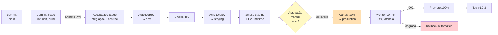

# Exercícios Resolvidos — Bloco 2

Exercícios do Bloco 2 ([Deployment Pipeline e Promoção de Artefatos](02-deployment-pipeline.md)).

---

## Exercício 1 — Identificar violações

Analise o pipeline abaixo (pseudo-YAML). Liste **todas** as violações dos princípios do bloco.

```yaml
jobs:
  build-staging:
    steps:
      - run: python -m build
      - run: ./deploy.sh staging

  build-production:
    needs: build-staging
    steps:
      - run: python -m build
      - run: ./deploy.sh production
```

### Solução

Violações encontradas:

1. **Viola "build once"**: dois jobs (`build-staging`, `build-production`) constroem artefato. O binário que vai para prod **não é** o mesmo que foi testado em staging.
2. **Viola "promote-don't-rebuild"**: o job de produção **reconstrói** em vez de reutilizar artefato.
3. **Falta upload de artefato**: não há `upload-artifact` → impossível promover.
4. **Falta `environment: production`**: sem GitHub Environment, não há gate, secrets segregados ou histórico.
5. **Sem testes entre build e deploy de staging**: deploy acontece direto após build.
6. **Sem smoke tests pós-deploy**: deploy "sucesso" significa apenas "script não quebrou".
7. **Migrations misturadas**: o script `deploy.sh` presumivelmente faz tudo (migrate + deploy). Bloco 4 mostra que **expand/contract** exigem separação.

Rodando o `analisa_pipeline.py` do bloco sobre este arquivo, as violações 1, 3 e 4 seriam detectadas automaticamente.

---

## Exercício 2 — Desenhar o pipeline ideal

A LogiTrack quer refazer o pipeline do **serviço Consulta** (apenas leitura de dados — baixo risco). Desenhe os estágios. Considere:

- Serviço é leitura-pura (sem write em banco, sem migrations).
- Aceitável: 6 deploys por dia na primeira fase, com meta de CDeployment em 6 meses.

Proponha um diagrama Mermaid.

### Solução



**Justificativas das decisões:**

- **Sem migrations** → pipeline mais simples; não há fase expand/contract neste serviço.
- **Canary 10%** em vez de Blue-Green → baixo risco, fração pequena, rollback barato.
- **Aprovação manual na fase 1** — apenas inicialmente. Quando CFR cair abaixo de 10% por 4 semanas consecutivas, a aprovação vira **automática** (baseada em smoke + canary OK).
- **Tag só após 100%** — versão só existe quando está de fato em produção.

---

## Exercício 3 — Separar config do artefato

O artefato `.whl` do serviço de Tracking contém hoje um `config.py` assim:

```python
DATABASE_URL = "postgresql://prod-db:5432/tracking"
LOG_LEVEL = "INFO"
CIRCUIT_BREAKER_BILLING = True
```

Reescreva aplicando 12-Factor III + o padrão do bloco. Depois mostre **como** configurar cada ambiente.

### Solução

**Novo `config.py`:**

```python
from functools import lru_cache
from pydantic import Field
from pydantic_settings import BaseSettings, SettingsConfigDict


class Settings(BaseSettings):
    model_config = SettingsConfigDict(
        env_prefix="LOGITRACK_",
        case_sensitive=False,
    )

    environment: str = Field(..., description="dev | staging | production")
    database_url: str
    log_level: str = "INFO"
    circuit_breaker_billing: bool = True


@lru_cache
def get_settings() -> Settings:
    return Settings()
```

**O artefato .whl não tem mais credenciais.** A configuração vem do ambiente.

**Configurações por ambiente:**

| Variável | dev | staging | production |
|----------|-----|---------|------------|
| `LOGITRACK_ENVIRONMENT` | `dev` | `staging` | `production` |
| `LOGITRACK_DATABASE_URL` | local docker | `$SECRET_STG_DB` | `$SECRET_PROD_DB` |
| `LOGITRACK_LOG_LEVEL` | `DEBUG` | `DEBUG` | `INFO` |
| `LOGITRACK_CIRCUIT_BREAKER_BILLING` | `false` | `true` | `true` |

**Como injetar no GitHub Actions:**

```yaml
jobs:
  deploy-production:
    environment: production     # secrets deste ambiente são expostos
    steps:
      - run: ./deploy.sh
        env:
          LOGITRACK_ENVIRONMENT: production
          LOGITRACK_DATABASE_URL: ${{ secrets.DATABASE_URL }}
          LOGITRACK_LOG_LEVEL: INFO
          LOGITRACK_CIRCUIT_BREAKER_BILLING: "true"
```

**Benefício concreto:** rodar `pytest` local com o mesmo artefato só requer setar `LOGITRACK_ENVIRONMENT=dev` e um Postgres local. **Zero** alteração no código.

---

## Exercício 4 — Escolher estratégia de gate

Para cada cenário, decida o gate adequado e justifique.

| # | Cenário | Gate proposto |
|---|---------|---------------|
| 1 | Deploy para `dev` após passar CI | Automático / Manual? |
| 2 | Deploy para `staging` após passar Acceptance Stage | Automático / Manual? |
| 3 | Deploy para `production` nos **primeiros 3 meses** da jornada CDelivery | Automático / Manual? |
| 4 | Deploy para `production` **após** 6 meses, CFR < 10% sustentado | Automático / Manual? |
| 5 | Deploy para `production` em **serviço regulado** (saúde, financeiro) | Automático / Manual? |

### Solução

| # | Gate | Justificativa |
|---|------|---------------|
| 1 | **Automático** | dev é para o próprio time; experimentação deve ser livre. |
| 2 | **Automático** | staging é o bastidor da CDelivery; se Acceptance passou, staging é quase livre de risco. |
| 3 | **Manual (1 reviewer)** | início da jornada, confiança ainda se constrói. Reviewer = quem tem contexto (dono da feature ou tech lead do serviço). |
| 4 | **Automático, com monitoramento** | amadurecimento permite remover reviewer. Gate passa a ser métricas (smoke OK + canary OK por X min). |
| 5 | **Manual permanente** + 2 aprovadores | compliance exige trilha de auditoria com aprovação humana. Automatizar até aonde puder, mas o **selo humano** é requisito regulatório. |

**Princípio**: gate não é "sempre manual" nem "sempre automático". É **proporcional à confiança** atual e ao **contexto** (regulação, criticidade).

---

## Exercício 5 — Pipeline rápido demais?

Um time orgulha-se: "nosso pipeline completa em **2 minutos**, do commit ao deploy em produção". Investigando:

- Commit Stage: 2 min (lint + 300 unit tests).
- Acceptance Stage: **pulado** ("deixa pra staging").
- Staging: **pulado** ("smoke é ruim mesmo").
- Production: deploy direto, sem canary.

**Problema.** Dê 3 críticas concretas.

### Solução

Crítica 1 — **pipeline rápido mascarando imaturidade**

2 minutos é rápido porque **nada está sendo testado de verdade**. O pipeline não detecta regressão de integração, nem de contrato, nem comportamento em ambiente real. Velocidade vazia.

Crítica 2 — **CDeployment sem rede de segurança**

Deploy direto para produção, sem canary, sem feature flag, sem smoke pós-deploy. Se um commit quebrar, a queda vai para **100% dos usuários imediatamente**. CFR alto é previsível. MTTR vira função da velocidade com que alguém vê no Grafana.

Crítica 3 — **não é CDelivery, é recklessness**

CDelivery (Humble & Farley) exige **confiança construída**. Este pipeline pula as etapas de construção dessa confiança. É o inverso da meta: parece CD, entrega instabilidade.

**Correção mínima:** adicionar Acceptance Stage (subir Postgres com Testcontainers, rodar integração), adicionar canary 10% em prod e smoke pós-deploy. Pipeline passa a durar 12-15 minutos — ainda rápido o suficiente para CDelivery frequente, e **realmente** seguro.

---

## Exercício 6 — Medindo o pipeline

A LogiTrack quer começar a medir o próprio pipeline. Proponha **5 métricas operacionais** do pipeline (não as DORA) e **como coletar**.

### Solução

| # | Métrica | Por quê importa | Como coletar |
|---|---------|------------------|---------------|
| 1 | **Tempo médio do Commit Stage** | Stage lento mata frequência de merge. Meta < 10 min. | GitHub Actions API: `workflow_runs` → `run_started_at` vs `updated_at` do job. |
| 2 | **Taxa de flakiness** (% de runs que falharam e, ao re-rodar sem mudança, passaram) | Flaky normaliza red build e corrói disciplina. | Comparar reruns sobre o mesmo SHA. Se diferente → flaky. |
| 3 | **% de deploys bloqueados por aprovação manual > 1h** | Fila humana indica que gate manual é gargalo — candidato a automatização. | Environment deployments API: `created_at` vs aprovação. |
| 4 | **Tempo médio em fila para promoção staging → prod** | Se alto, staging vira cemitério. | Diferença entre `deployment success` em staging e próximo `deployment created` em prod. |
| 5 | **% de rollbacks automáticos** | Saúde do mecanismo de rollback — baixo demais (0%) pode indicar que critério é frouxo; alto demais (>15%) indica pipeline imaturo. | Log dos scripts de rollback + tag de monitoramento. |

**Cuidado (Goodhart's Law):** medir não vira KPI individual. Métrica operacional serve para **ajustar o pipeline**, não **cobrar pessoas**.

---

## Próximo passo

- Revise o **[Bloco 2](02-deployment-pipeline.md)** se necessário.
- Avance para o **[Bloco 3 — Estratégias de Release](../bloco-3/03-estrategias-release.md)**.

---

<!-- nav:start -->

**Navegação — Módulo 4 — Entrega contínua**

- ← Anterior: [Bloco 2 — Deployment Pipeline e Promoção de Artefatos](02-deployment-pipeline.md)
- → Próximo: [Bloco 3 — Estratégias de Release: Blue-Green, Canary, Rolling e Feature Flags](../bloco-3/03-estrategias-release.md)
- ↑ Índice do módulo: [Módulo 4 — Entrega contínua](../README.md)

<!-- nav:end -->
