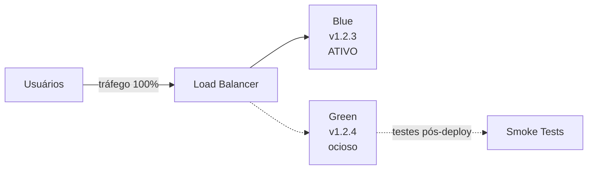
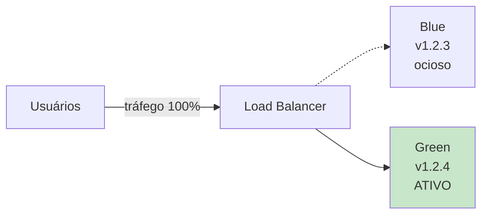
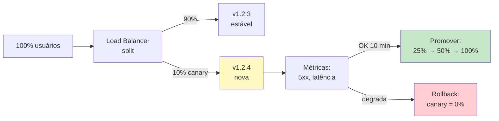
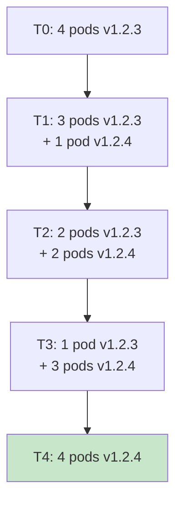
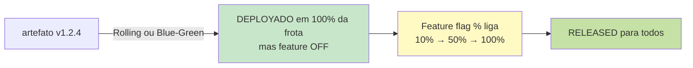

# Bloco 3 — Estratégias de Release: Blue-Green, Canary, Rolling e Feature Flags

> **Duração estimada:** 60 a 70 minutos. Inclui implementação de feature flags em Python.

Pipeline pronto, artefato imutável promovido. Agora a pergunta crítica: **como colocar a nova versão em produção sem derrubar o serviço?**

Este bloco distingue **deploy** de **release** e apresenta as 4 estratégias fundamentais — com código.

---

## 1. Deploy ≠ Release (de novo, agora com profundidade)

No Bloco 1 introduzimos a distinção. Aqui ela vira operacional:

- **Deploy** — ato técnico: **novo código roda em produção**.
- **Release** — ato de produto: **nova funcionalidade está exposta** ao usuário.

As estratégias deste bloco são ferramentas para **separar** essas duas coisas:

| Estratégia | Separa deploy de release? | Como |
|------------|---------------------------|------|
| **Blue-Green** | Não exatamente — muda o "qual versão recebe tráfego" | Dois ambientes, chaveia tráfego |
| **Canary** | Parcialmente — expõe gradualmente | % do tráfego para nova versão |
| **Rolling** | Não — substitui pods/instâncias aos poucos | Atualiza 1, 2, 3... das N instâncias |
| **Feature Flags** | **Sim, totalmente** | Código do deploy fica adormecido até flag virar |

Uma organização madura **combina** várias. Ex.: **Blue-Green para o deploy + Feature Flag para a release** — padrão comum no Netflix, Facebook.

---

## 2. Blue-Green Deployment

**Definição (Fowler, 2010):** dois ambientes de produção idênticos (*Blue* e *Green*). Em qualquer momento, **apenas um** recebe tráfego real. Novo deploy vai para o **ocioso**; quando está pronto, o roteador (load balancer, DNS, proxy) é **chaveado**.

### 2.1 Fluxo



Após validação:



### 2.2 Quando usar

**Bom para:**

- Serviços **stateless** (sem estado local).
- Quando **rollback em segundos** é crítico (basta voltar o chaveamento).
- Migrations compatíveis (expand/contract — Bloco 4).

**Ruim para:**

- Serviços com **estado** no processo (sessões, cache local).
- Custo alto — **dobra infraestrutura** enquanto ambos ambientes existem.
- Migrations destrutivas sem expand/contract (Blue e Green precisam conviver).

### 2.3 Implementação simplificada (script)

Sem orquestrador real (Kubernetes virá no Módulo 7), uma forma simples é **dois docker-compose** + nginx:

```nginx
# nginx.conf
upstream tracking_active {
    server tracking-blue:8000;    # comentar/descomentar para chavear
    # server tracking-green:8000;
}

server {
    listen 80;
    location / {
        proxy_pass http://tracking_active;
    }
}
```

E um script `switch.sh`:

```bash
#!/usr/bin/env bash
set -euo pipefail

TARGET="${1:?uso: switch.sh blue|green}"

if [[ "$TARGET" != "blue" && "$TARGET" != "green" ]]; then
  echo "Uso: $0 blue|green" >&2
  exit 1
fi

cat > /etc/nginx/conf.d/tracking.conf <<EOF
upstream tracking_active {
    server tracking-${TARGET}:8000;
}
server {
    listen 80;
    location / {
        proxy_pass http://tracking_active;
    }
}
EOF

nginx -t && nginx -s reload
echo "Tráfego chaveado para: ${TARGET}"
```

### 2.4 Rollback em Blue-Green

**Instantâneo:** basta **rechavear** o roteador para o ambiente antigo. Em segundos, tráfego volta à versão conhecida.

> Este é o ponto forte de Blue-Green: o **MTTR de rollback** fica muito baixo (< 1 min).

---

## 3. Canary Release

**Definição (Sato, 2014):** Nova versão recebe **uma pequena fração do tráfego** (ex.: 5%). Se métricas-saúde (5xx, latência, erro de negócio) permanecem saudáveis, a fração aumenta (20% → 50% → 100%). Se degradam, volta para 0%.

### 3.1 Fluxo



### 3.2 Canary real vs canary "por flag"

**Canary "de verdade"** exige um **proxy L7** (Envoy, HAProxy, Nginx+ngx_http_split_clients, Kubernetes + Istio/Linkerd, Argo Rollouts) que divide tráfego em nível de requisição.

**Canary simulado com feature flag** — aceitável pedagogicamente e em projetos que não têm proxy L7 — usa feature flag **percentual** (próxima seção).

> Este módulo foca no **canary simulado por feature flag**. Canary real em Kubernetes fica para o Módulo 7.

### 3.3 Critérios de promoção automática

Um canary maduro não é "promovido por cliques humanos". É promovido por **critérios objetivos**:

| Dimensão | Critério típico |
|----------|------------------|
| Taxa de erro 5xx | < 2× baseline durante 10 min |
| Latência p95 | < 1.2× baseline durante 10 min |
| Erro de negócio (ex.: falha no processamento de pacote) | < 1.1× baseline durante 10 min |
| Duração mínima da observação | 10 a 30 min |

Existe uma categoria de ferramentas para isso — **Automated Canary Analysis (ACA)**. Exemplo: **Kayenta** (Spotify/Netflix), **Argo Rollouts**.

### 3.4 Quando canary é melhor que blue-green

- Escala grande onde **duplicar infra** é caro.
- Quando quer **tráfego real** validando nova versão (blue-green testa "com smoke", canary testa "com 5% de usuários reais").
- Quando bugs aparecem **em estatística** (ex.: 0,3% de requests tem caso especial). Blue-green não pega; canary pega.

---

## 4. Rolling Update

**Definição:** atualiza instâncias **uma a uma** (ou N a N), substituindo a versão antiga pela nova. Sem segundo ambiente completo.

### 4.1 Fluxo



### 4.2 Quando escolher

- Padrão do **Kubernetes** (mais adiante).
- Custo de infra menor que Blue-Green (não duplica).
- Adequado quando **versões convivem bem** (API retrocompatível).

**Atenção:** durante o rolling, **ambas as versões atendem tráfego simultaneamente**. Isso **é bom** (não há corte) mas **exige** retrocompatibilidade:

- Schemas de API não quebrando.
- Contratos de mensageria (eventos Kafka, filas) não quebrando.
- Schema de banco compatível (padrão expand/contract — Bloco 4).

### 4.3 Comparação rápida

| Aspecto | Blue-Green | Canary | Rolling |
|---------|------------|--------|---------|
| Custo de infra | 2× | 1.05× | 1× |
| Rollback speed | Segundos | Minutos | Minutos |
| Feedback de usuários reais | Não (até chavear) | Sim (gradual) | Sim (gradual) |
| Exige retrocompat | Não (só durante janela) | Sim | Sim |
| Simplicidade | Média | Alta (com tooling) | Alta (com orquestrador) |

---

## 5. Feature Flags (Feature Toggles)

**Definição (Fowler, 2017):** mecanismo de **chavear comportamento em tempo de execução**, sem novo deploy.

O texto canônico é [Feature Toggles](https://martinfowler.com/articles/feature-toggles.html) (Fowler/Hodgson), que classifica flags em 4 tipos:

| Tipo | Propósito | Exemplos | Vida |
|------|-----------|----------|------|
| **Release** | Expor nova feature gradualmente | "Nova UI de rastreamento" | Semanas |
| **Experiment** | A/B testing | "Botão azul vs verde" | Semanas |
| **Ops** | Kill switch, circuit breaker | "Desligar integração com fornecedor X" | Longa/permanente |
| **Permission** | Controle de acesso | "Beta só para parceiros premium" | Longa/permanente |

### 5.1 Implementação simples em Python

Vamos implementar feature flags para a LogiTrack sem dependência externa.

**Requisitos:**

- Flag definida no código (nome, default).
- Override via variável de ambiente.
- Suporte a **liberação percentual** (canary simulado).
- **Testável**.

#### `features.py`

```python
"""Feature flags da LogiTrack.

Design:
  - Flags DEFINIDAS no código (nomes, default, tipo).
  - VALOR vem de variáveis de ambiente (12-Factor).
  - Flag percentual usa hash do sujeito (ex.: email, id) → determinismo.
  - NÃO há chamadas de rede: leitura é O(1).
"""
from __future__ import annotations

import hashlib
import os
from dataclasses import dataclass
from enum import Enum
from typing import Optional


class FlagType(Enum):
    RELEASE = "release"
    EXPERIMENT = "experiment"
    OPS = "ops"
    PERMISSION = "permission"


@dataclass(frozen=True)
class FeatureFlag:
    name: str
    default: bool
    tipo: FlagType
    descricao: str
    expira_em: Optional[str] = None     # ISO date — lembrete para REMOVER

    @property
    def env_var(self) -> str:
        return f"LOGITRACK_FLAG_{self.name.upper()}"

    @property
    def env_var_percent(self) -> str:
        return f"{self.env_var}_PERCENT"


# --- Catálogo central de flags. ---
ESTIMATIVA_ML = FeatureFlag(
    name="estimativa_ml",
    default=False,
    tipo=FlagType.RELEASE,
    descricao="Ativa a nova estimativa de entrega baseada em ML.",
    expira_em="2026-10-01",
)

CIRCUIT_BREAKER_BILLING = FeatureFlag(
    name="circuit_breaker_billing",
    default=True,
    tipo=FlagType.OPS,
    descricao="Abre o circuito para chamadas ao Billing quando este está instável.",
)

NOVA_UI_RASTREAMENTO = FeatureFlag(
    name="nova_ui_rastreamento",
    default=False,
    tipo=FlagType.EXPERIMENT,
    descricao="Variante B do experimento A/B de UI.",
)

BETA_TRANSPORTADORA_PREMIUM = FeatureFlag(
    name="beta_transportadora_premium",
    default=False,
    tipo=FlagType.PERMISSION,
    descricao="Exibe recursos beta para transportadoras marcadas como premium.",
)


def _ler_bool(env: str, default: bool) -> bool:
    raw = os.environ.get(env)
    if raw is None:
        return default
    return raw.strip().lower() in {"1", "true", "yes", "on", "sim"}


def _ler_percent(env: str) -> Optional[int]:
    raw = os.environ.get(env)
    if raw is None:
        return None
    try:
        v = int(raw)
    except ValueError:
        return None
    if 0 <= v <= 100:
        return v
    return None


def _bucket_percent(subject: str) -> int:
    """Mapeia o 'subject' (ex.: email, id) em um bucket 0-99 de forma determinística.

    Usa 4 bytes do hash para evitar o viés de (256 mod 100 = 56 → 56 buckets
    recebem 3 hashes, 44 buckets recebem 2). Com 4 bytes, o viés fica
    negligível (2^32 mod 100 ≈ 10^-8).
    """
    h = hashlib.sha256(subject.encode("utf-8")).digest()
    n = int.from_bytes(h[:4], "big")
    return n % 100


def is_enabled(flag: FeatureFlag, subject: Optional[str] = None) -> bool:
    """Avalia a flag.

    Regras (em ordem):
      1. Se há variável de percent definida E subject foi fornecido → hash.
      2. Caso contrário → bool da variável de ambiente.
      3. Caso contrário → default.
    """
    percent = _ler_percent(flag.env_var_percent)
    if percent is not None and subject is not None:
        return _bucket_percent(subject) < percent
    return _ler_bool(flag.env_var, flag.default)


def catalogo() -> list[FeatureFlag]:
    """Inventário de flags; útil para o endpoint de debug."""
    return [
        ESTIMATIVA_ML,
        CIRCUIT_BREAKER_BILLING,
        NOVA_UI_RASTREAMENTO,
        BETA_TRANSPORTADORA_PREMIUM,
    ]
```

#### Uso no código da aplicação

```python
# api.py (trecho)
from features import ESTIMATIVA_ML, is_enabled, CIRCUIT_BREAKER_BILLING


def estimar_entrega(pacote_id: int, subject: str) -> int:
    if is_enabled(ESTIMATIVA_ML, subject=subject):
        return estimar_com_ml(pacote_id)       # novo
    return estimar_com_heuristica(pacote_id)   # antigo


def faturar(transportadora_id: int) -> None:
    if is_enabled(CIRCUIT_BREAKER_BILLING):
        try:
            chamar_billing(transportadora_id)
        except BillingIndisponivel:
            registrar_debito_pendente(transportadora_id)
    else:
        chamar_billing(transportadora_id)
```

### 5.2 Testando feature flags

Testes devem ser **determinísticos** mesmo com flags. Ex.:

```python
# test_features.py
import os
import pytest

from features import (
    ESTIMATIVA_ML,
    CIRCUIT_BREAKER_BILLING,
    is_enabled,
)


def test_default_quando_nao_ha_env(monkeypatch):
    monkeypatch.delenv(ESTIMATIVA_ML.env_var, raising=False)
    monkeypatch.delenv(ESTIMATIVA_ML.env_var_percent, raising=False)
    assert is_enabled(ESTIMATIVA_ML) is False


def test_override_bool(monkeypatch):
    monkeypatch.setenv(ESTIMATIVA_ML.env_var, "true")
    assert is_enabled(ESTIMATIVA_ML) is True


def test_percent_determinstico(monkeypatch):
    monkeypatch.setenv(ESTIMATIVA_ML.env_var_percent, "50")
    # Para o mesmo subject, o resultado é sempre o mesmo.
    assert is_enabled(ESTIMATIVA_ML, subject="alice@x.com") == is_enabled(
        ESTIMATIVA_ML, subject="alice@x.com"
    )


def test_percent_zero_desliga_para_todos(monkeypatch):
    monkeypatch.setenv(ESTIMATIVA_ML.env_var_percent, "0")
    for email in ["a@x.com", "b@y.com", "c@z.com", "d@w.com"]:
        assert is_enabled(ESTIMATIVA_ML, subject=email) is False


def test_percent_cem_liga_para_todos(monkeypatch):
    monkeypatch.setenv(ESTIMATIVA_ML.env_var_percent, "100")
    for email in ["a@x.com", "b@y.com", "c@z.com", "d@w.com"]:
        assert is_enabled(ESTIMATIVA_ML, subject=email) is True


def test_percent_50_distribui_proximo_da_metade(monkeypatch):
    monkeypatch.setenv(ESTIMATIVA_ML.env_var_percent, "50")
    # Com 1000 subjects sintéticos, esperamos ~50%.
    ligados = sum(
        1
        for i in range(1000)
        if is_enabled(ESTIMATIVA_ML, subject=f"subject-{i}@logitrack.test")
    )
    # Dado o uso de SHA-256 + mod 100, esperar faixa 42-58% é seguro.
    assert 420 <= ligados <= 580, ligados


def test_kill_switch_por_padrao_ligado(monkeypatch):
    monkeypatch.delenv(CIRCUIT_BREAKER_BILLING.env_var, raising=False)
    # Flag OPS: default TRUE (proteção ligada).
    assert is_enabled(CIRCUIT_BREAKER_BILLING) is True


def test_kill_switch_desligado_explicitamente(monkeypatch):
    monkeypatch.setenv(CIRCUIT_BREAKER_BILLING.env_var, "false")
    assert is_enabled(CIRCUIT_BREAKER_BILLING) is False
```

### 5.3 Flag percentual como canary simulado

Liberar `ESTIMATIVA_ML` para **10%** dos usuários:

```bash
export LOGITRACK_FLAG_ESTIMATIVA_ML_PERCENT=10
```

Monitora métricas. Saudáveis? Aumenta:

```bash
export LOGITRACK_FLAG_ESTIMATIVA_ML_PERCENT=50
# ...
export LOGITRACK_FLAG_ESTIMATIVA_ML_PERCENT=100
# Quando estabilizar, remove percentual e liga via bool
unset LOGITRACK_FLAG_ESTIMATIVA_ML_PERCENT
export LOGITRACK_FLAG_ESTIMATIVA_ML=true
```

Rollback em **segundos**: `export LOGITRACK_FLAG_ESTIMATIVA_ML_PERCENT=0`.

### 5.4 O "débito de flags"

Flags de **release** e **experiment** **devem morrer** quando a feature estabiliza. Código que nunca remove flags acumula complexidade:

```python
if is_enabled(FLAG_A):
    if is_enabled(FLAG_B):
        if not is_enabled(FLAG_C):
            ...  # 3 caminhos combinatórios
```

Fowler chama isso de **toggle debt**. Mitigações:

- **Nome com prefixo temporal** (`release_2026q3_estimativa_ml`).
- **Campo `expira_em`** (já no nosso design) — script no CI avisa quando passa da data.
- **Kanban** com swimlane "flags para remover".

---

## 6. Combinando estratégias — o padrão "deploy + release"

O padrão maduro mais comum:



**Observe:** todas as instâncias rodam o **mesmo código novo**. A feature fica adormecida. O "canary" aqui é **sobre usuários**, não sobre instâncias. Isso:

- Elimina necessidade de canary na infra (feature flag substitui).
- Permite **rollback instantâneo por flag** (muito mais rápido que redeployar versão anterior).
- Permite **release diferente** para cada segmento (transportadora premium, região, etc.).

Netflix e Facebook operam assim em larga escala.

---

## 7. Decisão: qual estratégia para qual serviço da LogiTrack?

| Serviço | Características | Estratégia sugerida |
|---------|------------------|---------------------|
| **Tracking API** (recebe eventos) | Stateless, alta carga (8k/min), crítico | **Canary real** (5→25→50→100%) em cluster com proxy L7 (futuro Mod. 7) ou **Rolling + Feature Flag** hoje |
| **Consulta** (lê dados) | Stateless, leitura-pura, baixo risco | **Rolling simples** — margem de segurança é grande |
| **Notificações** (worker + Redis) | Estado leve em filas, impacto alto (spam SMS) | **Blue-Green** — corte limpo evita entrega duplicada |
| **Billing** | Financeiro, crítico, cálculos sensíveis | **Blue-Green** + **feature flag percentual** (dupla segurança); aprovação manual permanente |

**Princípio:** a estratégia é **função do risco e do estado**, não um padrão único da empresa.

---

## 8. Armadilhas comuns

### 8.1 Flag sem dono

Flag é criada, ativada 100%, **fica para sempre** no código. Depois de 1 ano, ninguém sabe o que ela faz.

**Remédio:** catálogo central (como `features.py`), revisão periódica, expiração.

### 8.2 Canary "visto apenas uma vez"

Canary fica em 5% durante 30 segundos, ninguém olha métricas, alguém clica "promote". Canary virou teatro.

**Remédio:** automatizar análise (ACA); não promover sem critério objetivo.

### 8.3 Blue-Green com estado local

Time faz blue-green de um serviço que mantém cache local em memória. Ao chavear, cache zera → latência explode por 10 min → usuários pensam que caiu.

**Remédio:** cache externo (Redis), ou **warm-up** do ambiente ocioso antes do chaveamento.

### 8.4 Migrations sem expand/contract em rolling/canary

Em rolling e canary, **duas versões convivem**. Se a nova versão dropa uma coluna que a antiga usa → a antiga quebra.

**Remédio:** padrão **expand/contract** — Bloco 4.

### 8.5 Feature flag que vira if permanente

Flag deveria ser temporária; virou `if` do negócio ("cliente X tem flag Y, cliente Z não"). É legítimo, mas **mude o tipo** para PERMISSION e documente como regra de negócio, não como flag de release.

---

## Resumo do bloco

- **Deploy** (técnico) ≠ **Release** (produto). Feature flags separam.
- **Blue-Green** — dois ambientes, chaveia tráfego. Rollback em segundos. Custo 2×.
- **Canary** — % gradual de tráfego. Exige proxy L7 para ser "real" — ou flag percentual para ser simulado.
- **Rolling** — substitui instâncias aos poucos. Padrão em Kubernetes. Exige retrocompat.
- **Feature flags** — 4 tipos (Release, Experiment, Ops, Permission). Têm **débito** — devem morrer.
- **Padrão maduro**: Rolling/Blue-Green + Feature Flag percentual → deploy amplo, release controlado.
- LogiTrack: estratégia por **serviço** (risco ≠ uniforme).

---

## Próximo passo

- Faça os **[exercícios resolvidos do Bloco 3](03-exercicios-resolvidos.md)**.
- Siga para o **[Bloco 4 — Release Engineering, versionamento e rollback](../bloco-4/04-release-engineering.md)**.

---

## Referências deste bloco

- **Fowler, M.** *"BlueGreenDeployment"* (2010). [martinfowler.com/bliki/BlueGreenDeployment.html](https://martinfowler.com/bliki/BlueGreenDeployment.html).
- **Sato, D.** *"CanaryRelease"* (2014). [martinfowler.com/bliki/CanaryRelease.html](https://martinfowler.com/bliki/CanaryRelease.html).
- **Hodgson, P.; Fowler, M.** *"Feature Toggles (aka Feature Flags)"* (2017). [martinfowler.com/articles/feature-toggles.html](https://martinfowler.com/articles/feature-toggles.html).
- **Humble, J.; Farley, D.** *Entrega Contínua*, cap. 10.
- **Kim, G. et al.** *The DevOps Handbook*, cap. 12.
- **Argo Rollouts (canary/blue-green em K8s):** [argoproj.github.io/argo-rollouts](https://argoproj.github.io/argo-rollouts/).
- **Kayenta (automated canary analysis):** [github.com/spinnaker/kayenta](https://github.com/spinnaker/kayenta).
