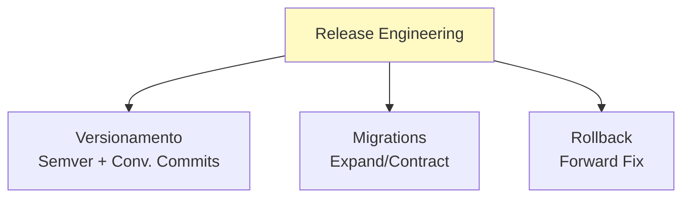
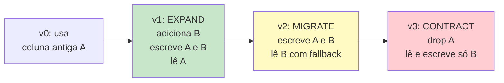
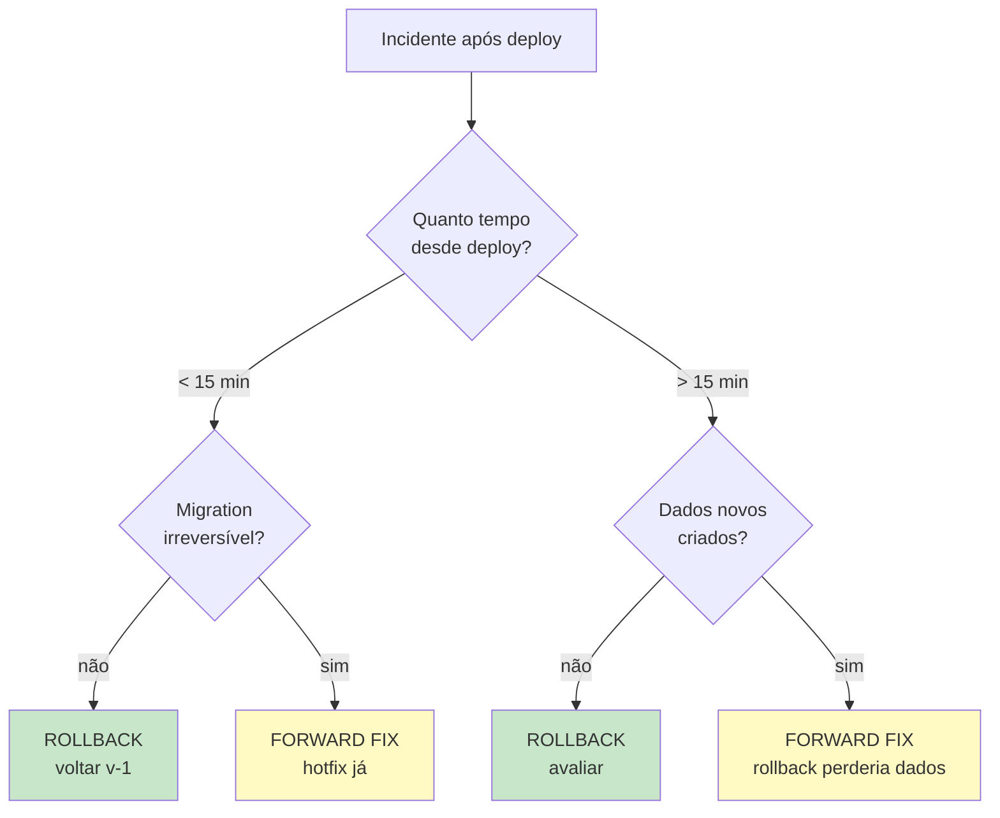

# Bloco 4 — Release Engineering: Versionamento, Migrations e Rollback

> **Duração estimada:** 60 a 70 minutos. Inclui decisor de bump semver e exemplo completo de migration expand/contract.

Este bloco fecha o módulo. Você tem pipeline (Bloco 2) e estratégia de release (Bloco 3). Falta a **disciplina operacional**: como versionar, quando dar rollback, como evoluir banco de dados sem derrubar nada.

---

## 1. O que é Release Engineering

**Definição (Google SRE Book, cap. 8 — Rundell):**

> *"Release Engineering é uma disciplina de engenharia relativamente nova dedicada a construir e entregar software. Release engineers compreendem como construir, configurar, testar, empacotar e deployar o software."*

**Foco deste bloco:** três disciplinas operacionais que não couberam nos blocos anteriores.



Humble & Farley (2014) dedicam os capítulos 12 e 13 a estes temas. Forsgren, Humble & Kim (*Accelerate*, 2018) mostram empiricamente que essas disciplinas estão entre os **maiores diferenciadores** de times elite.

---

## 2. Versionamento semântico (SemVer)

**Definição ([semver.org](https://semver.org/)):**

```
MAJOR.MINOR.PATCH
  │     │     │
  │     │     └── correções de bug retrocompatíveis
  │     └── novas features retrocompatíveis
  └── mudanças incompatíveis
```

Exemplos:

- `v1.4.7` → `v1.4.8`: bugfix.
- `v1.4.8` → `v1.5.0`: nova feature.
- `v1.5.0` → `v2.0.0`: breaking change.

### 2.1 Extensões

| Parte | Uso | Exemplo |
|-------|------|---------|
| **Pre-release** | Versões não estáveis | `v2.0.0-rc.1`, `v2.0.0-beta.3` |
| **Build metadata** | Identificador do artefato | `v1.5.0+sha.abc1234` |

### 2.2 Por que versionar artefatos (e não só libraries)?

Mesmo se seu software **não é uma library**, versionar o artefato tem valor enorme:

- **Rastrear** qual versão está em produção neste momento.
- **Ligar incidente a commit** (via build metadata ou changelog).
- **Fazer rollback** referenciando a versão alvo (`v1.4.7`) em vez de SHA.
- **Changelog** inteligível para stakeholders.
- **Alinhar versões de API** com versão do cliente (mobile/parceiros).

### 2.3 Conventional Commits — decidindo o bump automaticamente

[Conventional Commits](https://www.conventionalcommits.org/) é um padrão de mensagens que permite **inferir** o bump semver automaticamente.

**Formato:**

```
<tipo>(<escopo opcional>): <descrição>

<corpo opcional>

<rodapé opcional, incluindo BREAKING CHANGE>
```

**Tipos padrão e bump correspondente:**

| Tipo no commit | Bump resultante |
|----------------|-----------------|
| `feat:` | **MINOR** (nova feature) |
| `fix:` | **PATCH** (correção) |
| `perf:` | **PATCH** (ganho de performance) |
| `refactor:` | **PATCH** |
| `BREAKING CHANGE:` no rodapé OU `!` no tipo (ex.: `feat!:`) | **MAJOR** |
| `docs:`, `test:`, `chore:`, `ci:`, `build:` | **nenhum** (não gera release) |

### 2.4 Script em Python: decidir o próximo bump

`bump_semver.py` lê a saída de `git log v<ultima-tag>..HEAD` e decide qual é o próximo tag.

```python
"""bump_semver.py — decide o próximo tag SemVer analisando commits.

Uso:
  git log v1.4.7..HEAD --format=%s%n%b%n--END-- | python bump_semver.py v1.4.7
Saída (stdout): próxima versão (ex.: v1.5.0)
"""
from __future__ import annotations

import argparse
import re
import sys
from dataclasses import dataclass
from enum import IntEnum


class Bump(IntEnum):
    NONE = 0
    PATCH = 1
    MINOR = 2
    MAJOR = 3


@dataclass
class Commit:
    subject: str
    body: str


# feat, fix, feat(scope), feat!, feat(scope)!
RE_TIPO = re.compile(r"^(?P<tipo>[a-z]+)(?:\((?P<escopo>[^)]+)\))?(?P<bang>!)?:\s")
TIPOS_MINOR = {"feat"}
TIPOS_PATCH = {"fix", "perf", "refactor"}


def classificar(commit: Commit) -> Bump:
    m = RE_TIPO.match(commit.subject)
    if not m:
        # commit não-conforme → ignorar (ou PATCH, se preferir mais conservador)
        return Bump.NONE
    tipo = m.group("tipo")
    bang = m.group("bang")
    tem_breaking_body = "BREAKING CHANGE:" in commit.body
    if bang or tem_breaking_body:
        return Bump.MAJOR
    if tipo in TIPOS_MINOR:
        return Bump.MINOR
    if tipo in TIPOS_PATCH:
        return Bump.PATCH
    return Bump.NONE


def parse_git_log(texto: str) -> list[Commit]:
    """Espera blocos separados por '--END--'. Cada bloco: 1ª linha = subject, resto = body."""
    commits: list[Commit] = []
    for bloco in texto.split("--END--"):
        linhas = [ln for ln in bloco.strip().splitlines() if ln]
        if not linhas:
            continue
        subject = linhas[0]
        body = "\n".join(linhas[1:])
        commits.append(Commit(subject=subject, body=body))
    return commits


RE_VER = re.compile(r"^v?(\d+)\.(\d+)\.(\d+)$")


def parse_versao(s: str) -> tuple[int, int, int]:
    m = RE_VER.match(s.strip())
    if not m:
        raise SystemExit(f"versão inválida: {s!r} — esperado vX.Y.Z")
    return int(m.group(1)), int(m.group(2)), int(m.group(3))


def aplicar_bump(versao: tuple[int, int, int], bump: Bump) -> tuple[int, int, int]:
    major, minor, patch = versao
    if bump == Bump.MAJOR:
        return major + 1, 0, 0
    if bump == Bump.MINOR:
        return major, minor + 1, 0
    if bump == Bump.PATCH:
        return major, minor, patch + 1
    return versao


def formatar(v: tuple[int, int, int]) -> str:
    return f"v{v[0]}.{v[1]}.{v[2]}"


def main(argv: list[str] | None = None) -> int:
    p = argparse.ArgumentParser()
    p.add_argument("ultima_versao")
    args = p.parse_args(argv)

    texto = sys.stdin.read()
    commits = parse_git_log(texto)
    if not commits:
        sys.stderr.write("Nenhum commit encontrado no stdin.\n")
        return 2

    maior = max((classificar(c) for c in commits), default=Bump.NONE)
    atual = parse_versao(args.ultima_versao)

    if maior == Bump.NONE:
        sys.stderr.write(
            f"Nenhum commit classificável → mantém {formatar(atual)}\n"
        )
        print(formatar(atual))
        return 0

    nova = aplicar_bump(atual, maior)
    sys.stderr.write(f"{len(commits)} commit(s). Bump detectado: {maior.name}\n")
    print(formatar(nova))
    return 0


if __name__ == "__main__":
    sys.exit(main())
```

### 2.5 Uso no pipeline

No workflow do Bloco 2, podemos substituir a etapa "compute version" por algo assim:

```yaml
- name: Compute next version
  id: version
  run: |
    BASE=$(git describe --tags --abbrev=0 2>/dev/null || echo "v0.0.0")
    NEXT=$(
      git log "${BASE}..HEAD" --format='%s%n%b%n--END--' \
        | python scripts/bump_semver.py "$BASE"
    )
    echo "base=${BASE}" >> "$GITHUB_OUTPUT"
    echo "next=${NEXT}" >> "$GITHUB_OUTPUT"
    echo "Base: $BASE | Next: $NEXT"
```

### 2.6 Changelog automático

Ferramentas como [`git-cliff`](https://git-cliff.org/), [`semantic-release`](https://github.com/semantic-release/semantic-release) e [`release-please`](https://github.com/googleapis/release-please) consomem Conventional Commits e geram `CHANGELOG.md` automaticamente.

Para este módulo, vamos usar a **lógica in-house** (script acima). As ferramentas completas ficam como referência.

---

## 3. Migrations de banco compatíveis com CD

**O grande inimigo da CD:** schema changes que quebram a versão anterior (que ainda está rodando).

### 3.1 O padrão Expand/Contract (também chamado Parallel Change)

Descrito por **Danilo Sato** ([martinfowler.com/bliki/ParallelChange.html](https://martinfowler.com/bliki/ParallelChange.html)). Ideia: **separar** uma mudança destrutiva em **3 deploys**:



Em cada passo:

1. **Expand** — schema **ganha** a nova coluna. Código antigo (v0) continua funcionando.
2. **Migrate** — código escreve em ambas. Backfill de dados antigos para nova coluna.
3. **Contract** — schema **perde** a coluna antiga. Código só usa a nova.

**Propriedade crucial:** entre **qualquer 2 passos consecutivos**, o sistema está **operacional** com instâncias das duas versões rodando simultaneamente.

### 3.2 Exemplo prático — LogiTrack

Cenário: a tabela `pacote` tem uma coluna `status` (VARCHAR). Time quer normalizar em `status_id` (FK) apontando para tabela `status`.

#### Migration 001 — expand

```sql
-- migrations/001_expand_status.sql
-- Expand: cria tabela status e coluna status_id, mantém status antigo.

CREATE TABLE IF NOT EXISTS status (
    id SERIAL PRIMARY KEY,
    codigo VARCHAR(32) NOT NULL UNIQUE,
    descricao TEXT NOT NULL
);

INSERT INTO status (codigo, descricao) VALUES
    ('CRIADO', 'Pacote criado'),
    ('EM_ROTA', 'Em rota de entrega'),
    ('ENTREGUE', 'Entregue'),
    ('DEVOLVIDO', 'Devolvido')
ON CONFLICT (codigo) DO NOTHING;

ALTER TABLE pacote ADD COLUMN IF NOT EXISTS status_id INTEGER REFERENCES status(id);

-- Backfill: popula status_id a partir do status antigo
UPDATE pacote p SET status_id = s.id
FROM status s
WHERE p.status_id IS NULL AND s.codigo = p.status;
```

Código v1 (deployado junto): **lê `status` (velho)**, **escreve em `status` E `status_id`**.

#### Migration 002 — migrate (opcional; pode ser só mudança de código)

Neste caso não há SQL — é uma **mudança de código**: v2 passa a **ler `status_id`** (com fallback para `status` se `status_id IS NULL`).

#### Migration 003 — contract

```sql
-- migrations/003_contract_status.sql
-- Contract: remove a coluna VARCHAR antiga. Só rode após confirmar que nenhuma versão
-- antiga está mais ativa em produção (tipicamente: 1-2 semanas após deploy da v3).

ALTER TABLE pacote DROP COLUMN IF EXISTS status;
```

Código v3: lê e escreve apenas `status_id`.

### 3.3 Regras para migrations em CD

| Regra | Por quê |
|-------|---------|
| **Migration só adiciona** (no expand) | Instância antiga segue funcionando |
| **Migration não dropa** com código dependente rodando | Evita 5xx em rolling/canary |
| **Backfill é idempotente** | Pode rodar duas vezes sem corromper |
| **Migration roda ANTES do deploy do código** (expand) | Código novo já encontra schema pronto |
| **Contract roda DEPOIS de confirmar estabilidade** | Ponto de não-retorno |

### 3.4 O que evitar

- **Rename coluna** em um único deploy. Use add → migrate → drop.
- **Alter type** destrutivo (VARCHAR(50) → INTEGER com conversão) em um único deploy.
- **Drop tabela** sem garantia de que nenhuma versão ativa a usa.
- **Migration durante o deploy da v1**: separe a migration do deploy do código. Use hooks pre-deploy (expand) e post-deploy (contract).

---

## 4. Rollback vs. Forward Fix

### 4.1 As duas estratégias

| | **Rollback** | **Forward Fix** |
|---|---|---|
| **O que é** | Voltar para versão anterior | Consertar e lançar uma v+1 |
| **Tempo** | Minutos (com Blue-Green ou Canary) | Minutos a horas (depende do fix) |
| **Risco** | Perde valor entregue pela versão nova | Mais um deploy tenso sob pressão |
| **Quando usar** | Deploy recém-saiu, dado não mudou | Já tem tempo de prod, dados novos, migrations irreversíveis |

### 4.2 Decisão — heurística prática



### 4.3 Cenários típicos da LogiTrack

**Cenário A — deploy de v1.4.2 há 8 min, erro 500 em 4% dos requests.**

- Tempo curto: rollback é seguro.
- Migration? 1.4.2 só adicionou coluna (expand). Reversível.
- **Decisão:** ROLLBACK para 1.4.1.

**Cenário B — deploy de v1.4.2 há 4 horas, bug na conversão de fuso horário.**

- Já tem 4h de dados **gravados com bug**.
- Rollback pioraria: v1.4.1 não sabe como lidar com os dados já escritos.
- **Decisão:** FORWARD FIX — emitir 1.4.3 corrigindo.

**Cenário C — deploy de v1.5.0 há 30 min, coluna velha já dropada (contract).**

- Schema mudou destrutivamente.
- Rollback quebraria (v1.4.x espera a coluna que não existe mais).
- **Decisão:** FORWARD FIX urgente, ou ROLLBACK **reaplicando o schema da v1.4.x** (caro e arriscado).

### 4.4 O runbook mínimo

Um **runbook de rollback** é um documento curto que resume:

1. **Como detectar** que rollback é necessário (alarmes, métricas).
2. **Comandos exatos** para executar (idealmente: 1 comando / 1 clique).
3. **Critérios de não-rollback** (cenários B e C acima).
4. **Quem comunica** (status page, canal Slack, clientes).

Está no [entrega-avaliativa.md](../entrega-avaliativa.md).

---

## 5. Deploy freezes: quando fazem sentido

### 5.1 O que é freeze

"Não deployar durante janela X". Exemplos:

- **Black Friday / Natal:** alto volume → mais caro errar.
- **Fim do mês (fiscal):** fechamentos críticos.
- **Partida de esporte grande:** picos previsíveis.
- **Compliance / auditoria em andamento:** evitar mudanças não-rastreadas.

### 5.2 Freeze legítimo vs. freeze como muleta

| Legítimo | Muleta |
|----------|--------|
| Tem **data definida** e **termina** | "Sempre sexta"; permanente |
| Existe **justificativa de negócio** específica | "Porque dá medo" |
| Pipeline **permite deploy** fora do freeze, só há **política** de não fazer | Pipeline **não suportaria** deploy seguro mesmo fora |
| É **exceção** (poucos dias/ano) | É **norma** (várias semanas/ano) |

O freeze de sexta da LogiTrack (sintoma 6 do cenário) cai claramente em **muleta**. A solução correta é tornar deploy seguro — e **então** freezes tornam-se estratégicos, raros, e racionais.

### 5.3 Deploy freeze **não** é desculpa para código parar

Mesmo durante freeze, o time:

- **Mergeia em `main`** normalmente.
- Pipeline roda até staging.
- Apenas o gate para **production** fica travado.

Evita represamento e mantém lotes pequenos.

---

## 6. Postmortem de release mal sucedida

Quando dá errado em produção, a prática do Módulo 1 (postmortem blameless) se aplica. Aqui, com lente de **release engineering**:

**Perguntas específicas:**

1. **O pipeline poderia ter pego?** (teste faltando? smoke pós-deploy faltando?)
2. **Canary detectaria?** (se sim, por que não houve canary?)
3. **Feature flag poderia ter evitado escalada?** (se sim, desligar seria a primeira ação)
4. **Migration foi compatível?** (se não, adicionar expand/contract ao próximo deploy)
5. **Rollback foi possível?** Em quanto tempo?

O **output** deve alimentar o **backlog do pipeline**: cada lição vira um PR no `cd.yml` ou no catálogo de flags.

---

## 7. Deploy como rotina, não evento

O objetivo cultural deste módulo — que junta tudo — é **tornar deploy algo tedioso**.

Os indicadores de que chegou lá:

- **Não tem mais "release day"**.
- Deploy **não é anunciado** em canal #geral — ninguém liga.
- **Pizza no deploy** parou (não é evento especial).
- Ninguém lê runbook — tudo é automatizado.
- Estagiário pode clicar "deploy" no primeiro dia (e nada de ruim acontece).

Facebook, Google, Netflix, Etsy operam assim. Não porque são "gigantes" — porque **disciplinas descritas neste módulo** tornam isso possível.

---

## 8. Aplicação ao cenário da LogiTrack

| Sintoma | Como o Bloco 4 endereça |
|---------|--------------------------|
| 5 — Sem rollback real, 60-120 min | Blue-Green (Bloco 3) + runbook de rollback + critérios forward-fix. Meta: < 15 min. |
| 6 — Friday deploy freeze não respeitado | Freeze como **política racional**, com pipeline seguro que permite outros dias. |
| 9 — Config drift / parâmetro da transportadora X | Config versionada (Bloco 2) + ADR registrando decisões. |
| 10 — Deploy anxiety | Deploy vira rotina com versionamento automático + rollback confiável. |

E agora fica explicitamente endereçado:

| Necessidade | Prática deste bloco |
|-------------|----------------------|
| Versão rastreável em produção | SemVer com build metadata (`v1.4.2+sha.abc`) |
| Mudança de schema com 200k pacotes/dia ativos | Expand/contract |
| Meta MTTR < 15 min | Rollback instantâneo (Blue-Green) + critérios automatizados |
| Releases diárias sustentáveis | Deploy-como-rotina e extinção do "release day" |

---

## Resumo do bloco

- **SemVer** padroniza versionamento; **Conventional Commits** permite automatizar.
- Script `bump_semver.py` decide o próximo tag a partir dos commits.
- **Migrations em CD** exigem **Expand/Contract** — múltiplos deploys, nunca destrutivos no mesmo.
- **Rollback** é estratégia; **Forward Fix** também. A heurística depende de tempo, dados e migrations.
- **Deploy freezes** legítimos são datados, específicos, excepcionais. Como norma, são muleta.
- **Postmortem de release** retroalimenta o pipeline.
- Meta final: **deploy como rotina tediosa**, não evento.

---

## Próximo passo

- Faça os **[exercícios resolvidos do Bloco 4](04-exercicios-resolvidos.md)**.
- Avance para os **[exercícios progressivos](../exercicios-progressivos/README.md)** — onde você vai **construir o pipeline da LogiTrack**.

---

## Referências deste bloco

- **Preston-Werner, T.** *Semantic Versioning 2.0.0.* [semver.org](https://semver.org/).
- **Conventional Commits:** [conventionalcommits.org](https://www.conventionalcommits.org/).
- **Sato, D.** *"ParallelChange"* (2014). [martinfowler.com/bliki/ParallelChange.html](https://martinfowler.com/bliki/ParallelChange.html).
- **Humble, J.; Farley, D.** *Entrega Contínua*, cap. 12 (banco de dados) e 13 (componentes).
- **Beyer, B. et al.** *Site Reliability Engineering* (Google SRE Book), cap. 8 (Release Engineering). [sre.google/books](https://sre.google/books/).
- **Forsgren, N.; Humble, J.; Kim, G.** *Accelerate*, 2018. IT Revolution.
- **release-please (Google):** [github.com/googleapis/release-please](https://github.com/googleapis/release-please).
- **git-cliff:** [git-cliff.org](https://git-cliff.org/).
