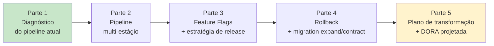

# Exercícios Progressivos — Módulo 4

Esta sequência de **5 partes encadeadas** é o laboratório prático do Módulo 4. Cada parte produz artefatos reais para a [LogiTrack](../00-cenario-pbl.md), e todos juntos compõem a base da [entrega avaliativa](../entrega-avaliativa.md).

**Duração total estimada:** 5 a 7 horas de trabalho concentrado.

---

## Encadeamento



Cada parte **depende** da anterior (exceto Parte 1). **Não pule.**

---

## Parte a parte

| # | Título | Duração | Arquivo |
|---|--------|---------|---------|
| 1 | Diagnóstico: onde a LogiTrack está no espectro CI → CDeployment | 45 min | [parte-1-diagnostico-pipeline.md](parte-1-diagnostico-pipeline.md) |
| 2 | Construir o Deployment Pipeline multi-estágio | 1h30 – 2h | [parte-2-pipeline-multi-estagio.md](parte-2-pipeline-multi-estagio.md) |
| 3 | Implementar Feature Flags e escolher estratégia de release | 1h | [parte-3-feature-flags.md](parte-3-feature-flags.md) |
| 4 | Desenhar plano de rollback + migration expand/contract | 1h | [parte-4-rollback-migration.md](parte-4-rollback-migration.md) |
| 5 | Plano de transformação 6 meses + projeção DORA | 45 min – 1h | [parte-5-plano-transformacao.md](parte-5-plano-transformacao.md) |

---

## Pré-requisitos

- **Python 3.10+**, **Git**, conta no **GitHub** (para criar o repositório público ou privado).
- Bloco 1 a 4 concluídos.
- Entendimento da pirâmide de testes (Módulo 3).
- **Docker** é **útil** (para Testcontainers e testes locais com Postgres), mas não obrigatório. Partes que exigem Docker estão marcadas.

---

## Entregáveis de cada parte

Cada parte pede **artefatos concretos** — diagramas, código, workflows, documentos. Recomenda-se **um repositório GitHub** por aluno (conforme [entrega-avaliativa.md](../entrega-avaliativa.md)), onde cada parte vira:

- Uma **branch** + **PR** (aprendendo fluxo profissional).
- Um **diretório** `exercicios/parte-N/` com os artefatos daquela parte.
- No final, branch `main` consolida tudo.

---

## Critérios gerais

Em todas as partes, priorize:

- **Clareza** dos diagramas (Mermaid obrigatório onde pedido).
- **Código funcional** (não pseudo-código quando o exercício pede implementação).
- **Admitir limitações** — reconhecer o que ficou fora do escopo é sinal de maturidade.
- **Citar fontes** — Humble & Farley, Fowler, DORA, etc. Aparece na entrega avaliativa.

---

## Começando

Crie seu repositório:

```bash
mkdir logitrack-tracking
cd logitrack-tracking
git init -b main
python3 -m venv .venv
source .venv/bin/activate
pip install --upgrade pip

# cópie o requirements.txt do módulo
curl -fsSL https://raw.githubusercontent.com/YOUR-ORG/aulas_ads/main/devops/04-entrega-continua/requirements.txt -o requirements.txt
# ou copie manualmente
pip install -r requirements.txt
```

Crie a estrutura inicial do projeto:

```bash
mkdir -p src/tracking tests/{unit,smoke} migrations scripts .github/workflows docs/adr
touch README.md VERSION pyproject.toml
echo "v0.0.0" > VERSION
```

Comece pela **[Parte 1 — Diagnóstico](parte-1-diagnostico-pipeline.md)**.

---

<!-- nav:start -->

**Navegação — Módulo 4 — Entrega contínua**

- ← Anterior: [Exercícios Resolvidos — Bloco 4](../bloco-4/04-exercicios-resolvidos.md)
- → Próximo: [Parte 1 — Diagnóstico do Pipeline da LogiTrack](parte-1-diagnostico-pipeline.md)
- ↑ Índice do módulo: [Módulo 4 — Entrega contínua](../README.md)

<!-- nav:end -->
