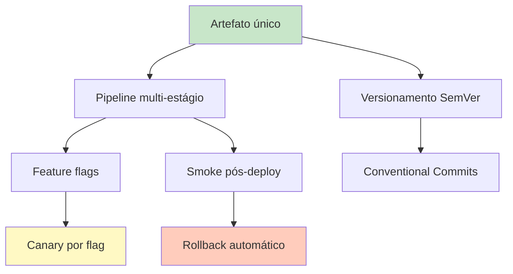

# Parte 5 — Plano de Transformação e Projeção DORA

> **Duração:** 45 min a 1 hora.
> **Objetivo:** consolidar tudo num **plano de transformação** de 6 meses para a LogiTrack, com **projeção DORA** e **riscos** reconhecidos.

---

## Contexto

Você tem **diagnóstico** (Parte 1), **pipeline construído** (Parte 2), **release controlado** (Parte 3) e **rollback + migration segura** (Parte 4). Falta o que um bom engenheiro apresenta a uma VP: **um plano coerente, com metas, riscos e limites claros**.

Esta é a parte **reflexiva** — poucas linhas de código, muita decisão.

---

## Tarefas

### 1. Escreva `docs/plano-transformacao.md`

Estrutura mínima (3 a 5 páginas):

#### a) Sumário executivo

1 parágrafo. Qual é a ambição. Qual ganho de negócio esperado. Em quanto tempo.

#### b) Estado atual (condensado da Parte 1)

Tabela: DF, LT, CFR, MTTR — com valor atual e tier DORA. Até 5 linhas de comentário.

#### c) Estado-alvo em 6 meses

Mesma tabela — projeção. Justifique cada projeção em 1 linha.

**Exemplo:**

| Métrica | Atual | Tier | 6 meses | Tier | Justificativa |
|---------|-------|------|---------|------|----------------|
| DF | 0,036/dia | Low | 1/dia | High | Remoção do release train + artefato único |
| LT | 25 dias | Low | < 24h | High | Consequência direta de DF alta |
| CFR | 18% | Medium | < 10% | Elite/High | Canary simulado + feature flags |
| MTTR | 90 min | Medium | < 15 min | Elite | Blue-Green na Billing + flags com kill switch |

#### d) Plano em 3 ondas

Divida a transformação em **3 ondas de 2 meses** cada.

**Onda 1 (meses 1-2) — Fundação**

- Objetivos concretos (ex.: artefato único em todos os serviços, CI estabilizado).
- Quais sintomas do cenário PBL são endereçados.
- Métrica de sucesso da onda (ex.: "DF sobe para 2/semana").

**Onda 2 (meses 3-4) — Pipeline completo**

- Feature flags + estratégia de release.
- Expand/contract adotado em 2 migrations reais.
- Métrica de sucesso (ex.: "LT cai para 3 dias").

**Onda 3 (meses 5-6) — Amadurecimento**

- Promover `deploy-production` a automático em ≥ 1 serviço.
- Canary real (já apontando para Módulo 7 — K8s).
- Métrica: atingir tiers projetados.

Para cada onda, inclua **diagrama Mermaid** mostrando o pipeline daquela onda.

#### e) Sequência de intervenções (dependências)

Use a **priorização da Parte 1**. Monte um **gráfico de dependências** — o que **precisa** vir antes de o quê?

Ex.:



### 2. Escreva `docs/riscos-e-mitigacoes.md`

**Pelo menos 6 riscos** da transformação, cada um com:

- **Descrição** do risco.
- **Probabilidade** (baixa/média/alta).
- **Impacto** (baixo/médio/alto).
- **Mitigação** proposta.
- **Sinais de alerta** precoces.

**Ideias de risco para LogiTrack:**

- Time não adota feature flags; cria flags, esquece, débito explode.
- Release acelerada causa pico de CFR durante Onda 1 (regressão temporária é esperada).
- Migration contract rodada antes de 100% dos pods na nova versão → outage.
- Cliente Transportadora Gamma, insatisfeita, exige mais mudanças durante a transformação.
- Sem observabilidade adequada, canary vira teatro — Módulo 10 precisa vir junto.
- Custo de ferramentas (ex.: feature flag platform em escala, Sentry, Datadog).

### 3. Escreva `docs/limites-escopo.md`

Duas seções:

**a) O que este plano NÃO resolve**

Ex.: "observabilidade profunda fica para Módulo 10"; "canary real em K8s fica para Módulo 7"; "testes de carga não fazem parte desta transformação".

**b) Pressupostos**

- A suíte de testes do Módulo 3 está saudável nos 4 serviços (se não estiver, a Onda 1 precisa contemplar estabilização).
- Há orçamento para 1 FTE de plataforma durante os 6 meses.
- Cultura (Módulo 1) está em nível mínimo — postmortem sem culpa já é praticado.
- Banco de dados atual suporta migrations online (PostgreSQL com cuidado adequado).

### 4. Atualizar README.md do repositório

O README final do repositório deve refletir a jornada — é **o que um recrutador/avaliador vai ler primeiro**.

Seções mínimas:

- **O que é o projeto**: "aplicação fictícia LogiTrack — laboratório do Módulo 4".
- **Como rodar**: setup do venv, `uvicorn tracking.api:app`, etc.
- **Pipeline**: diagrama Mermaid do `cd.yml`.
- **Feature flags**: tabela com as flags e o que fazem.
- **Estratégia de release**: 1 parágrafo + link para `docs/estrategia-release.md`.
- **Rollback**: link para `docs/runbook-rollback.md`.
- **Migrations**: link para `migrations/README.md`.
- **Plano de transformação**: link para `docs/plano-transformacao.md`.
- **Evidências** (runs, tags, etc.).
- **Limites** (1 parágrafo honesto).

---

## Entregáveis

```
logitrack-tracking/
├── README.md                          # atualizado, índice da jornada
└── docs/
    ├── plano-transformacao.md         # 3 ondas + projeção DORA
    ├── riscos-e-mitigacoes.md         # 6+ riscos
    └── limites-escopo.md              # o que não cobre
```

---

## Critérios de sucesso

- [ ] `plano-transformacao.md` tem: sumário, tabela atual, tabela alvo, 3 ondas com diagramas, gráfico de dependências.
- [ ] Projeção DORA é **defensável** com base nos blocos — não cai do céu.
- [ ] `riscos-e-mitigacoes.md` com **pelo menos 6 riscos**, cada um com 5 campos.
- [ ] `limites-escopo.md` nomeia **pelo menos 3 coisas** que não cobre (Módulos 5, 6, 7, 10).
- [ ] `README.md` é o **ponto de entrada** — qualquer pessoa que clone o repo entende a jornada.

---

## Dicas finais

- **Reconheça** — não minimize — o que fica de fora. Isto é maturidade.
- **Chame os módulos futuros** por nome: "canary real em K8s (Módulo 7)", "SLOs e error budget (Módulo 10)".
- **Evite metas inflacionadas.** DF elite (múltiplos/dia) em 6 meses é irreal para a LogiTrack de hoje. DF High (1/dia) é ambicioso mas realista. **Prometer menos e entregar é melhor que o oposto.**
- **Número é mais forte que adjetivo.** "Deploy mais rápido" é fraco; "DF de 0,036/dia para 1/dia (28×)" é forte.
- **Cite** Humble & Farley, DORA, Fowler onde for natural. Para professora/recrutadora, isso sinaliza rigor.

---

## Conclusão do Módulo 4

Ao completar as 5 partes, você terá:

1. **Diagnóstico DORA** rigoroso de uma empresa fictícia realista.
2. **Pipeline multi-estágio** funcional em GitHub Actions com artefato único.
3. **Feature flags** implementados e testados, com catálogo e governança.
4. **Runbook de rollback** e **migrations expand/contract** adequadas à CD.
5. **Plano de transformação** defensável, reconhecendo limites e dependências.

Esse conjunto **é** seu portfólio para entrevistas na área DevOps/Platform Engineering. É também a **base concreta** para o Módulo 5 (Containers — empacotar o artefato em imagem Docker), Módulo 6 (IaC — provisionar os ambientes) e Módulo 7 (K8s — orquestrar os deploys).

---

[← Voltar ao README do módulo](../README.md)

---

<!-- nav:start -->

**Navegação — Módulo 4 — Entrega contínua**

- ← Anterior: [Parte 4 — Rollback e Migration Expand/Contract](parte-4-rollback-migration.md)
- → Próximo: [Entrega Avaliativa do Módulo 4](../entrega-avaliativa.md)
- ↑ Índice do módulo: [Módulo 4 — Entrega contínua](../README.md)

<!-- nav:end -->
