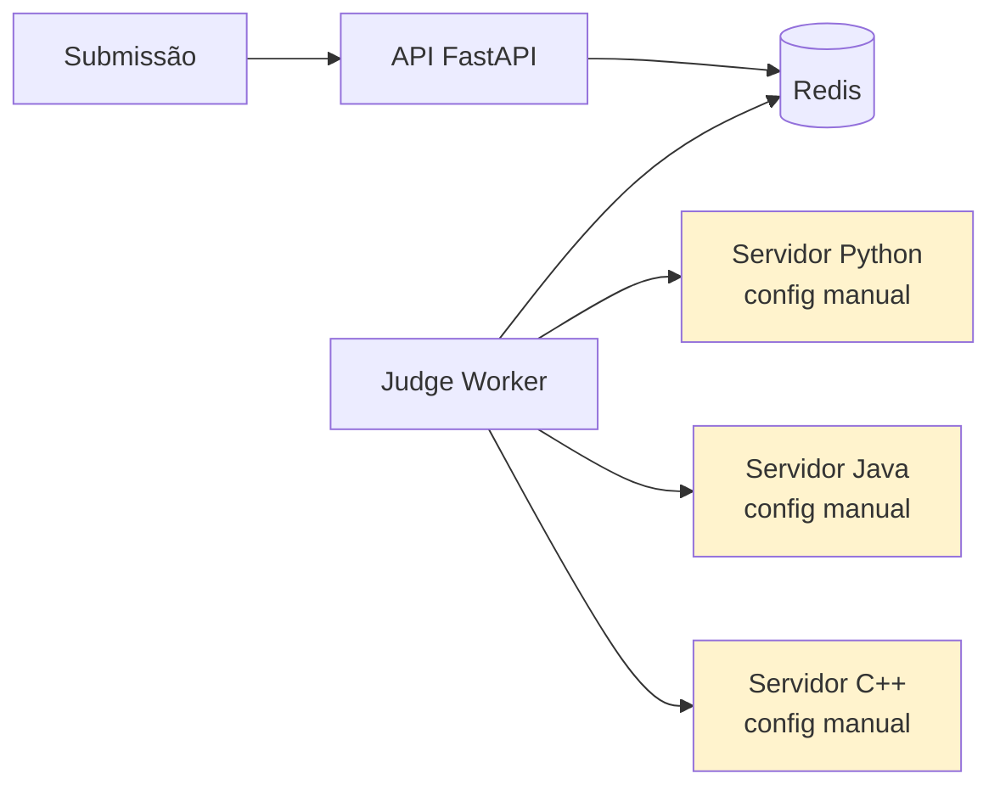

# Cenário PBL — Problema Norteador do Módulo

Este módulo é guiado por um **problema real** (PBL — Problem-Based Learning). O conteúdo teórico e os exercícios estão a serviço de **responder à pergunta norteadora** ao final.

---

## A empresa: CodeLab

A **CodeLab** é uma plataforma educacional de **programação online**. Alunos de cursos de graduação em Computação do Brasil e exterior escrevem código no navegador e o enviam para correção automatizada. A plataforma tem 4 anos, **120 mil alunos ativos por mês**, ~**200 mil submissões por dia** (pico de ~900/min em períodos de prova).

A ideia é simples; o desafio é brutal: **executar código não confiável de aluno** em segundos, de forma isolada, em 6 linguagens (Python, Java, C, C++, JavaScript, Go), retornando **veredito** (AC, WA, TLE, MLE, RE) e **output**.

A arquitetura é composta por:

- **API pública** (Python/FastAPI) — recebe submissões, expõe resultados.
- **Judge Worker** (Python) — puxa submissões da fila e orquestra a execução.
- **Runners** (um por linguagem) — onde o código do aluno efetivamente roda.
- **Banco PostgreSQL** — submissões, testes, resultados.
- **Redis** — fila + cache de casos de teste.

---

## O contexto técnico atual

A CodeLab **não usa containers** em produção — ainda. O setup atual:

- Cada linguagem tem um **ambiente Linux manualmente configurado** num servidor dedicado.
- O código do aluno é salvo em `/tmp/submissao-<id>/` e executado como **usuário `runner`** (sem sudo, mas compartilhando o FS).
- Limites de recursos vêm de **`ulimit`** + **`timeout`** — às vezes escapam.
- Deploys de novos ambientes são um pesadelo — "quando alguém precisa adicionar Rust, vira sprint inteira".

---

## Sintomas observados

| # | Sintoma | Detalhe |
|---|---------|---------|
| 1 | **Drift de ambiente** | Servidor-Python roda Python 3.10.6 em produção. Homolog roda 3.10.12. Um bug "só aparece em homolog" há 3 meses. |
| 2 | **"Funciona na máquina do dev"** | Setup local de dev exige 14 passos no README. 3 devs novos precisaram de 2 dias cada para ter ambiente funcionando. |
| 3 | **Isolamento fraco** | Um aluno descobriu que, com o C compilado certo, conseguia **ler `/etc/passwd`** do servidor. Sanitizado manualmente, mas o vetor existe. |
| 4 | **Limites escorregadios** | Submissão infinita "fura" `ulimit -t` quando o programa faz fork. Tem rodado por 12+ min antes de ser morta à mão. |
| 5 | **Adicionar linguagem é evento** | Rust foi pedido em 2024. Só foi disponibilizado em 2025, depois de 3 tentativas e 1 incidente. |
| 6 | **Dependências quebram em cascata** | `apt upgrade` de segurança num servidor quebrou o compilador de Go. Produção ficou com Go off por 6h. |
| 7 | **Sem artefato portável** | Para replicar ambiente, equipe de SRE **clona VM** — imagem de 14 GB que leva 40 min para baixar. |
| 8 | **Sem scan de segurança** | Nenhuma ferramenta escaneia CVEs nas libs do sistema. CVE crítica em libssl passou 4 meses despercebida. |
| 9 | **Ambiente de desenvolvimento difere de produção** | Dev roda Docker mock; produção roda bare metal. Bug de serialização só apareceu com o Redis real (prod). |
| 10 | **"Release train" da infraestrutura** | Mudança nos runners é acoplada ao deploy da API. Não dá para atualizar só a imagem do runner Python sem tocar no resto. |

---

## Impacto nos negócios

- **Custo de operação crescente**: o time SRE está 70% do tempo em manutenção de ambientes, não em melhorias.
- **Incidentes de segurança latentes**: o isolamento atual **é** o maior risco. Uma fuga real levaria a um incidente de imagem catastrófico para uma plataforma educacional.
- **Taxa de adição de linguagens próxima de zero**: Rust demorou 12 meses; Kotlin e Ruby foram **negadas**. Concorrentes (HackerRank, LeetCode) oferecem 30+.
- **Pico de provas = apagão parcial**: capacidade não elástica. Ao pico, alunos recebem timeout por superlotação — não por código ruim.
- **Custo por submissão**: alto (1 VM dedicada por linguagem ociosa 70% do tempo).

---

## O que a liderança quer

O CTO deu objetivos de 3 meses:

> *"Preciso que CADA submissão rode em um contêiner efêmero, isolado, com limites de CPU, memória e tempo garantidos pelo kernel. Preciso adicionar uma linguagem nova em UM dia. Preciso publicar imagens versionadas, escaneadas e com SBOM. E preciso poder replicar o ambiente de produção na máquina do estagiário em UM comando."*

Objetivos concretos:

- **Runner isolado por submissão** (contêiner com `--network=none`, FS read-only, limites rígidos).
- **Adicionar linguagem** = criar 1 Dockerfile + 1 PR.
- **Imagens versionadas** em registry (GHCR, já que o CI está em GitHub — herdado do Módulo 4).
- **Imagens escaneadas** em pipeline (Trivy/Grype); falha o build se CVE crítico.
- **SBOM** gerado e anexado à imagem.
- **Ambiente local completo** com `docker compose up`.
- **Imagem base minimalista** — menos superfície de ataque, pull mais rápido.

---

## Pergunta norteadora

> **Como redesenhar a CodeLab usando containers para garantir isolamento real de código não confiável, ambientes reproduzíveis do laptop à produção, e tempo de "adicionar uma linguagem" medido em horas — reconhecendo os limites do que contêineres sozinhos resolvem?**

Esta pergunta exige articular:

1. **Fundamentos** — por que containers isolam (namespaces, cgroups); o que **não** isolam.
2. **Desenho dos Dockerfiles** dos runners — pequenos, versionados, não-root.
3. **Ambiente local multi-serviço** com Compose, reproduzindo produção.
4. **Pipeline de imagens** com build, scan, assinatura, push ao registry.
5. **Plano realista** — o que é **responsabilidade do contêiner** (Módulo 5) e o que **vai para o orquestrador** (Módulo 7).

---

## Como este cenário aparece nos blocos

| Bloco | Lente sobre a CodeLab |
|-------|------------------------|
| **Bloco 1** — Fundamentos | Por que o isolamento atual (ulimit + usuário) falhou, e por que namespace isolaria. |
| **Bloco 2** — Dockerfile | Construir runner Python minimalista, multi-stage, non-root. |
| **Bloco 3** — Compose | Subir API + Redis + Postgres + Worker + Runner localmente. |
| **Bloco 4** — Produção | Push para GHCR, scan com Trivy, SBOM com Syft, limites de recursos. |

E os **exercícios progressivos** vão exigir que você **construa** a nova CodeLab containerizada, desde o Dockerfile do runner até o Compose pronto para o estagiário.

---

## Próximo passo

Leia o **[Bloco 1 — Fundamentos de containers](bloco-1/01-fundamentos-containers.md)** para entender **o que** um contêiner realmente é — antes de escrever o primeiro `Dockerfile`.

---

<!-- nav:start -->

| &nbsp; | &nbsp; | &nbsp; |
|:--|:--:|--:|
| **← Anterior** [Módulo 5 — Containers](README.md) | **↑ Índice** [Módulo 5 — Containers e orquestração](README.md) | **Próximo →** [Bloco 1 — Fundamentos de Containers](bloco-1/01-fundamentos-containers.md) |

<!-- nav:end -->
