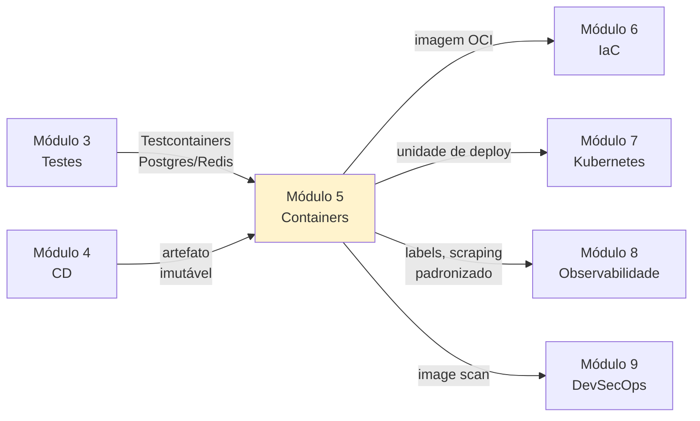

# Módulo 5 — Containers

**Carga horária:** 5 horas
**Nível:** Graduação (ensino superior)
**Pré-requisitos:** Módulos 1 (Cultura), 2 (CI), 3 (Testes), 4 (Entrega Contínua)

---

## Por que este módulo vem aqui

Você tem cultura (Mod. 1), integra continuamente (Mod. 2), testa com rigor (Mod. 3) e entrega o artefato por um pipeline seguro (Mod. 4). O **artefato**, até aqui, foi um `.whl` Python. Pronto para produção? **Quase.**

Na realidade, o binário que vai para produção carrega dependências além do seu código: versão do Python, libs do sistema, certificados, variáveis de ambiente do host. É por isso que "funciona na minha máquina" continua sendo sintoma vivo. O **container** resolve isso embalando **aplicação + runtime + sistema de arquivos mínimo** numa unidade portátil.

> *"A container is a standard unit of software that packages up code and all its dependencies so the application runs quickly and reliably from one computing environment to another."* — Docker Inc.

E o container é também o **substrato físico** sobre o qual os próximos módulos constroem: **IaC** (Módulo 6), **Kubernetes** (Módulo 7) e **observabilidade** (Módulo 8) só fazem sentido pleno quando a unidade de deploy é um **contêiner OCI**, não um binário "solto".

---

## Objetivos de Aprendizagem

Ao final do módulo, você será capaz de:

- **Distinguir** containers de **máquinas virtuais** e de **processos** comuns, sabendo que primitivas do Linux (namespaces, cgroups, UFS) os sustentam.
- **Escrever** um `Dockerfile` **idiomático** para uma aplicação Python, explorando camadas, cache, multi-stage e imagens mínimas.
- **Aplicar** boas práticas de segurança em imagens: **usuário não-root**, base mínima, `.dockerignore`, sem segredos embutidos.
- **Orquestrar ambientes locais multi-serviço** com **Docker Compose** (app + Postgres + Redis + worker).
- **Publicar** imagens num **registry** (GHCR) com tags semver + SHA.
- **Escanear** imagens contra CVEs (**Trivy/Grype**) e gerar **SBOM** (**Syft**).
- **Integrar** build e push de imagem no **pipeline CI/CD** construído no Módulo 4.
- **Reconhecer** o que é **responsabilidade** do container e o que é **responsabilidade** do orquestrador (preview do Módulo 7).

---

## Estrutura do Material

Mesma estrutura dos módulos anteriores: **4 blocos teóricos** + **5 exercícios progressivos** em PBL.

| Ordem | Conteúdo | Arquivo(s) |
|-------|----------|------------|
| 0 | Cenário PBL (CodeLab) | [00-cenario-pbl.md](00-cenario-pbl.md) |
| 1 | Fundamentos: containers, namespaces e OCI | [bloco-1/01-fundamentos-containers.md](bloco-1/01-fundamentos-containers.md) · [exercícios](bloco-1/01-exercicios-resolvidos.md) |
| 2 | Dockerfile: boas práticas, camadas, multi-stage | [bloco-2/02-dockerfile-boas-praticas.md](bloco-2/02-dockerfile-boas-praticas.md) · [exercícios](bloco-2/02-exercicios-resolvidos.md) |
| 3 | Docker Compose: ambientes multi-serviço | [bloco-3/03-compose-multi-servico.md](bloco-3/03-compose-multi-servico.md) · [exercícios](bloco-3/03-exercicios-resolvidos.md) |
| 4 | Produção: registries, scanning, SBOM e limites | [bloco-4/04-producao-seguranca.md](bloco-4/04-producao-seguranca.md) · [exercícios](bloco-4/04-exercicios-resolvidos.md) |
| 5 | Exercícios progressivos (5 partes) | [exercicios-progressivos/](exercicios-progressivos/) |
| 6 | Entrega avaliativa | [entrega-avaliativa.md](entrega-avaliativa.md) |
| — | Referências bibliográficas | [referencias.md](referencias.md) |

---

## Como Estudar

1. **Comece pelo cenário PBL** — a CodeLab é uma plataforma educacional que **executa código não confiável** de alunos. Container é essencial — não decorativo.
2. **Siga a ordem dos blocos.** Cada bloco encadeia no seguinte: primitivas → Dockerfile → Compose → produção.
3. **Pré-requisito de máquina:**
   - **Docker** (engine + CLI) instalado. Alternativa: **Podman** (rootless por default; a maioria dos exemplos funciona com `alias docker=podman`).
   - Linux, macOS ou Windows com WSL2.
4. **Experimente e quebre.** Escreva Dockerfiles, construa, inspecione com `docker inspect`, `docker history`, `docker exec`. O entendimento vem da prática.
5. **Faça os exercícios resolvidos** após cada bloco.
6. **Execute os exercícios progressivos** — cada um produz parte da solução da CodeLab.

### Setup do ambiente

Verifique sua instalação:

```bash
docker --version
docker compose version
docker info | head -20
```

Teste básico:

```bash
docker run --rm hello-world
```

Se tiver Podman em vez de Docker, `alias docker=podman` resolve ≥90% dos exemplos.

O `requirements.txt` consolidado deste módulo está em [requirements.txt](requirements.txt). Instale num venv separado — ele contém os scripts Python de apoio.

---

## Ideia Central do Módulo

| Conceito | Significado |
|----------|-------------|
| **Imagem** | Template imutável — sistema de arquivos + metadados de execução |
| **Container** | Instância em execução de uma imagem — processo isolado com visão própria de FS, rede, PID |
| **Layer** | Camada de FS sobreposta — cache e deduplicação dependem disso |
| **OCI** | Open Container Initiative — especificação aberta de imagem e runtime |
| **Registry** | Repositório versionado de imagens (GHCR, Docker Hub, Harbor self-hosted) |

> Container **não é VM leve**. É um **processo** do host, com a visão do sistema **restringida** por namespaces e cgroups. Entender isso muda tudo — inclusive as armadilhas de segurança.

---

## Conexão com o restante da disciplina



---

## O que este módulo NÃO cobre

- **Kubernetes** — Módulo 7 em profundidade. Aqui mencionamos **apenas como destino** da imagem.
- **Service mesh**, networking avançado, CNI — Módulo 7.
- **CI/CD avançado de imagens** (distroless customizado, Bazel) — fica fora do escopo de graduação.
- **Runtime alternativos** (gVisor, Kata Containers) — citados, mas não explorados.
- **SELinux/AppArmor** detalhado — apenas menção.

Aqui tratamos da **unidade atômica** (a imagem), de como construí-la bem e de como rodá-la localmente com múltiplos serviços. O **como escalar centenas** fica para Kubernetes.

---

*Material alinhado a: Docker Documentation, Docker — Up & Running (Matthias & Kane), Container Security (Liz Rice), The Kubernetes Book (Nigel Poulton), NIST SP 800-190 (Application Container Security Guide), OCI Image Spec.*

---

<!-- nav:start -->

| &nbsp; | &nbsp; | &nbsp; |
|:--|:--:|--:|
| **← Anterior**<br>[Referências Bibliográficas — Módulo 4](../04-entrega-continua/referencias.md) | **↑ Índice**<br>Módulo 5 — Containers e orquestração | **Próximo →**<br>[Cenário PBL — Problema Norteador do Módulo](00-cenario-pbl.md) |

<!-- nav:end -->
