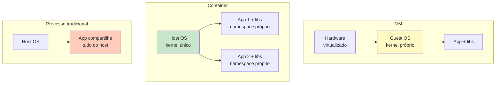
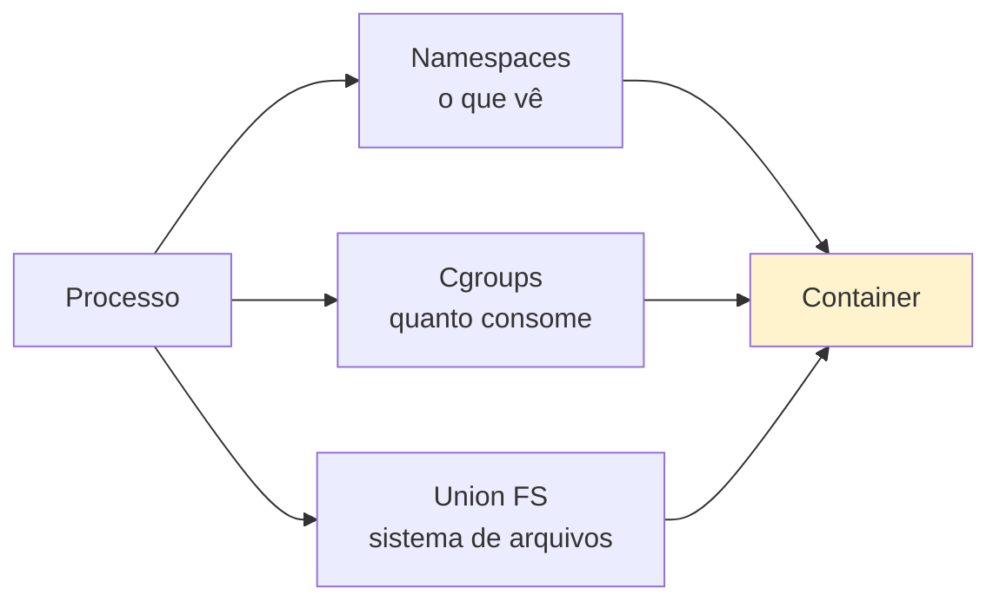

# Bloco 1 — Fundamentos de Containers

> **Duração estimada:** 60 a 70 minutos. Inclui um script Python que inspeciona namespaces de processos.

Antes de escrever o primeiro `Dockerfile`, você precisa entender **o que um contêiner realmente é** — porque metade dos bugs e **todas as surpresas de segurança** vêm de intuições erradas nesse nível.

---

## 1. O que NÃO é um container

Três concepções erradas muito comuns:

| Concepção popular | Por que está errada |
|--------------------|---------------------|
| "Container é uma VM leve." | VM virtualiza **hardware** e roda **seu próprio kernel**. Container **compartilha o kernel do host** — é um processo. |
| "Container é `chroot` melhorado." | `chroot` isola FS; container isola FS **+ rede + PIDs + usuários + IPC + mount table + UTS**. |
| "Container é um zip de aplicação." | A parte "zip" existe (imagem), mas o **runtime** que impõe isolação é o que torna contêiner seguro(ish). |

**Definição operacional (Liz Rice, 2020):**

> *"A container is a process running on the host, isolated from other processes by means of Linux namespaces, cgroups, and layered filesystems."*

---

## 2. Container vs VM vs processo



Comparativo rápido:

| Aspecto | VM | Container | Processo |
|---------|----|-----------|----------|
| Kernel próprio | Sim | Não — compartilha host | Não |
| Tempo de start | 30s - minutos | < 1s | < 100ms |
| Overhead de memória | GBs | MBs | KBs |
| Isolação | Forte (hypervisor) | Média (kernel, vulnerável a escapes) | Nenhuma |
| Densidade (quantos por host) | Dezenas | Centenas/milhares | — |
| Portabilidade da imagem | Alta (OVA, AMI) | Altíssima (OCI) | Baixa (binário) |
| Ferramentas | VMware, KVM, VirtualBox | Docker, Podman, containerd | OS |

**Quando usar o quê?**

- **VM**: quando precisa de kernel diferente do host (rodar Windows em Linux, ou vice-versa), ou **isolação reforçada** contra escape (serviços multitenant críticos).
- **Container**: todo resto. Portável, denso, rápido.
- **Processo**: desenvolvimento local simples, scripts únicos.

---

## 3. As 3 primitivas do Linux por baixo

Container existe porque **o kernel Linux oferece 3 mecanismos** que, combinados, dão a ilusão de isolamento.

### 3.1 Namespaces — "o que o processo vê"

Namespace é uma forma de **restringir a visão** do processo. Cada namespace isola um "espaço de nomes" do sistema operacional.

| Namespace | O que isola | Efeito |
|-----------|-------------|--------|
| **PID** | Identificadores de processo | `ps` dentro do container mostra só processos do container; PID 1 dentro = init do container |
| **MNT** | Pontos de montagem | FS próprio (`/`, `/usr`, etc.) sem ver o do host |
| **NET** | Interfaces, tabelas de rota, portas | Container pode ter seu IP, sua `lo`, sem ver `eth0` do host |
| **UTS** | Hostname e domain | `hostname` dentro pode ser diferente |
| **IPC** | Memória compartilhada, filas SysV | IPC isolada |
| **USER** | UIDs/GIDs | Usuário pode ser root **dentro** mas mapeado a UID não-privilegiado no host |
| **CGROUP** | Árvore de cgroups visível | Processo só enxerga seu próprio cgroup |
| **TIME** (recente) | `CLOCK_MONOTONIC` e `CLOCK_BOOTTIME` | Tempo independente — menos usado |

### 3.2 Cgroups (v2) — "quanto o processo pode consumir"

Cgroups (**control groups**) **limitam e contabilizam** recursos consumidos por um grupo de processos.

| Controller | O que limita |
|------------|--------------|
| **cpu** | Quotas de CPU (ex.: 0.5 core) |
| **memory** | RSS máximo; OOM kill quando ultrapassa |
| **pids** | Número máximo de processos (defesa contra fork bomb) |
| **io** | IOPS, bandwidth de disco |
| **net_cls/net_prio** | Classificação de tráfego de rede |

> **Sem cgroups, um container poderia consumir toda a CPU ou memória do host.** Por isso o Sintoma 4 da CodeLab ("limites escorregam") é grave — `ulimit` é insuficiente; cgroups são a resposta.

### 3.3 Union Filesystems — "camadas empilhadas"

Sistema de arquivos **sobreposto** (overlay): camadas empilhadas onde a de cima "vence" conflitos e as de baixo são **somente-leitura**.

```
┌──────────────────────────────┐  ← container layer (R/W)
├──────────────────────────────┤  ← image layer 3
├──────────────────────────────┤  ← image layer 2
├──────────────────────────────┤  ← image layer 1 (base)
└──────────────────────────────┘
```

Implementações:

- **overlayfs** — padrão moderno do Docker.
- **aufs** — antigo, descontinuado na maioria dos hosts.
- **btrfs / zfs** — alternativas baseadas em snapshots.

Propriedades importantes:

- **Cache**: layers iguais entre imagens são **compartilhados** no disco e na rede.
- **Copy-on-write**: quando o container escreve, a alteração vai para a camada R/W — a imagem original permanece imutável.
- **Imutabilidade**: as layers de imagem são hasheadas (`sha256:...`) e nunca mudam. Cada `FROM`/`RUN`/`COPY` gera uma nova layer.

### 3.4 Juntando as três



Container **é** essa combinação em execução. O runtime (`runc`, `crun`) é quem faz as chamadas de sistema (`clone(CLONE_NEW*)`, `setns`, `unshare`) que criam essa realidade.

---

## 4. Imagem vs container

**Imagem:**

- Template **imutável** em disco.
- Formada por **camadas** (layers) identificadas por hash.
- Tem um **manifest** com metadados: comando default, portas, variáveis de ambiente, labels.
- Especificada por **OCI Image Spec** ([github.com/opencontainers/image-spec](https://github.com/opencontainers/image-spec)).

**Container:**

- **Instância em execução** de uma imagem.
- Tem uma camada R/W por cima das camadas da imagem.
- Criado, iniciado, pausado, parado, removido — **ciclo de vida independente** da imagem.

Analogia consagrada: imagem : container :: classe : objeto.

---

## 5. OCI — Open Container Initiative

Em 2015, Docker, CoreOS e outros criaram a **OCI** para formalizar padrões abertos — evitando que "container" virasse sinônimo exclusivo de "Docker".

A OCI publica **3 especificações**:

1. **Image Specification** — formato da imagem em disco e no registry.
2. **Runtime Specification** — como um runtime recebe uma imagem descompactada (`config.json`) e cria um container.
3. **Distribution Specification** — protocolo HTTP(S) do registry.

**Na prática:** **Docker**, **Podman**, **containerd**, **CRI-O** — todos produzem e consomem imagens **OCI compatíveis**. Você pode construir com Docker e rodar em Podman; subir para GHCR e puxar em Kubernetes (via containerd).

---

## 6. Script Python — inspecionando namespaces reais

Aprender vendo: um script que lê `/proc/<pid>/ns/*` para mostrar os namespaces de um processo. Funciona em qualquer Linux — **sem Docker**.

### `inspect_namespaces.py`

```python
"""inspect_namespaces.py — mostra os namespaces de um processo Linux.

Uso:
  # seu próprio shell
  python inspect_namespaces.py

  # um PID específico
  python inspect_namespaces.py 1

  # comparar dois PIDs (ex.: shell vs processo dentro de container)
  python inspect_namespaces.py 1234 --compare 5678
"""
from __future__ import annotations

import argparse
import os
import sys
from dataclasses import dataclass
from pathlib import Path


NAMESPACES = [
    "cgroup",
    "ipc",
    "mnt",
    "net",
    "pid",
    "time",
    "user",
    "uts",
]


@dataclass(frozen=True)
class ProcNamespaces:
    pid: int
    inodes: dict[str, str]  # ns name -> inode string (ou '?' se inacessível)

    @classmethod
    def of(cls, pid: int) -> "ProcNamespaces":
        base = Path(f"/proc/{pid}/ns")
        inodes: dict[str, str] = {}
        for ns in NAMESPACES:
            p = base / ns
            try:
                target = os.readlink(p)
                # format: "net:[4026531993]"
                inode = target.split("[")[-1].rstrip("]")
                inodes[ns] = inode
            except (FileNotFoundError, PermissionError):
                inodes[ns] = "?"
            except OSError:
                inodes[ns] = "?"
        return cls(pid=pid, inodes=inodes)


def imprimir_um(p: ProcNamespaces) -> None:
    print(f"\n=== PID {p.pid} ===")
    for ns in NAMESPACES:
        print(f"  {ns:<8} {p.inodes[ns]}")


def imprimir_diff(a: ProcNamespaces, b: ProcNamespaces) -> None:
    print(f"\n=== Comparação PID {a.pid} vs PID {b.pid} ===")
    print(f"{'namespace':<10} {str(a.pid):>10}  {str(b.pid):>10}  diferente?")
    print("-" * 50)
    for ns in NAMESPACES:
        av, bv = a.inodes[ns], b.inodes[ns]
        diff = "SIM" if av != bv and "?" not in (av, bv) else ""
        print(f"{ns:<10} {av:>10}  {bv:>10}  {diff}")


def main(argv: list[str] | None = None) -> int:
    p = argparse.ArgumentParser(description=__doc__)
    p.add_argument("pid", nargs="?", type=int, default=os.getpid())
    p.add_argument("--compare", type=int, default=None)
    args = p.parse_args(argv)

    if sys.platform != "linux":
        print("Este script requer Linux.", file=sys.stderr)
        return 2

    a = ProcNamespaces.of(args.pid)
    if args.compare is None:
        imprimir_um(a)
    else:
        b = ProcNamespaces.of(args.compare)
        imprimir_um(a)
        imprimir_um(b)
        imprimir_diff(a, b)
    return 0


if __name__ == "__main__":
    sys.exit(main())
```

### Exercício prático — rodando

**1.** Inspecione seu shell:

```bash
python inspect_namespaces.py
```

Saída típica (Linux nativo, sem container):

```
=== PID 12345 ===
  cgroup   4026531835
  ipc      4026531839
  mnt      4026531840
  net      4026531992
  pid      4026531836
  time     4026531834
  user     4026531837
  uts      4026531838
```

**2.** Agora inicie um container e compare:

```bash
# terminal 1
docker run --rm --name c1 -it alpine sleep 600

# terminal 2
PID_CT=$(docker inspect --format '{{.State.Pid}}' c1)
python inspect_namespaces.py $$ --compare "$PID_CT"
```

Saída esperada (resumida):

```
=== Comparação PID 12345 vs PID 54321 ===
namespace       12345       54321  diferente?
--------------------------------------------------
cgroup    4026531835  4026532678  SIM
ipc       4026531839  4026532672  SIM
mnt       4026531840  4026532670  SIM
net       4026531992  4026532677  SIM
pid       4026531836  4026532673  SIM
time      4026531834  4026531834
user      4026531837  4026531837      ← MESMO usuário namespace!
uts       4026531838  4026532669  SIM
```

**Observação crítica (Sintoma 3 da CodeLab):** o namespace **user** é **igual** entre host e container — significa que root dentro do container é root no host. Por padrão, Docker **não usa user namespaces separados**. Isso é tratado no Bloco 4 (rootless, user-ns remap).

---

## 7. Limites de isolamento — o que containers **NÃO** protegem

Princípio: **container não é sandbox de segurança robusto** sem medidas adicionais. Diferente de VM, o kernel é **compartilhado**. Se há um CVE no kernel, **todas as imagens** rodando nele podem ser afetadas.

Vetores de risco clássicos:

1. **Kernel exploit**: CVE no kernel → root em container pode virar root no host.
2. **Escape por `/proc/self/exe` + privilégios**: CVE-2019-5736 no `runc` foi um exemplo real.
3. **`docker.sock` montado no container**: deploy de container dá controle total do Docker → do host.
4. **`--privileged`**: desabilita praticamente todas as proteções. Nunca em produção.
5. **Containers com `--net=host`**: perde isolação de rede; volta a ser "processo normal".
6. **Capabilities default demais**: sem `--cap-drop=ALL`, container herda mais do que precisa.

**Boas práticas no Bloco 4** mitigam muito, mas não tudo. Para **multitenant de código não-confiável** (exatamente a CodeLab), pode ser necessário camada adicional:

- **gVisor** (Google) — reexecuta syscalls em user-space.
- **Kata Containers** — containers "dentro" de microVMs (melhor de dois mundos).
- **Firecracker** (AWS Lambda) — microVM ultra-rápida.

Nenhum deles é coberto em profundidade neste módulo — mas **você deve saber que existem** quando a pergunta "containers são suficientes para isolar código não-confiável?" aparecer na entrevista ou no projeto.

---

## 8. Do cenário CodeLab ao que virá

| Sintoma | Causa identificada | Onde resolve |
|---------|--------------------|---------------|
| 1 — Drift de ambiente | Ambientes configurados à mão, no host | Bloco 2 (Dockerfile fixa tudo) |
| 2 — "Funciona na máquina do dev" | Dependências no host ≠ produção | Bloco 2 e Bloco 3 (Compose) |
| 3 — Isolamento fraco | `chroot`/usuário não bastam; precisa namespaces + cgroups + restrições | Bloco 4 (segurança + runtime flags) |
| 4 — Limites escorregadios | `ulimit` ≠ cgroups | Bloco 3 (Compose: `mem_limit`, `cpus`) e Bloco 4 |
| 7 — Sem artefato portável | VM de 14 GB ≠ imagem OCI de 80 MB | Bloco 2 (imagens pequenas) |

---

## Resumo do bloco

- **Container = processo** do host, com a visão restringida por **namespaces**, os recursos limitados por **cgroups** e o FS sobreposto por **union filesystem**.
- **Container ≠ VM leve**: kernel é compartilhado. Isso é poder e risco.
- **OCI** padroniza imagem, runtime e distribuição.
- Imagem é imutável (camadas hasheadas); container é instância efêmera.
- Namespaces isolam: PID, MNT, NET, UTS, IPC, USER, CGROUP. Cada um é **separável**.
- `inspect_namespaces.py` permite **ver com os próprios olhos** o isolamento.
- Containers **não** são sandbox absoluto: kernel exploits, `--privileged`, `docker.sock` montado são vetores reais.

---

## Próximo passo

- Faça os **[exercícios resolvidos do Bloco 1](01-exercicios-resolvidos.md)**.
- Avance para o **[Bloco 2 — Dockerfile e boas práticas](../bloco-2/02-dockerfile-boas-praticas.md)**.

---

## Referências deste bloco

- **Rice, L.** *Container Security.* O'Reilly, 2020. Caps. 3-5.
- **Kane, S. P.; Matthias, K.** *Docker — Up & Running.* 3ª ed. O'Reilly, 2023. Caps. 1-2.
- **OCI Image Specification:** [github.com/opencontainers/image-spec](https://github.com/opencontainers/image-spec).
- **OCI Runtime Specification:** [github.com/opencontainers/runtime-spec](https://github.com/opencontainers/runtime-spec).
- **Linux Kernel — Namespaces (7):** `man 7 namespaces`.
- **Linux Kernel — cgroups (7):** `man 7 cgroups`.
- **Evans, J.** *"How containers work."* [jvns.ca/blog/2016/10/10/what-even-is-a-container](https://jvns.ca/blog/2016/10/10/what-even-is-a-container/).
- **NIST SP 800-190** — *Application Container Security Guide*, 2019.

---

<!-- nav:start -->

| &nbsp; | &nbsp; | &nbsp; |
|:--|:--:|--:|
| **← Anterior**<br>[Cenário PBL — Problema Norteador do Módulo](../00-cenario-pbl.md) | **↑ Índice**<br>[Módulo 5 — Containers e orquestração](../README.md) | **Próximo →**<br>[Exercícios Resolvidos — Bloco 1](01-exercicios-resolvidos.md) |

<!-- nav:end -->
