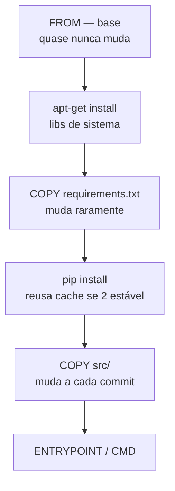

# Bloco 2 — Dockerfile e Boas Práticas

> **Duração estimada:** 75 a 90 minutos. Inclui script Python `analyze_dockerfile.py` que inspeciona um `Dockerfile` e aponta más práticas.

O `Dockerfile` parece simples — uma sequência de instruções. Mas a diferença entre um Dockerfile ingênuo e um idiomático afeta **tempo de build** (minutos vs segundos em cache), **tamanho da imagem** (GB vs MB), **segurança** (root vs não-root) e **velocidade de deploy** (pull rápido ou lento).

Neste bloco, você vai escrever `Dockerfiles` para a CodeLab que são **pequenos, rápidos de construir e seguros por padrão**.

---

## 1. Anatomia de um Dockerfile

Um `Dockerfile` é um **script declarativo**. Cada instrução gera (tipicamente) uma **camada** imutável na imagem final.

Instruções mais comuns:

| Instrução | Função |
|-----------|--------|
| `FROM` | Define a imagem base. Pode haver múltiplas em multi-stage. |
| `WORKDIR` | Define o diretório de trabalho. |
| `COPY` | Copia arquivos do contexto de build para a imagem. |
| `RUN` | Executa um comando **no build** (não em runtime). |
| `ENV` | Define variável de ambiente no processo final. |
| `ARG` | Argumento disponível apenas durante o build. |
| `EXPOSE` | Documenta a porta exposta (não publica — só metadata). |
| `USER` | Define o UID/GID com que o processo do container vai rodar. |
| `ENTRYPOINT` | Binário "fixo" do container; `CMD` vira argumento default. |
| `CMD` | Comando default executado. Sobrescrevível. |
| `HEALTHCHECK` | Comando que o Docker usa para decidir se o container está saudável. |
| `LABEL` | Metadata (versão, autor, licença, OCI labels). |

---

## 2. Um primeiro Dockerfile (ingênuo) para o runner Python da CodeLab

```dockerfile
FROM python:3.12
WORKDIR /app
COPY . /app
RUN pip install -r requirements.txt
CMD ["python", "runner.py"]
```

Tem **7 problemas**. Vamos listá-los.

1. **Tag genérica `python:3.12`** — imagem gigante (~1 GB) com ferramental desnecessário.
2. **Sem `.dockerignore`** — `COPY . /app` copia `.git`, `__pycache__`, credenciais, resultados de testes...
3. **Dependências juntas do código** — qualquer mudança de código **invalida** o cache de `pip install`.
4. **Sem `--no-cache-dir` em pip** — deixa cache do pip inflando a imagem.
5. **Sem `USER`** — roda como root.
6. **Sem `HEALTHCHECK`**.
7. **`FROM python:3.12`** (tag rolante!) — builds não são reproduzíveis; amanhã pode ser outra versão.

---

## 3. Ordenando camadas — o tesouro do cache

Cada instrução produz uma layer. O Docker **reaproveita** uma layer se a instrução **e** seus insumos forem idênticos.

Implicação crítica: **ordene do menos ao mais volátil.**



Resultado: um `git commit -am 'fix typo'` no código **não** refaz `pip install`. Build de 4 minutos cai para 15s.

Dockerfile **corrigido parcialmente**:

```dockerfile
FROM python:3.12-slim

WORKDIR /app

# dependências estáveis PRIMEIRO
COPY requirements.txt .
RUN pip install --no-cache-dir -r requirements.txt

# código DEPOIS
COPY src/ ./src/

CMD ["python", "-m", "src.runner"]
```

Ainda falta pin de versão, não-root, multi-stage, healthcheck...

---

## 4. Multi-stage builds — build-only vs runtime-only

**Ideia:** separar o ambiente que **constrói** (compilador, linters, ferramentas de build) do ambiente que **executa**. Só a etapa final vai para o registry.

### 4.1 Exemplo: Go estaticamente linkado

```dockerfile
# ---- build stage ----
FROM golang:1.22-alpine AS builder
WORKDIR /src
COPY go.mod go.sum ./
RUN go mod download
COPY . .
RUN CGO_ENABLED=0 go build -ldflags="-s -w" -o /out/judge ./cmd/judge

# ---- final stage ----
FROM gcr.io/distroless/static-debian12:nonroot
COPY --from=builder /out/judge /judge
USER nonroot:nonroot
ENTRYPOINT ["/judge"]
```

Imagem final: **~10 MB**. Sem shell, sem pacotes — **superfície de ataque quase nula**.

### 4.2 Exemplo: Python com wheel cache

```dockerfile
# ---- build stage ----
FROM python:3.12-slim AS builder
ENV PIP_NO_CACHE_DIR=1 \
    PIP_DISABLE_PIP_VERSION_CHECK=1 \
    PYTHONDONTWRITEBYTECODE=1

WORKDIR /app
COPY requirements.txt .
RUN pip install --prefix=/install -r requirements.txt

# ---- final stage ----
FROM python:3.12-slim

ENV PYTHONUNBUFFERED=1

RUN groupadd --system app && useradd --system --gid app --home /app --shell /sbin/nologin app

WORKDIR /app
COPY --from=builder /install /usr/local
COPY --chown=app:app src/ ./src/

USER app

EXPOSE 8000

HEALTHCHECK --interval=30s --timeout=3s --retries=3 \
  CMD python -c "import urllib.request; urllib.request.urlopen('http://127.0.0.1:8000/health').read()" || exit 1

CMD ["python", "-m", "src.runner"]
```

Agora temos:

- Dependências compiladas/baixadas em `builder`; imagem final tem só as libs instaladas.
- Usuário não-root (`app`).
- `HEALTHCHECK` documentado.
- Variáveis de ambiente úteis para Python em container (desligar pyc, desbufferar stdout).
- Tamanho: ~150 MB (contra ~1 GB do ingênuo).

---

## 5. Escolhendo a imagem base

| Base | Tamanho aprox. | Quando usar |
|------|----------------|-------------|
| `python:3.12` | ~1 GB | **Quase nunca.** Debian completo. |
| `python:3.12-slim` | ~130 MB | Default razoável. Tem `apt`, shell, glibc. |
| `python:3.12-alpine` | ~55 MB | Menor. **Cuidado:** musl libc rompe alguns wheels Python (precisa compilar C). |
| `gcr.io/distroless/python3` | ~50 MB | **Sem shell**, sem gerenciador de pacotes. Ótima para produção quando você **não** precisa debugar dentro. |
| `scratch` | 0 MB | Só para binários estáticos (Go, Rust). |

Regra prática:

- **Desenvolvimento e CI**: `slim` — ganha tempo de debug.
- **Produção de web apps Python**: `slim` fixo em versão; distroless se quiser reduzir superfície.
- **Produção de binários Go/Rust**: distroless ou `scratch`.
- **Runners da CodeLab** (código de aluno): imagem **específica para cada linguagem**, mínima.

### Pin de versão

**Nunca** use `python:3.12` em produção. Use no mínimo **minor+patch** pinado:

```dockerfile
FROM python:3.12.7-slim-bookworm
```

Para garantir máxima reprodutibilidade, **pinne por digest**:

```dockerfile
FROM python:3.12.7-slim-bookworm@sha256:abc123...
```

Com digest, mesmo que a tag seja re-publicada, você puxa exatamente o bit-a-bit original.

---

## 6. `.dockerignore` — tão importante quanto o Dockerfile

`COPY . /app` respeita `.dockerignore` do diretório de contexto. Sem ele, você copia **tudo** — inclusive:

- `.git` (pesado, pode vazar histórico).
- `__pycache__`, `*.pyc` (invalidam cache inutilmente).
- `node_modules` (se houver; gigantesco).
- `.env`, `credentials.json` (segredos **dentro da imagem**!).
- Saídas de teste, cobertura, IDE.

### `.dockerignore` recomendado para a CodeLab (Python)

```gitignore
# VCS
.git
.gitignore
.gitattributes

# Python artifacts
__pycache__
*.pyc
*.pyo
*.egg-info
.pytest_cache
.ruff_cache
.mypy_cache
htmlcov
.coverage
coverage.xml

# Virtual envs
.venv
venv
env

# IDE
.idea
.vscode
*.swp

# Docs/CI/Containers locais
docs
.github
docker-compose*.yml
Dockerfile*
!Dockerfile
!docker/Dockerfile*

# Segredos
.env
.env.*
*.key
*.pem

# OS
.DS_Store
Thumbs.db
```

**Verificar o que vai para o contexto:**

```bash
docker build --progress=plain -t test:sonda .
# ou, mais direto:
docker build --no-cache -t teste . 2>&1 | head -20
```

Em Docker BuildKit, `--secret`/`--ssh` substituem segredos embutidos corretamente — veja Bloco 4.

---

## 7. Usuário não-root

**Por padrão, o container roda como UID 0 (root) do host** (sem user namespace remap).

Vetor: um CVE no app → `remote code execution` → atacante tem **root no container**. Sem user-ns separado, é root **no host** (em caso de escape).

**Mitigação mínima: SEMPRE terminar o Dockerfile com `USER` não-root.**

```dockerfile
RUN groupadd --system app && useradd --system --gid app --home /app --shell /sbin/nologin app
USER app
```

Ou, se preferir UIDs numéricos (útil em Kubernetes com `runAsUser`):

```dockerfile
USER 10001:10001
```

**Cuidado com permissões de arquivos:**

```dockerfile
COPY --chown=app:app src/ ./src/
```

Sem `--chown`, os arquivos ficam de `root:root` e o usuário `app` não pode escrever neles (o que você quer — imutabilidade é boa) mas também pode não poder **ler** se o Dockerfile fizer algo antes.

---

## 8. Segredos — o que NÃO fazer

### Errado:

```dockerfile
# Nunca, jamais, em hipótese alguma.
ENV DB_PASSWORD=s3cr3t
ENV AWS_ACCESS_KEY=AKIA...
```

Razões:

- Segredo fica **gravado na camada da imagem** — qualquer um com acesso ao registry pode fazer `docker history` e ler.
- `ENV` é visível via `docker inspect`.

### Errado, versão 2:

```dockerfile
COPY .env /app/.env
```

Pior — arquivo de segredos dentro da imagem.

### Correto:

- **Runtime**: `docker run -e DB_PASSWORD=$(cat secret)` ou docker secrets/K8s secrets.
- **Build-time** (raro): BuildKit `--secret`:
  ```dockerfile
  # syntax=docker/dockerfile:1.4
  RUN --mount=type=secret,id=mypip,target=/root/.pip/pip.conf \
      pip install -r requirements.txt
  ```
  ```bash
  docker build --secret id=mypip,src=./my-pip.conf .
  ```
  O segredo **não** fica na imagem final.

### Verificação

```bash
docker history --no-trunc minha-imagem:tag | grep -i -E "password|secret|key|token"
```

Deve retornar **zero** matches úteis.

---

## 9. `ENTRYPOINT` vs `CMD`

Três padrões comuns:

### 9.1 Só `CMD`

```dockerfile
CMD ["python", "-m", "src.runner"]
```

Usuário sobrescreve o comando inteiro:

```bash
docker run minha-imagem bash   # roda bash, não o runner
```

### 9.2 Só `ENTRYPOINT`

```dockerfile
ENTRYPOINT ["python", "-m", "src.runner"]
```

Usuário **não pode trocar o binário**, só adiciona argumentos:

```bash
docker run minha-imagem --help   # roda: python -m src.runner --help
```

Bom para containers "binário fixo".

### 9.3 `ENTRYPOINT` + `CMD`

```dockerfile
ENTRYPOINT ["python", "-m", "src.runner"]
CMD ["--port=8000"]
```

`CMD` é **argumento default** do `ENTRYPOINT`. Melhor dos dois mundos: `docker run minha-imagem` roda com `--port=8000`; `docker run minha-imagem --port=9000` troca o argumento.

**Sempre prefira a forma exec (`["...", "..."]`)** em vez da forma shell (`CMD python -m src.runner`). Na forma shell, `PID 1` é `/bin/sh -c '...'` e **sinais** (SIGTERM) não são propagados corretamente ao seu processo — aplicações não conseguem desligar graciosamente.

---

## 10. `HEALTHCHECK` — o que o container acha de si mesmo

```dockerfile
HEALTHCHECK --interval=30s --timeout=3s --start-period=5s --retries=3 \
  CMD curl -fsS http://localhost:8000/health || exit 1
```

Parâmetros:

- `--interval` — de quanto em quanto tempo checar.
- `--timeout` — quanto a checagem pode durar.
- `--start-period` — tempo de graça no startup (não considerar falha).
- `--retries` — quantas falhas consecutivas antes de marcar unhealthy.

Estados: `starting` → `healthy` / `unhealthy`. `docker ps` mostra.

**Importante:** em Kubernetes, este healthcheck é **ignorado** — K8s usa `livenessProbe`/`readinessProbe`. Mas no **Compose** e em produção Docker direto, `HEALTHCHECK` dirige `depends_on: service_healthy`.

### Sem `curl` na imagem?

```dockerfile
HEALTHCHECK CMD python -c "import urllib.request,sys; \
  sys.exit(0 if urllib.request.urlopen('http://localhost:8000/health').status==200 else 1)"
```

Usa módulos stdlib, zero deps.

---

## 11. Labels OCI — metadata padronizada

Labels padronizados pela OCI tornam a imagem **autodescritiva** (quem fez, quando, versão, fonte):

```dockerfile
LABEL org.opencontainers.image.title="codelab-runner-python" \
      org.opencontainers.image.description="Runner isolado para código Python do aluno" \
      org.opencontainers.image.version="1.2.3" \
      org.opencontainers.image.revision="abc1234" \
      org.opencontainers.image.source="https://github.com/codelab/judge" \
      org.opencontainers.image.licenses="MIT" \
      org.opencontainers.image.created="2026-04-21T00:00:00Z"
```

Parametrize com `ARG` no CI:

```dockerfile
ARG GIT_SHA=unknown
ARG VERSION=0.0.0
LABEL org.opencontainers.image.revision=$GIT_SHA \
      org.opencontainers.image.version=$VERSION
```

```bash
docker build \
  --build-arg GIT_SHA=$(git rev-parse --short HEAD) \
  --build-arg VERSION=$(cat VERSION) \
  -t ghcr.io/codelab/runner-python:$(cat VERSION) .
```

---

## 12. Dockerfile final do runner Python da CodeLab

Trazendo tudo junto:

```dockerfile
# syntax=docker/dockerfile:1.6
ARG PYTHON_VERSION=3.12.7

# ---- build stage ----
FROM python:${PYTHON_VERSION}-slim-bookworm AS builder

ENV PIP_NO_CACHE_DIR=1 \
    PIP_DISABLE_PIP_VERSION_CHECK=1 \
    PYTHONDONTWRITEBYTECODE=1

WORKDIR /build

COPY requirements.txt .
RUN pip install --prefix=/install -r requirements.txt

# ---- final stage ----
FROM python:${PYTHON_VERSION}-slim-bookworm

ARG GIT_SHA=unknown
ARG VERSION=0.0.0

LABEL org.opencontainers.image.title="codelab-runner-python" \
      org.opencontainers.image.description="Runner isolado para código Python do aluno" \
      org.opencontainers.image.version=$VERSION \
      org.opencontainers.image.revision=$GIT_SHA \
      org.opencontainers.image.source="https://github.com/codelab/judge" \
      org.opencontainers.image.licenses="MIT"

ENV PYTHONUNBUFFERED=1 \
    PYTHONDONTWRITEBYTECODE=1

RUN groupadd --system --gid 10001 runner \
 && useradd  --system --uid 10001 --gid runner --home /runner --shell /sbin/nologin runner \
 && mkdir -p /runner /submissao \
 && chown -R runner:runner /runner /submissao

WORKDIR /runner

COPY --from=builder /install /usr/local
COPY --chown=runner:runner src/ ./src/

USER 10001:10001

HEALTHCHECK --interval=30s --timeout=3s --start-period=5s --retries=3 \
  CMD python -c "import urllib.request,sys; \
     sys.exit(0 if urllib.request.urlopen('http://127.0.0.1:8000/health').status==200 else 1)"

EXPOSE 8000

ENTRYPOINT ["python", "-m", "src.runner"]
CMD ["--port=8000"]
```

### Build reproduzível

```bash
docker build \
  --build-arg PYTHON_VERSION=3.12.7 \
  --build-arg GIT_SHA=$(git rev-parse --short HEAD) \
  --build-arg VERSION=$(cat VERSION) \
  -t ghcr.io/codelab/runner-python:$(cat VERSION) \
  -f docker/runner-python.Dockerfile \
  .
```

---

## 13. Script — `analyze_dockerfile.py`

Analisador **estático** de Dockerfile que aponta más práticas. Serve para:

- Validar seus próprios Dockerfiles antes do PR.
- Integrar num pre-commit / CI leve.
- Aprender padrões ruins procurando-os.

```python
"""analyze_dockerfile.py — lint simples de Dockerfile.

Uso:
  python analyze_dockerfile.py path/to/Dockerfile
"""
from __future__ import annotations

import argparse
import re
import sys
from dataclasses import dataclass, field
from pathlib import Path


@dataclass
class Achado:
    severidade: str  # "ERRO", "AVISO", "INFO"
    linha: int
    regra: str
    mensagem: str


@dataclass
class Analise:
    achados: list[Achado] = field(default_factory=list)

    @property
    def tem_erros(self) -> bool:
        return any(a.severidade == "ERRO" for a in self.achados)

    def registrar(self, severidade, linha, regra, mensagem):
        self.achados.append(Achado(severidade, linha, regra, mensagem))


RE_FROM = re.compile(r"^\s*FROM\s+(?P<ref>\S+)", re.IGNORECASE)
RE_USER = re.compile(r"^\s*USER\s+(?P<u>\S+)", re.IGNORECASE)
RE_RUN = re.compile(r"^\s*RUN\s+(?P<cmd>.+)", re.IGNORECASE)
RE_COPY_DOT = re.compile(r"^\s*COPY\s+\.\s+", re.IGNORECASE)
RE_ADD = re.compile(r"^\s*ADD\s+", re.IGNORECASE)
RE_HEALTH = re.compile(r"^\s*HEALTHCHECK\s+", re.IGNORECASE)
RE_CMD_SHELL = re.compile(r"^\s*CMD\s+[^\[]", re.IGNORECASE)
RE_ENTRYPOINT_SHELL = re.compile(r"^\s*ENTRYPOINT\s+[^\[]", re.IGNORECASE)
RE_ENV_SECRET = re.compile(
    r"^\s*ENV\s+.*(PASSWORD|SECRET|TOKEN|API_KEY|AWS_ACCESS_KEY|AWS_SECRET)",
    re.IGNORECASE,
)
RE_LATEST = re.compile(r":latest(\s|$)", re.IGNORECASE)
RE_NO_TAG = re.compile(r"^\s*FROM\s+[^:\s@]+\s*$", re.IGNORECASE)


def _ler(path: Path) -> list[str]:
    linhas_logicas: list[str] = []
    buffer = ""
    for raw in path.read_text(encoding="utf-8").splitlines():
        s = raw.rstrip()
        if s.endswith("\\"):
            buffer += s[:-1] + " "
            continue
        buffer += s
        linhas_logicas.append(buffer)
        buffer = ""
    if buffer:
        linhas_logicas.append(buffer)
    return linhas_logicas


def analisar(caminho: Path) -> Analise:
    a = Analise()
    linhas = _ler(caminho)

    tem_user_nao_root = False
    tem_healthcheck = False
    stages = 0
    user_final = None

    for i, linha in enumerate(linhas, start=1):
        stripped = linha.strip()
        if not stripped or stripped.startswith("#"):
            continue

        # FROM
        m = RE_FROM.match(linha)
        if m:
            stages += 1
            ref = m.group("ref")
            if ref.endswith(":latest"):
                a.registrar("ERRO", i, "base-latest",
                            f"FROM {ref} — tag 'latest' é instável; pinne versão.")
            elif RE_NO_TAG.match(linha):
                a.registrar("ERRO", i, "base-sem-tag",
                            f"FROM {ref} sem tag — idêntico a :latest.")
            elif "@sha256:" not in ref and ":" in ref:
                if not re.search(r":\d+\.\d+\.\d+", ref):
                    a.registrar("AVISO", i, "base-tag-imprecisa",
                                f"FROM {ref} — considere pinning de patch (ex.: 3.12.7) ou digest.")

        # USER
        m = RE_USER.match(linha)
        if m:
            u = m.group("u")
            user_final = u
            if u == "root" or u == "0" or u.startswith("0:"):
                a.registrar("ERRO", i, "user-root",
                            "USER root — container rodaria como root. Crie usuário não-privilegiado.")
            else:
                tem_user_nao_root = True

        # RUN apt-get sem limpeza
        m = RE_RUN.match(linha)
        if m:
            cmd = m.group("cmd").lower()
            if "apt-get install" in cmd or "apt install" in cmd:
                if "-y" not in cmd:
                    a.registrar("AVISO", i, "apt-sem-y",
                                "apt-get install sem -y — build pode travar interativamente.")
                if "rm -rf /var/lib/apt/lists" not in cmd:
                    a.registrar("AVISO", i, "apt-sem-limpeza",
                                "apt-get install sem 'rm -rf /var/lib/apt/lists/*' na MESMA RUN.")
                if "--no-install-recommends" not in cmd:
                    a.registrar("AVISO", i, "apt-recommends",
                                "Considere --no-install-recommends para reduzir imagem.")
            if "pip install" in cmd and "--no-cache-dir" not in cmd:
                a.registrar("AVISO", i, "pip-cache",
                            "pip install sem --no-cache-dir — cache fica na imagem.")
            if "curl " in cmd and "| bash" in cmd:
                a.registrar("AVISO", i, "curl-bash",
                            "curl | bash instala sem verificação. Prefira pacotes ou hash.")

        # COPY . (tudo)
        if RE_COPY_DOT.match(linha):
            a.registrar("AVISO", i, "copy-tudo",
                        "COPY . copia o contexto inteiro. Verifique se há .dockerignore adequado.")

        # ADD (prefira COPY)
        if RE_ADD.match(linha):
            if not re.search(r"https?://|\.tar", stripped, re.IGNORECASE):
                a.registrar("AVISO", i, "add-vs-copy",
                            "ADD sem URL/tar deveria ser COPY — semântica mais previsível.")

        # HEALTHCHECK
        if RE_HEALTH.match(linha):
            tem_healthcheck = True

        # CMD/ENTRYPOINT shell-form
        if RE_CMD_SHELL.match(linha):
            a.registrar("AVISO", i, "cmd-shell",
                        "CMD em forma shell — sinais (SIGTERM) não são propagados. Use forma exec.")
        if RE_ENTRYPOINT_SHELL.match(linha):
            a.registrar("AVISO", i, "entrypoint-shell",
                        "ENTRYPOINT em forma shell — mesmo problema de sinais.")

        # ENV com segredo
        if RE_ENV_SECRET.match(linha):
            a.registrar("ERRO", i, "env-segredo",
                        "Variável que parece segredo definida via ENV — fica gravada na imagem.")

        # latest em qualquer lugar
        if RE_LATEST.search(linha):
            a.registrar("AVISO", i, "latest",
                        "':latest' detectada — evite em builds reproduzíveis.")

    # Verificações globais
    if not tem_user_nao_root:
        a.registrar("ERRO", 0, "sem-user",
                    "Nenhum USER não-root definido — container roda como root por padrão.")
    if not tem_healthcheck:
        a.registrar("AVISO", 0, "sem-healthcheck",
                    "Sem HEALTHCHECK — Docker/Compose não saberá se o container está saudável.")
    if stages == 1:
        a.registrar("INFO", 0, "single-stage",
                    "Imagem single-stage — avalie multi-stage para reduzir tamanho.")

    return a


def _cor(sev: str) -> str:
    return {"ERRO": "\033[31m", "AVISO": "\033[33m", "INFO": "\033[36m"}.get(sev, "")


def main(argv: list[str] | None = None) -> int:
    p = argparse.ArgumentParser()
    p.add_argument("arquivo", type=Path)
    p.add_argument("--sem-cor", action="store_true")
    args = p.parse_args(argv)

    if not args.arquivo.exists():
        print(f"Arquivo não encontrado: {args.arquivo}", file=sys.stderr)
        return 2

    analise = analisar(args.arquivo)
    reset = "\033[0m" if not args.sem_cor else ""
    for achado in sorted(analise.achados, key=lambda x: (x.linha, x.severidade)):
        cor = _cor(achado.severidade) if not args.sem_cor else ""
        linha_txt = f"L{achado.linha:>3}" if achado.linha > 0 else "  -"
        print(f"{cor}[{achado.severidade:<5}]{reset} {linha_txt} {achado.regra:<20} {achado.mensagem}")

    erros = sum(1 for a in analise.achados if a.severidade == "ERRO")
    avisos = sum(1 for a in analise.achados if a.severidade == "AVISO")
    print(f"\nResumo: {erros} ERRO(s), {avisos} AVISO(s)")
    return 1 if analise.tem_erros else 0


if __name__ == "__main__":
    sys.exit(main())
```

### Rodando contra o Dockerfile "ingênuo" do início

```bash
cat > /tmp/Dockerfile.bad <<'EOF'
FROM python:3.12
WORKDIR /app
COPY . /app
RUN pip install -r requirements.txt
ENV DB_PASSWORD=senha123
CMD python runner.py
EOF

python analyze_dockerfile.py /tmp/Dockerfile.bad
```

Saída (abreviada):

```
[AVISO] L  1 base-tag-imprecisa   FROM python:3.12 — considere pinning de patch (ex.: 3.12.7) ou digest.
[AVISO] L  3 copy-tudo            COPY . copia o contexto inteiro. Verifique se há .dockerignore adequado.
[AVISO] L  4 pip-cache            pip install sem --no-cache-dir — cache fica na imagem.
[ERRO ] L  5 env-segredo          Variável que parece segredo definida via ENV — fica gravada na imagem.
[AVISO] L  6 cmd-shell            CMD em forma shell — sinais (SIGTERM) não são propagados. Use forma exec.
[ERRO ] L  0 sem-user             Nenhum USER não-root definido — container roda como root por padrão.
[AVISO] L  0 sem-healthcheck      Sem HEALTHCHECK — ...
[INFO ] L  0 single-stage         Imagem single-stage — avalie multi-stage para reduzir tamanho.

Resumo: 2 ERRO(s), 5 AVISO(s)
```

> **Observação pedagógica:** `analyze_dockerfile.py` cobre padrões clássicos. Para produção real, **use `hadolint`** (mais maduro, mais regras). O script aqui existe para você **entender o que está sendo verificado** — e estender quando quiser.

---

## 14. Pitfalls clássicos — erros que aparecem no review

| Sintoma | Causa | Correção |
|---------|-------|----------|
| **Build recomeça do zero a cada commit** | `COPY . .` antes de `pip install` | separar `COPY requirements.txt` + instalar + `COPY src/` depois |
| **Imagem de 2 GB para um app de 5 MB** | Base completa + cache + ferramental de build | slim/distroless + multi-stage |
| **`docker stop` leva 10s antes de matar** | `CMD` em shell-form: PID 1 = `/bin/sh`, ignora SIGTERM | forma exec; ou `tini` como init explícito |
| **`docker exec` mostra root mesmo após `USER app`** | `docker exec -u 0 ...` — `--user` pode ser sobrescrito | não relevante em produção — atacante que já tem `docker exec` já ganhou |
| **Segredo no `docker history`** | `ENV` com senha ou `ARG` usado em `RUN echo $SECRET` | `--secret` de BuildKit; nunca `ENV` para segredos |
| **Imagem funciona local, quebra no K8s** | Dependente de `localhost`, ou `USER` ausente faz K8s com PSS rejeitar | testar com `--read-only --user 10001` localmente |

---

## 15. Conexão com o pipeline do Módulo 4

No Módulo 4, o artefato era um `.whl`. Agora o artefato é uma **imagem OCI**. O `cd.yml` muda:

```yaml
- name: Build e push da imagem
  uses: docker/build-push-action@v5
  with:
    context: .
    file: docker/runner-python.Dockerfile
    push: true
    tags: |
      ghcr.io/codelab/runner-python:${{ github.sha }}
      ghcr.io/codelab/runner-python:v${{ steps.version.outputs.tag }}
    build-args: |
      GIT_SHA=${{ github.sha }}
      VERSION=${{ steps.version.outputs.tag }}
    cache-from: type=gha
    cache-to: type=gha,mode=max
```

**"Build once, deploy many"** continua valendo — mas agora é **promover uma imagem** (com digest estável) por ambientes, não um `.whl`. Detalhes no Bloco 4.

---

## Resumo do bloco

- Um Dockerfile idiomático é **pequeno**, **reproduzível**, **seguro** e **rápido de construir**.
- **Ordem das camadas** determina cache: estáveis em cima, voláteis embaixo.
- **Multi-stage**: separa ambiente de build do de runtime; imagem final mínima.
- **Base**: `slim` para Python; distroless/scratch para binários estáticos.
- **Sempre**: `.dockerignore`, `USER` não-root, labels OCI, tag pinada, forma exec de `CMD`/`ENTRYPOINT`.
- **Nunca**: segredos em `ENV`; `:latest` em produção; `COPY .` sem `.dockerignore`.
- `analyze_dockerfile.py` (e `hadolint`) ajudam a pegar erros antes do PR.

---

## Próximo passo

- Faça os **[exercícios resolvidos do Bloco 2](02-exercicios-resolvidos.md)**.
- Avance para o **[Bloco 3 — Docker Compose e ambientes multi-serviço](../bloco-3/03-compose-multi-servico.md)**.

---

## Referências deste bloco

- **Docker — Dockerfile best practices:** [docs.docker.com/develop/develop-images/dockerfile_best-practices/](https://docs.docker.com/develop/develop-images/dockerfile_best-practices/).
- **Kane, S. P.; Matthias, K.** *Docker — Up & Running.* 3ª ed., O'Reilly, 2023. Cap. 5.
- **Poulton, N.** *Docker Deep Dive.*
- **Distroless images:** [github.com/GoogleContainerTools/distroless](https://github.com/GoogleContainerTools/distroless).
- **Hadolint:** [github.com/hadolint/hadolint](https://github.com/hadolint/hadolint).
- **BuildKit secrets:** [docs.docker.com/build/building/secrets/](https://docs.docker.com/build/building/secrets/).
- **OCI Image Labels:** [github.com/opencontainers/image-spec/blob/main/annotations.md](https://github.com/opencontainers/image-spec/blob/main/annotations.md).
