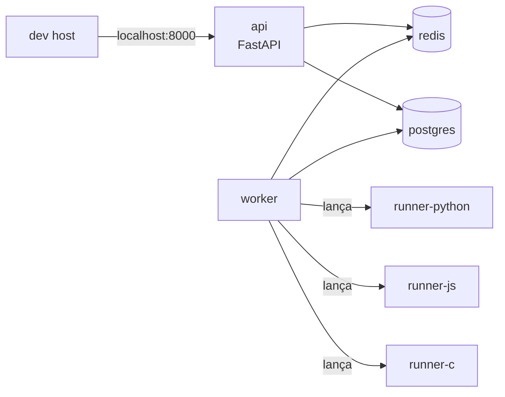

# Bloco 3 — Docker Compose e Ambientes Multi-Serviço

> **Duração estimada:** 75 minutos. Inclui o `docker-compose.yml` completo da CodeLab para sua máquina.

Dockerfile resolve "a imagem". Mas uma aplicação real tem múltiplos componentes: API, banco, cache, worker, runners. Iniciar todos à mão, conectar redes, subir na ordem certa e derrubar tudo ao final é exatamente o tipo de trabalho **tedioso e propenso a erro** que deveria ser declarativo.

**Docker Compose** é essa camada declarativa: você descreve os serviços num YAML e o Compose cuida do resto.

---

## 1. Problema que o Compose resolve

Sem Compose, subir um stack mínimo da CodeLab exige:

```bash
docker network create codelab-net
docker volume create codelab-pgdata
docker run -d --name pg --network codelab-net -v codelab-pgdata:/var/lib/postgresql/data \
  -e POSTGRES_PASSWORD=dev postgres:16-alpine
docker run -d --name redis --network codelab-net redis:7-alpine
docker run -d --name api --network codelab-net -p 8000:8000 \
  -e DATABASE_URL=postgresql://postgres:dev@pg:5432/codelab \
  -e REDIS_URL=redis://redis:6379/0 \
  codelab/api:dev
docker run -d --name worker --network codelab-net \
  -e REDIS_URL=redis://redis:6379/0 codelab/worker:dev
# ...continua para runners
```

Agora multiplique por 3 devs, 2 ambientes, CI. **Inviável manter na cabeça.** Pior: a ordem importa, não há healthcheck, não há parâmetros coerentes.

**Com Compose:**

```bash
docker compose up -d
```

Um comando. Idempotente. Declarativo. Reprodutível.

---

## 2. Anatomia do `docker-compose.yml`

```yaml
services:           # lista de serviços (cada um vira um container)
  nome:
    image: ...      # OU
    build:          # construir a partir de um Dockerfile local
      context: ./
      dockerfile: docker/api.Dockerfile

    environment:    # variáveis
      KEY: value

    env_file: .env  # OU arquivo separado

    ports:
      - "8000:8000" # host:container

    volumes:
      - ./src:/app/src          # bind mount (dev)
      - dados-pg:/var/lib/postgresql/data   # volume nomeado

    depends_on:
      db:
        condition: service_healthy

    healthcheck:
      test: ["CMD", "curl", "-f", "http://localhost:8000/health"]
      interval: 10s
      timeout: 3s
      retries: 5

    restart: unless-stopped

    deploy:
      resources:
        limits:
          cpus: "1.0"
          memory: 512M

    networks:
      - interna

volumes:            # volumes nomeados
  dados-pg:

networks:           # redes customizadas
  interna:
    driver: bridge
```

**Referência formal:** [compose-spec.io](https://compose-spec.io/).

> **Versão do arquivo Compose:** o atributo `version:` no topo está **obsoleto** desde o Compose V2. Não inclua.

---

## 3. O `compose.yml` da CodeLab

Arquitetura desejada:



### `docker-compose.yml` (base, produção-like)

```yaml
services:

  postgres:
    image: postgres:16.3-alpine
    environment:
      POSTGRES_USER: codelab
      POSTGRES_PASSWORD: ${POSTGRES_PASSWORD:-dev}
      POSTGRES_DB: codelab
    volumes:
      - pgdata:/var/lib/postgresql/data
    healthcheck:
      test: ["CMD-SHELL", "pg_isready -U codelab -d codelab"]
      interval: 5s
      timeout: 3s
      retries: 10
    networks:
      - backend
    deploy:
      resources:
        limits:
          memory: 512M

  redis:
    image: redis:7.2-alpine
    command: ["redis-server", "--save", "", "--appendonly", "no"]
    healthcheck:
      test: ["CMD", "redis-cli", "ping"]
      interval: 5s
      timeout: 3s
      retries: 10
    networks:
      - backend
    deploy:
      resources:
        limits:
          memory: 256M

  api:
    build:
      context: .
      dockerfile: docker/api.Dockerfile
    environment:
      DATABASE_URL: postgresql://codelab:${POSTGRES_PASSWORD:-dev}@postgres:5432/codelab
      REDIS_URL: redis://redis:6379/0
      ENVIRONMENT: local
    ports:
      - "${API_PORT:-8000}:8000"
    depends_on:
      postgres: { condition: service_healthy }
      redis:    { condition: service_healthy }
    healthcheck:
      test: ["CMD", "python", "-c", "import urllib.request,sys; sys.exit(0 if urllib.request.urlopen('http://127.0.0.1:8000/health').status==200 else 1)"]
      interval: 10s
      timeout: 3s
      retries: 5
      start_period: 5s
    networks:
      - backend
      - frontend

  worker:
    build:
      context: .
      dockerfile: docker/worker.Dockerfile
    environment:
      DATABASE_URL: postgresql://codelab:${POSTGRES_PASSWORD:-dev}@postgres:5432/codelab
      REDIS_URL: redis://redis:6379/0
      DOCKER_HOST: unix:///var/run/docker.sock
    volumes:
      - /var/run/docker.sock:/var/run/docker.sock  # worker precisa lançar runners
    depends_on:
      postgres: { condition: service_healthy }
      redis:    { condition: service_healthy }
    networks:
      - backend
    deploy:
      resources:
        limits:
          memory: 512M

volumes:
  pgdata:

networks:
  backend:
    driver: bridge
  frontend:
    driver: bridge
```

### Observações

- **`${POSTGRES_PASSWORD:-dev}`** — valor com default. Compose lê `.env` no diretório do arquivo.
- **`depends_on` com `condition: service_healthy`** — API só sobe quando Postgres e Redis respondem.
- **Redes separadas** (`backend` e `frontend`): apenas API está em `frontend`. Worker e DB estão só em `backend`. Isso é **defesa em profundidade** — worker não precisa ser alcançável de fora.
- **Worker com `docker.sock`** — o worker lança runners. **Isso é um risco de segurança** (controle total do Docker). Em produção, **API do Docker** restrita ou uso de sockets proxy com políticas. No Compose local, aceito.
- **Runners não são serviços permanentes** aqui — o worker os cria via API Docker, por submissão, com `--rm --network=none`. Veja Bloco 4.

### `.env` mínimo (não commitar)

```
POSTGRES_PASSWORD=dev
API_PORT=8000
```

### `.env.example` (commitado)

```
POSTGRES_PASSWORD=dev
API_PORT=8000
```

---

## 4. Override para desenvolvimento

Problema comum: em **produção** você quer a imagem pronta e estática; em **desenvolvimento** quer hot reload e bind mount do código.

O Compose carrega, além de `docker-compose.yml`, automaticamente **`docker-compose.override.yml`** — um arquivo que **sobrescreve** chaves.

### `docker-compose.override.yml` (dev)

```yaml
services:

  api:
    build:
      args:
        ENV: dev
    volumes:
      - ./src/codelab/api:/app/src/codelab/api:ro
    environment:
      UVICORN_RELOAD: "true"
      LOG_LEVEL: DEBUG
    command: ["uvicorn", "codelab.api.app:app", "--host", "0.0.0.0", "--port", "8000", "--reload"]

  worker:
    volumes:
      - ./src/codelab/worker:/app/src/codelab/worker:ro
    environment:
      LOG_LEVEL: DEBUG

  # Banco exposto LOCALMENTE apenas em dev (para rodar DBeaver, psql do host)
  postgres:
    ports:
      - "5432:5432"
```

Uso:

```bash
# Em dev, Compose mescla os dois arquivos automaticamente:
docker compose up

# Para simular produção localmente (sem o override):
docker compose -f docker-compose.yml up
```

**Regra:** `docker-compose.yml` deve ser **sozinho** capaz de rodar como produção. O override **só adiciona conforto** de dev. Nunca o contrário.

### Perfis (profiles) — ativação seletiva

```yaml
services:
  adminer:
    image: adminer:4
    ports: ["8080:8080"]
    profiles: ["tools"]
```

```bash
docker compose --profile tools up
```

Útil para ferramentas que **não devem subir** no dia a dia (pgadmin, kafka-ui, mailhog).

---

## 5. Volumes — bind mounts vs volumes nomeados

| Tipo | Exemplo | Uso |
|------|---------|-----|
| **Bind mount** | `./src:/app/src` | **Dev** — vê mudanças no host; hot reload. Fora de dev, costuma ser evitado. |
| **Volume nomeado** | `pgdata:/var/lib/postgresql/data` | **Persistência gerenciada pelo Docker**; sobrevive a `docker compose down`. |
| **Anonymous volume** | `/app/cache` (sem nome) | Container **único**; morre com o container se não nomeado. |
| **tmpfs** | `tmpfs: /tmp` | Memória. Ótima para diretórios efêmeros de alta escrita (runners da CodeLab!). |

Destruir tudo (incluindo dados):

```bash
docker compose down --volumes
```

Destruir só containers, preservando volumes:

```bash
docker compose down
```

> Dica da CodeLab: para o **runner**, monte `/tmp` como `tmpfs` com `size=64m` — código-fonte do aluno escreve lá e é apagado ao final do container.

---

## 6. Healthchecks em ação

Sem healthcheck, Compose considera o container "pronto" quando o processo está **em execução** — não quando está **servindo**.

Postgres leva ~2-4s para aceitar conexões após `docker run`. Sem healthcheck, sua API tenta conectar, falha, entra em loop de retry no melhor caso — ou cai com erro "connection refused" no pior.

### Postgres

```yaml
healthcheck:
  test: ["CMD-SHELL", "pg_isready -U codelab -d codelab"]
  interval: 5s
  timeout: 3s
  retries: 10
  start_period: 5s
```

### Redis

```yaml
healthcheck:
  test: ["CMD", "redis-cli", "ping"]
  interval: 5s
  retries: 10
```

### HTTP app

```yaml
healthcheck:
  test: ["CMD-SHELL", "curl -fsS http://localhost:8000/health || exit 1"]
```

> **`CMD` vs `CMD-SHELL`:** `CMD` recebe array sem shell (não resolve `$VAR`, não entende `|`); `CMD-SHELL` executa em `/bin/sh -c`. Use `CMD-SHELL` quando precisar de operadores shell.

### `depends_on` com condição

```yaml
depends_on:
  postgres:
    condition: service_healthy
```

`service_healthy` só é verdadeiro quando o health retorna `healthy` — portanto, API **só inicia** após Postgres responder de fato.

Outras condições:

- `service_started` — só espera o container iniciar (default, fraco).
- `service_completed_successfully` — espera container terminar com exit 0 (útil para containers de **migração**).

### Exemplo — container de migração one-shot

```yaml
services:

  migrate:
    build:
      context: .
      dockerfile: docker/api.Dockerfile
    command: ["alembic", "upgrade", "head"]
    environment:
      DATABASE_URL: postgresql://codelab:${POSTGRES_PASSWORD:-dev}@postgres:5432/codelab
    depends_on:
      postgres: { condition: service_healthy }

  api:
    depends_on:
      migrate: { condition: service_completed_successfully }
      postgres: { condition: service_healthy }
```

Agora a API só sobe **depois** das migrações aplicadas. Padrão limpo.

---

## 7. Redes

Por padrão, Compose cria **uma rede única** (`<projeto>_default`) e todos os serviços se enxergam pelo nome (`postgres`, `redis`, `api`). DNS embutido.

### Múltiplas redes — segregação

```yaml
networks:
  backend:
  frontend:

services:
  api:
    networks: [backend, frontend]
  worker:
    networks: [backend]         # não tem frontend — bom
  postgres:
    networks: [backend]
```

### Exposição de porta

- `ports: ["8000:8000"]` → publica no host.
- **Não expor** uma porta: só é acessível **pelos outros containers da mesma rede**. Melhor prática para Postgres, Redis, etc., exceto em dev.

### Rede externa

Quando você já tem uma rede criada (por exemplo, para juntar dois `compose.yml` distintos):

```yaml
networks:
  monitoramento:
    external: true
```

Útil quando separa stacks em múltiplos arquivos.

---

## 8. Limites de recursos (cgroups expostos)

```yaml
deploy:
  resources:
    limits:
      cpus: "1.0"          # 1 CPU (core)
      memory: 512M
      pids: 100
    reservations:
      memory: 128M
```

Forma mais antiga, ainda aceita (Compose V1/V2 sem Swarm):

```yaml
mem_limit: 512m
cpus: 1.0
```

**Observação:** `deploy` foi originalmente do Swarm; no Compose V2 com a spec atual, `deploy.resources.limits` é suportado sem Swarm.

Verifique no host:

```bash
docker stats
```

ou inspecionando o cgroup:

```bash
CID=$(docker inspect -f '{{.Id}}' codelab-api-1)
cat /sys/fs/cgroup/system.slice/docker-$CID.scope/memory.max 2>/dev/null || \
  cat /sys/fs/cgroup/memory/docker/$CID/memory.limit_in_bytes
```

---

## 9. Comandos essenciais do Compose

```bash
# Subir em background
docker compose up -d

# Ver logs de um serviço
docker compose logs -f api

# Entrar num container
docker compose exec api bash

# Executar comando one-shot (novo container)
docker compose run --rm api pytest -v

# Reconstruir
docker compose build --no-cache api

# Parar sem remover
docker compose stop

# Remover tudo
docker compose down

# Remover tudo + volumes (CUIDADO: perde dados)
docker compose down --volumes

# Listar status
docker compose ps
```

### Atalho via Makefile

```makefile
.PHONY: up down logs shell rebuild test

up:
	docker compose up -d

down:
	docker compose down

logs:
	docker compose logs -f --tail=100

shell:
	docker compose exec api bash

rebuild:
	docker compose build --no-cache
	docker compose up -d

test:
	docker compose run --rm api pytest -v
```

No README: "`make up`". Colaborador tem ambiente em 15 segundos.

---

## 10. Pitfalls comuns

| Sintoma | Causa | Correção |
|---------|-------|----------|
| API sobe e cai com "DB not ready" | `depends_on` sem `condition: service_healthy` | adicionar healthcheck + condition |
| `docker compose up` reconstrói toda vez | `build:` invalidando cache (ordenação) | ordenar Dockerfile; considerar `pull_policy: never` |
| Postgres parece "lento na primeira subida" | `start_period` curto | aumentar para 10-30s |
| `docker compose down` não remove `postgres:16` | network/volume persistem; imagem só via `--rmi` | `docker compose down --rmi local --volumes` |
| Variáveis `.env` não propagam | `.env` fora do diretório do compose | mover ou usar `--env-file` |
| Dev roda mas CI quebra | Override silencioso em dev (`docker-compose.override.yml`) | sempre testar `-f docker-compose.yml` sozinho no CI |
| Dois projetos "colidem" | Nome de projeto implícito pelo diretório | setar `COMPOSE_PROJECT_NAME` ou `--project-name` |

---

## 11. Compose no CI — `pytest` de integração

O Compose do Bloco 3 serve também para **testes de integração** no CI:

```yaml
# .github/workflows/tests.yml (trecho)
jobs:
  integration:
    runs-on: ubuntu-latest
    steps:
      - uses: actions/checkout@v4
      - name: Subir stack de teste
        run: docker compose -f docker-compose.yml -f docker-compose.test.yml up -d --build
      - name: Esperar API
        run: |
          for i in {1..30}; do
            curl -fsS http://localhost:8000/health && break
            sleep 2
          done
      - name: Rodar testes
        run: docker compose exec -T api pytest tests/integration -v
      - name: Derrubar
        if: always()
        run: docker compose down --volumes
```

Reproduzível **localmente** (mesmos arquivos) e **no CI**. Diferença do Testcontainers (Módulo 3): aqui subimos o **stack inteiro**; lá subíamos apenas o Postgres para um teste específico.

---

## 12. Compose **não é** Kubernetes

Limites importantes a admitir:

| Feature | Compose | Kubernetes |
|---------|---------|------------|
| **Multi-host / scheduler** | Não | Sim |
| **Autoscaling** | Não | Sim (HPA) |
| **Self-heal real** | `restart: unless-stopped` (básico) | Sim (liveness probe, replicasets) |
| **Rolling update** | Não (com downtime) | Sim (Deployment) |
| **Secrets robustos** | via arquivos, `docker secret` (limitado sem Swarm) | Sim (Secret + external providers) |
| **Storage replicável** | Não (volumes locais) | Sim (CSI, PVCs) |
| **Service mesh** | Não | Sim (Istio, Linkerd) |

**Compose é** excelente para:

- **Dev local**.
- **CI** (testes de integração).
- **Produção de estágio ou single-host de baixo porte** (projetos pessoais, ambientes internos).

**Não use** Compose em produção quando:

- Precisa **alta disponibilidade** real (multi-host).
- Precisa **scale up** automático.
- Precisa deploy **sem downtime** automático.

Para tudo isso, **Módulo 7** (Kubernetes). Mas entender o Compose é a ponte — a spec de serviços, redes, volumes, limits se traduz quase 1:1 para manifests K8s.

---

## Resumo do bloco

- Compose resolve **"como subir todos os serviços juntos"** de forma declarativa.
- **Healthcheck + `depends_on: service_healthy`** são o par essencial para ordenação correta.
- **Volumes nomeados** para persistência; **bind mounts** para dev; **tmpfs** para efêmero rápido.
- **Redes separadas** = defesa em profundidade (não exponha Postgres ao host em produção).
- **`docker-compose.override.yml`** é para dev; `docker-compose.yml` sozinho é produção-like.
- **Limits de recursos** no próprio Compose aproveitam cgroups.
- Compose **não** substitui Kubernetes — reconheça as fronteiras.

---

## Próximo passo

- Faça os **[exercícios resolvidos do Bloco 3](03-exercicios-resolvidos.md)**.
- Avance para o **[Bloco 4 — Produção e Segurança](../bloco-4/04-producao-seguranca.md)**.

---

## Referências deste bloco

- **Compose Specification:** [compose-spec.io](https://compose-spec.io/).
- **Docker Compose docs:** [docs.docker.com/compose/](https://docs.docker.com/compose/).
- **Kane, S. P.; Matthias, K.** *Docker — Up & Running.* Cap. 10.
- **Healthchecks:** [docs.docker.com/engine/reference/builder/#healthcheck](https://docs.docker.com/engine/reference/builder/#healthcheck).
- **Profiles:** [docs.docker.com/compose/profiles/](https://docs.docker.com/compose/profiles/).

---

<!-- nav:start -->

**Navegação — Módulo 5 — Containers e orquestração**

- ← Anterior: [Exercícios Resolvidos — Bloco 2](../bloco-2/02-exercicios-resolvidos.md)
- → Próximo: [Exercícios Resolvidos — Bloco 3](03-exercicios-resolvidos.md)
- ↑ Índice do módulo: [Módulo 5 — Containers e orquestração](../README.md)

<!-- nav:end -->
