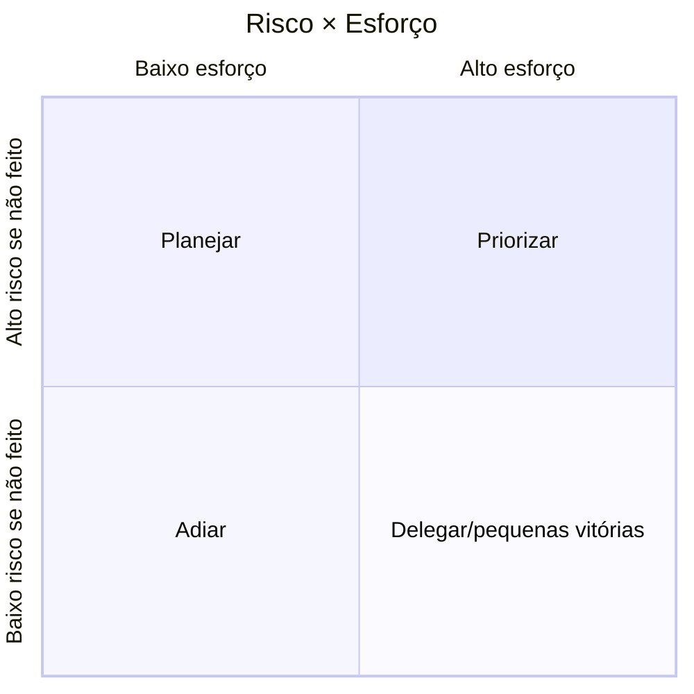

# Parte 1 — Diagnóstico da CodeLab

**Duração:** 60 a 90 minutos
**Pré-requisito:** Bloco 1 ([Fundamentos de Containers](../bloco-1/01-fundamentos-containers.md)) estudado.

---

## Contexto

Você ingressou na CodeLab como engenheiro de plataforma. O CTO deu objetivo de 3 meses: containerizar a plataforma. Antes de começar a escrever Dockerfiles, a primeira semana é de **diagnóstico**: o que existe hoje, qual risco cada peça carrega, o que containers **vão** resolver, o que **não** vão.

---

## Tarefas

### 1. Mapa do estado atual

Releia o [cenário PBL](../00-cenario-pbl.md) e desenhe, em **Mermaid**, a arquitetura atual da CodeLab — **sem containers**. Identifique os pontos de dor (drift, escape, limite frágil) no diagrama.

Arquivo: `docs/diagnostico.md`, seção **1. Estado Atual**.

### 2. Matriz "containers resolvem × não resolvem"

Para **cada** dos 10 sintomas listados no cenário, classifique:

| Sintoma | Containers resolvem? | Se não, o quê resolve (módulo futuro)? |
|---------|---------------------|----------------------------------------|
| 1 — Drift de ambiente | Sim (imagem única) | — |
| 2 — "Funciona na máquina do dev" | Sim | — |
| 3 — Isolamento fraco | Parcial (precisa flags runtime + K8s policies) | Módulo 7 (K8s PSP/PSA); Mod 9 (DevSecOps) |
| ... (preencha os 10) | | |

Arquivo: `docs/diagnostico.md`, seção **2. Matriz**.

### 3. Inventário físico

Assuma que você rodou `inspect_namespaces.py` (Bloco 1) no servidor atual da CodeLab **antes** de containerizar. Todos os processos compartilham os namespaces do host. Responda:

a) Por que isso por si só **não é** um bug?
b) Em que cenário esse compartilhamento **vira** um bug?
c) O que você espera observar **depois** de containerizar?

Arquivo: `docs/diagnostico.md`, seção **3. Inventário**.

### 4. Gap analysis priorizado

Liste **5 ações** para a transição, ordenadas por **risco × esforço**, usando a matriz:

Colocar as ações (ex.: "containerizar runner Python", "adicionar scan de CVE", "trocar ulimit por cgroups", etc.) no quadrante certo. Justificar **a posição** de cada uma.

Arquivo: `docs/diagnostico.md`, seção **4. Gap Analysis**.

### 5. Primeira peça a containerizar

Escolha a primeira peça. Justifique em 5 linhas. Critério:

- Menor risco de quebrar (peça **não crítica** para ensaio).
- Maior aprendizado (toca fundamentos — Dockerfile, run flags).
- **Visibilidade** boa (dá para mostrar ganho numérico).

Típica escolha: um dos **runners** (ex.: Python) em vez da API ou Postgres. Por quê? Runner é **transacional efêmero**, escala trivial, isolação essencial — e é o sintoma 3 do cenário, o risco mais alto.

Arquivo: `docs/diagnostico.md`, seção **5. Primeira peça**.

---

## O que entregar

- `docs/diagnostico.md` com as 5 seções preenchidas.
- Diagrama Mermaid da arquitetura atual (seção 1).
- Matriz (seção 2) cobrindo **todos os 10 sintomas** do cenário.
- Análise crítica (seção 3) incorporando a ideia de namespaces.
- Quadrante de priorização (seção 4) com **ao menos 5 ações**.
- Escolha justificada da primeira peça (seção 5).

## Critérios de aceitação

- A matriz **distingue** o que containers resolvem do que é responsabilidade de outro módulo (K8s, IaC, observabilidade, DevSecOps).
- O quadrante prioriza pelo menos uma ação "rápida + alta visibilidade" (baixo esforço + alto risco reduzido).
- A escolha da primeira peça é **defensável** — alguém não-técnico entenderia a justificativa.
- Nenhuma seção diz "containers resolvem tudo" — reconhecer limites é parte da nota.

## Saída esperada de seção 2 (exemplo esboçado)

| Sintoma | Resolve? | Detalhe |
|---------|---------|---------|
| 1 — Drift | **Sim** | Imagem imutável é o mesmo bit-a-bit de dev a prod. |
| 2 — Dev | **Sim** | `docker compose up` → ambiente em 15s. |
| 3 — Isolamento | **Parcial** | Namespaces isolam melhor que usuário+ulimit, mas código não-confiável exige `--network=none`, `--read-only`, `--cap-drop=ALL`, e idealmente gVisor/Kata (fora do escopo deste módulo). |
| 4 — Limites | **Sim** | cgroups via `--memory`, `--pids-limit`, `--cpus`. |
| 5 — Adicionar linguagem | **Sim** | Novo Dockerfile é isolado; não afeta outros runners. |
| 6 — apt upgrade quebra | **Sim** | Imagem pinada não é "atualizada" por fora. |
| 7 — Artefato portável | **Sim** | Imagem de ~150 MB vs VM de 14 GB. |
| 8 — Sem scan | **Não diretamente** | Containers viabilizam scan (Trivy/Grype); scan em si é Módulo 9 (DevSecOps); cobrimos aqui no Bloco 4. |
| 9 — Dev ≠ Prod | **Sim + Compose** | A condição é **não** ter override divergente em produção. |
| 10 — Release train | **Parcial** | Imagens separadas = deploy independente; orquestração de multi-serviço fica melhor em K8s (Mod 7). |

---

## Próximo passo

Com o diagnóstico pronto, avance para a **[Parte 2 — Dockerfile do runner](parte-2-dockerfile-runner.md)**.

---

<!-- nav:start -->

**Navegação — Módulo 5 — Containers e orquestração**

- ← Anterior: [Exercícios Progressivos — Módulo 5](README.md)
- → Próximo: [Parte 2 — Dockerfile do Runner Python](parte-2-dockerfile-runner.md)
- ↑ Índice do módulo: [Módulo 5 — Containers e orquestração](../README.md)

<!-- nav:end -->
