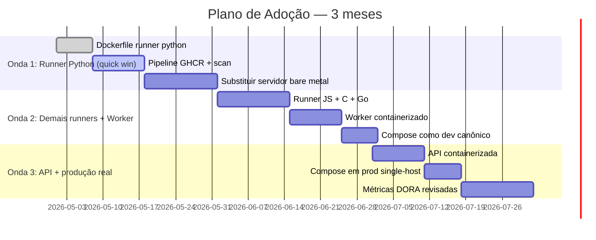

# Parte 5 — Plano de Adoção e Reconhecimento de Limites

**Duração:** 90 a 120 minutos
**Pré-requisitos:** Partes 1-4 concluídas.

---

## Contexto

A CodeLab agora tem **3 runners containerizados** (ou mais, se você foi longe), um stack local com Compose, e pipeline de imagens assinadas e escaneadas. Mas containers **não** resolvem tudo. Esta parte final faz **o fechamento honesto**: plano de adoção realista + admissão de limites + ponte para módulos futuros.

---

## Tarefas

### 1. Plano de adoção em 3 ondas

Crie `docs/plano-adocao.md`. Estruture em **3 ondas** de 1 mês cada, para os 3 meses que o CTO pediu.

Para cada onda, incluir:

- **Objetivo da onda** (frase única).
- **Serviços migrados**.
- **Riscos explícitos**.
- **Métricas de sucesso** (quantitativas).
- **Critério de "não avançar"** (quando a onda falha e se volta).

Diagrama **Gantt-like** (Mermaid):

### 2. Projeção de DORA

Puxe as métricas que o Módulo 4 usou. Projete **antes × depois**:

| Métrica | Agora (M4) | Após Mod 5 | Justificativa |
|---------|------------|-------------|---------------|
| Deployment Frequency | 1/dia | 3/dia | Imagens independentes por serviço; adicionar lang sem release train |
| Lead Time for Changes | 45 min | 30 min | Build reaproveita cache; pipeline paralelo em matriz |
| Change Failure Rate | 12% | 7% | Scan de CVE + SBOM detectam antes |
| MTTR | 25 min | 15 min | Rollback = trocar digest; imagem imutável |

Justifique números; não invente.

### 3. Matriz de responsabilidades — containers vs módulos futuros

Arquivo: `docs/limites-reconhecidos.md`.

Tabela explícita:

| Preocupação | Cobre aqui (Mod 5)? | Onde cobre? |
|-------------|----------------------|-------------|
| Imagem reproduzível | Sim (Bloco 2) | — |
| Ambiente multi-serviço local | Sim (Bloco 3) | — |
| Scan de CVE e SBOM | Sim (Bloco 4) | Mod 9 aprofunda |
| Assinatura de imagens | Básica (cosign) | Mod 9 (policy admission) |
| Rollback de imagem | Sim (via digest) | — |
| **Autoscaling horizontal** | **Não** | **Mod 7 (K8s HPA)** |
| **Self-heal avançado** | Parcial (`restart:` + healthcheck) | **Mod 7** |
| **Deploy multi-host** | **Não** | **Mod 7 (K8s)** ou Swarm |
| **Secrets em produção** | Básico (`-e` + BuildKit secrets) | **Mod 7 + Mod 9** (Vault, sealed secrets) |
| **IaC para subir infra** | **Não** | **Mod 6 (Terraform/Pulumi)** |
| **Logs centralizados** | stdout/stderr padronizado, sem coletor | **Mod 8 (Observabilidade)** |
| **Métricas de runtime** | **Não** | **Mod 8** |
| **Trace distribuído** | **Não** | **Mod 8 (OpenTelemetry)** |
| **RBAC fino** | **Não** | **Mod 7 + Mod 9** |
| **Política admission** (não-root obrigatório, sem `:latest`) | **Não enforced** | **Mod 7 (OPA/Kyverno)** |
| **Sandboxing extremo** (gVisor, Kata) | **Mencionado, não implementado** | **Mod 9 (DevSecOps)** ou decisão externa |

### 4. Riscos residuais

Arquivo: `docs/riscos-residuais.md` — ao menos **5 riscos** com:

- Descrição.
- Probabilidade × impacto.
- Mitigação atual.
- Mitigação futura (e em qual módulo).

Exemplos:

1. **Escape via CVE de kernel** — alta probabilidade ao longo do tempo; impacto crítico para runner de código não-confiável. Mitigação atual: patches em dia. Futura: gVisor/Kata.
2. **`docker.sock` no worker** — controle total do Docker. Mitigação atual: socket-proxy em avaliação. Futura: migrar para K8s Jobs (Mod 7) com RBAC.
3. **Dependência de `trivy` ser atual** — novas CVEs não detectadas se DB desatualizada. Mitigação: scheduled rebuild diário.
4. **Imagens acumuladas** — GHCR enche, custo se aplicável. Mitigação: retenção automática de tags `sha-*` > 90 dias.
5. **Falha de assinatura em produção sem enforcement** — imagem não-assinada poderia rodar em prod. Mitigação: hoje confiamos no processo; Mod 7 implementa policy.

### 5. Runbook "adicionar uma linguagem"

`docs/runbook-adicionar-linguagem.md` — passo a passo executável em **< 1 dia** por qualquer engenheiro. Inclua:

- Template de `docker/runner-<lang>.Dockerfile`.
- Adições necessárias ao worker (se houver).
- Entrada no CI matrix.
- Testes obrigatórios antes do merge.
- Checklist de review (tamanho da imagem, não-root, isolamento verificado).

**Demonstre** o runbook **adicionando uma 4ª linguagem** (ex.: Go). Commit; aprove via seu próprio PR. Tempo real medido deve ser **< 1 dia útil**.

### 6. Apresentação executiva (bônus)

Em `docs/apresentacao-executiva.md`, monte **um slide** (markdown) dirigido ao CTO:

- **Onde estamos**: 3 runners containerizados, pipeline de imagens, ambiente local em 1 comando.
- **O que ainda falta**: produção multi-host, secrets gerenciados, observabilidade.
- **Próximos módulos**: orquestração (K8s), IaC, observabilidade.
- **ROI**: custo × ganho em horas de SRE, em incidentes evitados, em velocidade de adicionar lang.

Linguagem não-técnica, bullet points curtos.

### 7. README consolidado do repositório

Atualize o `README.md` do repo como **índice** da jornada:

- Arquitetura (com Mermaid).
- Como rodar localmente.
- Como contribuir.
- Links para ADRs, plano, runbooks, políticas.
- Badge do workflow.

---

## O que entregar

1. **Documentação:**
   - `docs/plano-adocao.md` com 3 ondas + Gantt.
   - `docs/limites-reconhecidos.md` com matriz completa.
   - `docs/riscos-residuais.md` com ≥ 5 riscos.
   - `docs/runbook-adicionar-linguagem.md`.
   - `docs/apresentacao-executiva.md` (bônus).
2. **Evidência:**
   - 4ª linguagem adicionada via PR, seguindo o runbook.
   - Tempo medido do início ao merge (< 1 dia útil).
3. **Integração:**
   - `README.md` do repositório atualizado como índice.

## Critérios de aceitação

- Plano é **concreto e temporal** — não genérico.
- A matriz de limites é honesta: reconhece o que containers **não** resolvem.
- Riscos residuais são **mitigados** ou escalonados para módulos futuros, com traceabilidade.
- Runbook de nova linguagem é **executável** por outra pessoa.
- Apresentação (se feita) usa linguagem de negócio.

---

## Fechamento

Neste ponto você:

- **Entende** containers em profundidade (namespaces, cgroups, UFS, OCI).
- **Constrói** Dockerfiles idiomáticos e multi-stage.
- **Compose** ambientes reproduzíveis de dev e teste.
- **Pipeline** de imagens com scan, SBOM, assinatura.
- **Admite** o que fica para orquestrador (Módulo 7) e outras disciplinas.

A próxima peça natural é **subir essas imagens num cluster de verdade**, com autoscaling, self-heal e secrets gerenciados. É o **Módulo 7 — Kubernetes**.

Antes disso, **Módulo 6 — Infraestrutura como Código** trata de **onde** esse cluster vive e como é provisionado de forma reproduzível.

---

## Voltar ao índice

- [README do módulo](../README.md)
- [Entrega avaliativa](../entrega-avaliativa.md)
- [Referências](../referencias.md)
