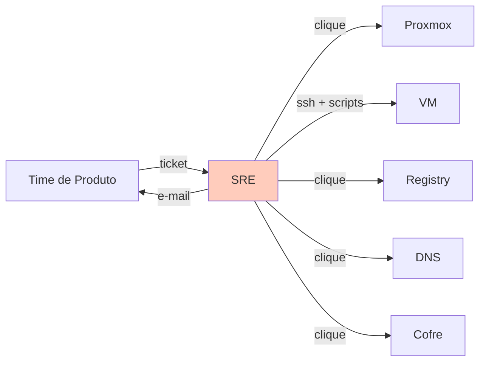

# Cenário PBL — Problema Norteador do Módulo

Este módulo é guiado por um **problema real** (PBL — Problem-Based Learning). O conteúdo teórico e os exercícios estão a serviço de **responder à pergunta norteadora** ao final.

---

## A empresa: Nimbus

A **Nimbus** é a **plataforma interna** (internal developer platform — IDP) de uma fintech brasileira. Não vende nada para fora — seu cliente é o **time de engenharia interno** da fintech, composto por ~**40 times de produto** que constroem desde o app de cartões até a gateway de pagamentos.

O que a Nimbus oferece?

- **Ambientes** de dev, homolog e produção para cada serviço.
- **Bancos de dados** (Postgres, Redis, Kafka).
- **Registry** de contêineres (ligada ao CI do Módulo 4).
- **Balanceadores, DNS interno, certificados**.
- **Logs centralizados, métricas, traces** (Módulo 8).
- **Secrets**, **LDAP**, **IAM interno**.

A fintech é **regulada pelo BACEN** e sujeita à **LGPD**. Por isso, toda a Nimbus é **self-hosted**: 3 data centers (2 no Brasil, 1 back-up internacional), com **Proxmox** sobre hardware próprio + Docker para cargas de contêiner. **Não** usa nuvem pública para cargas que tocam dado de cliente.

---

## O contexto técnico atual

A Nimbus cresceu sem IaC. Cada ambiente é criado por um processo de ticket:

1. Time abre ticket: "preciso de um ambiente de dev para meu serviço `xyz`".
2. SRE responsável faz login no Proxmox, clica em "Clonar VM" a partir de um template.
3. SSH na VM, roda 3 scripts internos (`setup.sh`, `install-db.sh`, `join-ldap.sh`).
4. Abre o portal do registry privado, cria o repositório.
5. Abre o DNS interno, cadastra o subdomínio `xyz-dev.nimbus.internal`.
6. Abre o cofre de segredos, cria as senhas.
7. Envia ao time a lista de URLs e credenciais.

Tempo médio por ambiente: **3 dias** de trabalho calendário.

---

## Sintomas observados

| # | Sintoma | Detalhe |
|---|---------|---------|
| 1 | **Click-ops em tudo** | Nenhuma criação de recurso passa por código. Toda mudança é manual no portal. |
| 2 | **Ambientes são flocos de neve** | `xyz-dev` em SP tem Postgres 14.3; em RJ, 14.5. Time alega bug "só em RJ" — é drift. |
| 3 | **Sem histórico de mudanças** | "Quem criou esse balanceador?" é pergunta sem resposta. Nenhum git log para infra. |
| 4 | **Rollback é manual e lento** | Mudança "ruim" num DNS? Hora de ligar para a pessoa que fez e pedir para desfazer à mão. |
| 5 | **3 dias para criar ambiente** | Fila crescente. Times começam a "trocar" ambientes entre si para não esperar. Vira favor pessoal. |
| 6 | **Disparidade dev/homolog/prod** | Cada ambiente é criado em época diferente, com procedimento um pouco diferente. Drift inerente. |
| 7 | **Credenciais em planilhas** | Senhas enviadas em e-mail; guardadas em tabelas compartilhadas. Auditoria abriu 3 não-conformidades. |
| 8 | **Experiência pela sorte** | Onboarding de novo SRE: "trabalhe ao meu lado por um mês". Nada documentado. |
| 9 | **Desligar ambiente é pior do que criar** | Time cancelado há 6 meses; ambientes continuam de pé porque "ninguém lembra como desligar". Custo crescendo. |
| 10 | **Mudança de configuração em produção requer janela de manutenção** | Temendo erro manual, mudanças críticas são agendadas — às 2h da madrugada de sábado. Ninguém quer estar de plantão. |

---

## Impacto nos negócios

- **Backlog crescente** de pedidos dos times → **atrito** entre Plataforma e Engenharia.
- **Audit risk**: LGPD e BACEN exigem trilha de mudanças. Hoje, não há.
- **Custo operacional alto**: SRE passa ~60% do tempo em provisionamento manual.
- **Mean time to onboard** de novo projeto: **8 dias** (ideal: < 1 hora).
- **Incidentes de drift** em produção: ~2/semana, geralmente causados por "alguém clicou em algo que não deveria".

---

## O que a liderança quer

O novo VP de Engenharia definiu metas de **6 meses**:

> *"Quero que cada recurso que sustentamos esteja descrito em código, num repositório Git. Cada mudança passa por pull request, com plano antes de aplicar. Quero criar um novo ambiente em menos de 30 minutos, desligar em menos de 10, e responder 'quem mudou isso e quando?' em 30 segundos. E quero isso tudo **self-hosted** — nada de SaaS fora do nosso perímetro."*

Objetivos concretos:

- **100% dos recursos** da Nimbus descritos em IaC.
- **Provisionamento** de ambiente novo em **≤ 30 min**.
- **Desprovisionamento** em **≤ 10 min**.
- **State compartilhado** entre a equipe, versionado e locked.
- **Secrets** nunca em texto plano, nem em git, nem em tickets.
- **Policy as Code** bloqueando configurações proibidas (Postgres público, S3 sem criptografia, etc.).
- **CI/CD de infraestrutura** com plan em PR e apply após aprovação.

---

## Pergunta norteadora

> **Como redesenhar o provisionamento da Nimbus para que TODO recurso nasça de código versionado, aplicado por pipeline com plano e aprovação, com state compartilhado, secrets seguros e policy enforced — reconhecendo o que IaC NÃO resolve (cultura, aplicação, processo humano)?**

Esta pergunta exige articular:

1. **Fundamentos** — por que código declarativo, idempotência, state são inegociáveis.
2. **Escolha de ferramenta** — OpenTofu (HCL) ou Pulumi (Python), com trade-offs explicitados.
3. **Arquitetura de repositório** — módulos, ambientes, state, secrets.
4. **Pipeline de IaC** — plan em PR, apply controlado, policy no portão.
5. **Plano de adoção** — 40 times não migram no mesmo dia; ondas, piloto, governança.
6. **Reconhecimento de limites** — IaC provisiona recursos; não resolve aplicação, cultura, gestão humana.

---

## Como este cenário aparece nos blocos

| Bloco | Lente sobre a Nimbus |
|-------|----------------------|
| **Bloco 1** — Fundamentos | Por que a click-ops falha; o que é estado; o que é drift em termos concretos. |
| **Bloco 2** — OpenTofu + Docker | Primeiro ambiente Nimbus descrito em HCL, rodando local. |
| **Bloco 3** — Pulumi + Python | Mesmo ambiente em Python — comparativo de ergonomia. |
| **Bloco 4** — Produção | Multi-ambiente, state compartilhado, secrets, policy, pipeline. |

E os **exercícios progressivos** te levam do diagnóstico da Nimbus até um MVP funcional de IaC que atende **um primeiro time piloto** — com plano claro para escalar aos 40.

---

## Próximo passo

Leia o **[Bloco 1 — Fundamentos de IaC](bloco-1/01-fundamentos-iac.md)** para entender **o que** é IaC **antes** de escrever o primeiro recurso.
