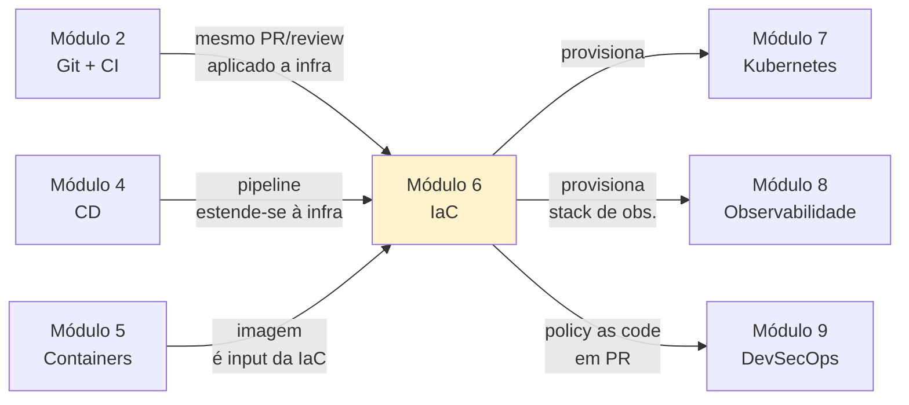

# Módulo 6 — Infraestrutura como Código (IaC)

**Carga horária:** 5 horas
**Nível:** Graduação (ensino superior)
**Pré-requisitos:** Módulos 1 (Cultura), 2 (CI), 3 (Testes), 4 (CD), 5 (Containers)

---

## Por que este módulo vem aqui

Até aqui você tem um pipeline maduro que **constrói**, **testa**, **empacota em contêiner** e **entrega**. Mas uma pergunta insistente permanece: **onde** esses contêineres vão rodar? E **como** a rede, o banco, o balanceador, o bucket de backup, os segredos e o cluster foram criados?

Na prática, durante todo o módulo anterior, dissemos "o registry é GHCR", "o banco é Postgres", "a rede é `bridge`". **Alguém** criou o repositório no GHCR, **alguém** configurou as permissões, **alguém** provisionou o host, **alguém** abriu a porta no firewall. Enquanto esse "alguém" for uma pessoa clicando num portal, a reprodutibilidade que você construiu nos módulos anteriores termina na borda do seu código.

**Infraestrutura como Código (IaC)** muda isso: a infraestrutura passa a ser **texto versionado** — que você revisa em PR, aplica por pipeline, reverte por `git revert`. Os mesmos princípios do Módulo 4 (build once, deploy many; promover, não reconstruir) agora valem **para a infraestrutura inteira**.

> *"Infrastructure as Code is the practice of routinely building, changing, and versioning infrastructure safely and quickly using tools that treat infrastructure-like configuration files as software source code."* — Kief Morris, *Infrastructure as Code*, 3ª ed., 2024.

E este módulo é também **ponte** para o Módulo 7 (Kubernetes) e o Módulo 8 (Observabilidade): sem IaC, cada cluster é um floco de neve; sem IaC, o coletor de métricas é ajustado à mão num host que ninguém sabe quem criou.

---

## Objetivos de Aprendizagem

Ao final do módulo, você será capaz de:

- **Distinguir** IaC declarativa de imperativa, de gerenciamento de configuração, e de scripts ad-hoc.
- **Explicar** os conceitos centrais: **estado**, **plano**, **idempotência**, **drift**, **convergência**.
- **Escrever** IaC em **HCL (OpenTofu/Terraform)** e em **Python (Pulumi)** provisionando recursos com provider Docker **localmente**.
- **Modularizar** código de infraestrutura com **módulos reutilizáveis** e **composição**.
- **Gerenciar state** compartilhado com backend remoto (MinIO/HTTP) e **locking**.
- **Separar ambientes** (dev/stg/prod) mantendo código comum, variáveis diferentes.
- **Proteger segredos** em IaC (Vault, SOPS, variables sensitive).
- **Aplicar Policy as Code** (Checkov/OPA) para bloquear configurações inseguras em PR.
- **Integrar IaC ao CI/CD**: `plan` em PR, `apply` em merge, com approval gates.
- **Reconhecer limites** — o que IaC **não** resolve (runtime, aplicação, processos humanos).

---

## Estrutura do Material

Mesma estrutura dos módulos anteriores: **4 blocos teóricos** + **5 exercícios progressivos** em PBL.

| Ordem | Conteúdo | Arquivo(s) |
|-------|----------|------------|
| 0 | Cenário PBL (Nimbus) | [00-cenario-pbl.md](00-cenario-pbl.md) |
| 1 | Fundamentos: declarativo, state, drift, idempotência | [bloco-1/01-fundamentos-iac.md](bloco-1/01-fundamentos-iac.md) · [exercícios](bloco-1/01-exercicios-resolvidos.md) |
| 2 | OpenTofu com provider Docker | [bloco-2/02-opentofu-docker.md](bloco-2/02-opentofu-docker.md) · [exercícios](bloco-2/02-exercicios-resolvidos.md) |
| 3 | Pulumi com Python | [bloco-3/03-pulumi-python.md](bloco-3/03-pulumi-python.md) · [exercícios](bloco-3/03-exercicios-resolvidos.md) |
| 4 | IaC em produção: state, secrets, policy, CI/CD | [bloco-4/04-iac-producao.md](bloco-4/04-iac-producao.md) · [exercícios](bloco-4/04-exercicios-resolvidos.md) |
| 5 | Exercícios progressivos (5 partes) | [exercicios-progressivos/](exercicios-progressivos/) |
| 6 | Entrega avaliativa | [entrega-avaliativa.md](entrega-avaliativa.md) |
| — | Referências bibliográficas | [referencias.md](referencias.md) |

---

## Como Estudar

1. **Leia o cenário PBL** — a **Nimbus** é uma plataforma interna de uma fintech self-hosted com 40 times sofrendo de click-ops.
2. **Siga os blocos em ordem.** Bloco 1 é fundação conceitual; Blocos 2 e 3 apresentam **dois sabores** de ferramenta (HCL vs Python); Bloco 4 leva para produção.
3. **Instale o ferramental:**
   - **OpenTofu** (ou Terraform — a sintaxe é ≈ idêntica para o que cobrimos).
   - **Pulumi** + Python 3.12+.
   - **Docker** (do Módulo 5).
   - **MinIO** (opcional, para backend S3-compatível local).
   - **Checkov** (opcional, Bloco 4).
4. **Digite. Não copie.** IaC é muito parecida com código de produção — erra-se em colchete, em dependência implícita, em ordem. Treino manual paga.
5. **Faça os exercícios resolvidos** de cada bloco antes de olhar a solução.
6. **Execute os 5 progressivos** — cada parte constrói a Nimbus automatizada.

### Setup rápido

Verifique os comandos:

```bash
tofu --version        # ou: terraform --version
pulumi version
docker --version
python3 --version
```

O `requirements.txt` consolidado está em [requirements.txt](requirements.txt) (para scripts de apoio e para o Pulumi Python).

---

## Ideia Central do Módulo

| Conceito | Significado |
|----------|-------------|
| **Declarativo** | Você descreve **o quê** deve existir; a ferramenta descobre **como** chegar lá |
| **State** | Fotografia do que a IaC criou — ponte entre código e mundo real |
| **Plan** | Simulação do diff entre código e estado atual — **lemos antes de aplicar** |
| **Idempotência** | Aplicar 2x == aplicar 1x; não há side-effects acumulativos |
| **Drift** | Mundo real divergiu do que o código descreve — alerta, não desastre |
| **Módulo** | Agrupamento reutilizável de recursos com interface (variáveis) clara |
| **Policy as Code** | Regras de segurança/compliance escritas em código, executadas em PR |

> O único local aceitável onde infraestrutura nasce **sem** passar por IaC é a **infra que sustenta a própria IaC** — o bootstrap. Tudo depois é código.

---

## Conexão com o restante da disciplina



---

## O que este módulo NÃO cobre

- **Provisionamento em nuvem pública específica** (AWS/GCP/Azure em profundidade) — usamos provider **Docker** local porque a disciplina preferiu ambiente auto-hospedado. Os conceitos são idênticos entre providers.
- **Ansible, Chef, Puppet** em profundidade — mencionamos a distinção (config management ≠ IaC imutável), mas sem praticar.
- **Kubernetes operators e CRDs** — são o "IaC nativo do K8s"; ficam para Módulo 7.
- **Terraform Enterprise / Terraform Cloud** — serviços pagos. Discutimos equivalentes self-hosted.
- **CloudFormation, ARM, Deployment Manager** — IaC proprietária. Preterimos em favor de soluções abertas.

---

*Material alinhado a: Kief Morris — "Infrastructure as Code" (O'Reilly); HashiCorp Terraform docs; OpenTofu docs; Pulumi docs; Google SRE Book cap. 19; "Terraform: Up & Running" (Yevgeniy Brikman).*

---

<!-- nav:start -->

**Navegação — Módulo 6 — Infraestrutura como código**

- ← Anterior: [Referências Bibliográficas — Módulo 5](../05-containers/referencias.md)
- → Próximo: [Cenário PBL — Problema Norteador do Módulo](00-cenario-pbl.md)

<!-- nav:end -->
