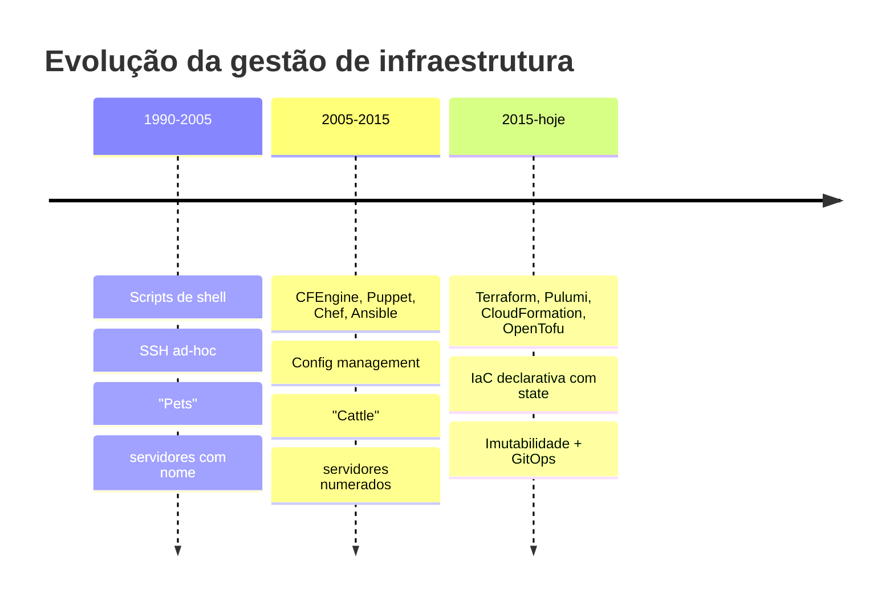
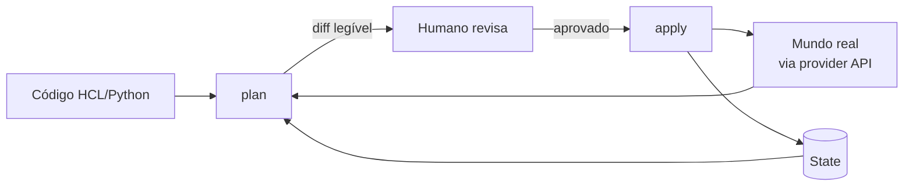

# Bloco 1 — Fundamentos de IaC

> **Duração estimada:** 60 a 70 minutos. Inclui o script Python `detect_drift.py`, que compara estado desejado (YAML) vs estado real (Docker) e reporta divergências.

A Nimbus do cenário PBL tem um problema claro: **nada** é descrito em código. Cada recurso nasce de um clique, cada ambiente carrega uma história pessoal, cada SRE é insubstituível. Antes de escolher ferramenta (OpenTofu vs Pulumi, Blocos 2 e 3), você precisa entender **o que** é IaC e, mais importante, **por que** IaC funciona.

---

## 1. O que é Infrastructure as Code

**Definição operacional (Morris, 2024):**

> *"A prática de especificar, versionar, testar e aplicar mudanças de infraestrutura usando as mesmas ferramentas e disciplinas da engenharia de software."*

Em uma frase: **infraestrutura vira texto**. Texto vai para o git. Do git, uma ferramenta aplica no mundo real.

**Três propriedades essenciais:**

1. **Reprodutibilidade** — aplicar o mesmo código produz o mesmo resultado.
2. **Revisabilidade** — um PR é o veículo de mudança; review humano + pipeline automatizado entram antes de aplicar.
3. **Reversibilidade** — `git revert` + `apply` retorna ao estado anterior.

IaC **não** é:

- Um script bash que cria VMs (imperativo, sem estado, sem plano).
- Um template de cloud-init (é config inicial, não todo ciclo de vida).
- Um Ansible playbook (é **config management**, que é uma categoria adjacente — mais sobre isso adiante).

---

## 2. Três gerações



### Geração 1 — Scripts

Ex.: `create-server.sh` que faz `ssh + apt install + edit config`. Funciona **uma vez**; rodar de novo quebra; sem plano; sem rollback; sem estado.

### Geração 2 — Config management

Puppet, Chef, Ansible. Pensam em **configurar um servidor existente**: "garantir que o pacote X esteja instalado e o arquivo Y tenha este conteúdo". São **declarativas** (em grande parte) e **idempotentes**.

**Limitação:** partem do pressuposto de que o servidor **já existe**. Quem o criou? Como? Respondido por... script ou clique.

### Geração 3 — IaC moderna

Terraform, Pulumi, OpenTofu, CloudFormation, Bicep. **Provisionam a infraestrutura inteira** (VMs, redes, load balancers, bancos, DNS) e mantêm **um estado** que sabe o que já foi criado. O paradigma muda de *"configure este servidor"* para *"faça existir esta topologia"*.

Idealmente, a Geração 3 **cria o servidor imutável** (via imagem pré-pronta, Módulo 5); **não precisa** da Geração 2 para "configurar depois". É o padrão **imutável**.

> **Convivência:** muitas empresas reais usam as duas — Terraform cria VMs; Ansible roda `post-provision` nelas. Funciona, mas é **mais complexidade** do que necessário quando você tem containers ou imagens pré-construídas.

---

## 3. Declarativo vs Imperativo

**Imperativo:** você escreve **os passos**.

```bash
if ! docker network ls | grep -q nimbus-net; then
  docker network create nimbus-net
fi
if ! docker volume ls | grep -q pgdata; then
  docker volume create pgdata
fi
docker run -d --name pg --network nimbus-net -v pgdata:/var/lib/postgresql/data postgres:16
```

Problemas:

- Toda condição "se já existe, pule" é sua responsabilidade.
- Rodar 2x pode dar resultado diferente de rodar 1x (não-idempotente).
- Mudar "quero Postgres 17 agora" requer editar e **rodar uma lógica de migração** que você inventou.
- Não há "plano" antes: roda cego.

**Declarativo:** você escreve **o quê deve existir**.

```hcl
resource "docker_network" "nimbus" { name = "nimbus-net" }
resource "docker_volume"  "pgdata" { name = "pgdata" }
resource "docker_container" "pg" {
  name    = "pg"
  image   = docker_image.pg.image_id
  networks_advanced { name = docker_network.nimbus.name }
  volumes { volume_name = docker_volume.pgdata.name; container_path = "/var/lib/postgresql/data" }
}
```

A ferramenta (`tofu apply`):

1. Lê o **estado** armazenado (o que ela criou antes).
2. **Compara** com o mundo real (via API do provider).
3. **Planeja** o delta necessário (criar, atualizar, destruir).
4. **Aplica** em ordem topológica.

Resultado: idempotente por construção, com plano legível, com rollback por `git revert`.

### Imperativo dentro do declarativo — as "escotilhas de escape"

Toda ferramenta declarativa tem **provisioners** ou **local-exec** para quando você *precisa* rodar imperativo (ex.: chamar um script externo). **Regra cultural**: usar com moderação e documentar. Cada provisioner é um pedaço de "gen 1" vivendo dentro de "gen 3".

---

## 4. Estado (State) — a espinha dorsal

**Estado** = fotografia do que a IaC criou.

Por que precisa?

- A partir de "eu descrevi 10 recursos" e "o mundo real tem 10 recursos", a ferramenta **precisa saber qual descrição mapeia para qual recurso real**.
- Sem estado, como responder "este container foi criado por mim ou pelo Fulano?"
- Sem estado, mudanças tornam-se **imperativas** (remove tudo, recria tudo) — caro, arriscado.

Forma típica: arquivo JSON chamado `terraform.tfstate` (OpenTofu/Terraform) ou JSON interno do Pulumi. Guarda:

- Lista de recursos gerenciados.
- Atributos atuais (IDs, IPs, dependências).
- Versão do provider que criou.
- Metadata de lineage.

### Problemas com state — e soluções

| Problema | Sintoma | Solução |
|----------|---------|---------|
| State **local** na máquina de 1 pessoa | Ninguém mais consegue aplicar; se a máquina morre, state some | **Backend remoto** (S3/MinIO, HTTP, etc.) |
| Duas pessoas aplicam ao mesmo tempo | **State corrupto**, recursos duplicados ou destruídos | **Locking** (advisory file lock, DynamoDB lock, servidor que oferece lock) |
| State contém **segredos em texto plano** | Senhas no arquivo JSON | Backends que **criptografam** (KMS, MinIO SSE, SOPS) + evitar `sensitive = false` |
| State fica **dessincronizado** do mundo real (drift) | Alguém editou à mão; próximo `plan` mostra mudanças inesperadas | **Scheduled drift detection** + cultura de "nada à mão" |

> O estado **não é opcional**. Mesmo sistemas "stateless" (Pulumi Deployments Stateless, ou Nix-like) têm estado — apenas o representam diferente.

---

## 5. Plan × Apply × Destroy

O ciclo de trabalho canônico:



**plan**: lê código + state + mundo real; imprime **diff**. **Não muda nada.**

```
  # docker_container.pg will be created
  + resource "docker_container" "pg" {
      + image      = "postgres:16.3"
      + name       = "pg"
      + networks_advanced { name = "nimbus-net" }
    }

Plan: 1 to add, 0 to change, 0 to destroy.
```

**apply**: executa o plan. Se o mundo mudou entre o plan e o apply, replaneja (ou falha).

**destroy**: planeja a remoção de **todos** os recursos gerenciados por aquele state. Usado em ambientes efêmeros.

**Cultura:** `plan` em PR (obrigatório); `apply` após merge + aprovação. Nunca `apply` direto, nem local.

---

## 6. Idempotência

Uma operação é **idempotente** quando executá-la N vezes produz o mesmo efeito que executá-la 1 vez.

Em IaC:

- Aplicar código que já está aplicado → 0 mudanças.
- Rodar `plan` 10 vezes → 10 outputs idênticos.
- Rodar `apply` 2x em sequência → segunda execução é no-op.

Por que importa:

- Retry seguro em caso de falha de rede.
- CI pode re-aplicar sem medo.
- **Drift detection**: se rodar `plan` agendado todo dia às 3h dá "0 changes", o mundo está em paz. Se aparece mudança, **algo aconteceu fora do processo**.

Ferramentas modernas são idempotentes **por construção**. Mas você pode **quebrar** idempotência se:

- Usar `local-exec` que depende de tempo (`date +%s`).
- Resources com nomes gerados aleatoriamente (`random_string`) sem `keepers`.
- Triggers que dependem de hash de timestamp.

---

## 7. Drift — quando o mundo diverge do código

**Drift** = a diferença entre o **estado desejado** (código) e o **estado real** (mundo).

Causas comuns:

| Causa | Exemplo |
|-------|---------|
| Mudança manual | Alguém editou `max_connections` do Postgres pelo portal |
| Mudança automática do provider | AWS rodou maintenance em seu RDS e mudou pequena config |
| Provider com default mutável | Nova versão do provider muda o default de um atributo |
| Lixo acumulado | Recurso criado à mão em emergência e nunca importado para state |

**O que fazer com drift detectado:**

1. **Reconciliar** (apply): forçar o mundo a se alinhar ao código.
2. **Absorver** (import ou ajuste de código): reconhecer que o mundo mudou por boa razão e atualizar o código.
3. **Alertar**: se drift é **frequente**, investigar **quem/por quê** — é sintoma de click-ops persistente.

**Detecção automatizada** (Bloco 4): rodar `tofu plan -detailed-exitcode` em CI agendado; se exit code = 2, há drift; notificar em Slack/PR.

### Drift não é desastre — é informação

A primeira reação saudável: **não tentar esconder**. Quem mudou à mão tem razões; entender as razões permite melhorar o código (talvez falte uma variável; talvez o processo manual estava certo e o código, errado).

---

## 8. Config Management vs IaC — divisão prática

| Dimensão | Config Management (Ansible, Chef, Puppet) | IaC moderna (OpenTofu, Pulumi) |
|----------|-------------------------------------------|-------------------------------|
| **Unidade** | Servidor/VM existente | Recurso de infraestrutura |
| **Modelo** | Reconvergente contínuo (agente) **ou** push ad-hoc | Converge uma vez (plan+apply) |
| **Estado** | Implícito (checagens) | Explícito (arquivo JSON) |
| **Mudança** | Edita arquivo no servidor | Recria/atualiza recurso |
| **Filosofia** | Servidores **mutáveis** (pets) | Servidores **imutáveis** (cattle) |

**Padrão moderno recomendado** (aplicado à Nimbus):

- **Imagem imutável** (Módulo 5) contém a aplicação + deps.
- **IaC** provisiona **onde** a imagem roda (host, rede, volume).
- **Config management** é minimizado — só se sobra algo específico de sistema.

Se você precisar de config management pesado dentro de VMs, questione o modelo: **contêineres + IaC** costumam eliminar a necessidade.

---

## 9. Topologia de repositório

Dois padrões consolidados:

### Padrão A — Monorepo com módulos + ambientes por diretório

```
nimbus-iac/
├── modules/
│   ├── ambiente-web/
│   └── banco-postgres/
├── envs/
│   ├── piloto-dev/
│   ├── piloto-stg/
│   └── piloto-prod/
└── policies/
```

**Cada env** é um `root module` próprio; usa módulos em `modules/` via caminho relativo; state separado por env.

### Padrão B — Monorepo com workspaces

Um único `root module`; workspaces `dev`, `stg`, `prod` representam ambientes; variáveis via `terraform.tfvars` por workspace.

**Discussão:**

- **A** é mais explícito — cada env tem diretório próprio, risco menor de errar de env. **Recomendado para produção**.
- **B** é mais compacto — ótimo para exercícios e ambientes efêmeros; **não recomendado** para produção crítica porque `apply` no workspace errado é trivial.

Usaremos **Padrão A** nos exercícios.

---

## 10. Script — `detect_drift.py`

Um mini-detector de drift para **entender o conceito** sem depender de Terraform ainda. Compara:

- **Desejado**: arquivo YAML que descreve containers esperados.
- **Real**: saída de `docker ps -a --format ...`.

Reporta:

- **Ausentes** (desejado, não existe).
- **Extras** (existe, não desejado).
- **Divergentes** (existe mas com imagem/porta/status diferente).

### `detect_drift.py`

```python
"""detect_drift.py — detector didático de drift em containers Docker.

Compara um arquivo YAML de 'estado desejado' com o mundo real (docker ps)
e reporta divergências em três categorias: FALTANDO, EXTRA, DIVERGENTE.

Uso:
  python detect_drift.py desired.yaml
"""
from __future__ import annotations

import argparse
import json
import subprocess
import sys
from dataclasses import dataclass, field
from pathlib import Path

import yaml


@dataclass(frozen=True)
class Desejado:
    nome: str
    imagem: str
    status: str = "running"  # "running" ou "stopped"


@dataclass(frozen=True)
class Real:
    nome: str
    imagem: str
    status: str  # "running", "exited", etc.


def ler_desejado(path: Path) -> list[Desejado]:
    data = yaml.safe_load(path.read_text(encoding="utf-8"))
    containers = data.get("containers", [])
    return [
        Desejado(nome=c["nome"], imagem=c["imagem"], status=c.get("status", "running"))
        for c in containers
    ]


def ler_real() -> list[Real]:
    r = subprocess.run(
        ["docker", "ps", "-a", "--format", "{{json .}}"],
        capture_output=True, text=True, check=True,
    )
    reais: list[Real] = []
    for linha in r.stdout.strip().splitlines():
        if not linha:
            continue
        item = json.loads(linha)
        status = "running" if "Up" in item.get("Status", "") else "stopped"
        reais.append(Real(
            nome=item.get("Names", ""),
            imagem=item.get("Image", ""),
            status=status,
        ))
    return reais


@dataclass
class Diff:
    faltando: list[str] = field(default_factory=list)
    extra: list[str] = field(default_factory=list)
    divergente: list[str] = field(default_factory=list)

    @property
    def ha_drift(self) -> bool:
        return bool(self.faltando or self.extra or self.divergente)


def comparar(desejado: list[Desejado], real: list[Real]) -> Diff:
    d_por_nome = {d.nome: d for d in desejado}
    r_por_nome = {r.nome: r for r in real}

    diff = Diff()

    for nome, d in d_por_nome.items():
        if nome not in r_por_nome:
            diff.faltando.append(f"{nome} (imagem={d.imagem})")
            continue
        r = r_por_nome[nome]
        diferencas = []
        if r.imagem != d.imagem:
            diferencas.append(f"imagem real={r.imagem} esperada={d.imagem}")
        if r.status != d.status:
            diferencas.append(f"status real={r.status} esperado={d.status}")
        if diferencas:
            diff.divergente.append(f"{nome}: {'; '.join(diferencas)}")

    for nome in r_por_nome:
        if nome not in d_por_nome:
            diff.extra.append(f"{nome} (imagem={r_por_nome[nome].imagem})")

    return diff


def imprimir(diff: Diff) -> None:
    if not diff.ha_drift:
        print("OK: nenhum drift detectado.")
        return
    if diff.faltando:
        print(f"\n[FALTANDO] {len(diff.faltando)} container(s) descritos mas ausentes:")
        for item in diff.faltando:
            print(f"  - {item}")
    if diff.extra:
        print(f"\n[EXTRA] {len(diff.extra)} container(s) existentes mas não declarados:")
        for item in diff.extra:
            print(f"  - {item}")
    if diff.divergente:
        print(f"\n[DIVERGENTE] {len(diff.divergente)} container(s) com atributos diferentes:")
        for item in diff.divergente:
            print(f"  - {item}")


def main(argv: list[str] | None = None) -> int:
    p = argparse.ArgumentParser(description=__doc__)
    p.add_argument("desired", type=Path, help="YAML de estado desejado")
    args = p.parse_args(argv)

    try:
        desejado = ler_desejado(args.desired)
    except FileNotFoundError:
        print(f"Arquivo não encontrado: {args.desired}", file=sys.stderr)
        return 2

    try:
        real = ler_real()
    except subprocess.CalledProcessError as e:
        print(f"docker ps falhou: {e.stderr}", file=sys.stderr)
        return 2

    diff = comparar(desejado, real)
    imprimir(diff)
    return 1 if diff.ha_drift else 0


if __name__ == "__main__":
    sys.exit(main())
```

### Uso didático

`desired.yaml`:

```yaml
containers:
  - nome: nimbus-postgres
    imagem: postgres:16.3-alpine
    status: running
  - nome: nimbus-redis
    imagem: redis:7.2-alpine
    status: running
```

```bash
# mundo real vazio
python detect_drift.py desired.yaml
# [FALTANDO] 2 container(s): nimbus-postgres, nimbus-redis

# subir o que está declarado
docker network create nimbus-net
docker run -d --name nimbus-postgres --network nimbus-net -e POSTGRES_PASSWORD=dev postgres:16.3-alpine
docker run -d --name nimbus-redis    --network nimbus-net redis:7.2-alpine

python detect_drift.py desired.yaml
# OK: nenhum drift detectado.

# alguém "clica em algo" e sobe outro container
docker run -d --name intruso alpine:3.20 sleep 1000

python detect_drift.py desired.yaml
# [EXTRA] intruso (imagem=alpine:3.20)

# alguém troca imagem do redis
docker rm -f nimbus-redis
docker run -d --name nimbus-redis --network nimbus-net redis:6.2-alpine

python detect_drift.py desired.yaml
# [DIVERGENTE] nimbus-redis: imagem real=redis:6.2-alpine esperada=redis:7.2-alpine
```

Este script **não é uma ferramenta séria de IaC** — é uma **ferramenta pedagógica** para você **sentir drift** antes de lidar com state do OpenTofu. O conceito é o mesmo.

---

## 11. Padrões e antipadrões

### Padrões

| Padrão | Descrição |
|--------|-----------|
| **Imutabilidade** | Nunca edite um recurso in-place; recrie |
| **Reproducibilidade** | Mesmo código + mesmos inputs = mesmo resultado |
| **Módulos com interface clara** | Inputs explícitos (variables), outputs explícitos |
| **DRY por módulo, WET por ambiente** | Módulos reutilizáveis; variáveis por env |
| **State remoto + locking** | Nunca state local em produção |
| **Plan em PR, apply após merge** | Portão humano + automático |

### Antipadrões

| Antipadrão | Por que é ruim |
|------------|-----------------|
| **Snowflake environment** | Cada ambiente criado em momento/método diferente; drift inerente |
| **Click-ops + IaC concorrentes** | Criar algumas coisas à mão, outras em código; ninguém sabe qual é a fonte da verdade |
| **State local na máquina do dev** | Se a máquina morre, state some; ninguém mais aplica |
| **Segredos em código** | Vazamento eterno via git history |
| **"Big bang" apply** | 500 mudanças num apply só; plan ilegível; rollback impossível |
| **`terraform apply` manual em produção** | Sem registro, sem aprovação, sem replay |
| **Ferramenta diferente por time** | 40 dialetos em vez de 1 padrão |

---

## 12. Voltando à Nimbus

Mapeamento dos 10 sintomas para conceitos deste bloco:

| Sintoma | Conceito que explica/corrige |
|---------|-------------------------------|
| 1 — Click-ops | Falta de IaC; mudar cultura + ferramenta |
| 2 — Flocos de neve | Drift não monitorado; falta reprodutibilidade |
| 3 — Sem histórico | Infraestrutura não em git |
| 4 — Rollback manual | `git revert` + `apply` substitui intervenção manual |
| 5 — 3 dias para criar | Módulos reutilizáveis + pipeline = minutos |
| 6 — Disparidade dev/stg/prod | Mesmo código, variáveis diferentes (WET por env) |
| 7 — Credenciais em planilha | Secret store + IaC integrada |
| 8 — Experiência pela sorte | Runbook é código; onboarding é PR |
| 9 — Desligar é pior que criar | `tofu destroy` fecha tudo; nunca é pior que criar |
| 10 — Mudanças em produção na madrugada | Plan + approval + pipeline desacopla risco humano |

---

## Resumo do bloco

- **IaC** transforma infraestrutura em **texto versionado**, revisável e aplicável por pipeline.
- **Declarativo** descreve o **quê**; a ferramenta descobre o **como** via `plan + apply`.
- **State** é a ponte entre código e mundo; **remoto + locked** em produção.
- **Idempotência** garante retry seguro e detecção de drift.
- **Drift** é informação, não desastre — detecte, analise, reconcilie ou absorva.
- **Config management** é categoria adjacente; contêineres + IaC frequentemente a substituem.
- Script `detect_drift.py` permite sentir drift sem precisar de Terraform.

---

## Próximo passo

- Faça os **[exercícios resolvidos do Bloco 1](01-exercicios-resolvidos.md)**.
- Avance para o **[Bloco 2 — OpenTofu com provider Docker](../bloco-2/02-opentofu-docker.md)**.

---

## Referências deste bloco

- **Morris, K.** *Infrastructure as Code.* 3ª ed., O'Reilly, 2024. Caps. 1-3.
- **Brikman, Y.** *Terraform: Up & Running.* 3ª ed., O'Reilly, 2022. Cap. 1.
- **Fowler, M.** *InfrastructureAsCode*, [martinfowler.com/bliki/InfrastructureAsCode.html](https://martinfowler.com/bliki/InfrastructureAsCode.html).
- **HashiCorp** — *What is Infrastructure as Code?*
- **Google SRE Book** — Cap. 3 ("Embracing Risk") e Cap. 12 ("Effective Troubleshooting").

---

<!-- nav:start -->

**Navegação — Módulo 6 — Infraestrutura como código**

- ← Anterior: [Cenário PBL — Problema Norteador do Módulo](../00-cenario-pbl.md)
- → Próximo: [Exercícios Resolvidos — Bloco 1](01-exercicios-resolvidos.md)
- ↑ Índice do módulo: [Módulo 6 — Infraestrutura como código](../README.md)

<!-- nav:end -->
