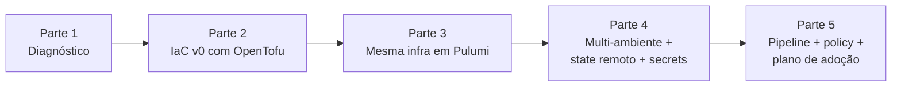

# Exercícios Progressivos — Módulo 6

Cinco partes encadeadas que constroem o **MVP da Nimbus automatizada** — um repositório IaC que provisiona, em minutos, um ambiente para um time piloto, com pipeline, policy e plano de adoção para os demais 39 times.

Leia o [cenário PBL](../00-cenario-pbl.md) antes de começar.

---

## Visão geral



| Parte | Entregáveis | Link |
|-------|-------------|------|
| **1** — Diagnóstico | Matriz de sintomas, decisão de ferramenta, topologia de repo | [parte-1-diagnostico.md](parte-1-diagnostico.md) |
| **2** — IaC v0 com OpenTofu | Repo, primeiro env subindo local via Docker | [parte-2-iac-v0-opentofu.md](parte-2-iac-v0-opentofu.md) |
| **3** — Mesma infra em Pulumi | Projeto Pulumi paralelo, comparação documentada | [parte-3-pulumi-paralelo.md](parte-3-pulumi-paralelo.md) |
| **4** — Produção | Multi-env, state remoto (MinIO), secrets (SOPS), módulo reutilizável | [parte-4-producao.md](parte-4-producao.md) |
| **5** — Pipeline + plano | CI/CD, policy, runbook, plano de adoção dos 40 times | [parte-5-pipeline-e-plano.md](parte-5-pipeline-e-plano.md) |

---

## Como estudar estas partes

1. **Não pule partes.** Cada parte parte do que a anterior deixou.
2. **Sempre entenda antes de aplicar.** Cole no editor; leia; só então rode.
3. **Mantenha um diário de decisões**. Cada decisão relevante vira um ADR (`docs/adr/XXX.md`).
4. **Quebre quando quiser**. Pare, experimente, quebre de propósito, observe como a ferramenta reage. Isso é parte do aprendizado.

---

## Entregáveis agregados

Ao final das 5 partes, você terá um repositório parecido com:

```
nimbus-iac/
├── README.md
├── Makefile
├── .github/workflows/
│   ├── iac-plan.yml
│   └── iac-apply.yml
├── modules/
│   ├── ambiente-web/         # OpenTofu
│   └── banco-postgres/
├── envs/
│   ├── piloto-dev/
│   └── piloto-stg/
├── pulumi-alt/               # projeto Pulumi paralelo (comparativo)
│   └── ...
├── policies/
│   ├── checkov/
│   └── opa/
├── scripts/
│   ├── bootstrap.sh
│   └── iac_policy_check.py
├── .sops.yaml
├── docs/
│   ├── arquitetura.md
│   ├── adr/
│   ├── plano-adocao.md
│   ├── limites-reconhecidos.md
│   └── runbook-onboarding.md
└── .gitignore
```

Esse é o material da **entrega avaliativa** do módulo ([entrega-avaliativa.md](../entrega-avaliativa.md)).

---

## Pré-requisitos

- `tofu` (ou `terraform`) instalado.
- `pulumi` instalado.
- `docker` funcional.
- `python3` ≥ 3.12.
- `sops` e `age` (Parte 4).
- `checkov` (Parte 5).
- Conta GitHub (repositório público ou privado).

---

## Próximo passo

Comece pela **[Parte 1 — Diagnóstico](parte-1-diagnostico.md)**.

---

<!-- nav:start -->

| &nbsp; | &nbsp; | &nbsp; |
|:--|:--:|--:|
| **← Anterior**<br>[Exercícios Resolvidos — Bloco 4](../bloco-4/04-exercicios-resolvidos.md) | **↑ Índice**<br>[Módulo 6 — Infraestrutura como código](../README.md) | **Próximo →**<br>[Parte 1 — Diagnóstico da Nimbus](parte-1-diagnostico.md) |

<!-- nav:end -->
