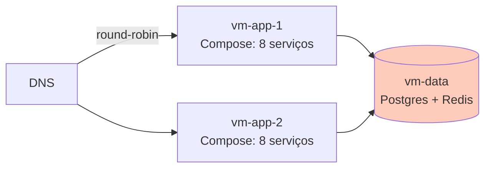

# Cenário PBL — Problema Norteador do Módulo

Este módulo é guiado por um **problema real** (PBL — Problem-Based Learning). O conteúdo teórico e os exercícios estão a serviço de **responder à pergunta norteadora** ao final.

---

## A empresa: StreamCast EDU

A **StreamCast EDU** é uma **EdTech brasileira** que vende **plataforma de streaming de aulas** para instituições de ensino superior. Em um login único, alunos assistem a aulas **gravadas** (on-demand) e **ao vivo**, comentam, fazem perguntas e recebem avaliações. A startup nasceu na pandemia e cresceu: hoje são **30 universidades clientes** no Brasil, com **~250 mil alunos** ativos na plataforma.

Cada universidade é um **tenant** — tem seu subdomínio (`ufpb.streamcast.edu.br`), suas cores, seu catálogo de cursos. No backend, os dados são logicamente separados; fisicamente, compartilham a mesma infraestrutura.

A aplicação é feita de **8 microsserviços** (simplificando):

| Serviço | Responsabilidade | Linguagem |
|---------|------------------|-----------|
| `auth` | Login, JWT, SSO por instituição | Python (FastAPI) |
| `catalog` | Catálogo de cursos, busca, recomendações | Python |
| `player` | Emite URLs assinadas, controla permissões de vídeo | Python |
| `transcoder` | Processa uploads, gera múltiplas qualidades (HLS) | Python + ffmpeg |
| `live` | Orquestra aulas ao vivo (RTMP ingest, chat) | Python |
| `billing` | Apura uso por tenant, emite fatura mensal | Python |
| `notify` | E-mail, push, SMS | Python |
| `api-gateway` | Ponto único de entrada, roteia por tenant | Python |

Storage:

- **Postgres** (principal: `users`, `courses`, `subscriptions`).
- **Redis** (cache e filas leves).
- **MinIO** (vídeos, thumbnails).

---

## Contexto técnico atual

Hoje a StreamCast roda a aplicação em **Docker Compose**, sobre **3 VMs grandes** num datacenter próprio (LGPD — dado de aluno é sensível):

- `vm-app-1` e `vm-app-2` rodam cópias do Compose completo (balanceamento round-robin por DNS).
- `vm-data` roda Postgres e Redis (single-node, sem replica).
- Deploys manuais via `docker compose pull && docker compose up -d`.

---

## Sintomas observados

| # | Sintoma | Detalhe |
|---|---------|---------|
| 1 | **Picos de carga às 8h, 14h e 19h** | Horário de aulas. CPU sobe a 100%. Usuários sofrem timeout. |
| 2 | **Transcoder afoga a VM** | Um upload grande consome toda a CPU de `vm-app-1` e **afeta auth e catalog** na mesma VM |
| 3 | **Atualização manual causa downtime** | `docker compose up -d` recria todos containers; fica ~30s fora do ar. Alunos em aula ao vivo perdem a conexão. |
| 4 | **Queda de serviço não tem self-heal** | `notify` morre (memory leak). Ninguém percebe por 4h — e-mails de confirmação não chegam. |
| 5 | **Escala é manual** | Para a semana da prova, DevOps faz "cópia manual" de `vm-app-3`. Depois esquece de desligar. |
| 6 | **Um tenant abusivo afeta os outros** | Universidade X sobe 10 mil uploads simultâneos. Transcoder afoga tudo. |
| 7 | **Secrets em `.env`** | Cada VM tem o `.env` com todas as senhas. Auditor levantou 5 não-conformidades. |
| 8 | **Rollback é restaurar snapshot de VM** | Deploy ruim? Restaurar snapshot da VM inteira; volta ao estado anterior mas perde dados de 1h. |
| 9 | **Nenhuma segmentação de rede** | `transcoder` pode conectar no Postgres de `auth` — se comprometido, acesso a tudo. |
| 10 | **Nova universidade = 3 dias** | Onboarding manual: criar schema, configurar SSO, subir bucket, DNS, balanceador. |

---

## Impacto nos negócios

- **SLA comprometido**: a proposta comercial prometeu "99.5% disponibilidade em horário de aula". Dados reais: ~98,7%. 3 clientes ameaçando sair.
- **Tempo de engenharia em operação**: ~40% do time de 6 devs, só apagando fogo.
- **Novos features em espera**: backlog de 11 itens de produto parados porque a infraestrutura não suporta mudanças seguras.
- **Onboarding de clientes**: meta comercial de 5 novas universidades/mês; entregando 2.
- **Custo de oportunidade**: transcoding em picos força pagar VMs sempre grandes; utilização média < 25%.

---

## O que a liderança quer

A nova CTO, vinda de uma big tech, definiu metas para **6 meses**:

> *"Quero que a plataforma se autorrecupere — se um serviço cai, outro sobe sem humano envolvido. Quero poder subir o transcoder para 20 réplicas quando precisa, e descer quando não precisa, sem editar nada à mão. Quero atualizar qualquer serviço sem derrubar aula ao vivo. Quero que um tenant abusivo não possa afetar os outros. E quero onboarding de uma universidade nova em menos de 1 dia. Se isso custa migrar para Kubernetes, migramos. Self-hosted, porque LGPD."*

Objetivos concretos:

- **Self-healing**: 95% dos incidentes de processo mortos devem ser resolvidos pelo cluster sem humano.
- **Rolling updates sem downtime**: 0s de indisponibilidade em cada deploy.
- **Autoscale horizontal**: transcoder escala de 2 a 20 réplicas conforme fila.
- **Isolamento multi-tenant**: segmentação de rede e quotas por namespace/tenant.
- **Secrets gerenciados**: fora do código, fora de `.env`, com rotação.
- **Rollback em 1 comando**: `kubectl rollout undo` ou `argocd app rollback`, < 1 min.
- **Onboarding de universidade em ≤ 1 hora**: PR de adição → ArgoCD sincroniza → tenant operante.
- **Observabilidade básica**: métricas do cluster (`kube-state-metrics`, `metrics-server`), prontas para integrar com Módulo 8.

---

## Pergunta norteadora

> **Como redesenhar a StreamCast EDU sobre Kubernetes para que a plataforma se autorrecupere, atualize sem downtime, escale conforme carga, isole tenants e onboarde clientes novos em minutos — reconhecendo o que Kubernetes NÃO resolve (aplicação, dados, cultura, custos)?**

Esta pergunta exige articular:

1. **Fundamentos** — por que K8s, como funciona, quais objetos endereçam quais problemas.
2. **Workloads** — Deployment, Service, ConfigMap, Secret, probes; como migrar um Compose para manifestos K8s.
3. **Operações** — namespaces por tenant, RBAC, NetworkPolicy, HPA, Ingress, PVC.
4. **Empacotamento e GitOps** — Helm parametrizado + ArgoCD reconciliando.
5. **Limites** — K8s não resolve bugs de aplicação, não substitui backup de dados, não elimina o custo de operá-lo.

---

## Como este cenário aparece nos blocos

| Bloco | Lente sobre a StreamCast |
|-------|---------------------------|
| **Bloco 1** — Fundamentos | Por que o Compose falha em escala; como o modelo declarativo + reconciliação resolve. |
| **Bloco 2** — Workloads | Primeiro serviço (`auth`) como Deployment + Service + Secret + ConfigMap. |
| **Bloco 3** — Operações | Namespaces por tenant, RBAC, NetworkPolicy isolando `transcoder`, HPA, Ingress. |
| **Bloco 4** — Produção | Tudo em Helm chart + ArgoCD reconciliando; DR, backup, limites honestos. |

E os **exercícios progressivos** constroem um MVP que coloca **2 ou 3 serviços** da StreamCast no cluster local, com tudo isso funcionando.

---

## Próximo passo

Leia o **[Bloco 1 — Fundamentos de Kubernetes](bloco-1/01-fundamentos-k8s.md)** para entender **o que** é K8s **antes** de instalar o cluster.
