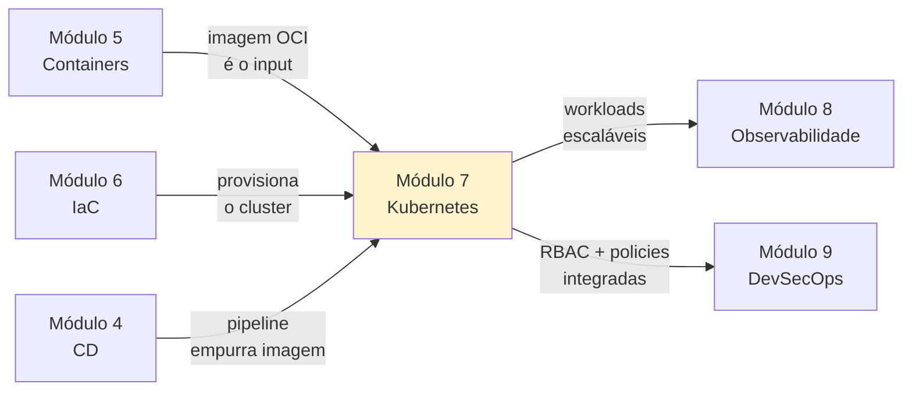

# Módulo 7 — Kubernetes

**Carga horária:** 6 horas
**Nível:** Graduação (ensino superior)
**Pré-requisitos:** Módulos 1 (Cultura), 2 (CI), 3 (Testes), 4 (CD), 5 (Containers), 6 (IaC)

---

## Por que este módulo vem aqui

O Módulo 5 mostrou como empacotar aplicações em **imagens OCI** — unidades imutáveis de entrega. O Módulo 6 mostrou como **provisionar** a infraestrutura onde elas vão rodar, em código versionado. Até aqui, essas imagens rodam em **um host** via Docker ou Docker Compose.

Mas aplicações reais têm propriedades que Compose não endereça bem:

- **Escala horizontal**: subir 20 réplicas quando o tráfego dobra, descer quando cai.
- **Autorregeneração**: se um contêiner morre, outro sobe automaticamente **em outro host** se o atual estiver sobrecarregado.
- **Rolling update sem downtime**: trocar a imagem de 20 réplicas sem que o usuário perceba.
- **Descoberta de serviço dinâmica**: `app` encontra `banco` mesmo com IPs mudando constantemente.
- **Multi-host**: carga distribuída em dezenas de máquinas como se fossem uma só.
- **Isolamento multi-tenant**: 30 universidades clientes sem que uma veja/afete a outra.

Essas são as promessas do **Kubernetes** — um orquestrador de contêineres projetado no Google, derivado do **Borg**, hoje o padrão de facto da indústria para cargas que não cabem num único host.

> *"Kubernetes is portable, extensible, open-source platform for managing containerized workloads and services, that facilitates both declarative configuration and automation."* — [kubernetes.io](https://kubernetes.io/docs/concepts/overview/)

Kubernetes é **complexo**. É também **inevitável** em equipes que ultrapassam uma carga que Compose consegue servir. Este módulo ensina o **núcleo operacional** que um profissional precisa para ser produtivo — sem transformar você em arquiteto de plataforma K8s.

---

## Objetivos de Aprendizagem

Ao final do módulo, você será capaz de:

- **Justificar** quando Kubernetes é (e quando **não é**) a ferramenta certa.
- **Descrever** a arquitetura do cluster: control plane (`api-server`, `etcd`, `scheduler`, `controller-manager`), nodes (`kubelet`, `kube-proxy`, container runtime).
- **Operar** um cluster local com **k3d** (ou **kind**), que roda em minutos em um notebook.
- **Escrever** manifestos YAML dos objetos essenciais: `Pod`, `Deployment`, `Service`, `ConfigMap`, `Secret`, `Ingress`, `PersistentVolumeClaim`, `HorizontalPodAutoscaler`, `NetworkPolicy`.
- **Implantar** uma aplicação FastAPI + Postgres + Redis no cluster, com probes, limits, secrets e Ingress.
- **Aplicar** padrões de produção: resource requests/limits, probes, Pod Disruption Budget, RBAC mínimo, namespaces por ambiente/tenant.
- **Empacotar** a aplicação em um **Helm chart** parametrizável e versionar valores por ambiente.
- **Estabelecer GitOps** com **ArgoCD** (self-hosted) — o cluster reconcilia continuamente ao que está no git.
- **Operar** rolling updates, rollbacks, scale manual e auto (HPA).
- **Reconhecer** limites de Kubernetes — observabilidade, segurança em profundidade, operadores, custos.

---

## Estrutura do Material

| Ordem | Conteúdo | Arquivo(s) |
|-------|----------|------------|
| 0 | Cenário PBL (StreamCast EDU) | [00-cenario-pbl.md](00-cenario-pbl.md) |
| 1 | Fundamentos: arquitetura, objetos, ciclo de Pod | [bloco-1/01-fundamentos-k8s.md](bloco-1/01-fundamentos-k8s.md) · [exercícios](bloco-1/01-exercicios-resolvidos.md) |
| 2 | Workloads: Deployment, Service, Config, Secret, probes | [bloco-2/02-workloads.md](bloco-2/02-workloads.md) · [exercícios](bloco-2/02-exercicios-resolvidos.md) |
| 3 | Operações: Namespace, RBAC, NetworkPolicy, HPA, Ingress, PVC | [bloco-3/03-operacoes-cluster.md](bloco-3/03-operacoes-cluster.md) · [exercícios](bloco-3/03-exercicios-resolvidos.md) |
| 4 | Produção: Helm, GitOps/ArgoCD, DR, limites | [bloco-4/04-producao-helm-gitops.md](bloco-4/04-producao-helm-gitops.md) · [exercícios](bloco-4/04-exercicios-resolvidos.md) |
| 5 | Exercícios progressivos (5 partes) | [exercicios-progressivos/](exercicios-progressivos/) |
| 6 | Entrega avaliativa | [entrega-avaliativa.md](entrega-avaliativa.md) |
| — | Referências bibliográficas | [referencias.md](referencias.md) |

---

## Como Estudar

1. **Leia o cenário PBL** — a **StreamCast EDU** é uma plataforma de streaming para universidades que já não cabe em Docker Compose.
2. **Instale o ferramental local:**
   ```bash
   # kubectl
   curl -LO "https://dl.k8s.io/release/$(curl -Ls https://dl.k8s.io/release/stable.txt)/bin/linux/amd64/kubectl"
   sudo install kubectl /usr/local/bin/

   # k3d (preferido)
   curl -s https://raw.githubusercontent.com/k3d-io/k3d/main/install.sh | bash

   # alternativa: kind
   # go install sigs.k8s.io/kind@latest

   # helm
   curl https://raw.githubusercontent.com/helm/helm/main/scripts/get-helm-3 | bash

   # k9s (TUI opcional, altamente recomendada)
   curl -sS https://webinstall.dev/k9s | bash
   ```
3. **Cluster local:**
   ```bash
   k3d cluster create streamcast --agents 2 --port "8080:80@loadbalancer"
   kubectl get nodes
   # NAME                      STATUS   ROLES                  AGE
   # k3d-streamcast-server-0   Ready    control-plane,master   30s
   # k3d-streamcast-agent-0    Ready    <none>                 25s
   # k3d-streamcast-agent-1    Ready    <none>                 25s
   ```
4. **Siga os blocos em ordem.** Bloco 1 é vocabulário; Bloco 2 implementa; Bloco 3 endurece; Bloco 4 empacota.
5. **Digite. Não copie.** YAML é sensível a indentação e nomes. Erros ensinam.
6. **Destrua o cluster** quando terminar (`k3d cluster delete streamcast`) para evitar drenar bateria e memória.

### Setup rápido

Verifique os comandos:

```bash
kubectl version --client
k3d version
helm version --short
```

O `requirements.txt` consolidado está em [requirements.txt](requirements.txt) (para scripts de apoio em Python).

---

## Ideia central do módulo

| Conceito | Significado |
|----------|-------------|
| **Declarativo com reconciliação** | Você descreve o **estado desejado**; controllers fazem o real **convergir** |
| **API única** | Todo objeto (Pod, Service, etc.) é recurso da API — `kubectl` é só um cliente |
| **etcd** | Banco que guarda o estado desejado de tudo |
| **Controller** | Loop que observa diferenças e age para reduzi-las |
| **Labels e selectors** | Tudo é amarrado por **rótulos**, não por nomes — desacoplamento |
| **Namespace** | Escopo lógico para agrupamento e isolamento (RBAC, quotas) |
| **Helm chart** | Pacote versionado de manifestos parametrizáveis |
| **GitOps** | Git é a fonte da verdade; cluster reconcilia continuamente |

> Kubernetes **não** executa contêineres diretamente — delega a um **runtime OCI** (containerd ou CRI-O). Ele executa o **modelo** de como contêineres se relacionam entre si, com rede, armazenamento e ciclo de vida.

---

## Conexão com o restante da disciplina



---

## O que este módulo NÃO cobre

- **Operadores e CRDs em profundidade** — apresentamos o conceito (ArgoCD é um operador), mas escrever um controller custom fica para cursos dedicados.
- **Service Mesh (Istio, Linkerd)** — citado como "próximo passo de maturidade"; prática fica para disciplina avançada.
- **Gerência de cluster gigante** (etcd em HA, upgrades de versão em cluster produtivo) — foge do escopo de graduação.
- **Cloud providers específicos** (EKS/GKE/AKS) — mencionamos como destino comum, mas praticamos em k3d local; os conceitos são 95% idênticos.
- **Kubernetes on bare-metal em produção** (kubeadm avançado) — citado; prática exige hardware indisponível.

---

*Material alinhado a: Kubernetes Up & Running (Burns, Beda, Hightower); Programming Kubernetes (Hausenblas, Schimanski); The Kubernetes Book (Poulton); documentação oficial kubernetes.io; Helm docs; ArgoCD docs; CNCF landscape.*

---

<!-- nav:start -->

| &nbsp; | &nbsp; | &nbsp; |
|:--|:--:|--:|
| **← Anterior**<br>[Referências Bibliográficas — Módulo 6](../06-infraestrutura-como-codigo/referencias.md) | **↑ Índice**<br>Módulo 7 — Kubernetes | **Próximo →**<br>[Cenário PBL — Problema Norteador do Módulo](00-cenario-pbl.md) |

<!-- nav:end -->
