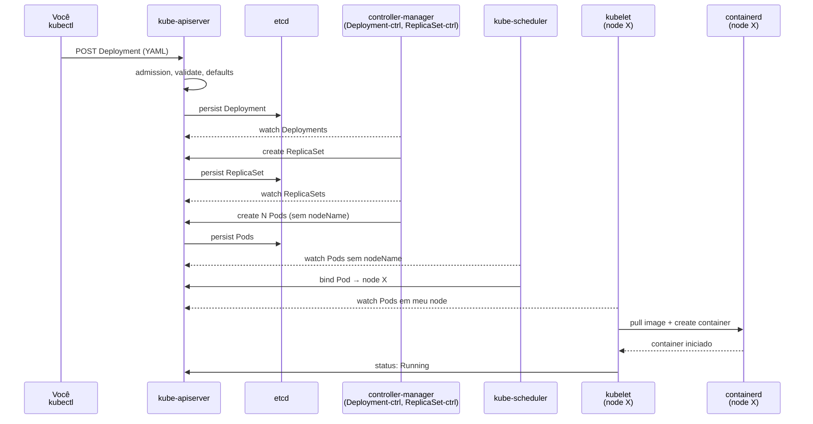

# Bloco 1 — Exercícios Resolvidos

Exercícios aplicados ao cenário **StreamCast EDU**. Cada exercício traz **enunciado**, **tempo sugerido**, **roteiro** e **solução comentada**.

---

## Exercício 1.1 — Por que Compose não escala

**Tempo:** 15 min · **Tipo:** conceitual

### Enunciado

Liste, em 1 parágrafo por item, **três** limitações da arquitetura atual da StreamCast (Compose em 2 VMs) que o modelo declarativo + reconciliação do Kubernetes endereça. Cite explicitamente o sintoma do cenário (de 1 a 10) que cada limitação ataca.

### Solução comentada

**1. Escala horizontal não é nativa (sintomas #1, #5).**
No Compose, escalar é `--scale=N` por host. Ninguém redistribui carga entre hosts; o que existe é DNS round-robin no topo. Em K8s, um `Deployment` com `replicas: 20` é espalhado pelo scheduler entre os nodes disponíveis, e um `HorizontalPodAutoscaler` ajusta `replicas` conforme métrica (CPU, fila). O pico das 8h, 14h e 19h deixa de exigir humano — o controller reage sozinho.

**2. Self-healing não existe (sintomas #4, #8).**
Compose não tem controller observando o processo. Se `notify` morre por memory leak, a VM não sabe o que fazer — o container fica em estado `Exited`. Em K8s, o ReplicaSet-controller detecta que `observed=0 vs desired=3` e recria Pods em 2s. Se o node morre, scheduler re-planeja nos nodes vivos. Rollback também é 1 comando (`kubectl rollout undo`) em vez de restaurar snapshot de VM inteira.

**3. Isolamento multi-tenant é ad-hoc (sintomas #2, #6, #9).**
Em Compose, todos os serviços dividem o mesmo host — `transcoder` afoga `auth`. A rede é plana; qualquer container fala com qualquer outro. Em K8s, **resource limits** impedem um serviço de consumir tudo; **namespaces** agrupam tenants; **NetworkPolicy** segmenta tráfego por labels. Universidade X não pode mais afogar a Y nem bisbilhotar seus dados em trânsito.

---

## Exercício 1.2 — Arquitetura do cluster em diagrama

**Tempo:** 20 min · **Tipo:** diagrama

### Enunciado

Desenhe (Mermaid ou papel) a arquitetura de um cluster Kubernetes mostrando control plane e nodes, e inclua em amarelo **o caminho** que um `kubectl apply -f auth-deployment.yaml` percorre até um Pod rodar. Aponte **5 componentes** distintos que atuam no caminho.

### Solução comentada



**5 componentes no caminho:**

1. `kubectl` — cliente que forma a requisição HTTPS.
2. `kube-apiserver` — porta única do cluster; valida, autentica, persiste.
3. `etcd` — onde o estado é gravado.
4. `kube-controller-manager` — roda o Deployment-controller, que cria ReplicaSet; ReplicaSet-controller, que cria Pods.
5. `kube-scheduler` — escolhe o node de cada Pod.
6. `kubelet` (no node escolhido) — cria o container via runtime.

**Ponto didático:** observe que o caminho é **todo via API**. Kubernetes é uma API Rest com persistência em etcd; cada componente só faz dois verbos: `watch` e `update`. Isso é o que permite extensão (CRDs, controllers custom).

---

## Exercício 1.3 — Classificando workloads da StreamCast

**Tempo:** 20 min · **Tipo:** decisão arquitetural

### Enunciado

Para cada serviço da StreamCast (lista abaixo), escolha o **workload controller** K8s mais apropriado e **justifique em 1 linha**. Considere: replicabilidade, estado, periodicidade, presença por node.

1. `auth` (API stateless)
2. `catalog` (API stateless com cache em Redis)
3. `transcoder` (processa itens de fila de upload; pode escalar)
4. `postgres` (banco principal)
5. `redis` (cache)
6. `backup-diario` (dump de Postgres todo dia às 3h)
7. `log-collector` (1 por node, captura stdout/stderr)
8. `migracao-v2` (roda migração de schema nova, uma vez, em deploy do release 2.0)

### Solução comentada

| Serviço | Controller | Justificativa |
|---------|-----------|---------------|
| `auth` | `Deployment` | API stateless replicável; sem identidade estável. |
| `catalog` | `Deployment` | idem `auth`; o estado está no Redis externo. |
| `transcoder` | `Deployment` + HPA (ou `Job` por item) | Workers stateless lendo fila; HPA escala por profundidade de fila. Variante: 1 `Job` por vídeo, criado por operador. |
| `postgres` | `StatefulSet` + PVC | Identidade estável (`-0`, `-1`, `-2`), volume próprio persistente, ordem de arranque importa para replicação. |
| `redis` | `StatefulSet` (se cluster) **ou** `Deployment` (1 réplica com PVC para persistência leve) | Depende do modo; para cache puro volátil, `Deployment` basta. Para Redis cluster/sentinel, `StatefulSet`. |
| `backup-diario` | `CronJob` | Executa periodicamente, completa e sai. |
| `log-collector` | `DaemonSet` | Precisa rodar em **todo node** que existir (inclusive nodes novos). |
| `migracao-v2` | `Job` | Executa 1x, precisa completar, e sai. Integra bem com pre-deploy hooks. |

**Armadilhas comuns:**

- Colocar `postgres` em `Deployment` com PVC funciona, mas se o Pod muda de node você perde o disco (PVC pode ser zonal); `StatefulSet` + `volumeClaimTemplates` é o padrão.
- Colocar `backup-diario` como `Deployment` com `sleep` infinito é *anti-padrão*; `CronJob` é o construto correto.
- "Transcoder" é caso clássico de debate: `Deployment` é mais operável (HPA direto); `Job` por vídeo dá rastreabilidade mais clara.

---

## Exercício 1.4 — Labels e selectors com canary

**Tempo:** 20 min · **Tipo:** modelagem YAML

### Enunciado

A equipe da StreamCast quer liberar a nova versão `v2` do `auth` para **10% do tráfego** enquanto `v1` atende aos outros 90%. Desenhe (em YAML esquemático — não precisa funcionar 100%) como usar **labels** e um **Service** único para isso, sem precisar de service mesh.

### Solução comentada

```yaml
# Dois Deployments com MESMO app=auth, versions diferentes:
apiVersion: apps/v1
kind: Deployment
metadata:
  name: auth-v1
spec:
  replicas: 9           # ← 90% do tráfego
  selector:
    matchLabels:
      app: auth
      version: v1
  template:
    metadata:
      labels:
        app: auth       # essencial: compartilham a label app=auth
        version: v1
    spec:
      containers:
        - name: auth
          image: ghcr.io/streamcast/auth:1.4.2
---
apiVersion: apps/v1
kind: Deployment
metadata:
  name: auth-v2
spec:
  replicas: 1           # ← 10% do tráfego
  selector:
    matchLabels:
      app: auth
      version: v2
  template:
    metadata:
      labels:
        app: auth
        version: v2
    spec:
      containers:
        - name: auth
          image: ghcr.io/streamcast/auth:2.0.0
---
apiVersion: v1
kind: Service
metadata:
  name: auth
spec:
  selector:
    app: auth           # ← captura TODOS os Pods com app=auth, v1 OU v2
  ports:
    - port: 80
      targetPort: 8000
```

**Por que funciona.** O `Service` balanceia round-robin entre todos os endpoints que casem com `app=auth`. Com 9 Pods de `v1` e 1 de `v2`, a razão estatística é 90/10.

**Limites que vale mencionar na entrega.**

- **Granularidade é grosseira** (9:1 dá 10%; 99:1 daria 1%, mas consome réplicas).
- **Sem stickiness** — o mesmo usuário pode alternar entre versões em requests sucessivos. Em canary sério, usa-se **service mesh** (Istio/Linkerd) com roteamento por header.
- **Sem observabilidade diferenciada** — precisa instrumentar métricas por `version`.

---

## Exercício 1.5 — Probes para a StreamCast

**Tempo:** 15 min · **Tipo:** configuração

### Enunciado

A aplicação `auth` da StreamCast tem:

- `GET /health/live` que retorna 200 se o processo estiver rodando.
- `GET /health/ready` que retorna 200 se consegue conectar no Postgres e no Redis.

A app demora até **25 s** para iniciar (carrega cache inicial do Postgres). Escreva os três blocos `startupProbe`, `readinessProbe` e `livenessProbe` para o container, justificando cada número.

### Solução comentada

```yaml
containers:
  - name: auth
    image: ghcr.io/streamcast/auth:1.4.2
    ports:
      - containerPort: 8000

    # Cobre o arranque lento. Kubelet só começa a checar
    # readiness/liveness DEPOIS que esta probe passar.
    startupProbe:
      httpGet:
        path: /health/live
        port: 8000
      periodSeconds: 5
      failureThreshold: 8     # 8 × 5s = 40s de tolerância
                              # mais do que os 25s observados

    # Diz se Pod deve receber tráfego. Checa dependências.
    # Se falha, Pod sai dos endpoints do Service mas NÃO é reiniciado.
    readinessProbe:
      httpGet:
        path: /health/ready
        port: 8000
      initialDelaySeconds: 0  # startupProbe já protegeu o arranque
      periodSeconds: 10
      failureThreshold: 3     # 3 falhas seguidas = sem tráfego

    # Reinicia container se falhar. Deve checar apenas
    # "processo vivo" — NUNCA dependências externas.
    livenessProbe:
      httpGet:
        path: /health/live
        port: 8000
      initialDelaySeconds: 0  # startupProbe já garantiu arranque
      periodSeconds: 20
      failureThreshold: 3     # 3 × 20s = 60s até reiniciar
```

**Justificativa dos valores:**

- **`startupProbe` com 40s de tolerância**: maior que os 25s observados, com margem. Se a app piorar para 35s, ainda sobe.
- **`readinessProbe` checa dependências**: se o Postgres cai, os Pods do `auth` saem dos endpoints — o tráfego não chega em Pods que falhariam.
- **`livenessProbe` checa processo vivo apenas**: se usasse `/health/ready` aqui, um Postgres indisponível por 60s **reiniciaria todos os Pods `auth`**, piorando o incidente — cascata.
- **Períodos escalonados** (`5s` → `10s` → `20s`): a sonda mais crítica (reinício) é a mais espaçada, evitando restart-loop prematuro.

**Erros comuns:**

- `livenessProbe` checando banco → cascata de reinícios na queda do banco.
- `startupProbe` ausente → `livenessProbe` com `initialDelaySeconds=60` "chutado", frágil.
- `readinessProbe` == `livenessProbe` — dobra propósito, aumenta acoplamento.

---

## Exercício 1.6 — Rodando `explore_cluster.py` e interpretando

**Tempo:** 25 min · **Tipo:** hands-on

### Enunciado

1. Instale `k3d`, `kubectl`, e as deps Python (`pip install -r requirements.txt`).
2. Crie um cluster: `k3d cluster create studios --agents 1`.
3. Rode `python explore_cluster.py --all-namespaces`.
4. Anote os valores observados.
5. Rode `kubectl apply -f ...` aplicando um nginx simples (YAML abaixo).
6. Rode `python explore_cluster.py --namespace default`.
7. Interprete a diferença.

YAML a aplicar:

```yaml
apiVersion: apps/v1
kind: Deployment
metadata:
  name: demo
spec:
  replicas: 2
  selector:
    matchLabels: {app: demo}
  template:
    metadata:
      labels: {app: demo}
    spec:
      containers:
        - name: nginx
          image: nginx:1.25-alpine
          ports: [{containerPort: 80}]
---
apiVersion: v1
kind: Service
metadata:
  name: demo
spec:
  selector: {app: demo}
  ports: [{port: 80, targetPort: 80}]
```

### Solução comentada

**Passo 3 (cluster recém-criado, antes do apply):**

```
$ python explore_cluster.py --all-namespaces
────── Inventário do cluster — escopo: TODOS os namespaces ──────
                   Resumo
│ Recurso     │ Quantidade │
│ Namespaces  │          5 │   (default, kube-system, kube-public, kube-node-lease, + um do k3d)
│ Nodes       │          2 │   (server + 1 agent)
│ Deployments │          4 │   (coredns, local-path-provisioner, metrics-server, traefik)
│ Services    │          5 │
│ ConfigMaps  │         12 │
│ Secrets     │         10 │
             Pods por status
│ Running │  10 │
```

**Observação:** mesmo um cluster "vazio" **não é vazio**. k3d sobe um conjunto padrão: DNS interno (**CoreDNS**), **Traefik** como Ingress Controller, **metrics-server**, provisioner de storage local. Tudo dentro de `kube-system`.

**Passo 6 (após aplicar o `demo`):**

```
$ python explore_cluster.py --namespace default
────── Inventário do cluster — escopo: default ──────
│ Recurso     │ Quantidade │
│ Namespaces  │          1 │
│ Nodes       │          2 │
│ Deployments │          1 │
│ Services    │          2 │   (kubernetes + demo)
│ ConfigMaps  │          1 │   (kube-root-ca.crt)
│ Secrets     │          0 │
             Pods por status
│ Running │   2 │
```

**Interpretação didática:**

- O **Deployment `demo`** criou **2 Pods** (`replicas: 2`), ambos rodando. Se um morrer, o ReplicaSet criará outro automaticamente.
- O **Service `demo`** é roteamento estável para esses Pods via label `app=demo`.
- O **Service `kubernetes`** (presente em todo cluster) é o alias interno para o próprio apiserver — apps no cluster podem chamá-lo.
- **1 ConfigMap** (`kube-root-ca.crt`) é criado automaticamente em cada namespace para publicar o CA do cluster.
- Zero Secrets no default: em clusters recentes (K8s 1.24+) ServiceAccounts **não geram mais token-secret automático**, o que é bom de segurança.

**Experimento de reforço (opcional):**

Mate um Pod e observe a reconciliação:

```bash
POD=$(kubectl get pods -l app=demo -o name | head -1)
kubectl delete $POD
kubectl get pods -l app=demo --watch
# você verá o Pod deletado sumir e um novo ser criado em segundos,
# porque o ReplicaSet observou observed=1, desired=2 e agiu.
```

Essa é **a promessa central do K8s** na prática.

---

## Próximo passo

Siga para o **[Bloco 2 — Workloads](../bloco-2/02-workloads.md)**, onde construímos o primeiro serviço real da StreamCast (`auth`) como Deployment + Service + ConfigMap + Secret.

---

<!-- nav:start -->

| &nbsp; | &nbsp; | &nbsp; |
|:--|:--:|--:|
| **← Anterior**<br>[Bloco 1 — Fundamentos de Kubernetes](01-fundamentos-k8s.md) | **↑ Índice**<br>[Módulo 7 — Kubernetes](../README.md) | **Próximo →**<br>[Bloco 2 — Workloads: do Compose ao Cluster](../bloco-2/02-workloads.md) |

<!-- nav:end -->
