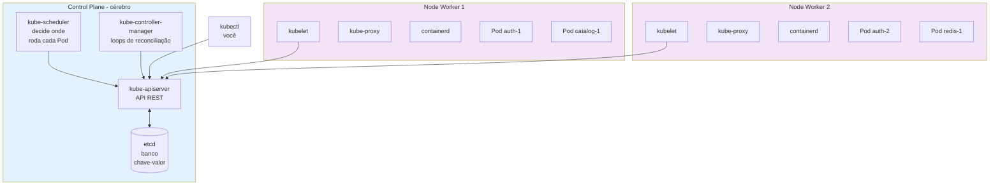
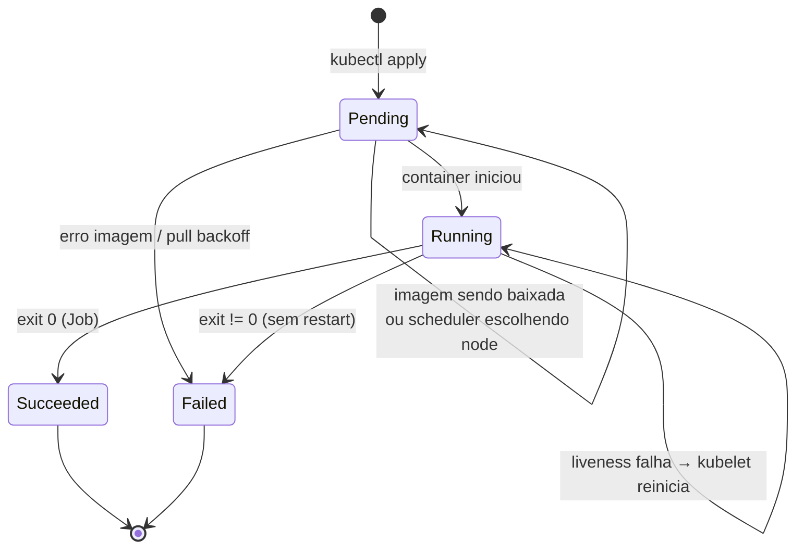
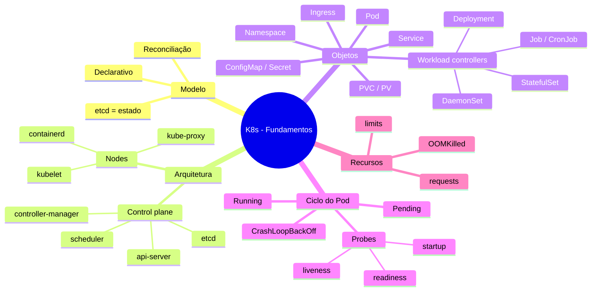

# Bloco 1 — Fundamentos de Kubernetes

**Tempo estimado de leitura:** 90 min
**Pré-requisitos:** Módulo 5 (contêineres) e Módulo 6 (IaC declarativa)

---

## 1. Por que Kubernetes existe

Relembre o Módulo 5: um contêiner é um processo isolado por **namespaces** e limitado por **cgroups** do kernel Linux. Ele é iniciado por um runtime OCI (runc, containerd). Docker Compose empilha vários contêineres **em um host**, com rede e volumes declarados em YAML.

Funciona para:

- desenvolvimento local,
- aplicações pequenas,
- cargas que cabem em 1–2 hosts.

**Não** funciona para:

- **Escala horizontal multi-host.** Se 1 host não aguenta, Compose não distribui carga entre hosts.
- **Autorregeneração.** Se o host cai, cai tudo.
- **Rolling update sem downtime.** Compose recria containers.
- **Descoberta de serviço dinâmica.** Em multi-host, IPs mudam e DNS local não resolve.
- **Isolamento multi-tenant.** Compose não oferece RBAC, quotas, segmentação de rede entre grupos.

A pergunta é: **"quem orquestra centenas de contêineres rodando em dezenas de hosts como se fossem um sistema só?"** Essa pergunta, respondida dentro do Google, gerou **Borg** (2003) e, depois, **Kubernetes** (2014, open-source). Hoje é projeto da **CNCF** (Cloud Native Computing Foundation) e padrão de facto da indústria.

> **Definição resumida.** Kubernetes é um **plano de controle declarativo**: você descreve o estado desejado da aplicação (manifestos YAML) e um conjunto de **controllers** reconcilia o estado real até igualar ao desejado — continuamente.

---

## 2. O modelo mental: estado desejado + reconciliação

Na StreamCast, hoje, para subir 3 réplicas do `auth`, a equipe:

1. Copia o `docker-compose.yml`.
2. Executa `docker compose up -d --scale auth=3` em cada VM.
3. Atualiza o DNS/load-balancer.
4. Se uma morre de madrugada, ninguém percebe.

No Kubernetes, você escreve:

```yaml
apiVersion: apps/v1
kind: Deployment
metadata:
  name: auth
spec:
  replicas: 3
  selector:
    matchLabels:
      app: auth
  template:
    metadata:
      labels:
        app: auth
    spec:
      containers:
        - name: auth
          image: ghcr.io/streamcast/auth:1.4.2
```

Aplica com `kubectl apply -f`. Daí por diante:

- Se 1 Pod morre, o **Deployment controller** detecta `observed=2, desired=3` e cria outro.
- Se o node morre, os Pods dele somem da API, o controller recria em outros nodes.
- Se você muda a imagem para `1.4.3` e aplica, o controller faz **rolling update**: sobe novos, mata antigos, em ordem.

Essa lógica — **loop de reconciliação** — é o núcleo do K8s. Internamente existe algo como:

```python
while True:
    desejado = etcd.get(recurso)
    real = cluster.observar(recurso)
    if desejado != real:
        cluster.agir(recurso, diff(desejado, real))
    sleep(intervalo)
```

Cada tipo de recurso tem seu controller. O `Deployment` tem seu. O `HorizontalPodAutoscaler` tem o seu (ajusta `replicas` conforme CPU). O `Service` tem o seu (programa o proxy). E assim por diante.

---

## 3. Arquitetura do cluster



### Control plane (cérebro)

| Componente | Papel |
|------------|-------|
| **`kube-apiserver`** | Única porta de entrada. Todo comando (`kubectl`, controllers, `kubelet`) passa por ele. Valida, autentica, autoriza, persiste em etcd. |
| **`etcd`** | Banco de dados **chave-valor** distribuído (Raft). Guarda TODO o estado desejado e observado do cluster. Se etcd vai embora sem backup, adeus cluster. |
| **`kube-scheduler`** | Observa Pods sem node atribuído; escolhe o melhor node (CPU livre, memória, afinidades, taints). |
| **`kube-controller-manager`** | Processo que roda **dezenas** de controllers embutidos (Deployment, ReplicaSet, Node, Service, Namespace...). |
| **`cloud-controller-manager`** | (opcional, em nuvens) integra com APIs de provedor: cria Load Balancers, discos, rotas. |

### Nodes (braços)

| Componente | Papel |
|------------|-------|
| **`kubelet`** | Agente em cada node. Conversa com o apiserver. Cria/destrói Pods via runtime OCI. **Executa** probes. |
| **`kube-proxy`** | Programa regras de rede (iptables/IPVS) para que Services funcionem. |
| **Container runtime** | **containerd** ou **CRI-O** (não Docker engine em K8s moderno). Quem de fato roda os containers. |

> **Importante:** `kubelet` não executa containers — pede ao runtime OCI que execute. Kubernetes é **orquestrador**, não runtime.

### Fluxo de um `kubectl apply`

1. Você: `kubectl apply -f deploy.yaml`.
2. `kubectl` fala HTTPS com `kube-apiserver`.
3. API valida (OpenAPI schema), aplica **admission controllers** (defaults, policies, webhooks).
4. API grava em etcd.
5. Deployment-controller observa mudança, cria ReplicaSet.
6. ReplicaSet-controller cria Pods desejados (ainda sem node).
7. Scheduler pega os Pods sem node, escolhe um node para cada, atualiza Pod com `nodeName`.
8. Kubelet do node observa seu próprio nome, pede ao runtime OCI que baixe imagem e inicie container.
9. Kubelet faz probes, reporta status ao apiserver, que grava em etcd.
10. Você vê `kubectl get pods` → `Running`.

Tudo isso em ~10 s num cluster saudável.

---

## 4. Os objetos fundamentais — taxonomia

### 4.1 Pod — unidade atômica

Um **Pod** é um grupo de 1+ containers que:

- compartilham **IP** (mesma network namespace),
- compartilham **volumes**,
- nascem e morrem juntos.

99% dos Pods têm **1 container**. Casos de 2+ containers: **sidecar** (ex.: container de log shipper coletando do container principal), **adapter**, **ambassador**, **init-container** (roda antes do principal).

```yaml
apiVersion: v1
kind: Pod
metadata:
  name: auth-exemplo
spec:
  containers:
    - name: auth
      image: ghcr.io/streamcast/auth:1.4.2
      ports:
        - containerPort: 8000
```

**IMPORTANTE:** na prática, você **quase nunca** escreve Pods crus. Você escreve `Deployment`, `Job`, `StatefulSet`, `DaemonSet` — eles criam Pods para você.

### 4.2 Workload controllers — quem cria Pods por você

| Objeto | Para quê | Como cria Pods |
|--------|----------|----------------|
| **`Deployment`** | Aplicação stateless replicável (API, worker) | Cria `ReplicaSet` que cria N Pods idênticos |
| **`StatefulSet`** | App com identidade estável (Postgres, Kafka, Zookeeper) | Pods com nomes `-0`, `-1`, `-2`, volumes próprios |
| **`DaemonSet`** | 1 Pod **por node** (agentes: log, metric, CNI) | N Pods, 1 por node, que pareia com mudanças de node |
| **`Job`** | Tarefa que **roda até completar** (migração, ETL pontual) | Pod que sai com exit 0 |
| **`CronJob`** | `Job` agendado (cron) | `Job` recorrente |

Na StreamCast:

- `auth`, `catalog`, `player`, `notify` → `Deployment` (stateless).
- `postgres`, `redis` (se dentro do cluster) → `StatefulSet`.
- `log-collector` → `DaemonSet`.
- `transcoder-batch` (processa fila) → `Job` ou `Deployment` dependendo da modelagem.
- Backup diário → `CronJob`.

### 4.3 Service — endpoint estável

IPs de Pods **mudam** o tempo todo (Pod morre, outro sobe, IP diferente). Aplicação X precisa chamar aplicação Y; não pode depender do IP do Pod.

**Service** resolve com DNS interno + balanceamento:

```yaml
apiVersion: v1
kind: Service
metadata:
  name: auth
spec:
  selector:
    app: auth
  ports:
    - port: 80
      targetPort: 8000
  type: ClusterIP
```

Agora qualquer Pod no mesmo namespace chama `http://auth` (porta 80) e K8s balanceia entre os Pods que tenham label `app=auth`.

Tipos de Service:

- **ClusterIP** (default): IP virtual interno ao cluster. Uso 95% dos casos.
- **NodePort**: abre porta em todo node (ex.: 30080). Útil dev/ad-hoc.
- **LoadBalancer**: pede ao cloud provider que crie um LB externo.
- **ExternalName**: alias DNS para serviço externo ao cluster.

### 4.4 Configuração e segredos

- **`ConfigMap`**: pares chave-valor não sensíveis (nível de log, URLs, feature flags).
- **`Secret`**: pares chave-valor **sensíveis** (senhas, tokens, TLS).

Ambos são injetados em Pods como:

- **env vars**, ou
- **arquivos montados em volume**.

```yaml
# ConfigMap
apiVersion: v1
kind: ConfigMap
metadata:
  name: auth-config
data:
  LOG_LEVEL: "info"
  AUTH_TTL_MIN: "60"
---
# Secret (base64)
apiVersion: v1
kind: Secret
metadata:
  name: auth-secrets
type: Opaque
data:
  JWT_SIGNING_KEY: c3VwZXItc2VjcmV0LWluLWRlbw==  # base64("super-secret-in-demo")
```

> **Atenção: `Secret` do K8s é apenas `base64`.** Não é criptografado em etcd por padrão. Em produção, habilita-se **encryption at rest** + usa-se **Sealed Secrets** ou **External Secrets** (Módulo 9).

### 4.5 Labels, selectors e a "cola" do K8s

Kubernetes **não amarra objetos por nome**. Amarra por **labels**.

```yaml
# Deployment gera Pods com labels
metadata:
  labels:
    app: auth
    env: dev
    tenant: streamcast

# Service captura Pods por selector
selector:
  app: auth
  env: dev
```

Qualquer Pod com **essa combinação** de labels é endpoint desse Service — venha de qualquer Deployment, StatefulSet etc. Isso habilita:

- **Canary**: 90% Pods com `version=v1`, 10% com `version=v2`, ambos no selector `app=auth`.
- **Quotas e RBAC** por label.
- **NetworkPolicy** filtrando por label.

### 4.6 Namespace — escopo lógico

`Namespace` agrupa objetos. Serve para:

- **Isolamento lógico** (`streamcast-dev` ≠ `streamcast-prod`).
- **RBAC por namespace** (dev time só acessa `streamcast-dev`).
- **Quotas** (`streamcast-dev` pode usar no máximo 4 CPUs, 8GiB RAM).
- **DNS** (Pod do namespace A resolve serviço do namespace B como `nome.namespace-b.svc.cluster.local`).

Nunca coloque produção no namespace `default`. Crie namespaces explícitos.

### 4.7 Volume e PersistentVolumeClaim

Containers são efêmeros. Para **estado persistente** (DB, uploads):

- **`PersistentVolume` (PV)**: recurso de storage no cluster (disco, NFS, ceph).
- **`PersistentVolumeClaim` (PVC)**: solicitação do Pod ("quero 10GiB classe `fast-ssd`").
- **`StorageClass`**: define *provisioner* que cria PV automaticamente (dinâmico).

```yaml
apiVersion: v1
kind: PersistentVolumeClaim
metadata:
  name: postgres-data
spec:
  accessModes: [ReadWriteOnce]
  resources:
    requests:
      storage: 10Gi
  storageClassName: local-path  # em k3d
```

### 4.8 Ingress — entrada HTTP

`Service` tipo `LoadBalancer` cria 1 LB por serviço = caro. Em vez disso, **`Ingress`** é 1 LB só com roteamento por **host** ou **path**:

```yaml
apiVersion: networking.k8s.io/v1
kind: Ingress
metadata:
  name: streamcast
spec:
  rules:
    - host: ufpb.streamcast.edu.br
      http:
        paths:
          - path: /api/auth
            pathType: Prefix
            backend:
              service:
                name: auth
                port:
                  number: 80
          - path: /api/catalog
            pathType: Prefix
            backend:
              service:
                name: catalog
                port:
                  number: 80
```

Precisa de um **Ingress Controller** instalado (NGINX, Traefik, HAProxy). No `k3d`, o Traefik já vem por padrão.

---

## 5. Ciclo de vida de um Pod



Estados principais:

| Fase | Significado |
|------|-------------|
| `Pending` | Aceito, mas ainda não rodando (pull de imagem, scheduling) |
| `Running` | Pelo menos um container está iniciado |
| `Succeeded` | Todos containers saíram com 0 (Jobs) |
| `Failed` | Todos containers saíram não-zero (sem RestartPolicy) |
| `Unknown` | Kubelet não responde |

Sub-estados importantes (descritos em `kubectl describe pod`):

- `ContainerCreating`: baixando imagem, criando rootfs.
- `ImagePullBackOff`: imagem não existe ou credencial inválida.
- `CrashLoopBackOff`: container reinicia toda hora (bug, config, probe).
- `OOMKilled`: excedeu `memory limit`, kernel matou.
- `Evicted`: node sob pressão, kubelet expulsou Pods.

### Probes (sondas)

`kubelet` consulta seu container:

- **`readinessProbe`**: "está **pronta para receber tráfego**?". Se falha, Pod sai dos endpoints do Service.
- **`livenessProbe`**: "está **viva**?". Se falha repetidas vezes, kubelet **reinicia** o container.
- **`startupProbe`**: "a app já terminou de iniciar?". Protege apps lentas para iniciar.

Tipos: `httpGet`, `tcpSocket`, `exec`.

```yaml
readinessProbe:
  httpGet:
    path: /health/ready
    port: 8000
  initialDelaySeconds: 5
  periodSeconds: 10
livenessProbe:
  httpGet:
    path: /health/live
    port: 8000
  initialDelaySeconds: 15
  periodSeconds: 20
```

> **Regra prática.** `/health/ready` deve checar **dependências** (DB conecta? Redis alcança?). `/health/live` deve checar apenas **processo vivo** — falso-positivo em liveness causa restart cascata.

---

## 6. Recursos: `requests` e `limits`

Todo container deveria declarar:

```yaml
resources:
  requests:
    cpu: "100m"       # 0.1 CPU
    memory: "128Mi"
  limits:
    cpu: "500m"       # 0.5 CPU
    memory: "256Mi"
```

- **`requests`**: o scheduler usa para **escolher node** (soma dos requests não pode exceder capacidade).
- **`limits`**: teto de uso. Ultrapassar CPU = throttling. Ultrapassar memória = **OOMKilled**.

Sem `requests`, o scheduler te coloca em qualquer node — e você briga por recurso. Sem `limits`, um bug de memória mata o node inteiro.

Na StreamCast, o **sintoma #2** (transcoder afoga VM) é exatamente a ausência de limits. Em K8s:

```yaml
# transcoder com limits que impedem sufocar vizinhos
resources:
  requests: { cpu: "500m",  memory: "512Mi" }
  limits:   { cpu: "2000m", memory: "2Gi"   }
```

---

## 7. Ferramental local: k3d

Para aprender K8s sem custo de nuvem, usamos **k3d** — roda o **k3s** (K8s leve da Rancher/SUSE) **dentro de containers Docker**. É rápido (cluster em 30s), descartável, multi-nó.

```bash
# Criar cluster de 3 nós (1 server + 2 agents), expondo porta 80 do Ingress
k3d cluster create streamcast \
  --agents 2 \
  --port "8080:80@loadbalancer" \
  --k3s-arg "--disable=traefik@server:*"  # opcional: instalaremos manualmente

kubectl get nodes
# NAME                      STATUS   ROLES                  AGE   VERSION
# k3d-streamcast-server-0   Ready    control-plane,master   45s   v1.30.x+k3s1
# k3d-streamcast-agent-0    Ready    <none>                 40s   v1.30.x+k3s1
# k3d-streamcast-agent-1    Ready    <none>                 40s   v1.30.x+k3s1
```

`kubectl` já funciona pois o k3d grava o kubeconfig automaticamente.

Alternativa equivalente: **kind** (`kind create cluster --config ...`).

---

## 8. Quando **NÃO** usar Kubernetes

Kubernetes tem custo — de operação, de aprendizado, de complexidade. **Não use** se:

| Sinal | Por quê |
|-------|---------|
| Aplicação cabe em 1 host sem previsão de crescer | Compose resolve. |
| Time não tem 2-3 pessoas dedicáveis a plataforma | Operar K8s bem é trabalho sério. |
| Aplicação é stateful pesada (DB) | Considere gerenciado (RDS) ou VM dedicada; rodar DB em K8s tem pegadinhas. |
| Você quer só CI/CD | Não confunda: GitHub Actions, Jenkins resolvem CI; K8s é para cargas em execução. |
| Latência < 1ms ou bare-metal especializado (trading, gaming) | Overhead de rede do K8s pode ser proibitivo. |

Na StreamCast, **faz sentido** porque há múltiplos serviços, tráfego escala, multi-tenant, time com capacidade de investir em plataforma. Para uma landing page estática, **não** faria sentido.

---

## 9. Script de apoio — explorar o cluster

Já no Python, vamos usar o cliente oficial do Kubernetes para explorar o cluster de forma reproduzível e didática.

### `explore_cluster.py`

```python
"""
explore_cluster.py — inventário didático do cluster Kubernetes atual.

Uso:
    python explore_cluster.py
    python explore_cluster.py --namespace streamcast-dev
    python explore_cluster.py --all-namespaces

Requer:
    pip install kubernetes rich
    kubeconfig válido em ~/.kube/config (k3d/kind/kubectl já setam)
"""
from __future__ import annotations

import argparse
import sys
from collections import Counter
from dataclasses import dataclass

from kubernetes import client, config
from rich.console import Console
from rich.table import Table


@dataclass(frozen=True)
class Inventario:
    namespaces: int
    nodes: int
    pods_por_status: Counter
    deployments: int
    services: int
    secrets: int
    configmaps: int


def coletar(api_core: client.CoreV1Api, api_apps: client.AppsV1Api,
            namespace: str | None) -> Inventario:
    if namespace:
        pods = api_core.list_namespaced_pod(namespace).items
        deploys = api_apps.list_namespaced_deployment(namespace).items
        svcs = api_core.list_namespaced_service(namespace).items
        secs = api_core.list_namespaced_secret(namespace).items
        cms = api_core.list_namespaced_config_map(namespace).items
        ns_count = 1
    else:
        pods = api_core.list_pod_for_all_namespaces().items
        deploys = api_apps.list_deployment_for_all_namespaces().items
        svcs = api_core.list_service_for_all_namespaces().items
        secs = api_core.list_secret_for_all_namespaces().items
        cms = api_core.list_config_map_for_all_namespaces().items
        ns_count = len(api_core.list_namespace().items)

    status_counts: Counter = Counter(p.status.phase for p in pods)
    nodes = len(api_core.list_node().items)

    return Inventario(
        namespaces=ns_count,
        nodes=nodes,
        pods_por_status=status_counts,
        deployments=len(deploys),
        services=len(svcs),
        secrets=len(secs),
        configmaps=len(cms),
    )


def renderizar(inv: Inventario, escopo: str) -> None:
    console = Console()
    console.rule(f"[bold]Inventário do cluster — escopo: {escopo}")

    t = Table(title="Resumo")
    t.add_column("Recurso")
    t.add_column("Quantidade", justify="right")
    t.add_row("Namespaces", str(inv.namespaces))
    t.add_row("Nodes", str(inv.nodes))
    t.add_row("Deployments", str(inv.deployments))
    t.add_row("Services", str(inv.services))
    t.add_row("ConfigMaps", str(inv.configmaps))
    t.add_row("Secrets", str(inv.secrets))
    console.print(t)

    if inv.pods_por_status:
        t2 = Table(title="Pods por status")
        t2.add_column("Status")
        t2.add_column("Qtd", justify="right")
        for status, qtd in inv.pods_por_status.most_common():
            t2.add_row(status or "Unknown", str(qtd))
        console.print(t2)


def main(argv: list[str] | None = None) -> int:
    parser = argparse.ArgumentParser(description="Inventário didático de cluster K8s")
    parser.add_argument("--namespace", help="Restringe a um namespace específico")
    parser.add_argument("--all-namespaces", action="store_true", default=False)
    parser.add_argument("--kubeconfig", default=None,
                        help="Caminho alternativo para kubeconfig")
    args = parser.parse_args(argv)

    try:
        if args.kubeconfig:
            config.load_kube_config(config_file=args.kubeconfig)
        else:
            config.load_kube_config()
    except Exception as exc:
        print(f"Falha ao carregar kubeconfig: {exc}", file=sys.stderr)
        print("Dica: rode 'kubectl get nodes' antes; se funcionar, este script funciona.",
              file=sys.stderr)
        return 2

    api_core = client.CoreV1Api()
    api_apps = client.AppsV1Api()

    ns = None if args.all_namespaces else args.namespace
    escopo = "TODOS os namespaces" if args.all_namespaces else (args.namespace or "default")

    inv = coletar(api_core, api_apps, ns)
    renderizar(inv, escopo)
    return 0


if __name__ == "__main__":
    sys.exit(main())
```

**Execução esperada:**

```
$ python explore_cluster.py --all-namespaces
────── Inventário do cluster — escopo: TODOS os namespaces ──────
                   Resumo
╭─────────────┬────────────╮
│ Recurso     │ Quantidade │
├─────────────┼────────────┤
│ Namespaces  │          5 │
│ Nodes       │          3 │
│ Deployments │          8 │
│ Services    │         10 │
│ ConfigMaps  │         14 │
│ Secrets     │         22 │
╰─────────────┴────────────╯
             Pods por status
╭─────────┬─────╮
│ Status  │ Qtd │
├─────────┼─────┤
│ Running │  19 │
│ Pending │   1 │
╰─────────┴─────╯
```

**Leitura didática:**

- Em um cluster recém-criado, você verá namespaces do sistema (`kube-system`, `kube-public`, `kube-node-lease`, `default`).
- `Secrets` quase sempre > `ConfigMaps` porque ServiceAccounts, Helm, TLS criam secrets internos.
- `Pending` constante **por muito tempo** é sintoma: imagem não puxa, scheduler não encaixa, PVC não liga.

O script reforça uma habilidade essencial: **consultar o cluster programaticamente** (em CI, em auditoria, em dashboards) em vez de apenas olhar o `kubectl` no terminal.

---

## 10. Mapa mental do bloco



---

## 11. Check-list do bloco (autoavaliação)

- [ ] Consigo explicar por que Kubernetes existe — o que Compose **não** resolve.
- [ ] Sei diferenciar **estado desejado** (etcd) de **estado real** (observado) e entendo o loop de reconciliação.
- [ ] Identifico cada componente do control plane e dos nodes e o papel que cumpre.
- [ ] Conheço os objetos centrais (Pod, Deployment, Service, ConfigMap, Secret, Namespace, PVC, Ingress) e para que servem.
- [ ] Sei o que é um **label** e por que tudo no K8s se amarra por labels, não por nomes.
- [ ] Entendo ciclo de vida de Pod e diferenças entre probes.
- [ ] Sei a diferença entre `requests` e `limits` e suas consequências.
- [ ] Sei quando **não** usar Kubernetes.
- [ ] Consegui rodar `k3d cluster create` e `explore_cluster.py` com saída coerente.

---

## 12. Próximos passos

- Resolva os exercícios em [01-exercicios-resolvidos.md](01-exercicios-resolvidos.md).
- Avance para o [Bloco 2 — Workloads](../bloco-2/02-workloads.md) para aplicar esses conceitos construindo o primeiro serviço da StreamCast no cluster.

**Leituras complementares:**

- Burns, Beda, Hightower & Evenson — *Kubernetes Up & Running*, Caps. 1-5.
- [kubernetes.io/docs/concepts/overview/components/](https://kubernetes.io/docs/concepts/overview/components/).
- [kubernetes.io/docs/concepts/workloads/pods/pod-lifecycle/](https://kubernetes.io/docs/concepts/workloads/pods/pod-lifecycle/).

---

<!-- nav:start -->

| &nbsp; | &nbsp; | &nbsp; |
|:--|:--:|--:|
| **← Anterior**<br>[Cenário PBL — Problema Norteador do Módulo](../00-cenario-pbl.md) | **↑ Índice**<br>[Módulo 7 — Kubernetes](../README.md) | **Próximo →**<br>[Bloco 1 — Exercícios Resolvidos](01-exercicios-resolvidos.md) |

<!-- nav:end -->
