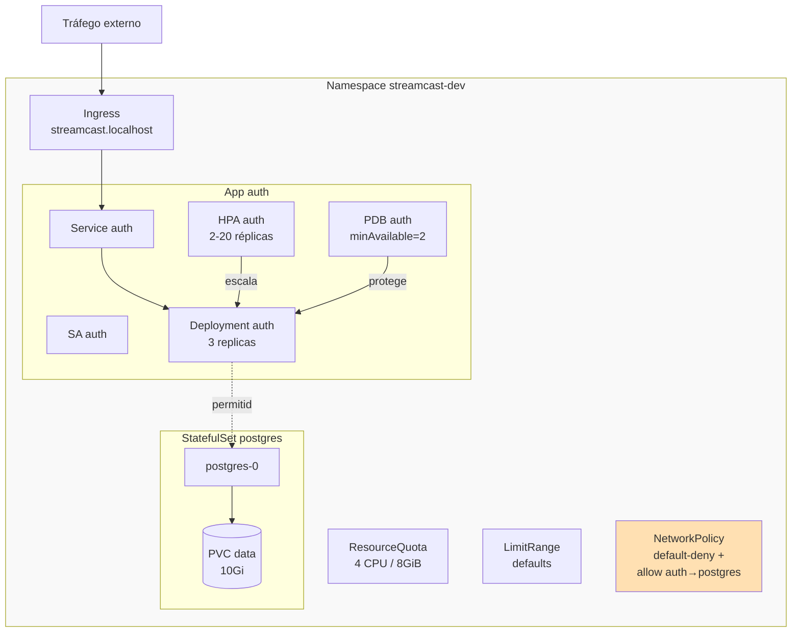

# Bloco 3 — Operações: isolamento, segurança, escala e entrada

**Tempo estimado de leitura:** 90 min
**Pré-requisitos:** Blocos 1 e 2

---

## 1. Objetivo

O Bloco 2 deixou o `auth` rodando como **Deployment** funcional. Mas a StreamCast tem 30 universidades clientes, múltiplos serviços, dados sensíveis de alunos. Precisamos de:

- **Isolamento lógico** entre ambientes e tenants (`Namespace`, `ResourceQuota`, `LimitRange`).
- **Menor privilégio** para quem acessa o cluster (`ServiceAccount`, `RBAC`).
- **Isolamento de rede** entre serviços (`NetworkPolicy`).
- **Autoescala horizontal** conforme carga (`HorizontalPodAutoscaler`).
- **Entrada HTTP ordenada** para o mundo externo (`Ingress`).
- **Estado persistente** bem modelado (`PersistentVolume`, `PersistentVolumeClaim`, `StatefulSet`).
- **Orçamento de indisponibilidade** (`PodDisruptionBudget`).

Este bloco transforma o Deployment do Bloco 2 em um sistema **operacionalmente sério**.

---

## 2. Namespace — fronteira lógica

Namespaces agrupam objetos. Servem para:

- **Isolamento por ambiente** (`streamcast-dev`, `streamcast-stg`, `streamcast-prod`).
- **Isolamento por tenant** (`tenant-ufpb`, `tenant-usp`).
- **Escopo de RBAC** (dev só enxerga `*-dev`).
- **Escopo de quotas** (cada tenant tem cota).
- **Escopo de NetworkPolicy**.

```yaml
# k8s/namespaces.yaml
apiVersion: v1
kind: Namespace
metadata:
  name: streamcast-dev
  labels:
    env: dev
    team: platform
---
apiVersion: v1
kind: Namespace
metadata:
  name: streamcast-stg
  labels:
    env: stg
    team: platform
```

Aplicar e operar dentro deles:

```bash
kubectl apply -f k8s/namespaces.yaml
kubectl -n streamcast-dev apply -f k8s/auth/
kubectl -n streamcast-dev get all
```

Tenha sempre **contexto explícito**. Recomendo alias:

```bash
# ~/.bashrc
alias kd='kubectl -n streamcast-dev'
alias ks='kubectl -n streamcast-stg'
```

Ou use o `kubens` (cmd `kubens streamcast-dev`) para fixar o namespace default.

### Quotas: `ResourceQuota` e `LimitRange`

`ResourceQuota` limita **agregado** de recursos no namespace:

```yaml
apiVersion: v1
kind: ResourceQuota
metadata:
  name: streamcast-dev-quota
  namespace: streamcast-dev
spec:
  hard:
    requests.cpu: "4"
    requests.memory: 8Gi
    limits.cpu: "8"
    limits.memory: 16Gi
    pods: "40"
    persistentvolumeclaims: "10"
```

`LimitRange` define **default e máximo por container**, caso o autor esquecer:

```yaml
apiVersion: v1
kind: LimitRange
metadata:
  name: container-defaults
  namespace: streamcast-dev
spec:
  limits:
    - type: Container
      default:
        cpu: 500m
        memory: 256Mi
      defaultRequest:
        cpu: 100m
        memory: 128Mi
      max:
        cpu: "2"
        memory: "2Gi"
```

Com isso:

1. Pods sem `requests/limits` **recebem** defaults razoáveis.
2. Pods tentando pedir > `max` são **rejeitados na admissão**.
3. O agregado do namespace não excede `ResourceQuota`.

Na StreamCast, cada namespace de **tenant** tem sua própria `ResourceQuota`. Universidade abusiva não pode comprometer as demais (sintoma #6).

---

## 3. RBAC — quem pode o quê

Kubernetes tem 4 conceitos:

| Objeto | Significado |
|--------|-------------|
| `ServiceAccount` | **Identidade** (de Pods) dentro do cluster |
| `Role` | Conjunto de permissões **em um namespace** |
| `ClusterRole` | Conjunto de permissões **cluster-wide** |
| `RoleBinding` / `ClusterRoleBinding` | Amarra Role(ClusterRole) a ServiceAccount/User/Group |

### Por que isso importa

Por padrão, **todo Pod é associado à ServiceAccount `default` do namespace**, e essa SA tem permissões implícitas. Se você escala um container comprometido, um atacante pode usar o token da SA para consultar o apiserver.

**Regra de ouro:** todo Deployment tem sua própria `ServiceAccount` dedicada, com **permissões mínimas** (idealmente **nenhuma** — o Pod da app geralmente não precisa acessar a API do K8s).

### Exemplo: SA dedicada sem permissões

```yaml
apiVersion: v1
kind: ServiceAccount
metadata:
  name: auth
  namespace: streamcast-dev
automountServiceAccountToken: false  # desliga montagem do token no Pod
```

No Deployment:

```yaml
spec:
  template:
    spec:
      serviceAccountName: auth
      automountServiceAccountToken: false
```

**Efeito:** o Pod do `auth` não recebe token montado em `/var/run/secrets/kubernetes.io/serviceaccount`. Se comprometido, não pode nem mesmo listar Pods.

### Exemplo: SA com permissão específica

Imagine que um operador (`tenant-reaper`) precisa listar e deletar Pods expirados de tenants. Precisa de permissões:

```yaml
apiVersion: v1
kind: ServiceAccount
metadata:
  name: tenant-reaper
  namespace: streamcast-ops
---
apiVersion: rbac.authorization.k8s.io/v1
kind: Role
metadata:
  name: pod-manager
  namespace: streamcast-dev     # restrito a este namespace
rules:
  - apiGroups: [""]
    resources: ["pods"]
    verbs: ["get", "list", "delete"]
---
apiVersion: rbac.authorization.k8s.io/v1
kind: RoleBinding
metadata:
  name: reaper-can-manage-pods
  namespace: streamcast-dev
subjects:
  - kind: ServiceAccount
    name: tenant-reaper
    namespace: streamcast-ops   # SA em outro namespace
roleRef:
  kind: Role
  name: pod-manager
  apiGroup: rbac.authorization.k8s.io
```

Note:

- Escolha **`Role` + `RoleBinding`** (namespace-scoped) sempre que possível.
- Use **`ClusterRole` + `ClusterRoleBinding`** apenas para permissões cluster-wide (nodes, PV, CRDs globais).
- Verbs comuns: `get`, `list`, `watch`, `create`, `update`, `patch`, `delete`, `deletecollection`.

### Testar permissões

```bash
kubectl auth can-i list pods \
  --as=system:serviceaccount:streamcast-ops:tenant-reaper \
  -n streamcast-dev
# yes

kubectl auth can-i delete secrets \
  --as=system:serviceaccount:streamcast-ops:tenant-reaper \
  -n streamcast-dev
# no
```

`kubectl auth can-i` é ferramenta de segurança essencial — teste o RBAC **antes** de usá-lo.

---

## 4. NetworkPolicy — firewall entre Pods

Por padrão, **todo Pod pode falar com qualquer Pod em qualquer namespace**. Isso é cômodo, inseguro, e endereça o sintoma #9 da StreamCast.

`NetworkPolicy` é um objeto que restringe tráfego **por labels**. Requer que o **CNI** (Container Network Interface) do cluster suporte policies — no k3d, o CNI padrão (**Flannel**) **não** suporta. Opções:

- Trocar CNI (k3d: `--no-flannel` + instalar Cilium ou Calico).
- Usar `k3d cluster create --k3s-arg "--flannel-backend=none" ...` + Calico.

Para aprendizagem, **habilite Calico** ou use `kind` com plugin Cilium. A sintaxe abaixo é universal.

### Anatomia

```yaml
apiVersion: networking.k8s.io/v1
kind: NetworkPolicy
metadata:
  name: auth-policy
  namespace: streamcast-dev
spec:
  podSelector:
    matchLabels:
      app: auth                   # policy alvo dos Pods app=auth
  policyTypes:
    - Ingress                     # controla tráfego entrando
    - Egress                      # controla tráfego saindo

  ingress:
    # Permite entrada apenas do ingress-controller
    - from:
        - namespaceSelector:
            matchLabels:
              name: ingress-nginx
      ports:
        - protocol: TCP
          port: 8000
    # Também permite outros Pods do mesmo namespace chamando auth
    - from:
        - podSelector: {}          # qualquer Pod do próprio ns
      ports:
        - protocol: TCP
          port: 8000

  egress:
    # Permite saída para postgres e redis no mesmo namespace
    - to:
        - podSelector:
            matchLabels:
              app: postgres
      ports:
        - { protocol: TCP, port: 5432 }
    - to:
        - podSelector:
            matchLabels:
              app: redis
      ports:
        - { protocol: TCP, port: 6379 }
    # DNS (CoreDNS em kube-system)
    - to:
        - namespaceSelector:
            matchLabels:
              kubernetes.io/metadata.name: kube-system
          podSelector:
            matchLabels:
              k8s-app: kube-dns
      ports:
        - { protocol: UDP, port: 53 }
        - { protocol: TCP, port: 53 }
```

### Padrão "deny all" por default

Recomendado: criar uma policy **padrão** negando tudo no namespace, depois adicionar policies específicas permitindo só o necessário:

```yaml
apiVersion: networking.k8s.io/v1
kind: NetworkPolicy
metadata:
  name: default-deny
  namespace: streamcast-dev
spec:
  podSelector: {}            # aplica a TODOS os Pods do namespace
  policyTypes: [Ingress, Egress]
  # sem rules = nada é permitido
```

### Ponto crucial: DNS

Muita app quebra depois que "deny all" entra em vigor porque **não resolve DNS**. Sempre libere saída para `kube-dns` no namespace `kube-system`.

### Testar a policy

```bash
# Dentro de um Pod sem permissão de egress:
kubectl run -it --rm attacker --image=alpine --restart=Never -- sh
# / # apk add curl
# / # curl http://auth
# curl: (28) Failed to connect to auth port 80 after 129372 ms: Operation timed out
```

A timeout confirma que a policy bloqueou.

Na StreamCast, a policy resolve o sintoma #9: `transcoder` só pode falar com `postgres`, `redis`, `minio`. Se for comprometido, não consegue pivotar para `auth`.

---

## 5. Horizontal Pod Autoscaler (HPA)

HPA escala réplicas de um Deployment com base em métricas (CPU, memória, métrica custom).

### Pré-requisito: `metrics-server`

```bash
# Em k3d, já vem instalado. Em kind:
kubectl apply -f https://github.com/kubernetes-sigs/metrics-server/releases/latest/download/components.yaml
```

Valide:

```bash
kubectl top pods -n streamcast-dev
# NAME                   CPU(cores)   MEMORY(bytes)
# auth-5d7f-...          8m           48Mi
```

### HPA básico

```yaml
apiVersion: autoscaling/v2
kind: HorizontalPodAutoscaler
metadata:
  name: auth
  namespace: streamcast-dev
spec:
  scaleTargetRef:
    apiVersion: apps/v1
    kind: Deployment
    name: auth
  minReplicas: 2
  maxReplicas: 20
  metrics:
    - type: Resource
      resource:
        name: cpu
        target:
          type: Utilization
          averageUtilization: 70   # 70% do requests.cpu
  behavior:
    scaleDown:
      stabilizationWindowSeconds: 120   # evita flapping
      policies:
        - type: Percent
          value: 50
          periodSeconds: 60
    scaleUp:
      stabilizationWindowSeconds: 0
      policies:
        - type: Percent
          value: 100
          periodSeconds: 30
```

**Pontos didáticos:**

- `averageUtilization: 70` = escala quando média de CPU entre Pods passa de 70% do que está em `requests.cpu`. **Por isso** o `requests.cpu` precisa ser calibrado — ele é a unidade.
- `behavior.scaleDown.stabilizationWindowSeconds: 120` = espera 2 min sem queda sustentada para descer. Evita "flapping" em padrões de carga irregular.
- `scaleUp` agressivo: em picos súbitos (8h da manhã), dobra em 30s.

Testar sob carga (simulado):

```bash
kubectl run -it --rm load-gen --image=busybox --restart=Never -- \
    sh -c 'while true; do wget -q -O- http://auth/ > /dev/null; done'

# em outra aba:
kubectl get hpa auth -w
# NAME   REFERENCE         TARGETS   MINPODS   MAXPODS   REPLICAS   AGE
# auth   Deployment/auth   85%/70%   2         20        4          1m
# auth   Deployment/auth   90%/70%   2         20        6          2m
```

Na StreamCast, o `transcoder` é candidato ideal — escala de 2 a 20 réplicas conforme profundidade de fila.

### Métricas custom (adiantamento)

Para escalar por **profundidade de fila** em vez de CPU, é preciso métrica custom: `metrics-server` só provê CPU/memória. Soluções:

- **KEDA** (Kubernetes Event-Driven Autoscaling) — escala por fila Redis/RabbitMQ/SQS/Kafka.
- **Prometheus Adapter** — adapta qualquer métrica Prometheus.

No Módulo 8 (Observabilidade) discutimos isso em profundidade.

---

## 6. Ingress — entrada HTTP do mundo externo

Relembrando: `Service` tipo `LoadBalancer` cria 1 LB por serviço (caro e cheio de IPs). `Ingress` é **1 ponto de entrada** (geralmente NGINX, Traefik) roteando por host/path.

### Ingress Controller

No k3d, o **Traefik** já vem instalado por padrão. Alternativa popular: **ingress-nginx**. O "Ingress" é só o objeto que descreve regras; o **Controller** é quem as cumpre.

Verifique:

```bash
kubectl get pods -n kube-system | grep -i traefik
kubectl get svc -n kube-system traefik
# traefik  LoadBalancer  10.43.x.x  172.x.x.x  80:30008/TCP,443:30009/TCP
```

### Ingress exemplo

```yaml
apiVersion: networking.k8s.io/v1
kind: Ingress
metadata:
  name: streamcast
  namespace: streamcast-dev
  annotations:
    # Específica do Traefik; em nginx mudam as annotations.
    traefik.ingress.kubernetes.io/router.entrypoints: web
spec:
  rules:
    - host: streamcast.localhost
      http:
        paths:
          - path: /api/auth
            pathType: Prefix
            backend:
              service:
                name: auth
                port:
                  number: 80
          - path: /api/catalog
            pathType: Prefix
            backend:
              service:
                name: catalog
                port:
                  number: 80
          - path: /
            pathType: Prefix
            backend:
              service:
                name: frontend
                port:
                  number: 80
```

Teste (se o k3d foi criado com `--port "8080:80@loadbalancer"`):

```bash
curl -H "Host: streamcast.localhost" http://localhost:8080/api/auth/
# {"service":"auth","log_level":"info"}
```

### Multi-tenant por host

Para a StreamCast, cada universidade tem subdomínio:

```yaml
spec:
  rules:
    - host: ufpb.streamcast.edu.br
      http:
        paths:
          - path: /
            pathType: Prefix
            backend: { service: { name: api-gateway, port: { number: 80 } } }
    - host: usp.streamcast.edu.br
      http:
        paths:
          - path: /
            pathType: Prefix
            backend: { service: { name: api-gateway, port: { number: 80 } } }
```

O mesmo Ingress pode ter `N` regras. O gateway interno roteia por header `Host` para o tenant correto.

### TLS (produção)

```yaml
spec:
  tls:
    - hosts: [streamcast.edu.br, "*.streamcast.edu.br"]
      secretName: streamcast-tls
  rules:
    - ...
```

O Secret `streamcast-tls` é `type: kubernetes.io/tls` com chaves `tls.crt` e `tls.key`. Em produção, use **cert-manager** + Let's Encrypt para renovação automática.

---

## 7. Persistência: `PV`, `PVC`, `StorageClass`

Pods são efêmeros. Para dados que não podem sumir (Postgres, uploads, etc.):

- **`PersistentVolume` (PV)**: recurso de storage cluster-wide (provisionado).
- **`PersistentVolumeClaim` (PVC)**: solicitação do Pod por storage.
- **`StorageClass`**: define o **provisioner dinâmico** (ex.: "local-path", "ceph-rbd", "aws-ebs").

### Fluxo dinâmico

1. Você cria um `PVC`: "quero 10GiB, classe `local-path`".
2. O provisioner da StorageClass cria um PV automaticamente.
3. O kubelet monta o PV no Pod.

No k3d, a StorageClass `local-path` (da Rancher) já vem provisionada.

```bash
kubectl get storageclass
# NAME                   PROVISIONER             RECLAIMPOLICY   ...
# local-path (default)   rancher.io/local-path   Delete          ...
```

### PVC

```yaml
apiVersion: v1
kind: PersistentVolumeClaim
metadata:
  name: postgres-data
  namespace: streamcast-dev
spec:
  accessModes: [ReadWriteOnce]     # RWO = 1 nó monta em leitura/escrita
  resources:
    requests:
      storage: 10Gi
  storageClassName: local-path
```

Montando em Pod:

```yaml
spec:
  containers:
    - name: postgres
      volumeMounts:
        - name: data
          mountPath: /var/lib/postgresql/data
  volumes:
    - name: data
      persistentVolumeClaim:
        claimName: postgres-data
```

### `StatefulSet` — padrão correto para DBs

`Deployment` + PVC funciona para apps stateless **com uma única réplica** que precisa persistir algo. Para **bancos de dados** e workloads com identidade estável, use `StatefulSet`:

```yaml
apiVersion: apps/v1
kind: StatefulSet
metadata:
  name: postgres
  namespace: streamcast-dev
spec:
  serviceName: postgres-headless   # Service headless para DNS por Pod
  replicas: 1
  selector:
    matchLabels: { app: postgres }
  template:
    metadata: { labels: { app: postgres } }
    spec:
      containers:
        - name: postgres
          image: postgres:16-alpine
          ports: [{ containerPort: 5432 }]
          env:
            - { name: POSTGRES_PASSWORD, valueFrom: { secretKeyRef: { name: postgres-secrets, key: POSTGRES_PASSWORD } } }
            - { name: POSTGRES_USER, value: auth }
            - { name: POSTGRES_DB, value: auth }
            - { name: PGDATA, value: /var/lib/postgresql/data/pgdata }
          volumeMounts:
            - { name: data, mountPath: /var/lib/postgresql/data }
          resources:
            requests: { cpu: "200m", memory: "256Mi" }
            limits:   { cpu: "1",    memory: "1Gi"   }
  volumeClaimTemplates:
    - metadata:
        name: data
      spec:
        accessModes: [ReadWriteOnce]
        resources:
          requests: { storage: 10Gi }
        storageClassName: local-path
---
apiVersion: v1
kind: Service
metadata:
  name: postgres-headless
  namespace: streamcast-dev
spec:
  clusterIP: None                    # headless
  selector: { app: postgres }
  ports: [{ port: 5432, targetPort: 5432 }]
---
apiVersion: v1
kind: Service
metadata:
  name: postgres
  namespace: streamcast-dev
spec:
  selector: { app: postgres }
  ports: [{ port: 5432, targetPort: 5432 }]
```

Diferenças-chave:

- Pods nomeados `postgres-0`, `postgres-1`, `postgres-2` (previsível, persistente).
- Cada Pod tem **seu próprio PVC** (`volumeClaimTemplates` gera um por réplica).
- Arrancam **em ordem** (0 antes de 1).
- DNS por Pod: `postgres-0.postgres-headless.streamcast-dev.svc.cluster.local`.

> **Aviso de realidade:** rodar DB em produção em K8s é trabalho de time dedicado. Para a StreamCast, em produção, considere **DB gerenciado** (RDS, Cloud SQL, on-prem com operador maduro tipo Zalando postgres-operator). Para aprendizado e dev, StatefulSet basta.

---

## 8. Pod Disruption Budget (PDB)

Cluster ops (drenar node, upgrade) podem expulsar Pods. PDB garante um **mínimo de réplicas disponíveis** mesmo durante manutenção voluntária.

```yaml
apiVersion: policy/v1
kind: PodDisruptionBudget
metadata:
  name: auth
  namespace: streamcast-dev
spec:
  minAvailable: 2             # nunca menos que 2 Pods Ready de 'auth'
  selector:
    matchLabels:
      app: auth
```

Se o admin faz `kubectl drain node-3`, o K8s **respeita** o PDB: só deleta Pods do `auth` nesse node se ainda houver ≥ 2 Pods do `auth` em outros nodes.

**Par de regras saudável:**

- `replicas: 3` + `PDB minAvailable: 2` → permite drain de 1 Pod por vez; mantém 2 servindo.
- `replicas: 2` + `PDB minAvailable: 1` → permite drain de 1 Pod.

PDB cobre **disruption voluntária** (drain, upgrade). Não cobre falha de hardware (essa é do `replicas` + reconciliação).

---

## 9. Script de apoio: auditor de segurança do cluster

Usamos o cliente Python para **auditar** o cluster todo contra políticas básicas. Complementa `check_deployment.py` com varredura ampla.

### `k8s_audit.py`

```python
"""
k8s_audit.py — varredura de um cluster Kubernetes para higiene e segurança.

Checagens (por workload):
  AUD-001  Pods sem resource.limits
  AUD-002  Pods com imagem :latest
  AUD-003  Pods rodando como root (securityContext.runAsUser=0 ou ausente)
  AUD-004  ServiceAccount default sendo usada em namespaces não-sistema
  AUD-005  Namespaces sem ResourceQuota
  AUD-006  Namespaces sem NetworkPolicy default-deny

Uso:
    python k8s_audit.py
    python k8s_audit.py -n streamcast-dev
"""
from __future__ import annotations

import argparse
import sys
from collections import defaultdict
from dataclasses import dataclass

from kubernetes import client, config
from rich.console import Console
from rich.table import Table


NS_SISTEMA = {"kube-system", "kube-public", "kube-node-lease",
              "local-path-storage", "ingress-nginx"}


@dataclass(frozen=True)
class Achado:
    codigo: str
    severidade: str
    namespace: str
    recurso: str
    mensagem: str


def _root_like(container) -> bool:
    sc = container.security_context
    if sc and sc.run_as_user == 0:
        return True
    return sc is None or sc.run_as_user is None


def _sem_limits(container) -> bool:
    return container.resources is None or not container.resources.limits


def auditar_pods(api: client.CoreV1Api, ns: str | None) -> list[Achado]:
    pods = (api.list_namespaced_pod(ns).items if ns
            else api.list_pod_for_all_namespaces().items)
    ach: list[Achado] = []
    for p in pods:
        ns_p = p.metadata.namespace
        nome = p.metadata.name
        if ns_p in NS_SISTEMA:
            continue
        for c in p.spec.containers:
            if _sem_limits(c):
                ach.append(Achado("AUD-001", "ERROR", ns_p, f"pod/{nome}",
                                  f"container {c.name} sem resources.limits"))
            if c.image and c.image.endswith(":latest"):
                ach.append(Achado("AUD-002", "ERROR", ns_p, f"pod/{nome}",
                                  f"container {c.name} usa :latest"))
            if _root_like(c) and not (p.spec.security_context
                                       and p.spec.security_context.run_as_user):
                ach.append(Achado("AUD-003", "WARN", ns_p, f"pod/{nome}",
                                  f"container {c.name} sem runAsUser definido (possível root)"))
        if (p.spec.service_account_name or "default") == "default":
            ach.append(Achado("AUD-004", "WARN", ns_p, f"pod/{nome}",
                              "usa ServiceAccount 'default' — crie SA dedicada"))
    return ach


def auditar_namespaces(api_core: client.CoreV1Api,
                       api_net: client.NetworkingV1Api) -> list[Achado]:
    ach: list[Achado] = []
    for ns in api_core.list_namespace().items:
        nome = ns.metadata.name
        if nome in NS_SISTEMA or nome == "default":
            continue
        quotas = api_core.list_namespaced_resource_quota(nome).items
        if not quotas:
            ach.append(Achado("AUD-005", "WARN", nome, "namespace",
                              "sem ResourceQuota"))
        nps = api_net.list_namespaced_network_policy(nome).items
        deny_default = any(np.metadata.name.startswith("default-deny")
                           for np in nps)
        if not deny_default:
            ach.append(Achado("AUD-006", "WARN", nome, "namespace",
                              "sem NetworkPolicy default-deny"))
    return ach


def renderizar(ach: list[Achado]) -> int:
    console = Console()
    if not ach:
        console.print("[bold green]Sem achados. Cluster passa nos checks básicos.")
        return 0

    por_severidade = defaultdict(int)
    for a in ach:
        por_severidade[a.severidade] += 1

    console.rule("[bold]Auditoria do Cluster")
    console.print(f"Total: [bold]{len(ach)}[/bold] achados " +
                  " · ".join(f"{s}={por_severidade[s]}" for s in ("ERROR", "WARN", "INFO")
                             if s in por_severidade))

    t = Table(show_lines=False)
    t.add_column("Sev")
    t.add_column("Código")
    t.add_column("Namespace")
    t.add_column("Recurso")
    t.add_column("Mensagem", overflow="fold")
    for a in sorted(ach, key=lambda x: (x.severidade, x.codigo)):
        style = "bold red" if a.severidade == "ERROR" else "yellow"
        t.add_row(f"[{style}]{a.severidade}[/{style}]",
                  a.codigo, a.namespace, a.recurso, a.mensagem)
    console.print(t)

    return 1 if por_severidade.get("ERROR", 0) > 0 else 0


def main(argv: list[str] | None = None) -> int:
    parser = argparse.ArgumentParser()
    parser.add_argument("-n", "--namespace", help="restringe a um namespace")
    parser.add_argument("--kubeconfig")
    args = parser.parse_args(argv)

    try:
        if args.kubeconfig:
            config.load_kube_config(config_file=args.kubeconfig)
        else:
            config.load_kube_config()
    except Exception as exc:
        print(f"Falha ao carregar kubeconfig: {exc}", file=sys.stderr)
        return 2

    api_core = client.CoreV1Api()
    api_net = client.NetworkingV1Api()

    ach = auditar_pods(api_core, args.namespace)
    if not args.namespace:
        ach.extend(auditar_namespaces(api_core, api_net))

    return renderizar(ach)


if __name__ == "__main__":
    sys.exit(main())
```

**Saída em um cluster recém-configurado:**

```
$ python k8s_audit.py
─────────── Auditoria do Cluster ───────────
Total: 7 achados  ERROR=2 · WARN=5
┌─────┬──────────┬─────────────────┬───────────────────┬────────────────────────────────┐
│ Sev │ Código   │ Namespace       │ Recurso           │ Mensagem                       │
├─────┼──────────┼─────────────────┼───────────────────┼────────────────────────────────┤
│ ERR │ AUD-001  │ streamcast-dev  │ pod/demo-xyz      │ container nginx sem limits     │
│ ERR │ AUD-002  │ streamcast-dev  │ pod/demo-xyz      │ container nginx usa :latest    │
│ WRN │ AUD-003  │ streamcast-dev  │ pod/demo-xyz      │ container nginx sem runAsUser  │
│ WRN │ AUD-004  │ streamcast-dev  │ pod/demo-xyz      │ usa SA 'default'               │
│ WRN │ AUD-005  │ streamcast-stg  │ namespace         │ sem ResourceQuota              │
│ WRN │ AUD-006  │ streamcast-dev  │ namespace         │ sem NetworkPolicy default-deny │
│ WRN │ AUD-006  │ streamcast-stg  │ namespace         │ sem NetworkPolicy default-deny │
└─────┴──────────┴─────────────────┴───────────────────┴────────────────────────────────┘
```

O script:

- Retorna `exit 1` se houver ERROR → integra com CI.
- Ignora namespaces de sistema.
- Aponta **remediação objetiva** (campo `mensagem`).

Esse tipo de varredura é a base da cultura **"cluster seguro por default"**. No Módulo 9 (DevSecOps) a mesma lógica ganha SAST, CVEs, SBOM.

---

## 10. Resumo visual



---

## 11. Check-list do bloco

- [ ] Criei namespaces `streamcast-dev` e `streamcast-stg`.
- [ ] Apliquei `ResourceQuota` em cada namespace.
- [ ] Criei `ServiceAccount` dedicada para `auth` e desliguei `automountServiceAccountToken`.
- [ ] Apliquei `NetworkPolicy default-deny` + policies específicas permitindo só fluxos necessários.
- [ ] Confirmei que CNI do cluster suporta NetworkPolicy (Calico/Cilium, não Flannel).
- [ ] Configurei HPA para `auth` por CPU, com `behavior` calibrado.
- [ ] Gerei carga artificial e observei HPA escalar.
- [ ] Publiquei Ingress com rotas por path e testei via `curl -H "Host: ..."`.
- [ ] Reescrevi Postgres como `StatefulSet` com `volumeClaimTemplates`.
- [ ] Adicionei `PodDisruptionBudget` com `minAvailable` para serviços críticos.
- [ ] Executei `k8s_audit.py` e resolvi os ERROR.

---

## 12. Próximos passos

- Resolva os exercícios em [03-exercicios-resolvidos.md](03-exercicios-resolvidos.md).
- Avance para o [Bloco 4 — Produção, Helm e GitOps](../bloco-4/04-producao-helm-gitops.md), onde tudo isso é empacotado e automatizado.

**Leituras complementares:**

- *Kubernetes Up & Running*, Caps. 11–15.
- [kubernetes.io/docs/concepts/services-networking/network-policies/](https://kubernetes.io/docs/concepts/services-networking/network-policies/).
- [kubernetes.io/docs/reference/access-authn-authz/rbac/](https://kubernetes.io/docs/reference/access-authn-authz/rbac/).
- [kubernetes.io/docs/tasks/run-application/horizontal-pod-autoscale/](https://kubernetes.io/docs/tasks/run-application/horizontal-pod-autoscale/).
- CIS Kubernetes Benchmark (seções RBAC, NetworkPolicy, Pod Security).
