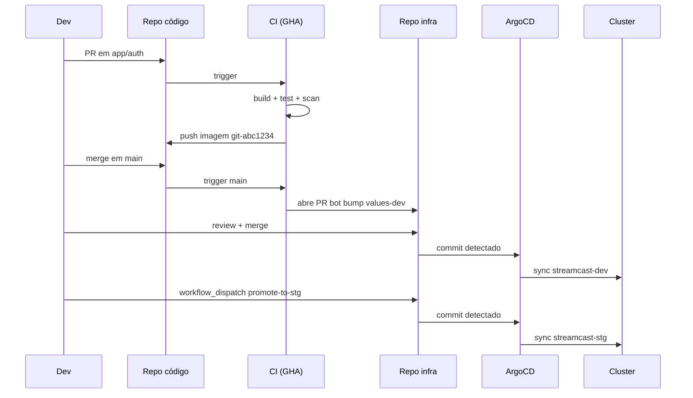

# Bloco 4 — Exercícios Resolvidos

Empacotamento, GitOps e os limites do Kubernetes na StreamCast.

---

## Exercício 4.1 — Do YAML ao Helm chart

**Tempo:** 35 min · **Tipo:** hands-on

### Enunciado

Transforme os manifestos YAML do `auth` (Deployment + Service + ConfigMap + Secret) em um **Helm chart** com:

- `values.yaml` expondo `replicaCount`, `image.tag`, `resources`, `env`.
- `values-dev.yaml` sobrescrevendo para 1 réplica e recursos menores.
- Template de Deployment e Service genéricos.

Valide com `helm lint`, renderize com `helm template`, instale em `streamcast-dev` com `helm install`.

### Solução comentada

**Estrutura:**

```
charts/auth/
├── Chart.yaml
├── values.yaml
├── values-dev.yaml
└── templates/
    ├── _helpers.tpl
    ├── configmap.yaml
    ├── secret.yaml
    ├── deployment.yaml
    └── service.yaml
```

**`Chart.yaml`:**

```yaml
apiVersion: v2
name: auth
description: Serviço auth da StreamCast EDU
type: application
version: 0.1.0
appVersion: "1.0"
```

**`values.yaml`:**

```yaml
image:
  repository: streamcast/auth
  tag: "1.0"
  pullPolicy: IfNotPresent

replicaCount: 3

resources:
  requests: { cpu: 100m, memory: 128Mi }
  limits:   { cpu: 500m, memory: 256Mi }

config:
  LOG_LEVEL: info
  AUTH_TTL_MIN: "60"

secrets:
  JWT_SIGNING_KEY: "change-me"
  DB_PASSWORD: "postgres-demo"

service:
  port: 80
  targetPort: 8000
```

**`values-dev.yaml`:**

```yaml
replicaCount: 1
resources:
  requests: { cpu: 50m,  memory: 64Mi }
  limits:   { cpu: 200m, memory: 128Mi }
config:
  LOG_LEVEL: debug
```

**`templates/_helpers.tpl`:**

```gotmpl
{{- define "auth.labels" -}}
app: auth
app.kubernetes.io/name: {{ .Chart.Name }}
app.kubernetes.io/instance: {{ .Release.Name }}
app.kubernetes.io/version: {{ .Values.image.tag | quote }}
app.kubernetes.io/managed-by: {{ .Release.Service }}
{{- end -}}
```

**`templates/configmap.yaml`:**

```gotmpl
apiVersion: v1
kind: ConfigMap
metadata:
  name: auth-config
  labels: {{- include "auth.labels" . | nindent 4 }}
data:
  {{- range $k, $v := .Values.config }}
  {{ $k }}: {{ $v | quote }}
  {{- end }}
```

**`templates/secret.yaml`:**

```gotmpl
apiVersion: v1
kind: Secret
metadata:
  name: auth-secrets
  labels: {{- include "auth.labels" . | nindent 4 }}
type: Opaque
stringData:
  {{- range $k, $v := .Values.secrets }}
  {{ $k }}: {{ $v | quote }}
  {{- end }}
```

**`templates/deployment.yaml`:**

```gotmpl
apiVersion: apps/v1
kind: Deployment
metadata:
  name: auth
  labels: {{- include "auth.labels" . | nindent 4 }}
spec:
  replicas: {{ .Values.replicaCount }}
  strategy:
    type: RollingUpdate
    rollingUpdate: { maxSurge: 1, maxUnavailable: 0 }
  selector:
    matchLabels:
      app: auth
  template:
    metadata:
      labels: {{- include "auth.labels" . | nindent 8 }}
      annotations:
        checksum/config: {{ include (print $.Template.BasePath "/configmap.yaml") . | sha256sum }}
    spec:
      containers:
        - name: auth
          image: "{{ .Values.image.repository }}:{{ .Values.image.tag }}"
          imagePullPolicy: {{ .Values.image.pullPolicy }}
          ports: [{ containerPort: 8000 }]
          envFrom:
            - configMapRef: { name: auth-config }
            - secretRef:    { name: auth-secrets }
          resources: {{- toYaml .Values.resources | nindent 12 }}
          readinessProbe:
            httpGet: { path: /health/ready, port: 8000 }
            periodSeconds: 10
          livenessProbe:
            httpGet: { path: /health/live, port: 8000 }
            periodSeconds: 20
```

**`templates/service.yaml`:**

```gotmpl
apiVersion: v1
kind: Service
metadata:
  name: auth
  labels: {{- include "auth.labels" . | nindent 4 }}
spec:
  type: ClusterIP
  selector: { app: auth }
  ports:
    - name: http
      port: {{ .Values.service.port }}
      targetPort: {{ .Values.service.targetPort }}
```

**Comandos:**

```bash
helm lint charts/auth
helm template auth charts/auth -f charts/auth/values-dev.yaml | less
helm install auth charts/auth -n streamcast-dev \
    --create-namespace -f charts/auth/values-dev.yaml
helm list -n streamcast-dev
kubectl -n streamcast-dev get all -l app=auth
```

**Lições didáticas:**

- O **`checksum/config`** faz com que mudanças no ConfigMap **forcem rollout** automático — sem isso, `helm upgrade` após mudar LOG_LEVEL não reinicia Pods.
- Labels **padronizadas** (`app.kubernetes.io/*`) habilitam integração com Kustomize, kubectl, Argo, observability.
- Parâmetros expostos em `values.yaml` são o contrato: mude-os com `--set` em CI ou via ArgoCD.

---

## Exercício 4.2 — Helm upgrade + rollback

**Tempo:** 20 min · **Tipo:** lifecycle

### Enunciado

1. Instale o chart `auth` em `streamcast-dev` com `image.tag=1.0`.
2. Faça `helm upgrade --set image.tag=1.1`.
3. Acompanhe `kubectl get pods -l app=auth -w` durante o rollout.
4. Execute `helm rollback auth 1`.
5. Liste o histórico com `helm history`.
6. Simule upgrade falho (tag inexistente `1.99`); observe que Pods novos entram em `ImagePullBackOff` mas os antigos continuam servindo.
7. Rollback e documente o tempo medido.

### Solução comentada

```bash
# Instalação
helm install auth charts/auth -n streamcast-dev \
    --create-namespace -f charts/auth/values-dev.yaml

helm history auth -n streamcast-dev
# REVISION  UPDATED                   STATUS     CHART       APP VERSION  DESCRIPTION
# 1         2026-04-21 14:00:01 UTC   deployed   auth-0.1.0  1.0          Install complete

# Upgrade para 1.1
helm upgrade auth charts/auth -n streamcast-dev \
    -f charts/auth/values-dev.yaml \
    --set image.tag=1.1
# REVISION 2

helm history auth -n streamcast-dev
# 1  deployed...  superseded  auth-0.1.0  1.0  Install complete
# 2  deployed...  deployed    auth-0.1.0  1.1  Upgrade complete

# Simular upgrade falho
helm upgrade auth charts/auth -n streamcast-dev \
    -f charts/auth/values-dev.yaml \
    --set image.tag=1.99
# kubectl get pods → 1 pod novo ImagePullBackOff, Pod antigo segue Ready

# Rollback
helm rollback auth 2 -n streamcast-dev
# (volta para revisão 2)

helm history auth -n streamcast-dev
# 1  superseded  auth-0.1.0  1.0  Install
# 2  superseded  auth-0.1.0  1.1  Upgrade
# 3  failed      auth-0.1.0  1.99 Upgrade
# 4  deployed    auth-0.1.0  1.1  Rollback to 2
```

**Valor didático:**

- Rollback em 1 comando (< 10s) — compare com o sintoma #8 da StreamCast atual (restaurar snapshot VM, 30min).
- `maxUnavailable: 0` garantiu **zero downtime** durante upgrade falho — o Pod antigo seguiu servindo enquanto o novo falhava.
- O `helm history` é **auditável**: quem fez upgrade, quando, e com qual chart.

---

## Exercício 4.3 — Configurando ArgoCD + primeira Application

**Tempo:** 40 min · **Tipo:** integração GitOps

### Enunciado

1. Instale ArgoCD no cluster local (`argocd` namespace).
2. Crie um repositório git (pode ser local `--bare`) contendo seu chart `streamcast`.
3. Crie uma `Application` do ArgoCD apontando para o repo.
4. Commit uma mudança (ex.: `replicaCount: 2 → 3`) e observe ArgoCD sincronizar.
5. Faça `kubectl scale deploy/auth --replicas=10` manualmente e observe ArgoCD **reverter** (selfHeal).

### Solução comentada

**Instalar ArgoCD:**

```bash
kubectl create namespace argocd
kubectl apply -n argocd \
    -f https://raw.githubusercontent.com/argoproj/argo-cd/stable/manifests/install.yaml

# Esperar pods subirem
kubectl -n argocd wait --for=condition=available deploy --all --timeout=120s

# Acessar UI
kubectl port-forward svc/argocd-server -n argocd 8080:443 &

# Senha
kubectl -n argocd get secret argocd-initial-admin-secret \
    -o jsonpath="{.data.password}" | base64 -d; echo
```

**Repo git local (para laboratório sem GitHub):**

```bash
# Em /tmp
mkdir -p ~/repos/streamcast-infra.git
git init --bare ~/repos/streamcast-infra.git

# Clone e popule
git clone ~/repos/streamcast-infra.git streamcast-infra
cd streamcast-infra
cp -r /onde/estão/seu/charts .
git add . && git commit -m "init"
git push origin main
```

**Application apontando para file:// (ArgoCD suporta; em produção use https://):**

> Para produção real use `repoURL: https://github.com/streamcast/infra.git`. Em laboratório local, `file://` funciona só se o pod ArgoCD enxergar o caminho — o padrão é subir um `gitea` leve ou usar `github.com` com fork público.

Assumindo repo HTTPs:

```yaml
apiVersion: argoproj.io/v1alpha1
kind: Application
metadata:
  name: streamcast-dev
  namespace: argocd
spec:
  project: default
  source:
    repoURL: https://github.com/<seu-user>/streamcast-infra.git
    targetRevision: main
    path: charts/streamcast
    helm:
      valueFiles: [values-dev.yaml]
  destination:
    server: https://kubernetes.default.svc
    namespace: streamcast-dev
  syncPolicy:
    automated: { prune: true, selfHeal: true }
    syncOptions: [CreateNamespace=true]
```

```bash
kubectl apply -f streamcast-dev-app.yaml
argocd app list -n argocd   # mostra streamcast-dev
argocd app sync streamcast-dev  # força sync
```

**Testar GitOps:**

```bash
# Modificar no repo
sed -i 's/replicaCount: 2/replicaCount: 3/' charts/streamcast/values-dev.yaml
git commit -am "scale auth to 3"
git push

# ArgoCD detecta em ~3min; force com refresh:
argocd app sync streamcast-dev
# ou na UI: Refresh → Sync
kubectl -n streamcast-dev get deployment/auth
# REPLICAS agora 3
```

**Testar selfHeal:**

```bash
kubectl -n streamcast-dev scale deploy/auth --replicas=10
# Espere ~20s
kubectl -n streamcast-dev get deploy/auth
# REPLICAS de volta a 3  ← ArgoCD reverteu
```

**Leitura na UI do ArgoCD:** na aba Events você verá "OutOfSync detected: replicas differs" e imediatamente "Sync automatic: applied".

**Reflexão:**

- Em Compose, você teria que detectar o drift manualmente (ninguém percebe).
- GitOps tornou isso automático.
- Contraponto honesto: `selfHeal=true` em produção pode **atrapalhar debug**. Muitos times deixam `selfHeal=false` em prod e confiam em alertas.

---

## Exercício 4.4 — Limites honestos do Kubernetes

**Tempo:** 25 min · **Tipo:** discussão argumentativa

### Enunciado

Para cada afirmação abaixo, responda **Verdadeiro, Falso ou Parcial** e justifique em 2-3 linhas citando o que Kubernetes de fato faz:

1. "Kubernetes dá alta disponibilidade à minha aplicação."
2. "Com Kubernetes, meu banco de dados não pode mais perder dados."
3. "Kubernetes resolve segurança — não preciso mais me preocupar."
4. "Kubernetes elimina downtime em deploys."
5. "Kubernetes é gratuito."
6. "Se meu app cabe em 1 VM, Kubernetes melhora minha vida."
7. "Kubernetes me isenta de ter observabilidade."
8. "Posso migrar qualquer aplicação para Kubernetes sem mudar código."

### Solução comentada

| # | Veredicto | Justificativa |
|---|-----------|---------------|
| 1 | **Parcial** | K8s dá HA **à camada de orquestração**: recria Pods, distribui em nodes. Mas HA real exige: cluster multi-AZ/region, control plane em HA (3x etcd), storage replicado, DB com failover, e um **design de app** que tolere reinícios. K8s é **necessário**, não suficiente. |
| 2 | **Falso** | K8s **não** faz backup. PVCs podem ser deletados acidentalmente. Storage pode falhar. Você precisa de `pg_dump` + Velero + replicação. K8s **ortogonaliza** à persistência — não resolve. |
| 3 | **Falso** | K8s fornece **primitivas** (RBAC, NetworkPolicy, Pod Security Standards, secrets), mas há muito mais: CVEs em imagens, imagens não assinadas, containers privilegiados, admission policies, runtime de containers sem isolamento forte, supply chain. Módulo 9 cobre. |
| 4 | **Parcial** | K8s permite **rolling update sem downtime** se você configurar bem: `maxUnavailable: 0`, `maxSurge: 1`, probes corretas, app que respeita sinal `SIGTERM` e graceful shutdown. Com má configuração, dá downtime como antes. |
| 5 | **Parcial** | O software K8s é open source e gratuito. Mas operar custa: control plane (em nuvem: ~$70-150/mês por cluster gerenciado), nodes (compute), storage, observabilidade, e **pessoas** (2-3 engenheiros dedicados em time sério). Em infra pequena, pode ser net-negativo. |
| 6 | **Falso** | Se 1 VM basta, Kubernetes é **complexidade negativa**. Docker Compose + monitoramento simples resolve. K8s faz sentido **quando** você ultrapassa 1 host ou precisa de isolamento forte / autoscale / self-heal em larga escala. |
| 7 | **Falso** | K8s entrega métricas básicas (CPU/mem via metrics-server), logs do kubelet, eventos. **Não** substitui Prometheus, Loki, tracing, alertas, dashboards. Operar cluster sem observabilidade é operar às cegas. |
| 8 | **Parcial** | Aplicações **cloud-native** (stateless, twelve-factor, graceful shutdown, logs em stdout, config por env var) migram facilmente. Apps com **estado em disco local**, sessão em memória, dependência de IP fixo, `cron` interno — exigem **refatoração**, não só empacotamento. Falácia de "lift-and-shift" é frequente. |

**Valor pedagógico:** desconstruir o hype é tão importante quanto adotar o bom. Em entrevista, engenheiro maduro **nomeia limites**.

---

## Exercício 4.5 — Pipeline GitOps completo

**Tempo:** 40 min · **Tipo:** integração

### Enunciado

Desenhe o pipeline fim-a-fim para a StreamCast:

1. Dev faz PR em `app/auth` com mudança.
2. CI deve: build, test, scan, push imagem com tag `git-sha` + `auth:<branch>-<sha>`.
3. Após merge em main, CI abre um PR automaticamente em `infra/` alterando `values-dev.yaml`.
4. Merge do PR de infra em main.
5. ArgoCD detecta e aplica no `streamcast-dev`.
6. Promoção manual para `stg` (PR que altera `values-stg.yaml`).
7. Testes E2E em stg; ok → PR para `values-prod.yaml`.

Escreva o workflow `.github/workflows/build-and-promote.yml`.

### Solução comentada

**Workflow no repo de código (`app/auth`):**

```yaml
name: build-and-promote

on:
  push:
    branches: [main]
  pull_request:

env:
  REGISTRY: ghcr.io
  IMAGE: streamcast/auth

jobs:
  build:
    runs-on: ubuntu-latest
    permissions:
      contents: read
      packages: write
      id-token: write
    outputs:
      tag: ${{ steps.meta.outputs.tag }}
    steps:
      - uses: actions/checkout@v4

      - name: Tag baseada em SHA
        id: meta
        run: echo "tag=git-$(git rev-parse --short HEAD)" >> "$GITHUB_OUTPUT"

      - name: Set up Docker Buildx
        uses: docker/setup-buildx-action@v3

      - name: Login GHCR
        if: github.event_name == 'push'
        uses: docker/login-action@v3
        with:
          registry: ${{ env.REGISTRY }}
          username: ${{ github.actor }}
          password: ${{ secrets.GITHUB_TOKEN }}

      - name: Build
        uses: docker/build-push-action@v5
        with:
          context: app/auth
          push: ${{ github.event_name == 'push' }}
          tags: ${{ env.REGISTRY }}/${{ env.IMAGE }}:${{ steps.meta.outputs.tag }}
          cache-from: type=gha
          cache-to: type=gha,mode=max

      - name: Scan com Trivy
        uses: aquasecurity/trivy-action@master
        with:
          image-ref: ${{ env.REGISTRY }}/${{ env.IMAGE }}:${{ steps.meta.outputs.tag }}
          severity: HIGH,CRITICAL
          exit-code: "1"
          ignore-unfixed: true

  open-infra-pr:
    if: github.event_name == 'push' && github.ref == 'refs/heads/main'
    needs: build
    runs-on: ubuntu-latest
    steps:
      - name: Checkout repo de infra
        uses: actions/checkout@v4
        with:
          repository: streamcast/infra
          token: ${{ secrets.INFRA_REPO_TOKEN }}

      - name: Bumpa tag no values-dev
        run: |
          sed -i 's|tag: ".*"|tag: "${{ needs.build.outputs.tag }}"|' \
              charts/streamcast/values-dev.yaml

      - name: PR automática
        uses: peter-evans/create-pull-request@v6
        with:
          token: ${{ secrets.INFRA_REPO_TOKEN }}
          commit-message: "chore(auth): bump dev to ${{ needs.build.outputs.tag }}"
          title: "chore(auth): deploy ${{ needs.build.outputs.tag }} em dev"
          body: |
            Imagem nova `${{ needs.build.outputs.tag }}` construída no commit
            ${{ github.sha }} do repo de código.

            Merge irá disparar ArgoCD para sincronizar `streamcast-dev`.
          branch: bot/auth-${{ needs.build.outputs.tag }}
```

**No repo de infra**, promoção stg e prod são PRs humanos (ou workflows programados):

```yaml
# .github/workflows/promote-to-stg.yml
name: promote-to-stg

on:
  workflow_dispatch:
    inputs:
      image_tag:
        description: "Tag a promover (ex.: git-abc1234)"
        required: true

jobs:
  promote:
    runs-on: ubuntu-latest
    steps:
      - uses: actions/checkout@v4
      - name: Bumpa values-stg
        run: |
          sed -i 's|tag: ".*"|tag: "${{ inputs.image_tag }}"|' \
              charts/streamcast/values-stg.yaml
      - uses: peter-evans/create-pull-request@v6
        with:
          title: "promote: auth ${{ inputs.image_tag }} para stg"
          body: "Após merge, ArgoCD sincroniza streamcast-stg."
          branch: promote/stg-${{ inputs.image_tag }}
```

**Fluxo completo:**



**Pontos de revisão crítica:**

- PR de **código** e PR de **infra** são **dois eventos auditáveis**.
- Quem faz review de infra tem responsabilidade diferente (SRE/platform) do review de código (peer dev).
- `prod` é sempre a **promoção do imutável** — nunca rebuilda imagem.
- Em prod, pode-se ter sync manual no ArgoCD: PR merged, ArgoCD mostra "OutOfSync", humano clica "Sync" após validar métricas.

---

## Exercício 4.6 — Rodando `helm_drift.py` contra o cluster

**Tempo:** 25 min · **Tipo:** auditoria independente

### Enunciado

1. Instale o chart `auth` no `streamcast-dev`.
2. Rode `python helm_drift.py auth -n streamcast-dev` — deve sair `Sem drift`.
3. Modifique manualmente (ex.: `kubectl -n streamcast-dev scale deploy/auth --replicas=7`).
4. Rode de novo — deve reportar drift em `replicas`.
5. Edite manualmente o ConfigMap (`kubectl edit cm auth-config`) e altere `LOG_LEVEL=error`.
6. Rode de novo — deve reportar drift no ConfigMap.
7. Use `helm upgrade` ou `argocd app sync` para reconciliar e confirme no script.

### Solução comentada

**Execução esperada:**

```bash
$ python helm_drift.py auth -n streamcast-dev
Sem drift. Cluster == Helm release 'auth'.

$ kubectl -n streamcast-dev scale deploy/auth --replicas=7
deployment.apps/auth scaled

$ python helm_drift.py auth -n streamcast-dev
───── Drift detectado em 'auth' ─────
│ Recurso         │ Campo    │ Esperado (Helm) │ Observado (cluster) │
│ Deployment/auth │ replicas │ 1               │ 7                   │

$ kubectl -n streamcast-dev edit cm auth-config
# alterar LOG_LEVEL: info → error

$ python helm_drift.py auth -n streamcast-dev
───── Drift detectado em 'auth' ─────
│ Recurso           │ Campo            │ Esperado (Helm) │ Observado │
│ Deployment/auth   │ replicas         │ 1               │ 7         │
│ ConfigMap/auth-config │ data.LOG_LEVEL │ info          │ error     │

# Reconcilia:
$ helm upgrade auth charts/auth -n streamcast-dev -f charts/auth/values-dev.yaml
Release "auth" has been upgraded. Happy Helming!

$ python helm_drift.py auth -n streamcast-dev
Sem drift. Cluster == Helm release 'auth'.
```

**Reflexão didática:**

- Drift é inevitável sem disciplina ou automação.
- GitOps (ArgoCD selfHeal) **previne** drift reconciliando.
- Ferramenta auditiva independente (`helm_drift.py`) **detecta** drift mesmo em clusters sem ArgoCD.
- O valor não é "pegar quem editou", mas **ter certeza do estado**.

---

## Próximo passo

Parta para os **[Exercícios Progressivos](../exercicios-progressivos/README.md)**, que integram Blocos 1–4 num entregável coeso para a StreamCast: cluster k3d local rodando 2-3 serviços empacotados em Helm chart, entregues via ArgoCD, com operação madura.

---

<!-- nav:start -->

| &nbsp; | &nbsp; | &nbsp; |
|:--|:--:|--:|
| **← Anterior**<br>[Bloco 4 — Produção: Helm, GitOps e os limites do K8s](04-producao-helm-gitops.md) | **↑ Índice**<br>[Módulo 7 — Kubernetes](../README.md) | **Próximo →**<br>[Exercícios Progressivos — Módulo 7](../exercicios-progressivos/README.md) |

<!-- nav:end -->
