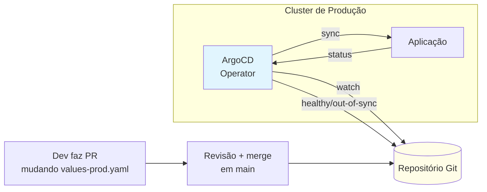
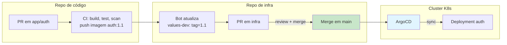
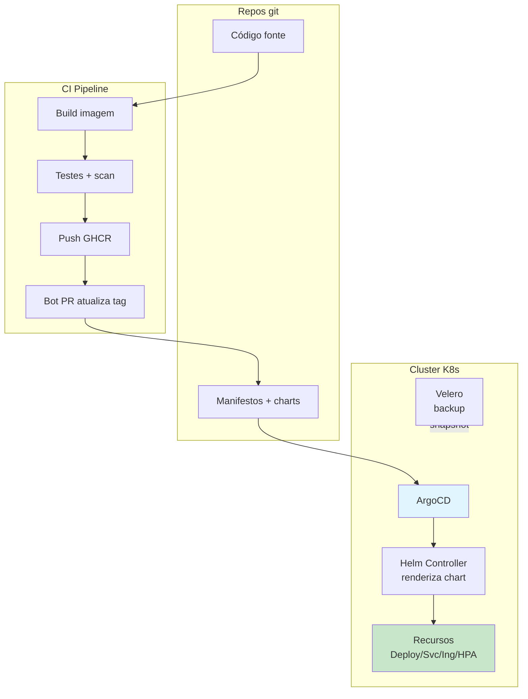

# Bloco 4 — Produção: Helm, GitOps e os limites do K8s

**Tempo estimado de leitura:** 90 min
**Pré-requisitos:** Blocos 1, 2 e 3; Módulo 4 (CD); Módulo 6 (IaC)

---

## 1. Objetivo

Nos blocos anteriores escrevemos dezenas de YAMLs — e a pergunta inevitável chega: **como empacotar, reusar, parametrizar e manter isso no tempo?**

Este bloco responde com três ideias articuladas:

1. **Helm** — gerenciador de pacotes para Kubernetes. Templates parametrizáveis + versão + instalação/upgrade como 1 comando.
2. **GitOps + ArgoCD** — o git é a fonte única da verdade; um operador no cluster reconcilia continuamente o que está lá com o que está no repositório.
3. **Limites honestos** — K8s não resolve bugs de aplicação, dados, segurança em profundidade nem cultura.

Ao final, a StreamCast terá a plataforma empacotada num chart, com ArgoCD garantindo que o cluster é **sempre** o reflexo do git — e você saberá o que Kubernetes **ainda não resolve**.

---

## 2. O problema de manter 40+ YAMLs

Depois do Bloco 3, a StreamCast já tem em cada ambiente:

- Namespaces, ResourceQuotas, LimitRanges.
- Deployments + Services + ConfigMaps + Secrets para `auth`, `catalog`, `api-gateway`, `notify`.
- StatefulSet para `postgres`, Deployment para `redis`.
- NetworkPolicy, HPAs, PDBs, Ingress.
- ServiceAccounts + Roles + RoleBindings.

Pergunta: **como replicar isso para o ambiente `stg`** com, digamos, `replicas` menor, senhas diferentes, `resources` menores? **Copiar e colar** não escala:

- 3 ambientes × 40 YAMLs = 120 arquivos para manter em sincronia.
- Adicionar um campo novo (ex.: `securityContext`) vira missão arqueológica.
- Drift silencioso acumula (dev tem X, prod tem Y, ninguém sabe por quê).

Duas soluções maduras:

| Ferramenta | Filosofia | Trade-offs |
|------------|-----------|------------|
| **Helm** | **Template engine** (Go templates) + lifecycle (install/upgrade/rollback) + repositório de charts | DSL custom (aprender); manipular YAML com strings é feio às vezes |
| **Kustomize** | **Overlays** sem DSL — base + patches | Não tem lifecycle (helm upgrade/rollback); mas integrado a `kubectl` |

Neste módulo focamos em **Helm** (mais popular no mercado; nativo de ArgoCD e das nuvens; rico ecossistema de charts prontos).

---

## 3. Helm em 15 minutos

### Conceitos

| Termo | Significado |
|-------|-------------|
| **Chart** | Pacote: templates + `values.yaml` + `Chart.yaml` |
| **Release** | Instância de um chart num namespace, com nome |
| **Values** | Parâmetros que sobrescrevem os defaults |
| **Template** | YAML com sintaxe Go (`{{ .Values.replicaCount }}`) |
| **Helpers** | Funções reutilizáveis (`_helpers.tpl`) |
| **Hook** | Executar Jobs em momentos do ciclo (pre-install, post-upgrade) |

### Estrutura de um chart

```
charts/streamcast/
├── Chart.yaml               # metadados
├── values.yaml              # defaults
├── values-dev.yaml          # override para dev
├── values-stg.yaml          # override para stg
├── .helmignore
└── templates/
    ├── _helpers.tpl         # funções reutilizáveis
    ├── serviceaccount.yaml
    ├── configmap.yaml
    ├── secret.yaml
    ├── deployment.yaml
    ├── service.yaml
    ├── hpa.yaml
    ├── ingress.yaml
    ├── networkpolicy.yaml
    └── pdb.yaml
```

### `Chart.yaml`

```yaml
apiVersion: v2
name: streamcast
description: Plataforma StreamCast EDU
type: application
version: 0.1.0        # versão do chart
appVersion: "1.0.0"   # versão da aplicação
maintainers:
  - name: Plataforma StreamCast
    email: plataforma@streamcast.edu.br
```

### `values.yaml` (defaults)

```yaml
global:
  imageRegistry: ghcr.io/streamcast
  imagePullPolicy: IfNotPresent

services:
  auth:
    enabled: true
    replicaCount: 3
    image:
      repository: auth
      tag: "1.0"
    resources:
      requests: { cpu: 100m, memory: 128Mi }
      limits:   { cpu: 500m, memory: 256Mi }
    probes:
      readiness:
        path: /health/ready
        periodSeconds: 10
      liveness:
        path: /health/live
        periodSeconds: 20
    hpa:
      enabled: true
      minReplicas: 2
      maxReplicas: 10
      targetCPU: 70
    pdb:
      minAvailable: 2

  catalog:
    enabled: true
    replicaCount: 2
    # ...

postgres:
  enabled: true
  persistence:
    size: 20Gi
    storageClassName: local-path

redis:
  enabled: true

ingress:
  enabled: true
  className: traefik
  host: streamcast.localhost
```

### `values-dev.yaml` (override)

```yaml
services:
  auth:
    replicaCount: 1
    resources:
      requests: { cpu: 50m,  memory: 64Mi }
      limits:   { cpu: 200m, memory: 128Mi }
    hpa:
      enabled: false

postgres:
  persistence:
    size: 5Gi

ingress:
  host: dev.streamcast.localhost
```

### `templates/_helpers.tpl`

```gotmpl
{{- define "streamcast.fullname" -}}
{{- printf "%s-%s" .Release.Name .Values.serviceName | trunc 63 | trimSuffix "-" -}}
{{- end -}}

{{- define "streamcast.labels" -}}
app.kubernetes.io/name: {{ .Values.serviceName }}
app.kubernetes.io/instance: {{ .Release.Name }}
app.kubernetes.io/managed-by: {{ .Release.Service }}
app.kubernetes.io/part-of: streamcast
helm.sh/chart: {{ printf "%s-%s" .Chart.Name .Chart.Version | replace "+" "_" }}
{{- end -}}

{{- define "streamcast.selectorLabels" -}}
app: {{ .Values.serviceName }}
app.kubernetes.io/instance: {{ .Release.Name }}
{{- end -}}
```

### `templates/deployment.yaml` (genérico)

```gotmpl
{{- range $svcName, $svc := .Values.services }}
{{- if $svc.enabled }}
---
apiVersion: apps/v1
kind: Deployment
metadata:
  name: {{ $svcName }}
  namespace: {{ $.Release.Namespace }}
  labels:
    app: {{ $svcName }}
    app.kubernetes.io/name: {{ $svcName }}
    app.kubernetes.io/instance: {{ $.Release.Name }}
    app.kubernetes.io/part-of: streamcast
spec:
  {{- if not $svc.hpa.enabled }}
  replicas: {{ $svc.replicaCount }}
  {{- end }}
  strategy:
    type: RollingUpdate
    rollingUpdate:
      maxSurge: 1
      maxUnavailable: 0
  selector:
    matchLabels:
      app: {{ $svcName }}
  template:
    metadata:
      labels:
        app: {{ $svcName }}
      annotations:
        checksum/config: {{ include (print $.Template.BasePath "/configmap.yaml") $ | sha256sum }}
    spec:
      serviceAccountName: {{ $svcName }}
      automountServiceAccountToken: false
      securityContext:
        runAsUser: 1000
        runAsNonRoot: true
        fsGroup: 1000
      containers:
        - name: {{ $svcName }}
          image: "{{ $.Values.global.imageRegistry }}/{{ $svc.image.repository }}:{{ $svc.image.tag }}"
          imagePullPolicy: {{ $.Values.global.imagePullPolicy }}
          ports:
            - containerPort: 8000
          envFrom:
            - configMapRef:
                name: {{ $svcName }}-config
            - secretRef:
                name: {{ $svcName }}-secrets
          resources:
            {{- toYaml $svc.resources | nindent 12 }}
          readinessProbe:
            httpGet:
              path: {{ $svc.probes.readiness.path }}
              port: 8000
            periodSeconds: {{ $svc.probes.readiness.periodSeconds }}
          livenessProbe:
            httpGet:
              path: {{ $svc.probes.liveness.path }}
              port: 8000
            periodSeconds: {{ $svc.probes.liveness.periodSeconds }}
{{- end }}
{{- end }}
```

Note o **`checksum/config`** — truque clássico para forçar rolling update quando o ConfigMap muda.

### Ciclo de vida

```bash
# Validar antes de aplicar
helm lint charts/streamcast

# Ver o que seria aplicado (debug)
helm template streamcast charts/streamcast -f charts/streamcast/values-dev.yaml

# Instalar
helm install streamcast charts/streamcast \
    -n streamcast-dev --create-namespace \
    -f charts/streamcast/values-dev.yaml

# Upgrade (também funciona se já instalado: helm upgrade --install)
helm upgrade streamcast charts/streamcast \
    -n streamcast-dev \
    -f charts/streamcast/values-dev.yaml \
    --set services.auth.image.tag=1.1

# Histórico
helm history streamcast -n streamcast-dev

# Rollback
helm rollback streamcast 1 -n streamcast-dev

# Desinstalar
helm uninstall streamcast -n streamcast-dev
```

O **Helm guarda a release em Secret K8s** no namespace (nome: `sh.helm.release.v1.streamcast.v3`). Não perde o histórico.

### Charts do ecossistema

Em vez de escrever do zero, muitas vezes você reusa charts oficiais:

```bash
helm repo add bitnami https://charts.bitnami.com/bitnami
helm install postgres bitnami/postgresql -n streamcast-dev -f pg-values.yaml
```

**Mas atenção:** charts de terceiros são **código** que vai rodar no seu cluster. Revise antes de adotar, especialmente em produção.

---

## 4. GitOps — por que e como

### A ideia

Conhecer Kubernetes é declarativo. Mas o **processo** que leva os manifestos para o cluster ainda é imperativo: CI roda `kubectl apply` ou `helm upgrade`. Isso é frágil:

- Se CI cai, não aplica.
- Se alguém faz `kubectl edit` em produção, o cluster **diverge do git** e ninguém sabe.
- Permissões amplas do CI (deployer cluster-admin?) são risco.

**GitOps** inverte o fluxo:

1. **Git é a verdade.** O estado desejado está em um ou vários repositórios.
2. Um **operador no cluster** (ex.: ArgoCD, Flux) observa o git e reconcilia: o que está no git ≠ cluster? **Aplica.**
3. Mudança fora do git → operador detecta drift e/ou reverte.
4. Humano não roda `kubectl apply` em produção — só faz PR.



### Vantagens práticas

- **Auditável**: toda mudança tem PR, commit, autor, data.
- **Rollback**: reverter commit = reverter estado.
- **Self-healing**: se alguém faz `kubectl delete deployment auth`, ArgoCD detecta e recria.
- **Provisionamento zero-trust**: cluster apenas **lê** do git; CI não precisa de credencial de cluster.

### Instalar ArgoCD no cluster

```bash
kubectl create namespace argocd
kubectl apply -n argocd \
    -f https://raw.githubusercontent.com/argoproj/argo-cd/stable/manifests/install.yaml

# Ou via Helm:
helm repo add argo https://argoproj.github.io/argo-helm
helm install argocd argo/argo-cd -n argocd --create-namespace

# Acessar UI
kubectl port-forward svc/argocd-server -n argocd 8080:443

# Senha inicial
kubectl -n argocd get secret argocd-initial-admin-secret \
    -o jsonpath="{.data.password}" | base64 -d
```

Acesse `https://localhost:8080`, user `admin`.

### Definir uma Application

```yaml
# argocd/apps/streamcast-dev.yaml
apiVersion: argoproj.io/v1alpha1
kind: Application
metadata:
  name: streamcast-dev
  namespace: argocd
spec:
  project: default
  source:
    repoURL: https://github.com/streamcast/infra.git
    targetRevision: main
    path: charts/streamcast
    helm:
      valueFiles:
        - values-dev.yaml
  destination:
    server: https://kubernetes.default.svc
    namespace: streamcast-dev
  syncPolicy:
    automated:
      prune: true         # remove recursos que sumirem do git
      selfHeal: true      # reverte modificações manuais
    syncOptions:
      - CreateNamespace=true
    retry:
      limit: 5
      backoff:
        duration: 10s
        factor: 2
        maxDuration: 3m
```

Aplicar:

```bash
kubectl apply -f argocd/apps/streamcast-dev.yaml
```

ArgoCD passa a manter `streamcast-dev` em sincronia com `charts/streamcast` (valores dev) do repositório `streamcast/infra` branch `main`. Fluxo típico:

1. Dev faz PR subindo `values-dev.yaml` para apontar `auth.image.tag: "1.1"`.
2. PR revisado, CI roda testes, build cria imagem `ghcr.io/streamcast/auth:1.1`.
3. Merge em `main`.
4. ArgoCD (loop de 3 min ou webhook) detecta diferença.
5. ArgoCD renderiza Helm → aplica no cluster.
6. Deployment controller faz rolling update.
7. ArgoCD reporta `Healthy + Synced`.

### Sync manual vs automático

- **`automated.selfHeal: true`**: reverte modificações fora do git. Pode ser intrusivo em desenvolvimento — use com critério.
- **`automated.prune: true`**: deleta recursos removidos do git. **Cuidado**: se você remove um manifesto sem querer, o cluster remove — faça code review sério.
- Para produção, alguns times preferem **sync manual** (humano clica em "Sync" após aprovar) para ter barreira extra.

### ApplicationSet (multiplicar apps)

Para a StreamCast, 30 tenants × 3 ambientes pode gerar centenas de Applications. `ApplicationSet` gera automaticamente a partir de **geradores**:

```yaml
apiVersion: argoproj.io/v1alpha1
kind: ApplicationSet
metadata:
  name: streamcast-tenants
  namespace: argocd
spec:
  generators:
    - matrix:
        generators:
          - list:
              elements:
                - { tenant: "ufpb" }
                - { tenant: "usp" }
                - { tenant: "unicamp" }
          - list:
              elements:
                - { env: "dev",  cluster: "https://kubernetes.default.svc" }
                - { env: "stg",  cluster: "https://kubernetes.default.svc" }
                - { env: "prod", cluster: "https://kubernetes.default.svc" }
  template:
    metadata:
      name: "{{tenant}}-{{env}}"
    spec:
      project: default
      source:
        repoURL: https://github.com/streamcast/infra.git
        path: charts/streamcast
        helm:
          valueFiles:
            - "values-{{env}}.yaml"
            - "tenants/{{tenant}}.yaml"
      destination:
        server: "{{cluster}}"
        namespace: "tenant-{{tenant}}-{{env}}"
      syncPolicy:
        automated:
          prune: true
          selfHeal: true
        syncOptions:
          - CreateNamespace=true
```

Isso gera 9 Applications (3 tenants × 3 ambientes) automaticamente. Adicionar universidade = adicionar 1 linha na lista de tenants + criar `tenants/ufmg.yaml`. **Onboarding medido em minutos** (meta do CEO da StreamCast).

---

## 5. Disaster Recovery (DR) — o que K8s não faz

### Fato inconveniente

**Kubernetes não faz backup dos seus dados.**

Se o `postgres-0` perde o PVC, os pods continuam sendo recriados — mas vazios. Se o etcd corrompe, o cluster todo pode ser inoperável.

### Escopos de DR

| Escopo | Ferramentas | Observações |
|--------|-------------|-------------|
| Backup de etcd | `etcdctl snapshot save` | Imperativo para clusters auto-hospedados |
| Backup de PVCs | **Velero** (com plugin de storage) | Backup de objetos K8s + snapshots de PV |
| Backup lógico de DBs | `pg_dump` via CronJob → S3/MinIO | Como vimos no Bloco 3 |
| Backup de secrets gerenciados | SOPS/Sealed-Secrets no git + Vault | No próprio repositório |

### Velero na prática

```bash
helm repo add vmware-tanzu https://vmware-tanzu.github.io/helm-charts
helm install velero vmware-tanzu/velero -n velero --create-namespace \
    --set configuration.provider=aws \
    --set configuration.backupStorageLocation.bucket=backups \
    --set configuration.backupStorageLocation.config.region=minio \
    --set configuration.backupStorageLocation.config.s3ForcePathStyle=true \
    --set configuration.backupStorageLocation.config.s3Url=http://minio:9000 \
    --set credentials.secretContents.cloud="[default]\naws_access_key_id=minio\naws_secret_access_key=minio123"

# Backup agendado diário
velero schedule create daily --schedule="0 3 * * *" \
    --include-namespaces streamcast-dev,streamcast-stg,streamcast-prod

# Restaurar
velero backup get
velero restore create --from-backup daily-20260421030000
```

Velero cobre objetos K8s + snapshots de PVC. Para backup granular de DB, ainda use `pg_dump`/WAL archiving.

### Exercício mental de DR

**Cenário:** cluster todo é destruído (rm -rf do etcd, falha catastrófica).

Tempo de recuperação se você tem:

| Estrutura | RTO (tempo até voltar) | RPO (perda de dados) |
|-----------|-----------------------|-----------------------|
| Só manifestos locais, sem nada | **Dias** | Tudo |
| IaC (OpenTofu) + `kubectl apply` | Horas | Todos dados |
| IaC + GitOps (ArgoCD bootstrap) | ~1h | Todos dados |
| IaC + GitOps + Velero restore | ~2h | < 24h |
| IaC + GitOps + Velero + replicação cross-region | ~30 min | ~minutos |

Meta realista para a StreamCast (começo): **~2h RTO, ~1h RPO**.

---

## 6. Observabilidade — o que K8s entrega e o que falta

K8s fornece gratuitamente:

- `kubectl logs` (stdout/stderr dos containers).
- Métricas do kubelet (`metrics-server`): CPU e memória básicos.
- Eventos (`kubectl get events`) — histórico curto.
- Status de objetos (`kubectl describe`).

**Não fornece** por padrão:

- Armazenamento de logs de médio/longo prazo.
- Métricas agregadas e dashboards.
- Tracing distribuído.
- Alertas.

Stack comum:

- **Prometheus** coleta métricas (pull).
- **Grafana** visualiza.
- **Loki** (ou EFK) armazena logs.
- **Tempo/Jaeger** faz tracing.
- **Alertmanager** dispara alertas.

**Módulo 8** cobre este stack em profundidade, inclusive instalando via chart `kube-prometheus-stack`.

---

## 7. Limites reconhecidos do Kubernetes

Aprender K8s é importante. Mas reconhecer **o que K8s não resolve** é maturidade. Copie e cole isso no `docs/limites-reconhecidos.md` da sua entrega:

> **Kubernetes NÃO resolve:**
>
> 1. **Bugs na aplicação.** Um crash em loop só vira um `CrashLoopBackOff` bonito em vez de um incident.
> 2. **Dados.** Perder um PVC por `kubectl delete -f ...` sem querer destrói o Postgres. Backup é **seu**, não do K8s.
> 3. **Segurança em profundidade.** RBAC e NetworkPolicy são ótimos, mas CVEs em imagens, segredos mal gerenciados, containers privilegiados e admission policies fracas **não somem** com K8s.
> 4. **Custo.** Clusters K8s bem operados custam: 2-3 engenheiros dedicados + infraestrutura baseline (control plane, observabilidade, CNI, storage, ingress).
> 5. **Complexidade operacional.** Atualizar cluster, drenar nodes, lidar com pods pendentes por pressão de recursos, debugar CNI — é trabalho sério e contínuo.
> 6. **Latência de arranque.** Pods não sobem em 10ms. Para cold-start crítico (FaaS), K8s puro não é ideal.
> 7. **Aplicações não cloud-native.** Se a app assume filesystem local persistente e não tolera reinício, migrá-la para K8s exige **refatoração**, não só empacotamento.
> 8. **Cultura.** Se o time não tem disciplina de PR, revisão, testes, o cluster declarativo ainda tem código mal feito. K8s **não faz magia cultural**.

No Módulo 9 (DevSecOps) endereçamos várias dessas lacunas; nas disciplinas de continuidade (SRE avançado) as demais.

---

## 8. Script de apoio: detector de drift de chart

Usamos Python para detectar quando o cluster diverge do chart Helm — útil como **auditoria independente** mesmo com ArgoCD.

### `helm_drift.py`

```python
"""
helm_drift.py — detecta drift entre um release Helm e o cluster atual.

Abordagem:
  1. `helm get manifest <release> -n <ns>` — o que Helm acredita ter aplicado.
  2. Para cada objeto renderizado, busca no cluster (mesmo kind/name/ns).
  3. Compara campos-chave:
     - Deployment.spec.replicas
     - Deployment.spec.template.spec.containers[*].image
     - Service.spec.ports
     - ConfigMap.data
  4. Reporta drift.

Uso:
  python helm_drift.py streamcast -n streamcast-dev
"""
from __future__ import annotations

import argparse
import subprocess
import sys
from dataclasses import dataclass

import yaml
from kubernetes import client, config
from rich.console import Console
from rich.table import Table


@dataclass(frozen=True)
class Drift:
    recurso: str
    campo: str
    esperado: str
    observado: str


def _helm_manifest(release: str, namespace: str) -> list[dict]:
    out = subprocess.run(
        ["helm", "get", "manifest", release, "-n", namespace],
        capture_output=True, text=True, check=True,
    ).stdout
    docs = [d for d in yaml.safe_load_all(out) if d]
    return docs


def _k8s_get(api_core, api_apps, kind: str, nome: str, ns: str):
    try:
        if kind == "Deployment":
            return api_apps.read_namespaced_deployment(nome, ns)
        if kind == "Service":
            return api_core.read_namespaced_service(nome, ns)
        if kind == "ConfigMap":
            return api_core.read_namespaced_config_map(nome, ns)
        if kind == "Secret":
            return api_core.read_namespaced_secret(nome, ns)
    except client.exceptions.ApiException:
        return None
    return None


def _drift_deployment(desejado: dict, real) -> list[Drift]:
    nome = desejado["metadata"]["name"]
    drifts: list[Drift] = []
    if real is None:
        drifts.append(Drift(f"Deployment/{nome}", "presenca",
                            "presente", "AUSENTE"))
        return drifts
    rep_des = desejado.get("spec", {}).get("replicas", 1)
    rep_real = real.spec.replicas
    if rep_des != rep_real:
        drifts.append(Drift(f"Deployment/{nome}", "replicas",
                            str(rep_des), str(rep_real)))
    cts_des = desejado["spec"]["template"]["spec"]["containers"]
    cts_real = {c.name: c for c in real.spec.template.spec.containers}
    for cd in cts_des:
        cn = cd["name"]
        if cn not in cts_real:
            drifts.append(Drift(f"Deployment/{nome}", f"container/{cn}",
                                "presente", "AUSENTE"))
            continue
        if cd.get("image") != cts_real[cn].image:
            drifts.append(Drift(f"Deployment/{nome}", f"container/{cn}.image",
                                cd.get("image", ""), cts_real[cn].image))
    return drifts


def _drift_service(desejado: dict, real) -> list[Drift]:
    nome = desejado["metadata"]["name"]
    if real is None:
        return [Drift(f"Service/{nome}", "presenca", "presente", "AUSENTE")]
    # comparação simples de ports[0].port
    p_des = desejado["spec"]["ports"][0]["port"]
    p_real = real.spec.ports[0].port
    return ([Drift(f"Service/{nome}", "port", str(p_des), str(p_real))]
            if p_des != p_real else [])


def _drift_configmap(desejado: dict, real) -> list[Drift]:
    nome = desejado["metadata"]["name"]
    if real is None:
        return [Drift(f"ConfigMap/{nome}", "presenca", "presente", "AUSENTE")]
    des_data = desejado.get("data", {}) or {}
    real_data = real.data or {}
    drifts: list[Drift] = []
    todas_chaves = set(des_data) | set(real_data)
    for k in sorted(todas_chaves):
        if des_data.get(k) != real_data.get(k):
            drifts.append(Drift(f"ConfigMap/{nome}", f"data.{k}",
                                str(des_data.get(k, "AUSENTE")),
                                str(real_data.get(k, "AUSENTE"))))
    return drifts


def comparar(docs: list[dict], namespace: str) -> list[Drift]:
    config.load_kube_config()
    api_core = client.CoreV1Api()
    api_apps = client.AppsV1Api()

    drifts: list[Drift] = []
    for d in docs:
        kind = d.get("kind", "")
        nome = d.get("metadata", {}).get("name")
        real = _k8s_get(api_core, api_apps, kind, nome, namespace)
        if kind == "Deployment":
            drifts.extend(_drift_deployment(d, real))
        elif kind == "Service":
            drifts.extend(_drift_service(d, real))
        elif kind == "ConfigMap":
            drifts.extend(_drift_configmap(d, real))
        # Secret, Ingress, HPA: estendíveis pelo leitor
    return drifts


def main(argv: list[str] | None = None) -> int:
    parser = argparse.ArgumentParser()
    parser.add_argument("release")
    parser.add_argument("-n", "--namespace", required=True)
    args = parser.parse_args(argv)

    try:
        docs = _helm_manifest(args.release, args.namespace)
    except subprocess.CalledProcessError as exc:
        print(f"helm get manifest falhou: {exc.stderr}", file=sys.stderr)
        return 2

    drifts = comparar(docs, args.namespace)

    console = Console()
    if not drifts:
        console.print(f"[green]Sem drift. Cluster == Helm release '{args.release}'.")
        return 0

    console.rule(f"[bold red]Drift detectado em '{args.release}'")
    t = Table()
    t.add_column("Recurso"); t.add_column("Campo")
    t.add_column("Esperado (Helm)"); t.add_column("Observado (cluster)")
    for d in drifts:
        t.add_row(d.recurso, d.campo, d.esperado, d.observado)
    console.print(t)
    return 1


if __name__ == "__main__":
    sys.exit(main())
```

**Uso:**

```bash
# Sem drift:
$ python helm_drift.py streamcast -n streamcast-dev
Sem drift. Cluster == Helm release 'streamcast'.

# Alguém editou manualmente:
$ kubectl -n streamcast-dev scale deployment/auth --replicas=7

$ python helm_drift.py streamcast -n streamcast-dev
───── Drift detectado em 'streamcast' ─────
│ Recurso           │ Campo    │ Esperado (Helm) │ Observado (cluster) │
│ Deployment/auth   │ replicas │ 3               │ 7                   │
```

**Valor didático:**

- Demonstra **drift = divergência entre fonte da verdade e realidade**.
- Mostra como o próprio ArgoCD opera internamente: compara renderização com cluster.
- Integra com CI (exit != 0 → alerta).

---

## 9. CI/CD completo com GitOps

Pipeline típico da StreamCast após este módulo:



Passos:

1. **Repo de código** (`app/auth`): CI builda imagem `1.1`, roda testes, scan de segurança, push para GHCR.
2. **Bot** (GitHub Actions ou Renovate) abre PR no **repo de infra** atualizando `values-dev.yaml` para apontar `tag: 1.1`.
3. PR revisado por humano, merge em `main`.
4. **ArgoCD** detecta mudança e aplica no cluster.
5. Pipeline de promoção manual (ou automatizado com testes no stg) promove para `values-stg.yaml` → `values-prod.yaml`.

**Separação de repos** (código vs infra) é padrão GitOps:

- Dev não tem permissão direta no repo de infra prod (ou tem, mas com review obrigatório).
- Infra é auditada separadamente.
- Rollback de infra não afeta versionamento de código.

---

## 10. Resumo visual



---

## 11. Check-list do bloco

- [ ] Transformei meus manifestos em Helm chart (`charts/streamcast`).
- [ ] Criei `values-dev.yaml` e `values-stg.yaml` com parâmetros por ambiente.
- [ ] Usei `_helpers.tpl` para labels comuns; `helm lint` passa.
- [ ] Consegui `helm install`, `helm upgrade`, `helm rollback`.
- [ ] Instalei ArgoCD no cluster e criei 2 `Application` apontando para meu repo.
- [ ] Fiz um commit no repo e vi ArgoCD sincronizar automaticamente.
- [ ] Rodei `helm_drift.py` e vi a saída antes e depois de `kubectl scale`.
- [ ] Sei responder: por que **GitOps** resolve problemas que `kubectl apply` em CI não resolve.
- [ ] Escrevi `limites-reconhecidos.md` listando o que K8s **não** resolve.

---

## 12. Próximos passos

- Resolva os exercícios em [04-exercicios-resolvidos.md](04-exercicios-resolvidos.md).
- Faça os [Exercícios Progressivos](../exercicios-progressivos/) para integrar tudo numa entrega avaliativa.
- Prepare a [Entrega Avaliativa](../entrega-avaliativa.md).

**Leituras complementares:**

- Arundel, Domingus — *Cloud Native DevOps with Kubernetes* (O'Reilly). Caps 9–11 (Helm, deploy strategies).
- Palladino, Morrison — *GitOps and Kubernetes* (Manning).
- Documentação oficial do [Helm](https://helm.sh/docs/) e [ArgoCD](https://argo-cd.readthedocs.io/en/stable/).
- CNCF Landscape: landscape.cncf.io → seção "App Definition & Development" > "Application Definition & Image Build" (charts e alternativas).
