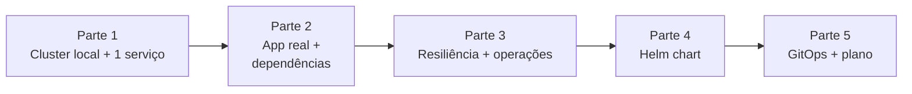

# Exercícios Progressivos — Módulo 7

Os exercícios são **encadeados**: cada parte assume os artefatos construídos nas anteriores. Ao final, você terá o MVP da **StreamCast EDU** rodando localmente num cluster Kubernetes com probes, limits, HPA, Ingress, NetworkPolicy, RBAC, empacotado como **Helm chart** e sincronizado via **ArgoCD**.

---

## Mapa do progresso



| Parte | Foco | Artefatos esperados |
|-------|------|---------------------|
| [1](parte-1-cluster-local.md) | Diagnóstico + cluster k3d + primeiros manifests | `scripts/k3d-up.sh`, `k8s/demo/*.yaml`, ADR-001, `explore_cluster.py` rodando |
| [2](parte-2-workloads-basicos.md) | `auth` FastAPI + Postgres + Redis no cluster | `app/auth/`, `k8s/streamcast-dev/*`, imagens importadas no k3d |
| [3](parte-3-resiliencia.md) | Probes, limits, HPA, Ingress, NetworkPolicy, RBAC, PDB | manifests endurecidos, `k8s_audit.py` sem ERROR |
| [4](parte-4-helm.md) | Empacotamento em Helm chart + values por ambiente | `charts/streamcast/`, `values-dev.yaml`, `values-stg.yaml` |
| [5](parte-5-gitops-e-plano.md) | ArgoCD sincronizando 2 ambientes + runbook + ADRs | `argocd/apps/`, `docs/` completo, plano de migração |

---

## Entregáveis agregados

Ao terminar as 5 partes, seu repositório `streamcast-k8s/` deve ter:

```
streamcast-k8s/
├── README.md                   # instruções do projeto
├── Makefile                    # alvos: up, deploy, clean, audit
├── scripts/
│   ├── k3d-up.sh
│   ├── k3d-down.sh
│   ├── explore_cluster.py      # (do Bloco 1)
│   ├── check_deployment.py     # (do Bloco 2)
│   ├── k8s_audit.py            # (do Bloco 3)
│   └── helm_drift.py           # (do Bloco 4)
├── app/
│   └── auth/
│       ├── src/
│       ├── pyproject.toml
│       ├── Dockerfile
│       └── tests/
├── k8s/                        # manifestos crus (snapshot pré-Helm; opcional)
├── charts/
│   └── streamcast/
│       ├── Chart.yaml
│       ├── values.yaml
│       ├── values-dev.yaml
│       ├── values-stg.yaml
│       └── templates/
├── argocd/
│   ├── install/
│   └── apps/
│       ├── streamcast-dev.yaml
│       └── streamcast-stg.yaml
├── docs/
│   ├── adr/
│   │   ├── 001-k3d-vs-kind.md
│   │   ├── 002-helm-vs-kustomize.md
│   │   └── 003-argocd-vs-flux.md
│   ├── arquitetura.md
│   ├── runbook-onboarding-tenant.md
│   ├── plano-migracao.md
│   └── limites-reconhecidos.md
└── .github/workflows/
    ├── ci.yml
    └── promote-to-stg.yml
```

---

## Pré-requisitos

- Notebook com **≥ 8 GB de RAM** e Docker rodando.
- Instalados: `docker`, `kubectl`, `k3d` (ou `kind`), `helm`, `git`, `python 3.12+`.
- Opcional mas recomendado: `k9s`, `stern`, `kubectx`/`kubens`, `argocd` CLI.
- Conhecimento dos módulos 1-6.

Valide ambiente:

```bash
docker version
kubectl version --client
k3d version
helm version --short
python --version
```

---

## Como trabalhar

- **Faça PR a cada parte** (mesmo num fork solo). Isso ensaia o fluxo GitOps.
- **Escreva commits curtos** com motivação clara (resgate do Módulo 6).
- **Destrua e recrie** o cluster entre sessões: `k3d cluster delete streamcast && scripts/k3d-up.sh`.
- **Meça tempo e esforço** em cada parte — será insumo do `plano-migracao.md`.
- **Discuta** com pares: muita dor em K8s vem de "eu não sabia que outro fazia assim".

---

## Critérios de aceite globais

- `make up` recria cluster limpo em < 2 min.
- `make deploy` instala chart completo em dev com `helm upgrade --install` em < 1 min.
- `make audit` roda todos os scripts Python e retorna sem ERROR.
- ArgoCD mostra `streamcast-dev` e `streamcast-stg` ambos `Healthy + Synced`.
- Entrega avaliativa ([../entrega-avaliativa.md](../entrega-avaliativa.md)) completa.

---

## Próximo passo

Comece pela **[Parte 1 — Cluster local + primeiros manifests](parte-1-cluster-local.md)**.

---

<!-- nav:start -->

**Navegação — Módulo 7 — Kubernetes**

- ← Anterior: [Bloco 4 — Exercícios Resolvidos](../bloco-4/04-exercicios-resolvidos.md)
- → Próximo: [Parte 1 — Cluster local + primeiros manifests](parte-1-cluster-local.md)
- ↑ Índice do módulo: [Módulo 7 — Kubernetes](../README.md)

<!-- nav:end -->
